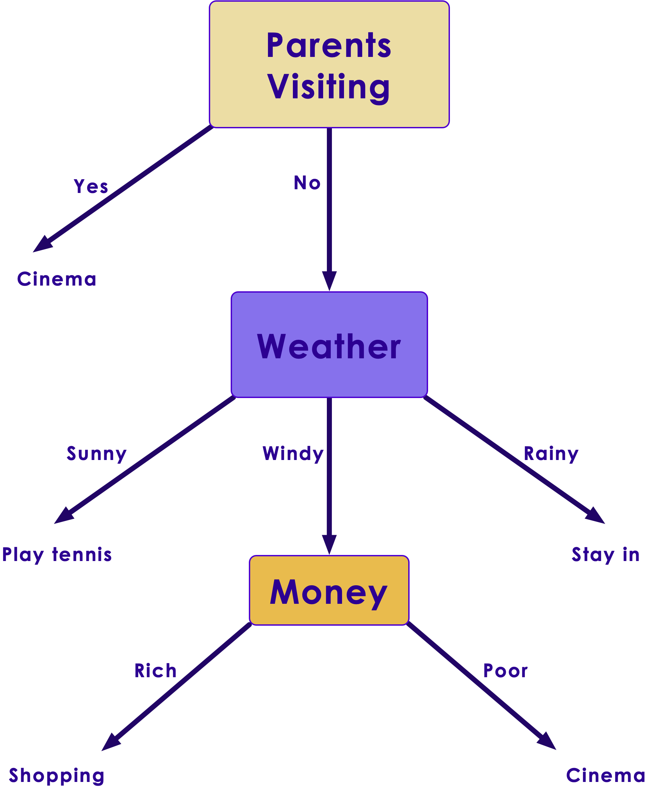

# Sklearn Classification / Regression
---

## Classification / Regression
  * Classification and Regression are both supervised ML.
  * Both are to make a prediction
  * Classification: predict a categorical variable 
    - Could be binary (yes/no)
  * Regression: predict a real number
  * We ”fit” the model with training data and labels
  * We can evaluate the model
  * Then we “predict” new data.

Notes:

---

## Review of Classification Algorithms
  * Naïve Bayes
  * Support Vector Machines (using Stochastic Gradient Descent)
  * Logistic Regression/MaxEntropy
  * Decision Trees
    - A basic decision tree is pretty simple. 
    - It is a set of rules collect the rule
    - Decision-tree learning is a means of inferring an appropriate decision tree from the data.

Notes:

---

## Support Vector Machines (SVMs)
  * Support Vector Machine is a classification method that is:
    - Supervised (trained)
    - Linear
    - Binary (splits into two classes)  (E.g., Spam or not-spam)
    - Crisp (not fuzzy, not probabilistic)
  * How does it work?
    - Draw a line (hyperplane) that separates the two classes
    - Line should perform best possible separation
    - Maximize distance between line and closest points.

Notes:

---

## Decision Tree

<!-- {"left" : 2.71, "top" : 1.89, "height" : 5.86, "width" : 4.83} -->

Notes:

---

## Classification Support in Scikit-learn
  * The following algorithms are well-represented in Scikit-learn:
    - Linear methods: SVM, Logistic Regression
    - Decision trees
    - Ensemble decision trees (Random Forests, Gradient Boosted Trees)
    - Naïve Bayes

Notes:

---

## Evaluating Classification Models
  * Let's consider a binary classifier
   - Picks one of two outcomes  (spam / not-spam)
  * Two approaches
   - Confusion matrix
   - ROC curve

Notes:

---

## ROC Curve

| Classification => | Predicted Spam                                     | Not Spam                            |
|-------------------|----------------------------------------------------|-------------------------------------|
| Actual Spam       | 4 Count  \\ 66%  True Positive  Rate (Sensitivity) | 2 Count  33%  False Negative  Rate  |
| Actual Not Spam   | 1 Count  \\ 16%  False Positive  Rate              | 3 Count    True Negative Rate       |

<!-- {"left" : 0.25, "top" : 1.65, "height" : 1.88, "width" : 9.75, "columnwidth" : [3.25, 3.25, 3.25]} -->

Notes:

