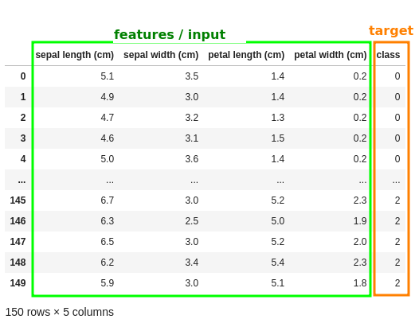
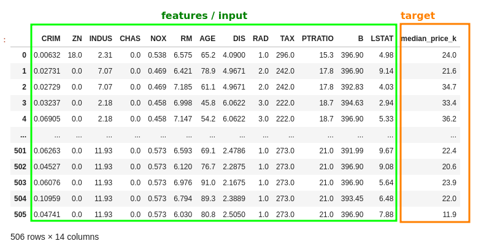
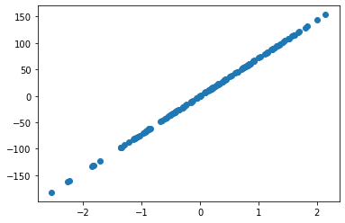
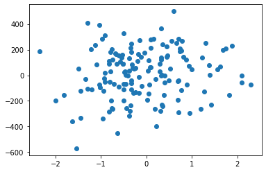
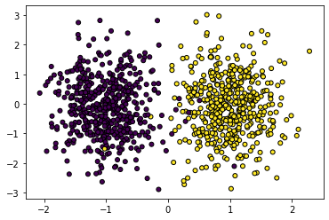
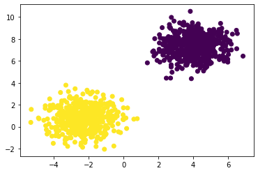
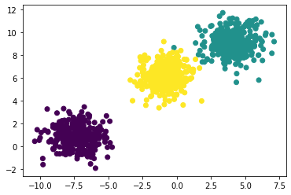
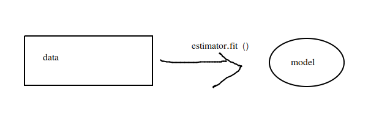

# Python Scikit-Learn

<!-- {"left" : 2.92, "top" : 6.17, "height" : 1.61, "width" : 2.99} -->

---

## Lesson Objectives

* Understand Scikit-Learn in Python
* Advantages and Disadvantages
* Supervised Machine Learning
* Unsupervised Machine Learning
* Recommendations

Notes:

---

# SKLearn Intro

---

## What is Scikit-learn?

<!-- {"left" : 7.2, "top" : 1.36, "height" : 1.69, "width" : 2.52} -->

* Scikit-Learn is a machine learning library written in Python

* Developed by David Cournapeau in 2007
  * Now most popular ML library after Tensorflow
  
* Why is Scikit-Learn popular?
  * Consistent API
  * Complete Documentation
  * Comprehensive - has lots of popular algorithms implemented
  * Fast (most code written in Cython - gives like C like performance)

* [scikit-learn](https://scikit-learn.org/stable/)

* [Current version is 0.24](https://scikit-learn.org/stable/auto_examples/release_highlights/plot_release_highlights_0_24_0.html)

Notes:

---

## Limitations

 * Single Node Only
   - No Parallelization (other than threads)
   - Can use multiple CPU cores in ONE machine (by using `n_jobs` parameter)
   - No Cluster Computing
   
 * Limited Data Size
   - Data Size should fit in memory
   
 * No Deep Learning
   - Limited neural network support
   - No Deep Learning

Notes:

---

## Scikit-learn vs Tensorflow

|                  | Scikit-learn                              | Tensorflow                      |
|------------------|-------------------------------------------|---------------------------------|
| Machine Learning | Comprehensive support with consistent API | Some support for traditional ML |
| Deep Learning    | No deep-learning support                  | Specializes in Deep Learning    |
| Scalability      | Single Node Only                          | Parallel Tensorflow             |
| GPU Support      | None                                      | Extensive                       |
| Data Size        | Data should fit in memory                 | Can integrate with Big Data     |

<!-- {"left" : 0.25, "top" : 1.3, "height" : 3.38, "width" : 9.75, "columnwidth" : [3.25, 3.25, 3.25]} -->

Notes:

---

## Scikit-learn vs Spark ML

|                  | Scikit-learn                              | Spark MLLib                     |
|------------------|-------------------------------------------|---------------------------------|
| Machine Learning | Comprehensive support with consistent API | Some ML Algorithms supported    |
| Deep Learning    | No deep-learning support                  | No deep learning Support        |
| Scalability      | Single Node Only                          | Cluster Computing               |
| GPU Support      | None                                      | None                            |
| Data Size        | Data should fit in memory                 | Part of Big-Data Ecosystem      |

<!-- {"left" : 0.25, "top" : 1.3, "height" : 3.38, "width" : 9.75, "columnwidth" : [3.25, 3.25, 3.25]} -->

Notes:

---
## Installing Scikit-Learn

- Using Conda

```bash
    conda install numpy
    conda install pandas
    conda install scipy
    conda install scikit-learn
```
<!-- {"left" : 0, "top" : 2.04, "height" : 1.44, "width" : 5.78} -->


<br/>

- Using Pip

```bash
    pip3 install numpy
    pip3 install pandas
    pip3 install scipy
    pip3 install scikit-learn
```
<!-- {"left" : 0, "top" : 4.43, "height" : 1.49, "width" : 5.78} -->

---

# SKLearn Datasets

---

## SKLearn Datasets

- `scikit.datasets` package has some very popular datasets
    - __`load_iris`__ : popular IRIS dataset
    - __`load_boston`__ : Boston housing data

- It also has some **data generators** to dynamically generate data
    - __`make_blobs`__
    - __`make_classification`__

- For more information see [reference doc](https://scikit-learn.org/stable/modules/classes.html#module-sklearn.datasets)

Notes:

---

## SkLearn Datasets : IRIS

```python
import sklearn
from sklearn import datasets
import pandas as pd

# load data
iris = sklearn.datasets.load_iris()

iris.keys()
# > dict_keys(['data', 'target', 'target_names', 'DESCR', 'feature_names', 'filename']

# convert to pandas dataframe for nicer display
iris_df = pd.DataFrame(iris.data, columns=iris.feature_names)
iris_df['class'] = iris.target
iris_df
```

<!-- {"left" : 3.34, "top" : 1.09, "height" : 2.44, "width" : 3.56} -->

---

## SkLearn Datasets : IRIS

```python
import sklearn
from sklearn import datasets

iris = sklearn.datasets.load_iris()

## what is in
iris.keys()
# > dict_keys(['data', 'target', 'target_names', 'DESCR', 'feature_names', 'filename'])

## learn about data
print (iris.DESCR)
```

```text
Iris plants dataset
--------------------

**Data Set Characteristics:**

    :Number of Instances: 150 (50 in each of three classes)
    :Number of Attributes: 4 numeric, predictive attributes and the class
    :Attribute Information:
        - sepal length in cm
        - sepal width in cm
        - petal length in cm
        - petal width in cm
        - class:
                - Iris-Setosa
                - Iris-Versicolour
                - Iris-Virginica
```

---

## SkLearn Datasets : IRIS

```python
import sklearn
from sklearn import datasets

iris = sklearn.datasets.load_iris()

## X / features
x = iris.data
x.shape
# > (150, 4)
print (x)

## y / labels
y = iris.target
y.shape
# > (150, )
print (y)
```
<!-- {"left" : 0, "top" : 1.54, "height" : 4.49, "width" : 10.25} -->

```text
# X
[[5.1 3.5 1.4 0.2]
 [4.9 3.  1.4 0.2]
 [4.7 3.2 1.3 0.2]
 [4.6 3.1 1.5 0.2]
 [5.  3.6 1.4 0.2]
...               ]

# Y
[0 0 0 0 0 0 0 0 0 0 0 0 0 0 0 0 0 0 0 0 0 0 0 0 0 0 0 0 0 0 0 0 0 0 0 0 0
 0 0 0 0 0 0 0 0 0 0 0 0 0 1 1 1 1 1 1 1 1 1 1 1 1 1 1 1 1 1 1 1 1 1 1 1 1
 1 1 1 1 1 1 1 1 1 1 1 1 1 1 1 1 1 1 1 1 1 1 1 1 1 1 2 2 2 2 2 2 2 2 2 2 2
 2 2 2 2 2 2 2 2 2 2 2 2 2 2 2 2 2 2 2 2 2 2 2 2 2 2 2 2 2 2 2 2 2 2 2 2 2
 2 2]
```

---

## SKLearn Datasets : Boston

```python
import sklearn
from sklearn import datasets
import pandas as pd

boston = sklearn.datasets.load_boston()

boston_df = pd.DataFrame(boston.data, columns=boston.feature_names)
boston_df['median_price_k'] = boston.target
boston_df
```

<!-- {"left" : 3.34, "top" : 1.09, "height" : 2.44, "width" : 3.56} -->

---

## SKLearn Datasets : Boston

```python
import sklearn
from sklearn import datasets
boston = sklearn.datasets.load_boston()
print (boston.DESCR)
x = boston.data
x.shape # (506, 13)

y = boston.target
y.shape # (506, )
```
<!-- {"left" : 0, "top" : 1.54, "height" : 3.78, "width" : 7.28} -->

```text
Boston house prices dataset
---------------------------
**Data Set Characteristics:**  

    :Number of Instances: 506 

    :Number of Attributes: 13 numeric/categorical predictive. 
    Median Value (attribute 14) is usually the target.

    :Attribute Information (in order):
        - CRIM     per capita crime rate by town
        - ZN       proportion of residential land zoned for lots over 25,000 sq.ft.
        - INDUS    proportion of non-retail business acres per town
        - CHAS     Charles River dummy variable (= 1 if tract bounds river; 0 otherwise)
        - NOX      nitric oxides concentration (parts per 10 million)
        - RM       average number of rooms per dwelling
        - AGE      proportion of owner-occupied units built prior to 1940
        - DIS      weighted distances to five Boston employment centres
        - RAD      index of accessibility to radial highways
        - TAX      full-value property-tax rate per $10,000
        - PTRATIO  pupil-teacher ratio by town
        - B        1000(Bk - 0.63)^2 where Bk is the proportion of blacks by town
        - LSTAT    % lower status of the population
        - MEDV     Median value of owner-occupied homes in $1000's
```

---

## Sklearn Synthetic Datasets

* Synthetic datasets are great way to experiment with algorithms

* **`make_regression`** can generate regression data

* **`make_classification`** are used for classification

* **`make_blobs`** for clustering data

---

## SkLearn.make_regression

* Params
    - `noise` : setting it close to zero will result in linear line.  Higher values will scatter more
    - `random_state`: Optional value, setting this to a specific value will generate, reproduceable data

```python
from sklearn.datasets import make_regression
from matplotlib import pyplot

X, y = make_regression(n_samples=150, n_features=1, noise=0.2)
# X, y = make_regression(n_samples=150, n_features=1, noise=0.2, random_state=42)

pyplot.scatter(X,y)
pyplot.show()
```

<!-- {"left" : 3.34, "top" : 1.09, "height" : 2.44, "width" : 3.56} -->

---

## SkLearn.make_regression


```python
from sklearn.datasets import make_regression
from matplotlib import pyplot

X, y = make_regression(n_samples=150, n_features=1, noise=200)
# X, y = make_regression(n_samples=150, n_features=1, noise=200, random_state=42)

pyplot.scatter(X,y)
pyplot.show()
```

<!-- {"left" : 3.34, "top" : 1.09, "height" : 2.44, "width" : 3.56} -->

---

## SkLearn.make_classification

```python
import sklearn
from sklearn import datasets
%matplotlib inline
import matplotlib.pyplot as plt

x, y = sklearn.datasets.make_classification(
                n_samples = 1000 ,
                n_features=2, 
                n_redundant=0,
                n_informative=1, 
                n_clusters_per_class=1)

plt.scatter(x[:, 0], x[:, 1], marker='o', c=y,
            s=25, edgecolor='k')
```
<!-- {"left" : 0, "top" : 4.96, "height" : 3.24, "width" : 10.25} -->

<!-- {"left" : 2.56, "top" : 1.21, "height" : 3.44, "width" : 5.14} -->

---

## SKLearn.make_blobs

* Generate clusters of data

```python
import sklearn
from sklearn import datasets
%matplotlib inline
import matplotlib.pyplot as plt

x,y  = sklearn.datasets.make_blobs(
                n_samples=1000,
                n_features=2, 
                centers=2)

x.shape # (1000,2)
y.shape #(1000,)

plt.scatter(x[:, 0], x[:, 1], c=y)
```
<!-- {"left" : 0, "top" : 3.62, "height" : 5.16, "width" : 6.46} -->

<!-- {"left" : 3.34, "top" : 1.09, "height" : 2.44, "width" : 3.56} -->

---

## SKLearn.make_blobs

* Generate clusters of data

```python
import sklearn
from sklearn import datasets
%matplotlib inline
import matplotlib.pyplot as plt

x,y  = sklearn.datasets.make_blobs(
                n_samples=1000,
                n_features=2, 
                centers=3)

x.shape # (1000,2)
y.shape #(1000,)

plt.scatter(x[:, 0], x[:, 1], c=y)
```
<!-- {"left" : 0, "top" : 3.62, "height" : 5.16, "width" : 6.46} -->

<!-- {"left" : 3.34, "top" : 1.09, "height" : 2.44, "width" : 3.56} -->

---

# SkLearn Algorithms

---

## SkLearn Algorithms

* Sklearn implements many popular algorithms

* **Preprocessing**: Getting the data into shape for Machine Learning

* **Dimensionality Reduction**: Reducing redundancy in variables

* **Classification**: Predicting one of a finite set of classes for data.

* **Regression**: Predicting a response variable

* **Clustering**: Finding natural patterns in the data.

* **Model Selection**: Finding the best model for our data.

Notes:

---

## Scikit-Learn Algorithm Map

<!-- {"left" : 1.02, "top" : 2.26, "height" : 5.12, "width" : 8.21} -->

---

## Algorithm Summary

| PreProcessing                    | Dimensionality Reduction           | Classification                | Regression              | Clustering              | Model Selection                                    |
|----------------------------------|------------------------------------|-------------------------------|-------------------------|-------------------------|----------------------------------------------------|
| Feature Scaling (Scaler Classes) | PCA (Principal Component Analysis) | Linear Models                 | Linear Models           | Kmeans                  | Cross-Validation                                   |
| Normalization                    | SVD (Singular Value Decomposition) | SVM (Support Vector Machines) | Decision Trees          | Spectral Clustering     | Hyperparmeter Tuning                               |
| Binarization                     | Linear Discriminant Analysis       | Nearest Neighbors             | Ensemble Decision Trees | Hierarchical Clustering | Model Persistence                                  |
| Categorical Encoding             | LDA (Latent Dirichlet Allocation)  | Naive Bayes                   |                         |                         | Metrics (Regressions, Classifications, Clustering) |
| Imputation                       |                                    | Decision Trees                |                         |                         |                                                    |
| FunctionTransformer              |                                    | Ensemble Decision Trees       |                         |                         |                                                    |
|                                  |                                    | Neural Networks               |                         |                         |

<!-- {"left" : 0.07, "top" : 1.05, "height" : 4.26, "width" : 10.12, "columnwidth" : [1.96, 1.92, 1.78, 1.49, 1.5, 1.47]} -->

---

## Lab: Sklearn Datasets

<!-- {"left" : 6.76, "top" : 0.88, "height" : 4.37, "width" : 3.28} -->

* **Overview:**
  - Get familiar with SKlearn datasets

* **Approximate run time:**
  - 20-30 mins

* **Instructions:**
  - SKLearn1 - Datasets

---

## Lab: Sklearn Utils

<!-- {"left" : 6.76, "top" : 0.88, "height" : 4.37, "width" : 3.28} -->

* **Overview:**
  - Get familiar with SKlearn APIs

* **Approximate run time:**
  - 20-30 mins

* **Instructions:**
  - SKLearn2 - APIs

---

# Extra Slides

---

## Estimators

<!-- {"left" : 5.2, "top" : 3, "height" : 0.61, "width" : 4.9} -->

<!-- {"left" : 5.15, "top" : 3.87, "height" : 0.93, "width" : 5} -->


 * Estimators are used to
    - transform data
    - and create models by training on data

 * Algorithms (Regressions / Classifications) are implemented as Estimator
   - training:  __`estimator.fit(data)`__

 * An example of transforming data
   - transforming data: 
   - __`transformed = estimator.transform(data)`__


Notes:

---

## estimator.transform()

- Used to transform data
    - for example scaling data

```python
from sklearn.preprocessing import MinMaxScaler

scaler = MinMaxScaler()
data = [....]
scaled_data = scaler.transform(data)

```
<!-- {"left" : 0, "top" : 2.3, "height" : 1.88, "width" : 9.15} -->

---

## estimator.fit()
* .fit(data) will fit the estimator to the data
* Can take 1 or 2 parameters
* 1 Parameter is just data
   - usually for unsupervised learning
   - __`estimator.fit(data)`__

* 2 parameters are data + labels
   - usually for supervised learning
   - __`estimator.fit(x_train, y_train)`__


Notes:

---

## estimator.predict() Method
 * Most estimators have a .predict() method
 
 * Designed for delivering labels on new data
 
 * For unsupervised learning, for example clustering, `predict()` will assign data to cluster
 
 * Training: __`estimator.fit(x_train, y_train)`__
 
 * Prediction: __`estimator.predict(x_test)`__

Notes:

---

## Estimator Example: SVM

```python
from sklearn import svm

# Instantiate SVM Classifier
clf = svm.SVC(gamma=0.001, C=100.)

# Fit model to data
clf.fit(x_train, y_train) #(notice 2 params)

# Make a prediction
y_pred = clf.predict(x_test)

```
<!-- {"left" : 0, "top" : 1.47, "height" : 2.65, "width" : 7.28} -->


Notes:

---


# SkLearn Mixins (Optional, Reference Only)

---

## Mix-ins

 * Not just for ice-cream!
 
 * Scikit-learn has several mix-ins for class
   - __`TransformerMixIn`__
   - __`ClassifierMixIn`__
   - __`ClusterMixIn`__
   - __`RegressorMixIn`__
   
 * Added to class with multiple-inheritance

Notes:

---

## Transformer Mix-In
  * Transformer mix-in adds 2 methods:
    - __`transform()`__
    - __`fit_transform()`__: calls fit, then transform
    
  * Transformers are used for transformations
    - like PCA
    
  * A trivial Example:

```python
transformer = FunctionTransformer(np.log1p)
transformer.transform(np.array[1,2])
[0.69314718, 1.09861229]
```
<!-- {"left" : 0, "top" : 4, "height" : 1.07, "width" : 7.94} -->

Notes:

---

## Classifier Mix-In
  * Designed to be used for classification
  * Has a score:
    - takes in X, y, weights
    - returns score: accuracy

Notes:

---

## Regressor Mix-In
  * Designed to be used for regression
  * Has a Score
    - Takes in X,y,weights
    - returns r-squared

Notes:

---

## Cluster Mix-In
  * __`fit_predict()`__
    - call __`fit()`__ then __`predict()`__
  * score: Too many!
    - a number of scoring options for clusters.
    - depends on type

Notes:


