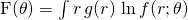
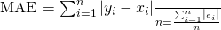
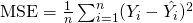

# Python Sklearn: Metrics 

---

## Lesson Objectives
 * Understand Evaluation
 * Types of Evaluation

---

# Model Evaluation 

---

## What is Model Evaluation?
 * We can't just "run and forget"
 * Models may be worthless!
 * How do we know our model is working?
 * How do we compare models?


Notes:

---

# Regression

---
 # Regression models 

---

## Evaluating a Regression Model
 * We can use the following:
   - Explained Variance
   - Mean Absolute Error (MAE)
   - Mean Squared Error (MSE)
   - R-Squared (R2)
 * We will talk about each one


Notes:

---

## Explained Variance
 * Computes the explained variance regression
 * Basically same as r-squared for linear model

<!-- {"left" : 3.33, "top" : 2.45, "height" : 0.38, "width" : 3.59} -->


Notes:

$F(\theta) = \int r\,g(r)\,\ln f(r;\theta)$

---


## Explained Variance in Python

 * We can use scikit-learn for this

```python
from sklearn.metrics import explained_variance_score
explained_variance_score(y_true, hy_pred)
```
<!-- {"left" : 0.0, "top" : 1.47, "height" : 0.87, "width" : 10.25} -->


Notes:

---

## Mean Absolute Error

 * Mean Absolute Error is different than MSE
 * Take absolute value of each error and take the mean of that.


<!-- {"left" : 3.33, "top" : 2.45, "height" : 0.38, "width" : 3.59} -->

Notes:

`$\mathrm{MAE} = \frac{\sum_{i=1}^n\left| y_i-x_i\right|}{n} =\frac{\sum_{i=1}^n\left| e_i \right|}{n}$`

## Mean Absolute Error in Python

```python
from sklearn.metrics import mean_absolute_error

```
<!-- {"left" : 0.0, "top" : 1.01, "height" : 0.7, "width" : 10.25} -->


Notes:

---

## Mean Squared Error

 * MSE is the mean of the squared errors (residual)
 * The mean squared error is defined as the following:


<!-- {"left" : 3.02, "top" : 2.49, "height" : 0.5, "width" : 4.21} -->


Notes:

`$\operatorname{MSE}=\frac{1}{n}\sum_{i=1}^n(Y_i-\hat{Y_i})^2$`
---

## Mean Squared Error in Python

```python
from sklearn.metrics import mean_squared_error_score

```
<!-- {"left" : 0.0, "top" : 1.01, "height" : 0.7, "width" : 10.25} -->


Notes:

---

# Classification
---

## Accuracy

 * The Accuracy Score is simply ratio of correct to total.
 * Does not consider class balance.


Notes:

---

## Accuracy can Lie!

 * Accuracy is the most deceptive evaluation
 * Class Balance can affect results.
 * Imagine a test for a rare medical condition
   - Only 1% of tested have the condition.
   - Let's say your accuracy is 99.0%
   - Is that good?
   - **NO!!** It could be always "negative"
 * Need to balance other factors


Notes:

---

## Accuracy in Scikit-Learn

 * Here is how we do accuracy in Scikit-Learn
 * Returns number from 0.0 to 1.0

```python
from sklearn.metrics import accuracy_score
accuracy_score(y_test, predicted)
```
<!-- {"left" : 0.0, "top" : 1.98, "height" : 1.05, "width" : 10.16} -->

Notes:

---

## Classification Report

 * Classification Report Gives us a lot!
 * Includes:
   - Accuracy
   - F1 Score
   - Precision
   - Recall


Notes:

---

## Classification Report in Python

 * Here is how we do classification report:

```python
from sklearn.metrics import classification_report
classification_report(y_test, predicted)
```
<!-- {"left" : 0.0, "top" : 1.54, "height" : 0.93, "width" : 10.32} -->


Notes:

---

## Confusion Matrix


```text
array([[1015,   35],
       [ 25,   2284]])
```
<!-- {"left" : 0.0, "top" : 1.09, "height" : 1.1, "width" : 6.07} -->


Notes:


