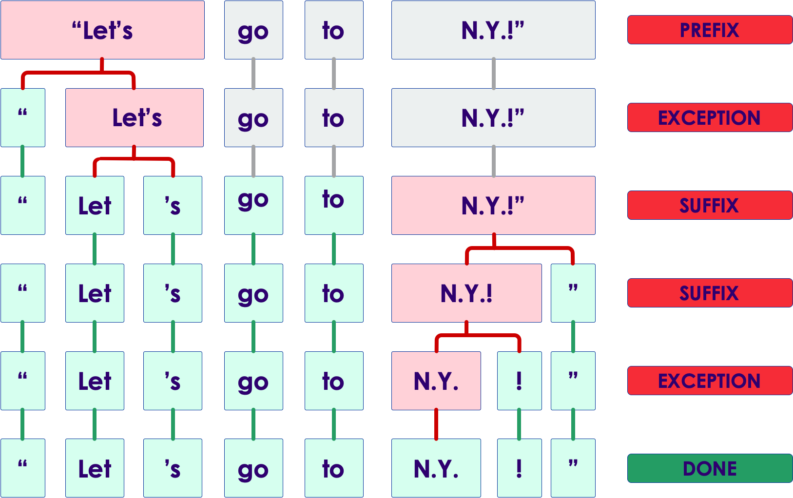

# Introduction to spaCy


---
## NLP Libraries

* By Ecosystem:
  - Python: NLTK, spaCy, gensim
  - JVM: OpenNLP, CoreNLP, Spark NLP, UIMA, GATE, Mallet
  - Others: tm for R, SAS, Watson, Matlab, ...

* By Design:
  - Raw functionality: NLTK, OpenNLP
  - Annotation libraries: spaCy, Spark NLP, UMIA, GATE

* Industrial Grade, Open Source, Supported:
  - spaCy
  - Spark NLP


Notes:

---
## Spacy Intro


 * Spacy is a Python library  for advanced natural language processing (NLP)

 * Open-source ([MIT License](https://en.wikipedia.org/wiki/MIT_License))

 * High performance library -- written in [Cython](https://cython.org/)

 * Include neural network models for superior performance

 * Also supports deep learning workflows -- supports [TensorFlow](https://www.tensorflow.org/) and [PyTorch](http://pytorch.org/)


Notes:

---

## Applications

 * Advanced NLP (Natural Languae Processing)

 * Web and social information extraction

 * Pre-process text for deep learning


Notes:

---
## Features And Capabilities

 * Tokenization

 * POS (Part Of Speech) tagging

 * Dependency parsing

 * Lemmatization

 * Sentence Boundary Detection (SBD)

 * Named Entity Recognition (NER)


Notes:

---
## Features And Capabilities, cont'd

 * Similarity

 * Text Classification

 * Rule-based Matching

 * Training

 * Serialization

 * Cool visualizers!


Notes:

---


## Feature Comparison

|                         | **SPACY** | **NLTK** | **CORENLP** |
|-------------------------|-----------|----------|-------------|
| Programming language    | Python    | Python   | Java/Python |
| Neural network models   | Yes       | No       | Yes         |
| Integrated word vectors | Yes       | No       | No          |
| Multi-language support  | Yes       | Yes      | Yes         |
| Tokenization            | Yes       | Yes      | Yes         |
| part-of-speech tagging  | Yes       | Yes      | Yes         |
| Sentence segmentation   | Yes       | Yes      | Yes         |
| Dependency parsing      | Yes       | No       | Yes         |
| Entity recognition      | Yes       | Yes      | Yes         |
| Entity linking          | No        | No       | No          |
| Co-reference resolution  | No        | No       | Yes         |


Notes:

---
## Spacy Advantages

 * New deep learning-powered models for spaCy's tagger, parser and entity recognizer

 * The new models are 10× smaller, 20% more accurate require under 1 GB of memory per process

 * Easier to customize the pipeline with your own components

 * Add text categorization models to spaCy pipelines

 * Improved word vectors support with the new Vectors class

 * Serialization API made consistent across classes and objects


Notes:

---

## Spacy Languages

 * Pre-trained models for 7 languages:

    - English
    - French
    - German
    - Spanish
    - Portuguese
    - Italian
    - Dutch

Notes:

---
## More Spacy (Alpha) Languages

 * Swedish
 * Finnish
 * Norwegian
 * Danish
 * Hungarian
 * Polish
 * Russian
 * Romanian
 * Croatian
 * Turkish

Notes:

---
## More Spacy (Alpha) Languages, cont'd

 * Hebrew
 * Persian
 * Irish
 * Bengali
 * Hindi
 * Indonesian
 * Thai
 * Chinese
 * Japanese
 * Vietnamese


Notes:

---
## Alpha Languages Status

 * Most alpha languages have tokenization support
 * Immature language models:
   - Stop Words
   - Stemming


Notes:

---

## Statistical Models

 * One of the cool features of Spacy is that it has pre-trained language models.

 * These Are used for predicting linguistic annotations

 * Available for many languages

 * These give Spacy an edge compared to other NLP tool kits

 * Implemented in Python modules

 * Not all features require statistical models to be loaded


Notes:

---

## Downloading Spacy Models

 * First step to use Spacy is to grab the language models available
 * Models are language and genre specific
 * For example :  __en_core_web_sm__
    - __English__ language
    - __Core__ vocabulary
    - Trained on __Web__ text (others could __news__)
    - Size __small__  (__sm__ for small, __md__for medium, __lg__ for large)
 * Model sizes (for English)
    - small : ~ 50 MB
    - medium : ~120 MB
    - large : ~850 MB

```bash
# only need one of these
$   python -m spacy download en_core_web_sm
$   python -m spacy download en_core_web_md
$   python -m spacy download en_core_web_lg  
```

---

## Using a Model

```python
import spacy
print ("spacy version ", spacy.__version__)

nlp = spacy.load("en_core_web_sm")
# now we can use this model to parse text
```


Notes:

---
## Tokenization

 * Separating words and punctuations

```python
import spacy
nlp = spacy.load("en_core_web_sm")

text="Apple unveiled first iPhone in 2007 in San Francisco!"

doc = nlp(text)

for token in doc:
    print(token)
```

```text
# output
Apple
unveiled
the
first
iPhone
in
2007
in
San
Francisco
!
```

Notes:


---

 ## Parsing And Tagging

 * Needs statistical model
 * Predicts which label most likely applies in the context.
 * spaCy encodes all strings to hash values
    - to reduce memory usage
    - to improve efficiency

```python
import spacy
nlp = spacy.load("en_core_web_sm")

text="Apple unveiled the first iPhone in 2007 in San Francisco!"

doc = nlp(text)

for token in doc:
    print ("token.text : ", token.text)
    print ("    token.lemma_ : ", token.lemma_)
    print ("    token.pos_ : ", token.pos_)
    print ("    token.tag_ : ", token.tag_)
    print ("    token.dep_ : ", token.dep_)
    print ("    token.shape_ : ", token.shape_)
    print ("    token.is_alpha : ", token.is_alpha)
    print ("    token.is_stop : ", token.is_stop)
    print()
```

- output next slide

---

## Token Attributes

```text
# input sentence : "Apple unveiled the first iPhone in 2007 in San Francisco!"

token.text :  Apple
    token.lemma_ :  apple
    token.pos_ :  PROPN
    token.tag_ :  NNP
    token.dep_ :  nsubj
    token.shape_ :  Xxxxx
    token.is_alpha :  True
    token.is_stop :  False

token.text :  unveiled
    token.lemma_ :  unveil
    token.pos_ :  VERB
    token.tag_ :  VBD
    token.dep_ :  ROOT
    token.shape_ :  xxxx
    token.is_alpha :  True
    token.is_stop :  False

token.text :  the
    token.lemma_ :  the
    token.pos_ :  DET
    token.tag_ :  DT
    token.dep_ :  det
    token.shape_ :  xxx
    token.is_alpha :  True
    token.is_stop :  True
```

Notes:

---

## Parsing And Tagging, cont'd

| Attributes | Description                                                                   |
|------------|-------------------------------------------------------------------------------|
| text       | The original word text.                                                       |
| lemma      | The base form of the word                                                     |
| pos        | The simple part-of-speech tag                                                 |
| tag        | The detailed part-of-speech tag                                               |
| dep        | Syntactic dependency, i.e. the relation between tokens                        |
| shape      | The word shape – capitalization, punctuation, digits                          |
| is alpha   | Is the token an alpha character?                                              |
| is_stop    | Is the token part of a stop list, i.e. the most common words of the language? |

Notes:


---
## Entity Recognition

 * Entity :  a person, a place, date, Organization
 * Needs statistical model to predict
 * We can see entities are recognized as
    - Organization : Apple
    - Geographical (GPE: Countries, Cities, Sates) : San Francisco & California
    - Person : Steve Jobs
 * __Question for class__ : Can you recognize an entity that is classified incorrectly? :-)

```text
Apple unveiled the first iPhone in 2007 in San Francisco, California.  
Steve Jobs did a flawless live demonstration of the phone
```


Notes:


---
## Entity Recognition Sample Code

```python
import spacy
from spacy import displacy

nlp = spacy.load("en_core_web_sm")

text="""Apple unveiled the first iPhone in 2007 in San Francisco, California.  
Steve Jobs did a flawless live demonstration of the phone."""

doc = nlp(text)

for ent in doc.ents:
  print(ent.text, ":", ent.label_)
```

```text
Apple : ORG
the first : DATE
iPhone : ORG
2007 : DATE
San Francisco : GPE
California : GPE
Steve Jobs : PERSON
```


Notes:

---

## Displaying Entities

```python
import spacy
from spacy import displacy

nlp = spacy.load("en_core_web_sm")

text="""Apple unveiled the first iPhone in 2007 in San Francisco, California.  
Steve Jobs did a flawless live demonstration of the phone."""

doc = nlp(text)

## This will display inline in Jupyter notebook
displacy.render(doc, style="ent", jupyter=True)

## To serve this page as a webservice
displacy.serve(doc, style="ent", port=9000)
## Now go to port number 9000 in the browser to see the output

```


---

## Recognized Entities

TODO Sujee

https://spacy.io/api/annotation

---


##  Similarity

 * Also needs statistical model
 * Creates word vectors using `word2vec`
 * Compares word vectors
 * For better result we should use large model

```bash
# large model (~850 MB)
$ python -m spacy download en_core_web_lg

# medium model (~120 MB)
$ python -m spacy download en_core_web_md
```

```python
import spacy
nlp = spacy.load('en_core_web_md')

text = 'city street car sky cloud burger fries'
doc = nlp(text)
for t1 in doc:
  for t2 in doc:
    print(t1.text, t2.text, t1.similarity(t2))
```

- Output next slide

Notes:

---

## Similarity Output

```text
## output

city city 1.0
city street 0.5766038
city car 0.41435096
city sky 0.383001
...
car car 1.0
car sky 0.25578403
car cloud 0.15403153
...
sky sky 1.0
sky cloud 0.5564015
sky burger 0.14439403
...
cloud cloud 1.0
cloud burger 0.11223613
cloud fries 0.079438336
...
fries fries 1.0
```

---

## Similarity Prettier Output
```python
import spacy
import pandas as pd

nlp = spacy.load('en_core_web_md')
text = 'city street car sky cloud burger fries'

doc = nlp(text)

# using pandas dataframes for pretty output
rows  = list(doc)
df = pd.DataFrame (index=rows)

for t1 in doc:
  for t2 in doc:
    df.at[t1, t2] = t1.similarity(t2)

df
```

```text

            city    street       car       sky     cloud    burger     fries
city    1.000000  0.576604  0.414351  0.383001  0.219230  0.209346  0.106902
street  0.576604  1.000000  0.431532  0.302520  0.156812  0.269560  0.180607
car     0.414351  0.431532  1.000000  0.255784  0.154032  0.160535  0.099612
sky     0.383001  0.302520  0.255784  1.000000  0.556401  0.144394  0.141509
cloud   0.219230  0.156812  0.154032  0.556401  1.000000  0.112236  0.079438
burger  0.209346  0.269560  0.160535  0.144394  0.112236  1.000000  0.796376
fries   0.106902  0.180607  0.099612  0.141509  0.079438  0.796376  1.000000
```

---
## Making pipeline

 * Pipeline component delivers document to a component in order to process and passes the processed document to the next step

 * Encourages code re-use

 * No need to do the same operations over and over again


Notes:

---
## Architecture


Notes:

---

## Lab: Spacy Labs


 *  **Overview**:
    - Get familiar with Spacy

 *  **Approximate Time**:
    - 1 hr

 *  **Instructions**:
     - Instructor : Please demo the first lab
     - Spacy-1 : Spacy Intro
     - Spacy-2 : Working with Spacy


Notes:

---

# Backup Slides

---
## Tokenizer Exception

* Exception rules to split a string into tokens:
 - Prefix: e.g. `$`,`(`,`"`.
 - Suffix: e.g. `km`.`)`.`"`.`!`.
 - Infix: e.g. `-`,`--`,`/`,`...`.





Notes:

---
## Vocab

 * Data is stored in vocab when possible

 * Vocab is shared by multiple documents

 * Vocab is encoded to hash values in order to save memory


Notes:

---

## Serialization

 * Used for saving modified pipeline, vocab, vectors, entities and models

 * Supports pickle protocol


Notes:

---
## Training and Prediction

 * Used for prediction

 * Training phase on training data

 * Predicting phase on unlabeled data


Notes:

---

## Language data

 * Exceptions and special cases are seen in all languages

 * Some exceptions are common among languages

 * Some exceptions are language specific

 * Language specific data is stored in `lang` module


Notes:

---
## Structure of language data


Notes:

