# Python: Visualization
---

## Lesson Objectives

  * Learn about Python Visualization

  * Many different packages and options.

Notes:

---

## Lesson Objectives

  * Learn about Python visualization

  * Introduction to different packages and available options

    - pandas
    - matplotlib
    - seaborn
    - ggplot
    - plotly
    - dash
    - bokeh


  * Comparison on a few statistical graphs

Notes:

---

# Pandas Visualization
---


## Pandas Visualization

* Pandas has built-in visualization.

- Basically aliases similar functionality in matplotlib
- Good for representing plots of dataframes

* Can do things like add labels, etc through matplotlib.pyplot

* "pandas" website - https://pandas.pydata.org/pandas-docs/stable/visualization.html

Notes:

Pandas: https://pandas.pydata.org/pandas-docs/stable/visualization.html

---

## Pandas visualization

```pycon
>>> df.groupby('carrier').mean().plot(kind='bar' \
, figsize =(12,8))
>>> plt.xticks(rotation=0)
>>> plt.xlabel('Carrier')
>>> plt.ylabel('Delay')
>>> plt.title('Average Arrival Delay')
```
<!-- {"left" : 0, "top" : 1.38, "height" : 1.86, "width" : 8.78} -->


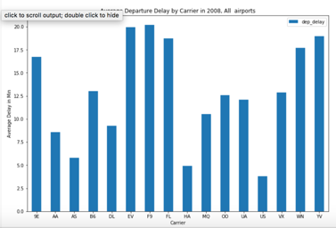<!-- {"left" : 2.54, "top" : 3.7, "height" : 3.55, "width" : 5.23} -->


Notes:

---

# Matplotlib

---

## Matplotlib plots

  * "matplotlib" is python's native plotting library

  * It is powerful, with lots of options, not focused on aesthetics

  * "matplotlib" website - https://matplotlib.org/

  * "matplotlib" needs to be imported
    - `import matplolib.pyplot as plt`

  * Plotting data in "x", "y"

```pycon
>>> plt.plot(x, y)
```
<!-- {"left" : 0, "top" : 4.58, "height" : 0.54, "width" : 3.78} -->

Notes:

"matplotlib" website - https://matplotlib.org/

---

## Matplotlib plots

  * To show plots
    - `plt.show()`
    - Will pop up a window with the plot
    - Except when running in a Jupyter Notebook.
  * Saving plots to a file
    - `plt.savefig("test.png") # uses extension`
    - Use the file extension
  * To show plots in jupyter notebook:
    - `%matplotlib inline%`
    - This is a cell magic for jupyter, NOT a line of python code!
    - Do **NOT** have to write `plt.show()` if you have this.

---

## Matplotlib plot options

  * To set x axis label

    - `plt.xlabel("x label")`

  * To set y axis label

    - `plt.ylabel("y label")`

  * To set title on plot

    - `plt.title("title")`

  * To turn grid on/off plot

    - `plt.grid(True/False)`

Notes:

---

## Matplotlib Simple Example

```python
t = np.arange(0.0, 2.0, 0.01)
s = 1 + np.sin(2*np.pi*t)
plt.plot(t, s)
plt.xlabel('time (s)')
plt.ylabel('voltage (mV)')
plt.title('Sine wave')
plt.grid(True)
plt.savefig("test.png")
```

<!-- {"left" : 0, "top" : 1.47, "height" : 2.39, "width" : 5.61} -->

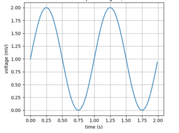<!-- {"left" : 2.83, "top" : 4.42, "height" : 3.43, "width" : 4.6} -->

Notes:

---

## Visualizing Data

| Method          | Description                                                 |
|-----------------|-------------------------------------------------------------|
| Boxplot         | A quick way to visualize the data                           |
| Frequency table | Count number of data points that fall into intervals  (bins) |
| histogram       | Plot of frequency table                                     |
| Density plot     | Smoothed version of histogram. (Kernel Density Estimate)     |

<!-- {"left" : 0.26, "top" : 1.3, "height" : 2.88, "width" : 9.75, "columnwidth" : [4.88, 4.88]} -->

Notes:

---
## Boxplot / Box-and-Whisker Plot

* Boxplot displays 5 measures: min, Q1, Q2 (median), Q3, max

* Q1, Q2, Q3 are the first, second and third quartiles

* Smallest / Largest values are measured within upper/lower fences

* Fences are usually 1.5 times IQR (Q3 - Q1)


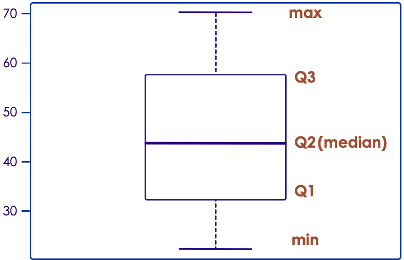<!-- {"left" : 2.82, "top" : 4.24, "height" : 3.36, "width" : 4.6} -->

Notes:

---

## Boxplot / Box-and-Whisker Plot

  * Example: Boxplot for income data (sorted)
    `[22k, 25k, 30k, 35k, 40k, 42k, 45k, 50k, 55k, 60k, 65k, 70k]`

```python
import numpy as np
import matplotlib.pyplot as plt
import seaborn as sns
salaries = np.array([22, 25, 30, 35, 40, 42, 45, 50, 55, 60, 65, 70])
plt.figure()
plt.title("Boxplots")
plt.subplot(1, 2, 1)
m = plt.boxplot(salaries)
plt.ylabel("salaries(thousands)")
plt.title("matplotlib boxplot")
plt.subplot(1, 2, 2)
sns.set()
s = sns.boxplot(data = salaries)
plt.title("seaborn boxplot")
plt.show()
```
<!-- {"left" : 0, "top" : 2.69, "height" : 3.54, "width" : 10.25} -->

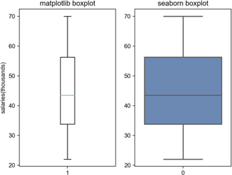<!-- {"left" : 5.48, "top" : 4.8, "height" : 3.28, "width" : 4.39} -->


Notes:

---
## Histograms

  * Example: Histogram for `np.random.randn()` data

```python
import numpy as np
import matplotlib.pyplot as plt
import seaborn as sns
num = np.random.randn(1500)
plt.figure()
# plt.title("Histograms")
# plt.subplot(2, 1, 1)
m = plt.hist(num, bins=10)
plt.grid(True)
plt.title("matplotlib Histogram")
plt.figure()
# plt.subplot(2, 1, 2)
s = sns.distplot(num, color = "r", bins = 10)
plt.grid(True)
plt.title("seaborn Histogram")
plt.show()
```
<!-- {"left" : 0, "top" : 1.72, "height" : 4.5, "width" : 8.28} -->


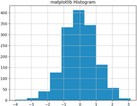<!-- {"left" : 1.65, "top" : 6.29, "height" : 2.46, "width" : 3.19} --> &nbsp;&nbsp;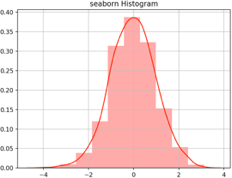<!-- {"left" : 5.38, "top" : 6.28, "height" : 2.47, "width" : 3.22} -->


Notes:

---

## Scatter Plot (Python)

  * Histogram counts data points per bin

```python
%matplotlib inline
import numpy as np
import matplotlib.pyplot as plt
bills = np.array([50,30,60,40,65,20,10,15,25,35])
tips= np.array([12,7,13,8,15,5,2,2,3,4])
plt.xlabel("bill amount")
plt.ylabel("tip")
plt.scatter(bills, tips)
```
<!-- {"left" : 0, "top" : 2, "height" : 2.39, "width" : 8.94} -->


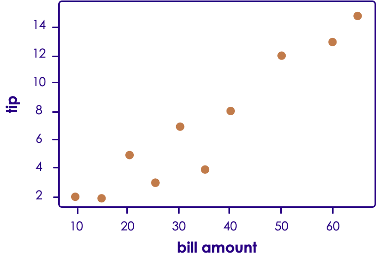<!-- {"left" : 2.63, "top" : 4.88, "height" : 3.45, "width" : 5} -->

Notes:


## Lab: matplotlib - intro

  * Overview:

    - Intro to matplotlib

  * Approximate time:

    - 10 mins

  * Instructions:

    - `visualization/1-viz-intro.ipynb`

---

# Advanced Matplotlib

---

## Matplotlib subplots

  * Matplotlib allows us to create subplots

```python
# Create two subplots sharing y axis
fig, (ax1, ax2) = plt.subplots(2, sharey=True)

ax1.plot(x1, y1, 'ko-')
ax2.plot(x2, y2, 'r.-')
ax2.set(xlabel='time (s)', ylabel='Undamped')
```

<!-- {"left" : 0, "top" : 1.84, "height" : 1.86, "width" : 8.44} -->

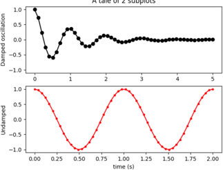<!-- {"left" : 2.47, "top" : 4.23, "height" : 3.71, "width" : 5.31} -->

Notes:

---

## Figure Versus Axes

  * The figure object is the entire plot

  * Typically used if we want to save the figure

  * The axes represent the plots

  * We can have more than one (subplots)

  * Here's how we get one:

```python
import matplotlib.pyplot as plt

fig,ax = plt.subplots() # Just one plot
```
<!-- {"left" : 0, "top" : 4.17, "height" : 1.17, "width" : 7.97} -->

<br/>

  * More than one (subplots)

```python
import matplotlib.pyplot as plt

fig, (ax1,ax2)	 = plt.subplots(2) #Two subplots
```
<!-- {"left" : 0, "top" : 6.1, "height" : 1.07, "width" : 9.11} -->

Notes:

---

## Matplotlib - plot()

  * Voltage vs Time using `plot()`:

```python
import matplotlib.pyplot as plt
import numpy as np
t = np.arange(0.0, 2.0, 0.01)
s = 1 + np.sin(2*np.pi*t)
plt.plot(t, s)
plt.xlabel('time (s)')
plt.ylabel('voltage (mV)')
plt.title('Sine wave')
plt.grid(True)
plt.savefig("test.png")
```
<!-- {"left" : 0, "top" : 2.0, "height" : 2.92, "width" : 5.94} -->

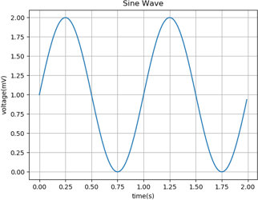<!-- {"left" : 4.5, "top" : 5.0, "height" : 3.83, "width" : 5.11} -->

Notes:

---

## Matplotlib - subplot()

  * Undamped vs Damped oscillations using subplot():

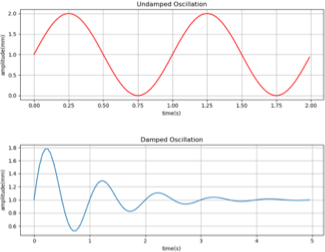<!-- {"left" : 6.63, "top" : 6.17, "height" : 2.72, "width" : 3.52} -->

```python
import matplotlib.pyplot as plt
import numpy as np

x1 = np.arange(0, 2, 0.01)
x2 = np.arange(0, 5, 0.05)
y1 = 1 + np.sin(2 * np.pi * x1)
y2 = 1 + np.multiply(np.exp(-x2), np.sin(2 * np.pi * x2))

plt.figure(num = 1, figsize=(10.24,7.68))
plt.subplots_adjust(wspace = 0.3, hspace = 0.5)
plt.subplot(2,1,1)
plt.plot(x1, y1, color = "r")
plt.xlabel("time(s)")
plt.ylabel("amplitude(mm)")
plt.title("Undamped Oscillation")
plt.grid(True)
plt.subplot(2,1,2)
plt.plot(x2, y2)
plt.xlabel("time(s)")
plt.ylabel("amplitude(mm)")
plt.title("Damped Oscillation")
plt.grid(True)
plt.savefig("matplotlib2.png")
plt.show()
```
<!-- {"left" : 0, "top" : 2.06, "height" : 4.28, "width" : 6.65} -->

Notes:

---

## Matplotlib - scatter()

  * Random numbers using `scatter()`:

```python
import numpy as np
import matplotlib.pyplot as plt
np.random.seed(23238023)
p = 50
x = np.random.rand(p)
y = np.random.rand(p)
plt.scatter(x, y)
plt.show()
```
<!-- {"left" : 0, "top" : 2.0, "height" : 3.18, "width" : 8.78} -->


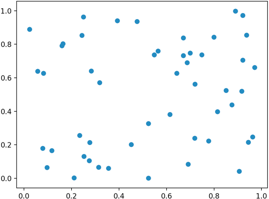<!-- {"left" : 5.47, "top" : 4.74, "height" : 3.18, "width" : 4.3} -->


Notes:

---

## Matplotlib - scatter()

  * Random numbers using `scatter()`:
  * Notice colors/shapes:

```python
import numpy as np
import matplotlib.pyplot as plt
np.random.seed(23238023)
p = 50
x = np.random.rand(p)
y = np.random.rand(p)
colors = np.random.rand(p)
area = (30 * np.random.rand(p))**2
plt.scatter(x, y, s=area, c=colors, alpha=0.5)
plt.show()
```
<!-- {"left" : 0, "top" : 2.0, "height" : 3.18, "width" : 8.44} -->

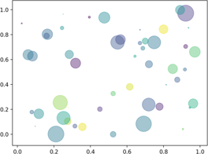<!-- {"left" : 5.54, "top" : 5.08, "height" : 3.27, "width" : 4.4} -->


Notes:

---

## Matplotlib - bar()

  * Bar plot using matplotlib:

```python
import matplotlib.pyplot as plt
y = [4, 11, 5.5, 6, 4, 4.5, 6.3, 8.1]
N = len(y)
x = range(N)
width = 1/1.5
plt.bar(x, y, width)
plt.show()
```
<!-- {"left" : 0, "top" : 1.74, "height" : 2.13, "width" : 6.94} -->


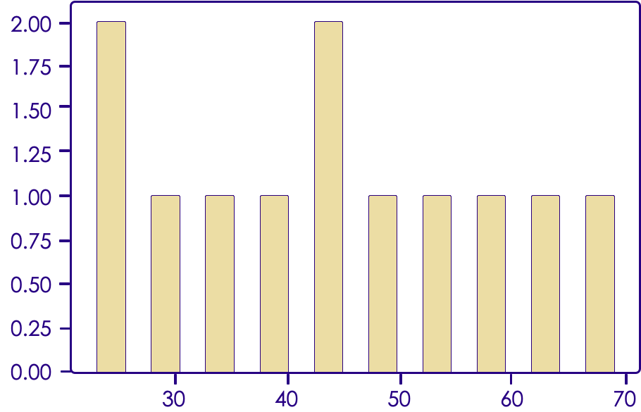<!-- {"left" : 2.68, "top" : 4.49, "height" : 3.71, "width" : 4.89} -->

Notes:

---

## Matplotlib - pie()

  * Pie Chart using matplotlib:

```python
import matplotlib.pyplot as plt
labels = 'Apples', 'Oranges', 'Strawberries', 'Blueberries'
fracs = [10, 30, 45, 15]
plt.pie(fracs, labels=labels, autopct="%1.1f%%")
plt.title("Fruits in the basket")
plt.show()
```
<!-- {"left" : 0, "top" : 2.0, "height" : 1.8, "width" : 10.25} -->


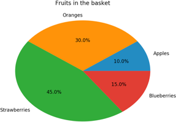<!-- {"left" : 3.09, "top" : 4.57, "height" : 3.47, "width" : 4.07} -->

Notes:

---

# Seaborn
---

## Seaborn: pretty graphs

  * Matplotlib graphs are powerful but not very beautiful.

  * Seaborn makes some pretty plots

  * Based on Matplotlib

  * Allows a number of aesthetic parameters.

Notes:

---

## Seaborn pretty plots

  * "matplotlib" graphs are powerful but not very beautiful

  * "seaborn" makes some pretty plots

  * It is based on "matplotlib"

  * It allows a number of aesthetic parameters

  * "seaborn" website - https://seaborn.pydata.org/

  * "seaborn" needs to be imported
    - `import seaborn as sns`


Notes:

---

## Seaborn - barplot() - Ease of use

  * **Bar plot** example - comparison of matplotlib / seaborn code

  * Lengthier code in matplotlib

```python
fig, ax = plt.subplots()
rects1 = ax.bar(ind, men_means, width, color='r'
,yerr=men_std)
rects2 = ax.bar(ind + width, women_means, width,
color='y', yerr=women_std)
ax.set_xticks(ind + width / 2)
ax.legend((rects1[0], rects2[0]), ('Men', 'Women'))
```
<!-- {"left" : 0, "top" : 2.28, "height" : 2.37, "width" : 10.25} -->


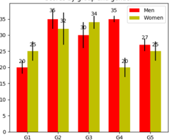<!-- {"left" : 3.42, "top" : 4.82, "height" : 2.76, "width" : 3.41} -->

Notes:

---

## Seaborn - barplot() - Ease of use

  * **Bar plot** example - comparison of matplotlib / seaborn code

  * Condensed shorter code in seaborn for the same plot
    - `ax = sns.barplot(x="day", y="total_bill", hue="sex", data=tips)`

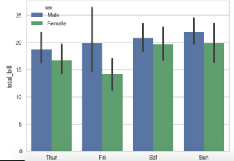<!-- {"left" : 3.16, "top" : 3.62, "height" : 3.19, "width" : 3.94} -->

Notes:

---

## Seaborn - regplot()

* **Regression plot** example

* Take a look at the `tips.csv` dataset (used in example below)


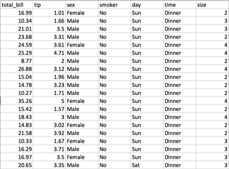<!-- {"left" : 1.94, "top" : 3.11, "height" : 4.75, "width" : 6.35} -->

Notes:

---

## Seaborn - regplot()

  * **Regression plot** example

```python
import numpy as np
import matplotlib.pyplot as plt
import seaborn as sns
import pandas as pd
tips = sns.load_dataset("tips")
sns.regplot(x="total_bill", y="tip", data = tips,
color="g", marker="+")
plt.show()
```
<!-- {"left" : 0, "top" : 1.59, "height" : 2.86, "width" : 10.25} -->


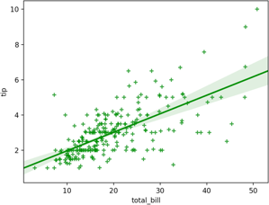<!-- {"left" : 2.63, "top" : 4.62, "height" : 4.0, "width" : 5.4} -->

Notes:

---

## Seaborn - regplot()

  * Changing colors and pen thickness: 

```python
import numpy as np
import matplotlib.pyplot as plt
import seaborn as sns
import pandas as pd
tips = sns.load_dataset("tips")
sns.regplot(x = "total_bill", y = "tip",
data = tips, marker = "+",
scatter_kws = {"color" : "green"},
line_kws = {"color" : "red", "linewidth" : 4})
plt.show()
```
<!-- {"left" : 0, "top" : 1.64, "height" : 3.34, "width" : 9.75} -->


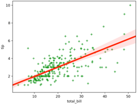<!-- {"left" : 2.53, "top" : 5.11, "height" : 3.58, "width" : 4.7} -->


Notes:

---

## Lab: matplotlib/seaborn - cars

  * Overview:

    - Learn matplotlib and seaborn by exploration of the cars dataset

  * Approximate time:

    - 20 mins

  * Instructions:

    - **visualization/2-plot-cars.ipynb**


---


# Examples

---

## Bar Plots: Matplotlib

  * Example of a barplot

```python
fig, ax = plt.subplots()
rects1 = ax.bar(ind, men_means, width,
color='r',yerr=men_std)
rects2 = ax.bar(ind + width, women_means, width,
color='y', yerr=women_std)

# add some text for labels, title and axes ticks
ax.set_xticks(ind + width / 2)
ax.legend((rects1[0], rects2[0]), ('Men', 'Women'))
```
<!-- {"left" : 0, "top" : 1.92, "height" : 2.58, "width" : 9.75} -->


<!-- {"left" : 3.17, "top" : 5.07, "height" : 3.17, "width" : 3.91} -->

Notes:

---

## Barplot: Seaborn

  * Seaborn is easier!

```python
ax = sns.barplot(x="day", y="total_bill", hue="sex", data=tips)
```
<!-- {"left" : 0, "top" : 1.85, "height" : 0.49, "width" : 10.25} -->


<!-- {"left" : 2.14, "top" : 3.28, "height" : 4.3, "width" : 5.97} -->


Notes:

---

## Heatmap

 * We can do Heatmaps in seaborn


```python
import matplotlib.pyplot as plt
import seaborn as sns
sns.set()

flights_long = sns.load_dataset("flights")
flights = flights_long.pivot("month", "year", "passengers")

# Draw a heatmap with the numeric values in each cell
f, ax = plt.subplots(figsize=(9, 6))
sns.heatmap(flights, annot=True, fmt="d", linewidths=.5, ax=ax)
```
<!-- {"left" : 0, "top" : 1.66, "height" : 2.88, "width" : 7.84} -->

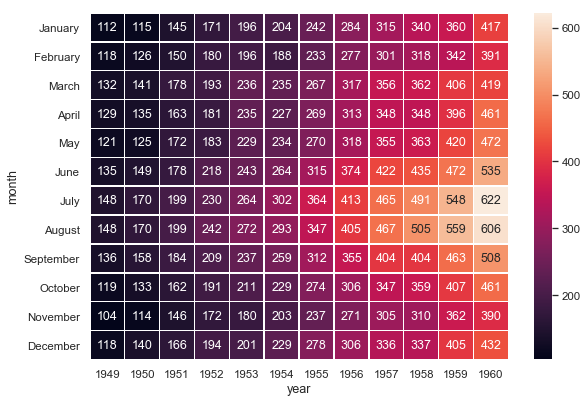<!-- {"left" : 4.07, "top" : 4.73, "height" : 4.13, "width" : 5.73} -->

---

## Lab: Heatmaps 

  * Overview:

    - Heatmap with Seaborn


  * Approximate time:

     - 30 minutes

  * Instructions:

    - **visualization/3-heatmap.ipynb**

---


# Other Visualiztion

---

## ggplot

  * ggplot package is a very popular graphics package

  * Based on ggplot2 package in R
    - use **BOTH** R and Python!

  * Provides very readable graphics

  * Has a 'grammar' to describe graph

  * Excels at graphing complex data sets

  * Mastering ggplot can be 'challenging' (though extremely powerful)

  * Recommended book : "ggplot2: Elegant Graphics for Data Analysis"

  * [Link](http://www.ling.upenn.edu/~joseff/rstudy/summer2010_ggplot2_intro.html)


Notes:

  http://www.ling.upenn.edu/~joseff/rstudy/summer2010_ggplot2_intro.html


---

## ggplot examples


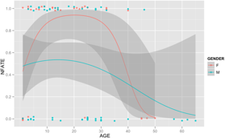<!-- {"left" : 1.36, "top" : 1.69, "height" : 2.56, "width" : 4.1} -->&nbsp;&nbsp;&nbsp;&nbsp;&nbsp;&nbsp;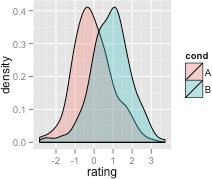<!-- {"left" : 5.26, "top" : 1.69, "height" : 2.78, "width" : 3.47} -->


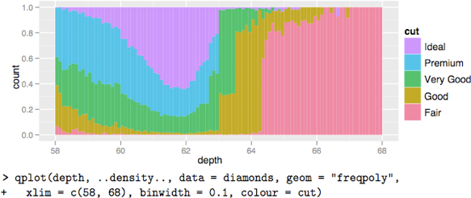<!-- {"left" : 1.03, "top" : 4.61, "height" : 3.56, "width" : 8.18} -->

Notes:

---

## Ggplot - general syntax

  * Syntax

    - Involves Data, Aesthetics and Layers
    - ggplot (data, aes, layers)

  * data

    - can be DataFrame, vector, etc.

  * aes

    - Maps how elements get converted to graph
    - x position / x-y position / shape / color

  * layers

    - Geometric shapes
    - Points / lines / bars

Notes:

---

## Ggplot point and line plots

  * Quick example of point and line plots:

```python
import ggplot
ggplot(mtcars, aes(hp, mpg))  #Error: No layers in plot
ggplot(mtcars, aes(hp, mpg)) + geom_point() #point layer
ggplot(mtcars, aes(hp, mpg)) + geom_line() #line layer
```
<!-- {"left" : 0, "top" : 1.76, "height" : 1.33, "width" : 10.11} -->


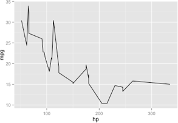<!-- {"left" : 5.17, "top" : 3.56, "height" : 3.09, "width" : 4.43} -->&nbsp;&nbsp;&nbsp;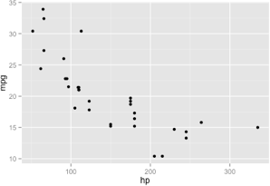<!-- {"left" : 0.38, "top" : 3.55, "height" : 3.15, "width" : 4.51} -->

Notes:

---

## Ggplot point and line plots

  * Same example of point and line plots (w/ variable assignment)

```python
import ggplot
g = ggplot(mtcars, aes(hp, mpg))  #Error: No layers in plot
g1 = g + geom_point() #point layer
g2 = g + geom_line() #line layer
```
<!-- {"left" : 0, "top" : 2, "height" : 1.33, "width" : 10.25} -->

<!-- {"left" : 5.17, "top" : 3.56, "height" : 3.09, "width" : 4.43} -->&nbsp;&nbsp;&nbsp;<!-- {"left" : 0.38, "top" : 3.55, "height" : 3.15, "width" : 4.51} -->

Notes:

---

## Lab: Graphs / ggplot

  * Overview:
    - Exploring graphing with Python

  * Approximate time:
    - 30 minutes

  * Instructions:
    - **visualization/4-ggplot.ipynb**


Notes:

---

## Plotly 

 * Plotly is a cross-platform plotting and charting library for python
 * Cross-Platform:
   - R
   - Matplab
   - Python
   - Javascript
 * It consists of two parts:
   - `plotly.js` - client-side library for webpage
   - `plotly` python package: python bindings.


---

## Dash 
 * Dash is a webapp framework on top of plotly and python
 * Runs on top of "Flask" web service framework.
 * Similar to Shiny in R.


---

## Bokeh 

 * Bokeh is a plotting library for web-based *interactive* visualizations
 * Excellent for dashboarding and interactive web and mobile visualizations

---

## Review


<!-- {"left" : 0.26, "top" : 1.25, "height" : 5.48, "width" : 9.74} -->
