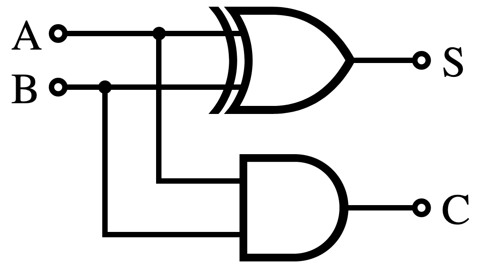
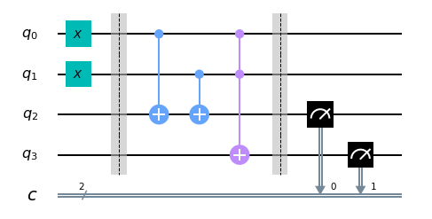
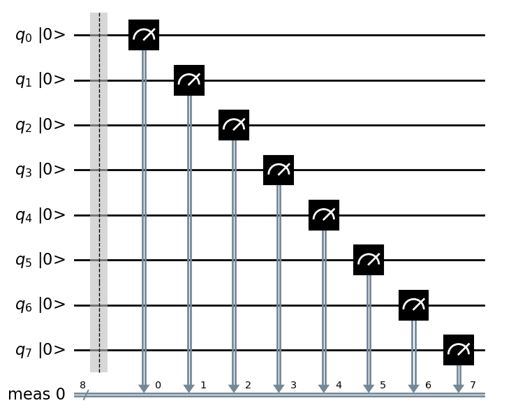
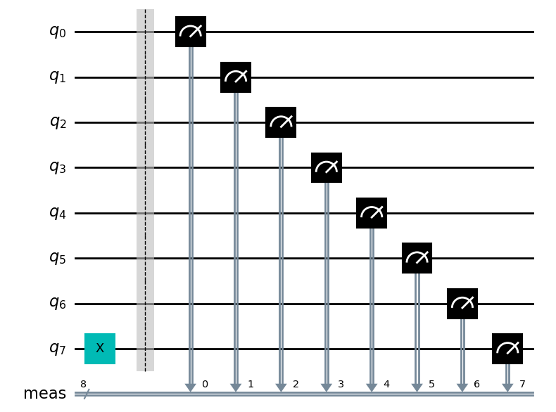

# Atoms of computations

---

# Bits

## Splitting information into bits

* 9000+200+10+3
* Think of a number and try to write it down in binary.
* If you have n bits, how many different states can they be in?

---

## Computation as a diagram



---

## Qiskit diagram



---

## Your first quantum circuit



---

## Adder circuit



---

## Addition in binary

```text
   10001111111101
+  00011100111110

=  ??????????????

   10001111111101
+  00011100111110
=  ???????????011 

```

## 1 + 1


---


# Lab

* First QC notebook
* https://github.com/elephantscale/quantum-computing-labs/blob/main/02-atoms/02.1-atoms-of-computation.ipynb
* Variation of first notebook
* https://github.com/elephantscale/quantum-computing-labs/blob/main/02-atoms/02.2-atoms-of-computation.ipynb

---