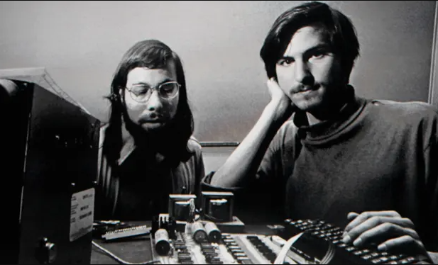

# Future of QC

---

# Remaining QC challenges

Note:

https://thequantuminsider.com/2023/03/24/quantum-computing-challenges/

---

## 1.ERROR CORRECTION

* Most experts would consider this the biggest challenge. Quantum computers are extremely sensitive to noise and errors caused by interactions with their environment. This can cause errors to accumulate and degrade the quality of computation. Developing reliable error correction techniques is therefore essential for building practical quantum computers.

---

## 2. SCALABILITY

* While quantum computers have shown impressive performance for some tasks, they are still relatively small compared to classical computers. Scaling up quantum computers to hundreds or thousands of qubits while maintaining high levels of coherence and low error rates remains a major challenge.

---

## 3. HARDWARE DEVELOPMENT

* Developing high-quality quantum hardware, such as qubits and control electronics, is a major challenge. There are many different qubit technologies, each with its own strengths and weaknesses, and developing a scalable, fault-tolerant qubit technology is a major focus of research.

---

## 4. SOFTWARE DEVELOPMENT
 
*  Quantum algorithms and software development tools are still in their infancy, and there is a need for new programming languages, compilers, and optimization tools that can effectively utilize the power of quantum computers.

---

## 5. CLASSICAL COMPUTERS INTERFACES
 
* Quantum computers won’t replace classical computers; they will serve as complementary technology. 
* Developing efficient and reliable methods for transferring data between classical and quantum computers is essential for practical applications.

---

## 6. STANDARDS AND PROTOCOLS
 
*  As the field of quantum computing matures, there is a need for standards and protocols for hardware, software, and communication interfaces. Developing these standards will be essential for ensuring compatibility and interoperability between different quantum computing platforms. We should also throw in benchmarking — the ability to measure performance standards is still in its infancy for quantum computing design, development and operation.

---

## 7. TRAINED TALENT

* The number of people properly educated and trained to enter the quantum workforce is small and spread across the world. Finding the right workers is a challenge. In a chicken-and-egg scenario, we won’t increase the number of people motivated to enter the quantum workforce until we have more practical quantum computers and we won’t have more practical quantum computers until we have more people motivated to become part of the quantum workforce.

---

## 8. OVERALL EXPENSE

* Perhaps this is an obvious outcome of all the above challenges, but expense remains a huge roadblock — or stumbling block — for quantum computing. 
* The likelihood that two Steves will be slapping together quantum computers in their garage is an unlikely scenario. 
* Quantum talent is expensive. Quantum hardware is expensive. Supply chains are complex, vulnerable and — you guessed it — expensive to establish and maintain. 
* Dealing with these expenses and finding investments to offset these costs will likely be a standard duty of institutional scientists and commercial entrepreneurs for the foreseeable future.

---

