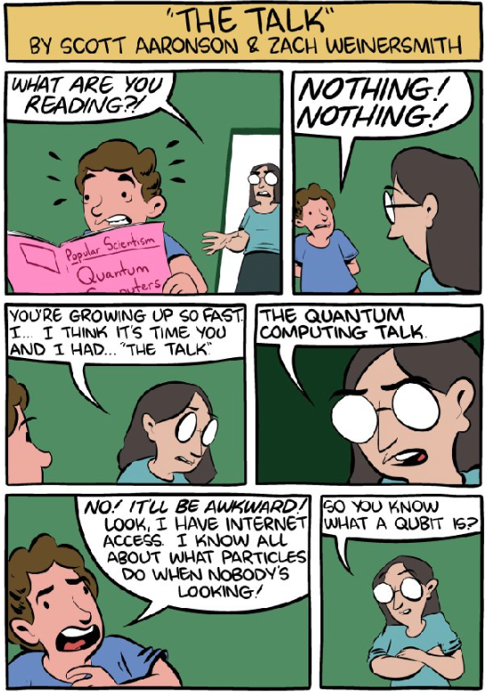
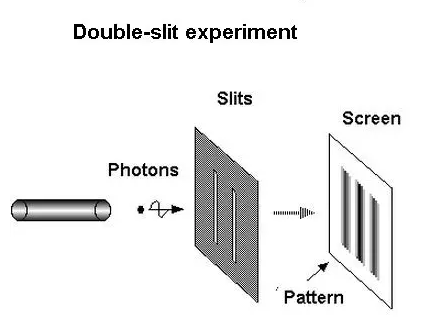

# Introduction

---

## Quantum computing is easy

* Even babies know it

* Let's listen to the book
* [https://www.youtube.com/watch?v=wZtnNUYkNOc](https://www.youtube.com/watch?v=wZtnNUYkNOc)

---

## How to talk about quantum computing to your teenager

* [https://www.quora.com/What-is-an-intuitive-explanation-of-quantum-computing](https://www.quora.com/What-is-an-intuitive-explanation-of-quantum-computing)

---

## Double slit experiment

---

## Why learn quantum computing?

* Moore law
  * Number of transistors per silicon chip doubles every year, or every 18 months
  * But now, this law does not work
  * Because with small transistors there is electrical leakage
  * And because of heat
  * We use smaller chips, we come to subatomic particles, and these are in the realm of quantum mechanics
  * Cost of cooling in server rooms

---

## Why else to learn about quantum computing
* Better factoring prime numbers
  * Better, not hackable encryption

* New research
  * Quantum communication, networks, internet
    * Novel ways of information transfer

---

## One more reason - optimization

* Quantum computer are very good about solving optimization problems
  * Calculating optimal route for delivery
  * Scheduling flights
  
---

## And one more advantage of QC
* QC is very good at specific problems
  * They will not replace classic computers, but...
  * Exponentially accelerate Machine Learning
  * We will implement it! With IBM Qiskit!!

---

## Applications of Quantum Computing

1. Energy Grid Optimization
   * [Article by Jirawat Tangpanitanon](https://qtft.org/post/quantum-computing-for-energy-system-optimisation)
2. Weather forecasting
   * Because of multiple parameters
3. Finance
   * Prediction of financial markets
4. Risk analysis
   * Credit risk analysis
5. Portfolio optimization
6. Supply chain and inventory optimization
7. Battery, electronic chip design
8. Drug development, medicine discovery
9. Material science - novel material discovery
10. Quantum cryptography & cybersecurity
11. Accelerating Machine Learning

--- 

## What is quantum
* Instructor tells the story
* He uses this demo [https://qiskit.org/textbook/what-is-quantum.html](https://qiskit.org/textbook/what-is-quantum.html)

---

## Nobel  prize 2022
* No local realism
* [Explanation from Olivia](https://www.youtube.com/watch?v=9OM0jSTeeBg)
* We will be back to this later

---
## Lab - setup

* Setup of Python
* https://github.com/elephantscale/quantum-computing-labs/blob/main/01-setup/01.1-setup.md
* Setup of Qiskit
* https://github.com/elephantscale/quantum-computing-labs/blob/main/01-setup/01.2-install-qiskit.md
* Setup of Jupyter
* https://github.com/elephantscale/quantum-computing-labs/blob/main/01-setup/01.3-prepare-notebook.md

---