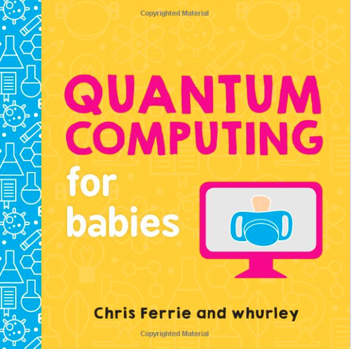
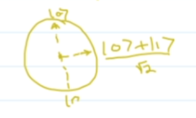
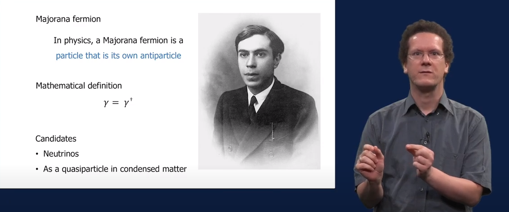

# Introduction

---

## Quantum computing is easy

* Even babies know it

* Let's listen to the book
* [https://www.youtube.com/watch?v=wZtnNUYkNOc](https://www.youtube.com/watch?v=wZtnNUYkNOc)

---

## Why learn quantum computing?

* Moore law
  * Number of transistors per silicon chip doubles every year, or every 18 months
  * But now, this law does not work
  * Because with small transistors there is electrical leakage
  * And because of heat
  * We smaller chips, we come to subatomic particles, and these are in the realm of quantum mechanics
  * Cost of cooling in server rooms

---

## Why else to learn about quantum computing
* Better factoring prime numbers
  * Better, not hackable encryption

* New research
  * Quantum communication, networks, internet
    * Novel ways of information transfer

---

## One more reason - optimization

* Quantum computer are very good about solving optimization problems
  * Calculating optimal route for delivery
  * Scheduling flights
  
---

## And one more advantage of QC
* QC is very good at specific problems
  * They will not replace classic computers, but...
  * Exponentially accelerate Machine Learning
  * We will implement it! With IBM Qiskit!!

---

## Applications of Quantum Computing

1. Energy Grid Optimization
   * [Article by Jirawat Tangpanitanon](https://qtft.org/post/quantum-computing-for-energy-system-optimisation)
2. Weather forecasting
   * Because of multiple parameters
3. Finance
   * Prediction of financial markets
4. Risk analysis
   * Credit risk analysis
5. Portfolio optimization
6. Supply chain and inventory optimization
7. Battery, electronic chip design
8. Drug development, medicine discovery
9. Material science - novel material discovery
10. Quantum cryptography & cybersecurity
11. Accelerating Machine Learning

--- 
## Quantum Computing vs. Classical

| Quantum Computing                                                                                         | Classical Computing                                  |
|-----------------------------------------------------------------------------------------------------------|------------------------------------------------------|
| Quantum bits of Qubits => Two-level quantum systems => \|0> or \|1>  or linear combination of \|0> & \|1> | Classical bits 0 & 1 => voltage levels - ON or OFF   |
| Calculation power increases exponentially with no of qubits                                               | Calculation power increases linearly with no of bits |
| Hardware varies, such as superconducting qubits, ion traps, integrated photonics, Majorano Fermions       | Hardware made of CMOS circuits                       |
| QPU - process in parallel                                                                                 | CPU - process sequentially                           |
| Useful for optimization,  data analysis, and simulation                                                   | Can be used for everyday tasks                       |

---

## Qubits picture

---

## Majorano Fermions

---

# Atoms of computation

---

# What is quantum?

---

# Qubits and quantum gates

---