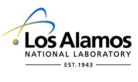
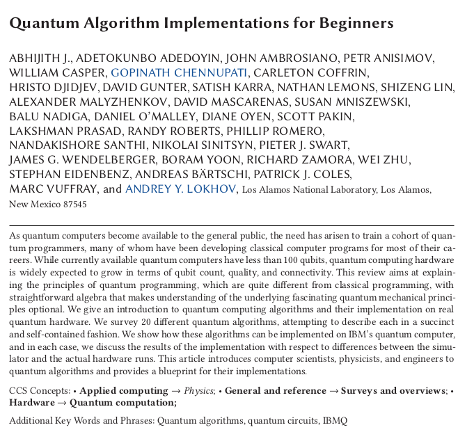
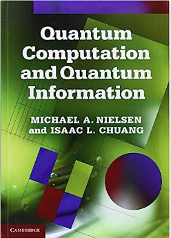
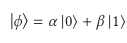
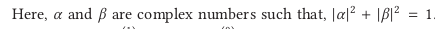
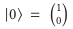
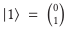

# LANL paper

## LANL
* LANL is Los Alamos National Laboratory

---

## Paper

---

## Summary

* As quantum computers become available to the general public, the need has arisen to train a cohort of quan-
tum programmers, many of whom have been developing classical computer programs for most of their careers. 
* While currently available quantum computers have less than 100 qubits, quantum computing hardware
is widely expected to grow in terms of qubit count, quality, and connectivity. 
* We survey 20 different quantum algorithms, attempting to describe each in a succinct
and self-contained fashion. 

---

## The Quantum Computing Programming Model

* Self-contained description of the quantum computing programming model.
* Common terms and concepts
* For foundations, look further

---

## Book

---

## Major points

* Quantum computing basically deals with the manipulation of quantum systems. 
* The physical details of this is dependent on the quantum computer’s hardware design. 
* Here, we will only talk about the higher level abstractions used in quantum computing: 
* A typical programmer will only be exposed to these abstractions.

---

## More hairy

* The state of any quantum system is always represented by a vector in a complex vector space (usually called a Hilbert space). 
* Quantum algorithms are always expressible as transformations acting on this vector space. 
* These basic facts follow from the axioms of quantum mechanics. 
* Follow me, Sir, and we will explain some of the basic concepts and terminology used in
quantum computing.

---

## The Qubit

* The qubit (short for ‘quantum bit’) is the fundamental information carrying unit used in quantum computers. 
* It can be seen as the quantum mechanical generalization of a bit used in classical computers. 
* More precisely, a qubit is a two-dimensional quantum system. 
* The state of a qubit can be expressed as

---

## Notation

* The ket-notation or the Dirac notation

---

## Measuring a qubit

* Unlike a classical bit, 
  * the  state of a qubit cannot be measured without changing it. 
* Measuring a qubit will yield the classical value of either zero 
  * with probability |α|**2 
* one
    with probability |β|**2 

---