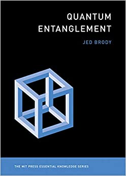

# Philosophy corner

# Local realism

## What is local realism

* Local realism is a philosophical concept that arises in the context of quantum mechanics and is closely associated with the famous Einstein-Podolsky-Rosen (EPR) paradox. 
* It consists of two main principles: locality and realism.

---

## Locality
* Locality is the idea that physical processes occurring at one location do not depend on the properties of objects at other locations, 
* provided that they are separated by a distance large enough that no signal traveling at or below the speed of light could connect them within the relevant time frame. 
* In other words, 
  * events occurring at separate points in space should not be able to instantaneously influence each other.

## Realism

* Realism is the belief that physical properties have definite values independent of observation or measurement. 
* This means that particles should have well-defined properties (such as position, momentum, spin, etc.) even when they are not being directly observed.

---

## Challenge

* Local realism was challenged by the development of quantum mechanics, which introduced the concepts of wave-particle duality, superposition, and entanglement. 
* These phenomena seem to defy the principles of local realism, as they involve the instantaneous collapse of a particle's wavefunction upon measurement, leading to seemingly "spooky action at a distance," as Einstein once called it.

## Conflict

* The conflict between local realism and quantum mechanics was highlighted by the EPR paradox and later formalized by Bell's theorem. 
* Bell's theorem demonstrated that if local realism were true, certain statistical correlations between measurements of entangled particles would have to satisfy specific inequalities, known as Bell inequalities. 
* However, experimental tests have consistently shown violations of these inequalities, providing strong evidence against local realism and in favor of the predictions of quantum mechanics.

---

## No more local realize

* While local realism remains an intuitive and appealing concept, the empirical evidence from quantum experiments indicates that our understanding of the nature of reality may need to accommodate phenomena that cannot be easily reconciled with the principles of locality and realism as we currently understand them.

---

# Four approaches

## Quantum entanglement book

https://xn--webducation-dbb.com/wp-content/uploads/2021/02/Jed-Brody-Quantum-Entanglement-MIT-Press-2020.pdf

---

## Meet Jed Brody

---

## Approaches

* QBism
  * Shut-up and calculated
* Superdeterminism
  * There is no free will
* Multi-verse
* Reality is a higher-dimensional space
  * Three-dimensional titan starts poking the tips of a fork through the two- dimensional world
* Measurement creates objectively real states

---

