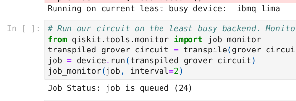

# QC applications and algorithms

---

# Quantum algorithms

---

## Shor's Algorithm:

* This quantum algorithm, proposed by Peter Shor in 1994, is designed for integer factorization.
* It can efficiently factor large composite numbers, which is a computationally hard problem for classical algorithms.
* Shor's algorithm has significant implications for cryptography, as it undermines the security of widely-used cryptographic schemes like RSA.

---

## Grover's Algorithm:

* Proposed by Lov Grover in 1996, this quantum algorithm is used for unstructured search problems.
* It can efficiently search an unsorted database of N items, finding the target item with a quadratic speedup compared to classical search algorithms.
* This makes it particularly useful for solving problems where brute-force search is the best known classical approach.

---

## Quantum Fourier Transform (QFT):

* QFT is a linear transformation that maps the amplitudes of a quantum state to its frequency domain.
* It is a key component of several quantum algorithms, including Shor's algorithm and the quantum phase estimation algorithm.
* The QFT can be implemented more efficiently on a quantum computer than the classical fast Fourier transform (FFT) on a classical computer.

---

## Quantum Phase Estimation (QPE):

* QPE is a quantum algorithm used to estimate the eigenvalues of a unitary operator, which is a crucial subroutine in various quantum algorithms.
* Applications of QPE include solving linear systems of equations, estimating energy levels in quantum chemistry, and quantum simulation.

---

## Variational Quantum Eigensolver (VQE):

* VQE is a hybrid quantum-classical algorithm used to find the ground state energy of a quantum system,
  * which is particularly useful in quantum chemistry and material science.
* The algorithm relies on variational principles to minimize the energy of a parameterized quantum state, with optimization performed classically.

---

## Quantum Approximate Optimization Algorithm (QAOA):

* QAOA is another hybrid quantum-classical algorithm, designed for solving combinatorial optimization problems.
* It approximates the solution by alternating between applying quantum and classical optimization steps.
* QAOA has been applied to problems such as the traveling salesman problem, max-cut, and other NP-hard problems.

---

## HHL Algorithm:

* Named after its creators Harrow, Hassidim, and Lloyd.
* The HHL algorithm is designed to solve linear systems of equations using a quantum computer.
* The algorithm provides an exponential speedup over classical algorithms for specific types of sparse matrices,
  * making it particularly useful for large-scale linear problems.

## Summary

* These algorithms demonstrate the potential for quantum computing to provide significant advantages over classical computing
* in solving certain types of problems.
* However, it's important to note that large-scale, fault-tolerant quantum computers are still under development,
* and these algorithms are yet to be widely deployed in practical applications.

---

# Shor algorithm

## Shor intro

* Shor's algorithm is a quantum algorithm that can efficiently factor large numbers, which has significant implications for cryptography. 
* It was developed by Peter Shor in 1994 and is one of the most well-known quantum algorithms. 
* Entanglement, a fundamental property of quantum mechanics, is a key aspect of the algorithm.

---

## Entanglement in Shor

* Entanglement allows quantum particles to have correlated properties, even when they are far apart. 
* In Shor's algorithm, entanglement is used to create superposition states and perform calculations that would be infeasible with classical computing methods. 
* Here's a simplified overview of how Shor's algorithm uses entanglement:

---

## Initialization: 
* The algorithm starts by preparing two quantum registers (collections of qubits) in an initial state. 
* The first register contains n qubits, and the second register contains m qubits, where n and m are chosen based on the size of the number to be factored. 
* The initial state is a superposition of all possible values for the registers.

---

## Modular exponentiation: 
* A modular exponentiation operation is performed on the second register, which is a crucial step in the algorithm. 
* This operation entangles the states of the two registers, creating a joint state that encodes the periodicity of the modular exponentiation function.

---

## Quantum Fourier Transform (QFT): 
* The QFT is applied to the first register. 
* The QFT essentially extracts the periodicity information encoded in the entangled states of the registers. 
* Since the QFT is a linear operation, the entanglement between the first and second registers is preserved.

---

## Measurement: 
* The first register is measured, which collapses its state to a single value. 
* Due to the entanglement between the registers, this also collapses the state of the second register. 
* The measured value from the first register is used to estimate the period of the modular exponentiation function.

---

## Classical post-processing: 
* With the period found, classical algorithms can be used to compute the greatest common divisor (GCD) and find the factors of the number.
* Entanglement plays an essential role in Shor's algorithm by enabling the creation of superposition states and allowing the efficient extraction of the periodicity information using the QFT. This ability to manipulate and exploit quantum entanglement is what makes Shor's algorithm exponentially faster than classical factoring algorithms.

---

## Meet Peter Shor

---

# Grover algorithm

## Meet Lov Grover

---

## Grover algorithm

---

# How real is QC?

---

## Jack Woehr

* Qiskit Advocate and IBM Champion 2021
* 

*
*
[IBM and Cleveland Clinic are deploying the first on-site quantum computer in health care as tech promises to accelerate scientific breakthroughs](https://fortune.com/2023/03/23/ibm-cleveland-clinic-deploying-first-on-site-quantum-computer-health-care-tech-science-erzurum-gil/)

---
## Cleveland clinic

* One of the largest research centers
* IBM is partnering with Cleveland Clinic to introduce the first quantum computer ever deployed on site in the private sector
* For researchers at Cleveland Clinic, it means the **chance** to develop more precise, targeted, and effective medicines
* We **don’t yet know** precisely which breakthroughs quantum computing will help us achieve

---

## Jack Woehr extended answer

* Hi Mark! Did you ever read Dr. Seuss's Bartholomew and the Oobleck?
* King Derwin of Didd was bored with the weather, so his wizards promised to make Oobleck. He asked, "What's that like?" and they told him, "We don't know, we've never made it before."

---
## Scott Wyman Neagle

[Aliro Quantum’s AliroNet Chosen as the Network Controller for EPB Quantum Network](https://www.hpcwire.com/off-the-wire/aliro-quantums-alironet-chosen-as-the-network-controller-for-epb-quantum-network-powered-by-qubitekk/)

---

## Aliro

* Aliro Quantum, The Quantum Networking Company, offers AliroNet to emulate, pilot and deploy entanglement-based quantum networks
* Got the contract to supply quantum networking

---

## Scott Wyman extended answer

* Hey Mark, what Aliro is doing is building a quantum network for EPB. Initially the network will be used for research. However, I see networking itself as a practical application. The overriding question is, "Is quantum networking part of quantum computing? Or is it a separate discipline?" Having worked in both, I see quantum computing and quantum networking as separate discipline, much like a classical chip designer might not know much about network engineering and vice versa. But in the industry, quantum networking tends to be viewed as a subset of quantum computing.
* Aliro might be a particularly interesting case study for your course, since we are often described as "the quantum Cisco", and the very early stage networking we are doing is similar to the early classical networks that Cisco built in the 80s

---

## Jacob Watkins

*  PhD student in theoretical physics with broad interests in quantum computing and quantum information. My current research focuses on developing algorithms for quantum simulation. 

* It should be said that there is no practical task that people widely agree can be done better on an existing quantum computer compared to a classical computer. Stay tuned!

---

## QC in materials science

* Quantum computational chemistry
  * https://arxiv.org/pdf/1808.10402.pdf
* Quantum algorithms for quantum chemistry and quantum materials science
  * https://arxiv.org/pdf/2001.03685.pdf
* Simulating key properties of lithium-ion batteries with a fault-tolerant quantum computer
  * https://personal.us.es/norge/papers/Phys_Rev_A_106_032428.pdf
* Emerging quantum computing algorithms for quantum chemistry
  * https://arxiv.org/pdf/2109.02873.pdf%20

---

