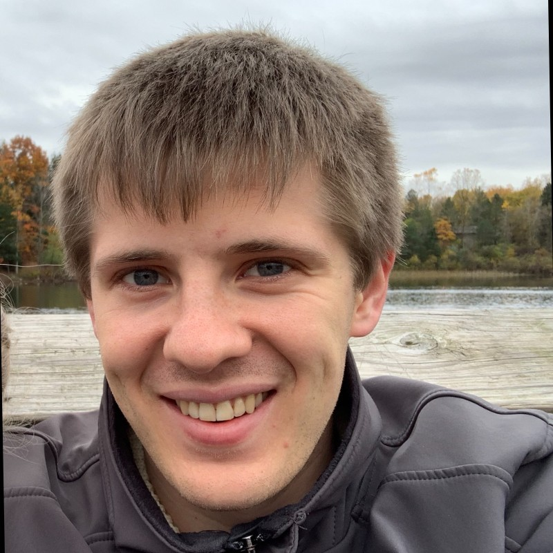

# QC applications

# QC in materials science

## QC in materials science

* Major references
* [Quantum computational chemistry](https://arxiv.org/pdf/1808.10402.pdf)
* [Quantum algorithms for quantum chemistry and quantum materials science](https://arxiv.org/pdf/2001.03685.pdf)
* [Simulating key properties of lithium-ion batteries with a fault-tolerant quantum computer](https://personal.us.es/norge/papers/Phys_Rev_A_106_032428.pdf)
* [Emerging quantum computing algorithms for quantum chemistry](https://arxiv.org/pdf/2109.02873.pdf)

---

## Jack Woehr

* Qiskit Advocate and IBM Champion 2021
* 

*
*
[IBM and Cleveland Clinic are deploying the first on-site quantum computer in health care as tech promises to accelerate scientific breakthroughs](https://fortune.com/2023/03/23/ibm-cleveland-clinic-deploying-first-on-site-quantum-computer-health-care-tech-science-erzurum-gil/)

---
## Cleveland clinic

* One of the largest research centers
* IBM is partnering with Cleveland Clinic to introduce the first quantum computer ever deployed on site in the private sector
* For researchers at Cleveland Clinic, it means the **chance** to develop more precise, targeted, and effective medicines
* We **don’t yet know** precisely which breakthroughs quantum computing will help us achieve

---

## Scott Wyman Neagle

[Aliro Quantum’s AliroNet Chosen as the Network Controller for EPB Quantum Network](https://www.hpcwire.com/off-the-wire/aliro-quantums-alironet-chosen-as-the-network-controller-for-epb-quantum-network-powered-by-qubitekk/)

---

## Aliro

* Aliro Quantum, The Quantum Networking Company, offers AliroNet to emulate, pilot and deploy entanglement-based quantum networks
* Got the contract to supply quantum networking

---

## Jacob Watkins

*  PhD student in theoretical physics with broad interests in quantum computing and quantum information. My current research focuses on developing algorithms for quantum simulation. 

* It should be said that there is no practical task that people widely agree can be done better on an existing quantum computer compared to a classical computer. Stay tuned!

---
