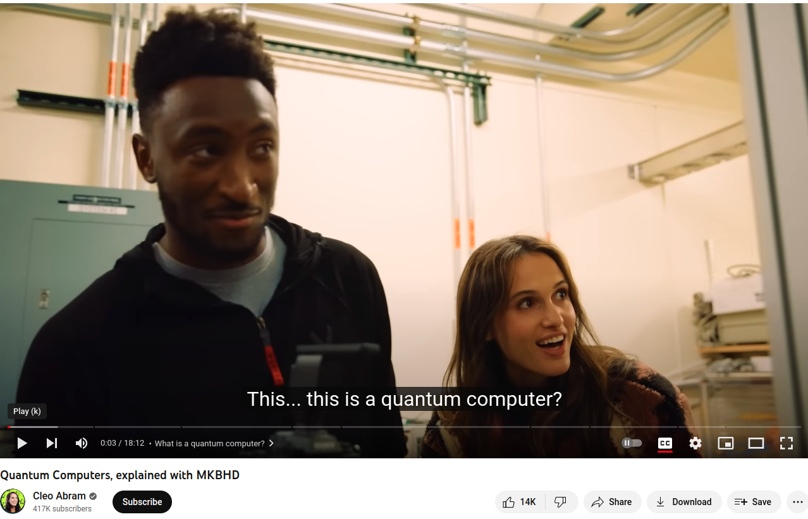
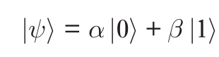
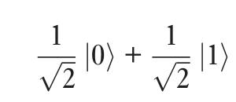
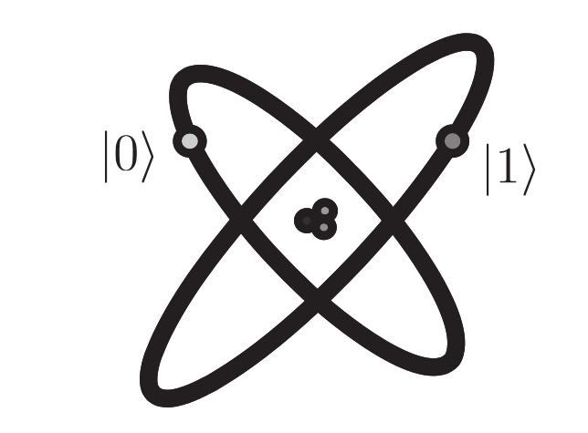
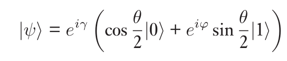
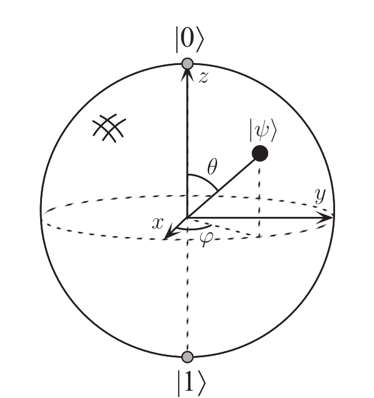
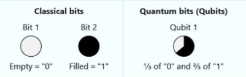
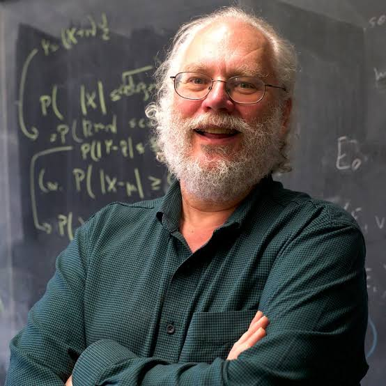
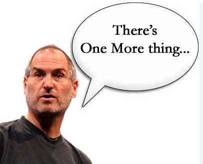

# What is Quantum Computing

---

## Quantum computing explained

* By MKBHD, 16mm subscribers, 3bb views
* https://www.youtube.com/watch?v=e3fz3dqhN44
* To be enjoyed together with the audience
* Followed by a Q&A session

---

## Quantum computing is easy

* Even babies know it

* Let's listen to the book
* [https://www.youtube.com/watch?v=wZtnNUYkNOc](https://www.youtube.com/watch?v=wZtnNUYkNOc)

---

## Global perspective

* Fundamental ideas to quantum computation and quantum information
  * quantum mechanics
  * computer science
  * information theory
  * cryptography

---

## History of quantum computation and quantum information

* classical physics had problems
* predicting absurdities such as 
  * the existence of an ‘ultraviolet catastrophe’ involving infinite energies, or 
  * electrons spiraling inexorably into the atomic nucleus.
* The crisis came to a head in the early 1920s after a quarter century of turmoil, and resulted in the creation of the modern theory of quantum mechanics.

---

## Quantum mechanics

* Has been applied with enormous success to everything under and inside the Sun
* Structure of the atom
* Nuclear fusion in stars
* Superconductors
* Structure of DNA
* Elementary particles of Nature.

---

## What is quantum mechanics?

* Mathematical framework or set of rules for the construction of physical theories.
* Physical theory is known as quantum electrodynamics 
  * describes with fantastic accuracy the interaction of atoms and light
* Quantum electrodynamics is built up within the framework of quantum mechanics, 
  * but contains specific rules not determined by quantum mechanics.
* The rules of quantum mechanics are simple but even experts find them counterintuitive,
---

## Elements of development

* No-cloning theorem, discovered in the early 1980s
* 1970s, of obtaining complete control over single quantum systems
* Since the 1970s many techniques for controlling single quantum systems have been developed.

---

## Single quantum systems

* For example, methods have been developed for 
  * trapping a single atom in an ‘atom trap’, 
  * isolating it from the rest of the world and
  * allowing us to probe many different aspects of its behavior with incredible precision. 
* The scanning tunneling microscope has been used to move single atoms around,
  * creating designer arrays of atoms at will. 
  * Electronic devices whose operation involves the transfer of only single electrons have been demonstrated.

---

## quantum computer idea

* Quantum computers offer an essential speed advantage over classical computers. 
* This speed advantage is so significant that many researchers believe t
  * hat no conceivable amount of progress in classical computation would be able to overcome the gap between the power of a classical computer 
  * and the power of a quantum computer.

---

## Efficiency

* What do we mean by ‘efficient’ versus ‘inefficient’ simulations of a quantum computer? 
* Many of the key notions needed to answer this question were actually invented before the notion of a quantum computer had even arisen. 
* In particular, the idea of efficient and inefficient algorithms was made mathematically precise by the field of computational complexity. 
* Roughly speaking, an efficient algorithm is one which runs in time polynomial in the size of the problem solved. 
* In contrast, an inefficient algorithm requires super-polynomial (typically exponential) time. 
* What was noticed in the late 1960s and early 1970s was that it seemed as though 
* the Turing machine model of computation was at least as powerful as any other model of computation, 
* in the sense that a problem which could be solved efficiently in some model of computation could also be solved efficiently in the Turing machine model, 

---

## Analog computer

* One class of challenges to the strong Church–Turing thesis comes from the field of analog computation. 
* In the years since Turing, many different teams of researchers have noticed that certain types of analog computers can efficiently solve problems
* believed to have no efficient solution on a Turing machine. 
* At first glance these analog computers appear to violate the strong form of the Church–Turing thesis.

---

## Analog problems

* Unfortunately for analog computation, 
* it turns out that when realistic assumptions about the presence of noise in analog computers are made, 
* their power disappears in all known instances; 
* they cannot efficiently solve problems which are not efficiently solvable on a Turing machine.

---

## Lesson of analog

* This lesson – that the effects of realistic noise must be taken into account in evaluating the efficiency of a computational model – 
* was one of the great early challenges of quantum computation and quantum information, 
* a challenge successfully met by the development of a theory of quantum error-correcting codes and fault-tolerant quantum computation. 
* Thus, unlike analog computation, quantum computation can in principle tolerate a finite amount of noise and 
  * still retain its computational advantages.

---

## David Deutsch
* 1985
* Deutsch attempted to define a computational device that would be capable of efficiently simulating an arbitrary physical system.
* the laws of physics are ultimately quantum mechanical
* Deutsch was naturally led to consider computing devices based upon the principles of quantum mechanics. 
* These devices, quantum analogues of the machines defined forty-nine years earlier by Turing, 
* led ultimately to the modern  conception of a quantum computer

---

## Peter Shor’s 
* 1994 demonstration
  * the problem of finding the prime factors of an integer
  * Shor’s results show that quantum computers are more powerful than Turing machines, even probabilistic Turing machines

---

## 1995 Lov Grover 
* showed that another important problem 
  * the problem of  conducting a search through some unstructured search space – 
  * could also be sped up on a quantum computer

---

## Richard Feynman 1982
* essential difficulties in simulating quantum mechanical systems on classical computers
* building computers based on the principles of quantum mechanics would allow us to avoid those difficulties

---

# Quantum bit

---

## Qubit

* The bit is the fundamental concept of classical computation and classical information.
* Quantum computation and quantum information are built upon an analogous concept, the quantum bit, or qubit for short
* We introduce the properties of single and multiple qubits

---

## What is a qubit?
* We’re going to describe qubits as mathematical objects
* But hang on
* Did we say that qubits were physical objects?
* It’s true that qubits, like bits, are realized as actual physical systems
* However, for the most part we treat qubits as abstract mathematical objects

---

## What then is a qubit?
* Just as a classical bit has a state – either 0 or 1
* a qubit also has a state
* Two possible states for a qubit are the states |0> and |1>
* correspond to the states 0 and 1 for a classical bit

---

## Dirac notation

* Notation like |> is called the Dirac notation
* it’s the standard notation for states in quantum mechanics. 
* The difference between bits and qubits is that a qubit can be in a |0> or |1>
* It is also possible to form linear combinations of states, often called superpositions:

---

## Complex numbers

* Put another way, the state of a qubit is a vector in a two-dimensional complex vector space
* The special states |0> and |1> are known as   computational basis states, and form an orthonormal basis for this vector space.

---

## Examine a qubit
* We can examine a bit to determine whether it is in the state 0 or 1
* Rather remarkably, we cannot examine a qubit to determine its quantum state
* Instead, quantum mechanics tells us that we can only acquire much more restricted information about the quantum state.
* When we measure a qubit we get either the result 0, with probability |α|**2 , or the result 1, with probability |β|**2
* |α|**2 + |β|**2 = 1
* since the probabilities must sum to one

---

## Qubit state
* qubit can be in the state

---

## Qubit represented by two electronic levels in an atom

---

## Another form of equation

---

## Yet another form of equation

---

## Bloch sphere

---

## Let us take the bull by the horns 

* Computer have bits
* Quantum computers have qubits
* Bits can be `0` or `1`
* Qubits can be `0` or `1` or anything in between
* Joke quiz
  * Yes?
  * No?
  * Correct

---
## How do you run a quantum computer problem
* Select the qubits
* Set initial values
* Go away and do not look, but **honestly**
  * Looking ruins the wonderful feeling of uncertainty
* Come back and measure the results

---

## What if qubits were waves

* This is how qubits can be anything between `0` and `1`

---

## Picture of a qubit

---

## Superposition power 	

* Superposition allows quantum algorithms to process information in a fraction of the time it would take even the fastest classical systems to solve certain problems.
  * The amount of information a qubit system can represent grows exponentially. Information that 500 qubits can easily represent would not be possible with even more than 2^500 classical bits.
  * It would take a classical computer millions of years to find the prime factors of a 2,048-bit number. Qubits could perform the calculation in just minutes.
  * Shor's algorithm

---

## A word on Shor's algorithm

* Shor's algorithm is a quantum algorithm that can factorize large numbers exponentially faster than the best-known classical algorithm. The number of qubits required to run Shor's algorithm depends on the number to be factored.

* In particular, the number of qubits needed for Shor's algorithm is given by:

  * n_qubits = 2 * ceil(log2(N)) + O(1)

  * where N is the number to be factored and ceil(log2(N)) is the smallest integer greater than or equal to the base-2 logarithm of N.

---

## So practically

* For example, if we want to factorize a 2048-bit number, we would need approximately 4096 qubits. However, currently available quantum computers have much fewer qubits, and the largest number factored using Shor's algorithm on a quantum computer is 21.

* Therefore, while the theoretical power of Shor's algorithm is immense, it is not yet practical for factoring large numbers on current quantum computers.

* IBM's Osprey has 433 qubits - we are not there yet

---

## How qubits numbers grow?

* IBM Q System One: 20 qubits - January 2019
* IBM Q System One "Falcon": 27 qubits - May 2020
* IBM Q System One "Eagle": 53 qubits - November 2020
* IBM Quantum System: 65 qubits - June 2021
* IBM "Osprey": 433 qubits - November 2022 

---

## One more thing - quantum entanglement

---

## Quantum entanglement

* Entanglement
  * Multiple qubits can exhibit quantum entanglement. 
  * Entangled qubits always correlate with each other to form a single system. 
  * Even when they're infinitely far apart, measuring the state of one of the qubits allows us to know the state of the other, without needing to measure it directly.
* Entanglement is required for any quantum computation and it cannot be efficiently performed on a classical computer. 
  * Applications include 
    * factoring large numbers (Shor's algorithm) 
    * solving search problems (Grover's algorithm).

---

## How to talk about quantum computing to your teenager

* [https://www.quora.com/What-is-an-intuitive-explanation-of-quantum-computing](https://www.quora.com/What-is-an-intuitive-explanation-of-quantum-computing)

---

## Why learn about quantum computing
* Better factoring prime numbers
* Better, not hackable encryption
* Quantum communication, networks, internet
* Novel ways of information transfer

---

## One more reason - optimization

* Quantum computer are very good about solving optimization problems
  * Calculating optimal route for delivery
  * Scheduling flights
  
---

## And one more advantage of QC
* QC is very good at specific problems
  * They will not replace classic computers, but...
  * Exponentially accelerate Machine Learning
  * We will implement it! With IBM Qiskit!!

---

## Applications of Quantum Computing

1. Energy Grid Optimization
   * [Article by Jirawat Tangpanitanon](https://qtft.org/post/quantum-computing-for-energy-system-optimisation)
2. Weather forecasting
   * Because of multiple parameters
3. Finance
   * Prediction of financial markets
4. Risk analysis
   * Credit risk analysis
5. Portfolio optimization
6. Supply chain and inventory optimization
7. Battery, electronic chip design
8. Drug development, medicine discovery
9. Material science - novel material discovery
10. Quantum cryptography & cybersecurity
11. Accelerating Machine Learning

--- 

## Nobel  prize 2022
* No local realism
* Explanation from Olivia
* https://www.youtube.com/watch?v=9OM0jSTeeBg
* We will be back to this later

---
## Lab - setup

* Setup of Python
* https://github.com/elephantscale/quantum-computing-labs/blob/main/01-setup/01.1-setup.md
* Setup of Qiskit
* https://github.com/elephantscale/quantum-computing-labs/blob/main/01-setup/01.2-install-qiskit.md
* Setup of Jupyter
* https://github.com/elephantscale/quantum-computing-labs/blob/main/01-setup/01.3-prepare-notebook.md

---