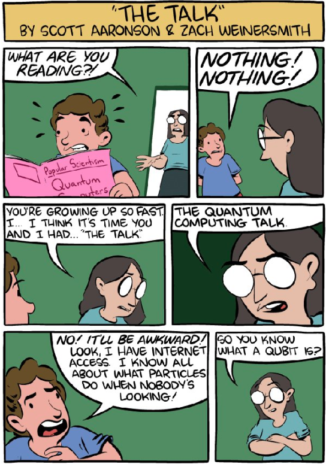

# What is Quantum Computing

---

## Quantum computing explained

* By MKBHD, 16mm subscribers, 3bb views
* https://www.youtube.com/watch?v=e3fz3dqhN44
* To be enjoyed together with the audience
* Followed by a Q&A session

---

## Quantum computing is easy

* Even babies know it

* Let's listen to the book
* [https://www.youtube.com/watch?v=wZtnNUYkNOc](https://www.youtube.com/watch?v=wZtnNUYkNOc)

---

## Let us take the bull by the horns 

* Computer have bits
* Quantum computers have qubits
* Bits can be `0` or `1`
* Qubits can be `0` or `1` or anything in between
* Joke quiz
  * Yes?
  * No?
  * Correct

---
## How do you run a quantum computer problem
* Select the qubits
* Set initial values
* Go away and do not look, but **honestly**
  * Looking ruins the wonderful feeling of uncertainty
* Come back and measure the results

---

## What if qubits were waves

* This is how qubits can be anything between `0` and `1`

---

## Picture of a qubit

---

## Superposition power 	

* Superposition allows quantum algorithms to process information in a fraction of the time it would take even the fastest classical systems to solve certain problems.
  * The amount of information a qubit system can represent grows exponentially. Information that 500 qubits can easily represent would not be possible with even more than 2^500 classical bits.
  * It would take a classical computer millions of years to find the prime factors of a 2,048-bit number. Qubits could perform the calculation in just minutes.
  * Shor's algorithm

---

## A word on Shor's algorithm

* Shor's algorithm is a quantum algorithm that can factorize large numbers exponentially faster than the best-known classical algorithm. The number of qubits required to run Shor's algorithm depends on the number to be factored.

* In particular, the number of qubits needed for Shor's algorithm is given by:

  * n_qubits = 2 * ceil(log2(N)) + O(1)

  * where N is the number to be factored and ceil(log2(N)) is the smallest integer greater than or equal to the base-2 logarithm of N.

---

## So practically

* For example, if we want to factorize a 2048-bit number, we would need approximately 4096 qubits. However, currently available quantum computers have much fewer qubits, and the largest number factored using Shor's algorithm on a quantum computer is 21.

* Therefore, while the theoretical power of Shor's algorithm is immense, it is not yet practical for factoring large numbers on current quantum computers.

* IBM's Osprey has 433 qubits - we are not there yet

---

## How qubits numbers grow?

* IBM Q System One: 20 qubits - January 2019
* IBM Q System One "Falcon": 27 qubits - May 2020
* IBM Q System One "Eagle": 53 qubits - November 2020
* IBM Quantum System: 65 qubits - June 2021
* IBM "Osprey": 433 qubits - November 2022 

---

## One more thing - quantum entanglement

---

## Quantum entanglement

* Entanglement
  * Multiple qubits can exhibit quantum entanglement. 
  * Entangled qubits always correlate with each other to form a single system. 
  * Even when they're infinitely far apart, measuring the state of one of the qubits allows us to know the state of the other, without needing to measure it directly.
* Entanglement is required for any quantum computation and it cannot be efficiently performed on a classical computer. 
  * Applications include 
    * factoring large numbers (Shor's algorithm) 
    * solving search problems (Grover's algorithm).

---

## How to talk about quantum computing to your teenager

* [https://www.quora.com/What-is-an-intuitive-explanation-of-quantum-computing](https://www.quora.com/What-is-an-intuitive-explanation-of-quantum-computing)

---

## Why learn about quantum computing
* Better factoring prime numbers
* Better, not hackable encryption
* Quantum communication, networks, internet
* Novel ways of information transfer

---

## One more reason - optimization

* Quantum computer are very good about solving optimization problems
  * Calculating optimal route for delivery
  * Scheduling flights
  
---

## And one more advantage of QC
* QC is very good at specific problems
  * They will not replace classic computers, but...
  * Exponentially accelerate Machine Learning
  * We will implement it! With IBM Qiskit!!

---

## Applications of Quantum Computing

1. Energy Grid Optimization
   * [Article by Jirawat Tangpanitanon](https://qtft.org/post/quantum-computing-for-energy-system-optimisation)
2. Weather forecasting
   * Because of multiple parameters
3. Finance
   * Prediction of financial markets
4. Risk analysis
   * Credit risk analysis
5. Portfolio optimization
6. Supply chain and inventory optimization
7. Battery, electronic chip design
8. Drug development, medicine discovery
9. Material science - novel material discovery
10. Quantum cryptography & cybersecurity
11. Accelerating Machine Learning

--- 

## Nobel  prize 2022
* No local realism
* Explanation from Olivia
* https://www.youtube.com/watch?v=9OM0jSTeeBg
* We will be back to this later

---
## Lab - setup

* Setup of Python
* https://github.com/elephantscale/quantum-computing-labs/blob/main/01-setup/01.1-setup.md
* Setup of Qiskit
* https://github.com/elephantscale/quantum-computing-labs/blob/main/01-setup/01.2-install-qiskit.md
* Setup of Jupyter
* https://github.com/elephantscale/quantum-computing-labs/blob/main/01-setup/01.3-prepare-notebook.md

---