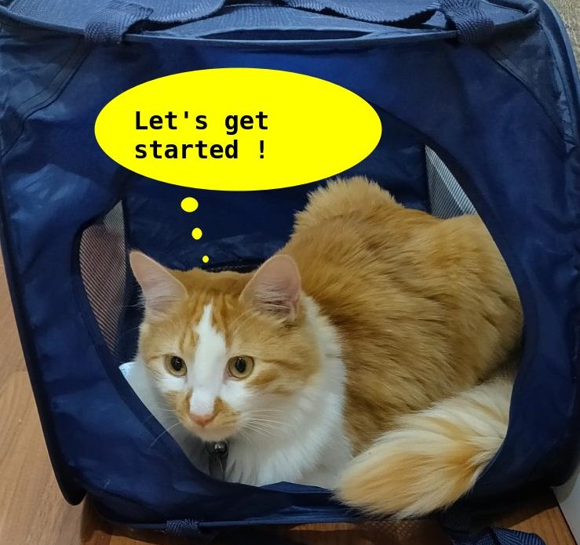

 <!-- {"left" : 3.33, "top" : 6.2, "height" : 2.33, "width" : 2.33} -->

# Introduction to Scala

<!-- {"left" : 6.49, "top" : 7.66, "height" : 2.07, "width" : 4.52} -->

---

## Instructor Introduction

* Instructor, please introduce yourself

* Talk about your background and your experience in the subject

---

## About This Class

<!-- {"left": 13.58, "top": 2.14, "height": 1.79, "width": 3.36} --> 

* A **practical approach to Scala language**

* Objectives:
    - Learn about Scala and its features
    - Get hands-on experience using Scala

* Skill level: **Beginner to intermediate**

* Format: **50% lectures + 50% labs**

* This is a **very hands-on** class

Notes:

---

## Agenda - 3 days

<!-- {"left": 13.58, "top": 2.14, "height": 1.79, "width": 3.36} -->

* Scala intro
    - Setup dev environment
    - REPL
    - Types

* Scala programming - part 1
    - Functional programming
    - Classes and Case classes
    - Traits

* Scala programming - part 2
    - Collections
    - Concurrency
    - Best practices
Notes:

---

## Pre-requisites and Expectations

<!-- {"left" : 6.76, "top" : 0.88, "height" : 4.37, "width" : 3.28} -->

* Intended audience:  
    - Developers

* Need to be comfortable in coding (Java helps)

* This is an **intro-intermediate** level class.  No previous knowledge of Scala is assumed

---

## Our Teaching Philosophy

* Learn concepts & fundamentals

* Get familiar with API by writing code

* Highly interactive (questions, discussions, etc. are welcome)

* Hands-on (learn by doing)

<!-- {"left" : 1.78, "top" : 3.22, "height" : 5.4, "width" : 6.7} -->
<!-- {"left" : 1.3, "top" : 1.69, "height" : 6.26, "width" : 7.66} -->

Notes:

---

## Class Introductions and Background

* Please complete a background survey, if applicable

* About you
    - Your Name
    - Your background (developer, admin, manager, etc.)
    - Technologies you are familiar with
    - Familiarity with Scala  
    (scale of 1 - 4 ;  1 - new, 2 - know some concepts,  3 - took a course, 4 -  using it at work)
    - Something non-technical about you!  
    (favorite ice cream flavor / hobby  etc.)

 &nbsp; <!-- {"left" : 0.85, "top" : 5.47, "height" : 2.1, "width" : 2.38} --> &nbsp; <!-- {"left" : 3.25, "top" : 5.49, "height" : 2.03, "width" : 3.74} --> &nbsp; <!-- {"left" : 7.02, "top" : 5.47, "height" : 2.1, "width" : 2.38} -->

Notes:

---

## Recommended Resources

 <!-- {"left" : 12.58, "top" : 1.89, "height" : 5.86, "width" : 4.47} -->

 <!-- {"left" : 12.58, "top" : 1.89, "height" : 5.86, "width" : 4.47} -->

* Books
    - [Scala 3 book](https://docs.scala-lang.org/scala3/book/introduction.html) - Free online
    - [Programming Scala, 3rd edition](https://learning.oreilly.com/library/view/programming-scala-3rd/9781492077886/) - Learn the language
    - [Hands on Scala](https://www.handsonscala.com/) - Practical approach to Scala and [code on github](https://github.com/handsonscala/handsonscala)

* Online
    - [Scastie - Scala online playground](https://scastie.scala-lang.org/)
    - [Scala cookbook](http://scalacookbook.com/) - Sample code you can use
    - [#ThisWeekInScala!](https://medium.com/disney-streaming/tagged/thisweekinscala) - great blog to keep up with Scala news
    - [Should I learn Scala](https://www.toptal.com/scala/why-should-i-learn-scala)

---

## Class Logistics

 <!-- {"left": 4.54, "top": 2.9, "height": 7.91, "width": 8.42} -->

* Instructor's contact

* Slides

* Lab bundle

* Lab environment

---

## Let's Get Started!

 <!-- {"left": 4.54, "top": 2.9, "height": 7.91, "width": 8.42} --> 
