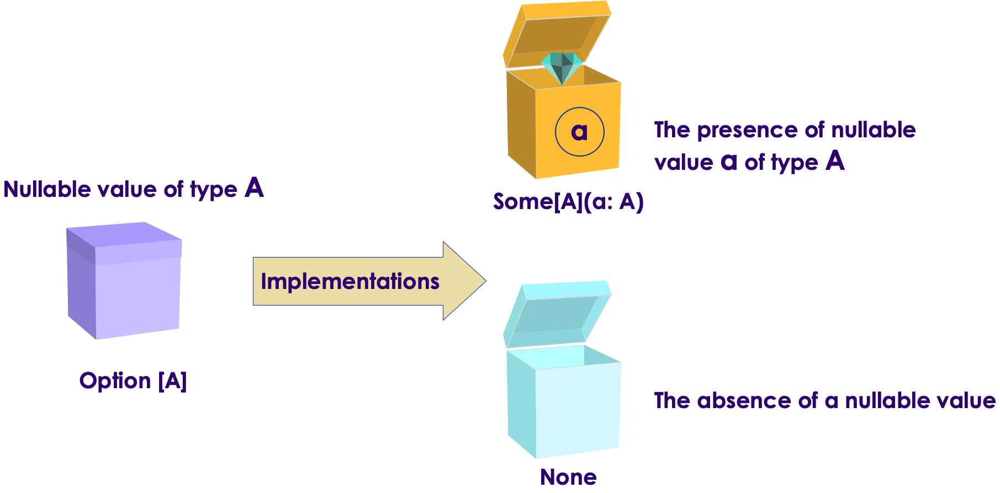
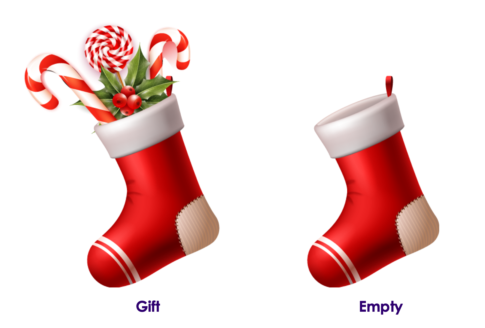

# Scala Case Classes

<!-- {"left" : 6.49, "top" : 7.66, "height" : 2.07, "width" : 4.52} -->
<!-- {"left" : 6.49, "top" : 7.66, "height" : 2.07, "width" : 4.52} -->

---

## Lesson Objectives

 * Learn about twin concepts: Case Classes and Pattern Matching

Notes:

---

# Case Classes

---

## Java Switch

* Here is a Java switch

```java
// java 
// switch statement has no value and can not be assigned to a variable
int month = 8;
String monthName;

switch (month) {
    case 1:  
        monthName = "January";
        break;
    case 2:  
        monthName = "February";
        break;
    default:
        monthName = "Invalid month";
        break;
}
System.out.println (monthName)
```

* What could you improve? (See next slide)
    * Match cases is only on primitive types
    * Match cases is only for constants
    * Repeat ‘break’ every time

Notes:

---

## Scala Version

* Here is the scala version

```scala
val month = 2

val monthName = month match {
    case 1 => "January"
    case 2 => "February"
    //...
    case _ => "Invalid month" // default
}

// monthName = "February"
```

* Improvements:
    - cleaner
    - no need to repeat 'break'
    - and can assign match statement to a variable!  (`monthName`)

Notes:

---

## Scala Case Classes and Pattern Matching

```scala
val pet = ...

val desiredFood = pet match {
    case Cat() => "meow mix"
    case Dog() => "puppy chow"
    case Bunny() => "carrot"
    case _ => "Unknown"
}
```

* Here we match on **classes** not just primitive types!

---

## Case Classes

* In order to participate in ‘match’ expression, a class must be prefixed with **`case`**

```scala

abstract class Animal

case class Cat   (name : String, breed : String) extends Animal

case class Dog   (name: String, breed : String)  extends Animal

case class Bunny (name: String)  extends Animal


val cat1 = Cat("Mr Meow", "Orange Tabby")
val dog1 = Dog ("Pluto", "Golden retriever")

dog1.name  // "Pluto"
```

* Case class benefits
    - No need to say ‘new’
    - No need to declare members (name, breed)
    - The code reads cleaner

Notes:

---

## Another Case Class Example

```scala
abstract class Investment

case class RealEstate(name: String, value: Double, monthly: Double) extends Investment

case class Crypto(name: String, amount: Double) extends Investment

case class MutualFund(name: String, amount: Double, yieldType: String) extends Investment

case class Portfolio(name: String, investment: Investment) extends Investment
```

```scala

def getOffer(investment: Investment): Double = investment match {
    case RealEstate(name, value, monthly) =>
        println("Considering a real estate investment into " + name)
        value + 12 * monthly
    case Crypto(name, amount) =>
        println("Be careful with " + amount + " of " + name)
        amount * 5000
    case _ =>
        println("I will consider any investment")
        1
}

val bitcoin = Crypto("Bitcoin", 50000.0)
val house = RealEstate (("House", 1000000.0, 2000.0)

val offer1  = getOffer(bitcoin)  // 250_000.0  (50_000 x 5)
val offer2  = getOffer(house)  // 124_000.0  (100_000 + 12 * 2_000)
```

Notes:

---

## Sealed Classes

* **sealed** keyword is used to control the extension of classes and traits

* Declaring a class or trait `sealed` restricts that **subclasses have to be in the same source file**

```scala
// file : Investment.scala

sealed abstract class Investment

case class RealEstate (...) extends Investment

case class Crypto (...)  extends Investment

// new sub-classes can only be defined in this file.  no where else!
```

```scala
// file : AnotherInvestment.scala

case class NFT (...) extends Investment 
// error!  not allowed
```

Notes:

---

## Option Type

 <!-- {"left" : 0.6, "top" : 2.04, "height" : 2.05, "width" : 8.55} -->
 <!-- {"left" : 0.6, "top" : 2.04, "height" : 2.05, "width" : 8.55} -->

* **`Option`** is a container for **zero or one element**

* For example **`Option[Int]`** can have 
    - value : **`Some[Int]`**
    - or nothing:   **`None`**

* Option is a preferred way to deal with null values in Scala

```scala
val capitals = Map (
    "US" -> "Washington",
    "UK" -> "London",
    "France" -> "Paris"
)

capitals("US")  // => "Washington"
capitals("Canada")  // => NoSuchElementException!  Ugh !!
```

```scala
// a better approach.  Use 'get' method that returns Option
capitals.get("US")     //  Option[String] = Some(Washington)

capitals.get("Canada") //  Option[String] = None
// great!  no ugly exceptions!
```

Notes:

---

## Using Options

* We can extract the values from an Option in the following ways
    - `isDefined` or `nonEmpty` : True Option has value, false otherwise
    - `isEmpty` : False Option has value, true otherwise

```scala
val capitals = Map (
    "US" -> "Washington",
    "UK" -> "London",
    "France" -> "Paris"

val usCapital = capitals.get("US")  // Option : Some(Washington)
if (usCapital.isDefined)  // check if the option has value
    println (usCapital.get)
else
    println ("not found")

val canadianCapital = capitals.get ("Canada") // Option[String] = None
if (canadianCapital.isEmpty)  // check for emptyness
    println ("Not found")
```

* Use `getOrElse`

```scala
val usCapital = capitals.get("US")  // Option : Some(Washington)
val canadianCapital = capitals.get ("Canada") // Option[String] = None

println ("US Capital : " + usCapital.getOrElse("Unknown"))  // => "Washington"
println ("Canadian Capital : " + canadianCapital.getOrElse("Unknown"))  // ==> "Unknown"
```

* Go ahead and try it out!  🏋️

---

## Options with Pattern Matching

* This is common way to handle options

```scala
val capitals = Map (
    "US" -> "Washington",
    "UK" -> "London",
    "France" -> "Paris" )

val countries = List ("US", "UK", "Japan")

for ( country <-  countries) {
    val capitalCityOpt = capitals.get(country)  // option,  can be Some or None

    // here we are matching Option
    val capitalCityName = capitalCityOpt match {
        case Some(x) =>   x
        case None => "Unknown"
    }
    println (s"Country = $country,  capital city = $capitalCityName")
}

// or another way : use `getOrElse`
for ( country <-  countries) {
    val capitalCityName2 = capitals.get(country).getOrElse("Unknown2")
    println (s"Country = $country,  capital city 2 = $capitalCityName2")
}
```

* Go ahead and try it out!  🏋️

Notes:

---

# Pattern Matching

---

## Pattern Match Example

* Here we match the class name and attributes like `monthly`

```scala
investment match {
    case RealEstate(name, value, monthly) =>
        println("Considering a real estate investment into " + name)
        value + 12 * monthly
    case Crypto(name, amount) =>
        println("Be careful with " + amount + " of " + name)
        amount * 5000
    case _ =>
        println("I will consider any investment")
        1
}
```

* If we don't care about values, use **`wildcard`** matching (using underscores)

```scala
investment match {
    case RealEstate (_, _, _) => 
        println ("Considering real estate")

    case _ => 
        println ("Something else")
}
```

Notes:

---

## Constructor Pattern


```scala
investment match {
    case RealEstate(name, value, monthly) =>
        println("Considering a real estate investment into " + name)
        value + 12 * monthly
    case Crypto(name, amount) =>
        println("Be careful with " + amount + " of " + name)
        amount * 5000
    case _ =>
        println("I will consider any investment")
        1
}
```

Notes:

---

## Tuple Pattern

* Tuple pattern is simple

* Extensively used in Spark

```scala

def matchTuple ( x : Any) = {
    x match {
        case (a,b) => 
            println (s"Two elements : $a, $b")

        case (a,b,c) => 
            println (s"There elements : $a, $b, $c")
        
        case _ =>
    }
}

matchTuple ( ("apple", 2))             //  Two elements : apple, 2
matchTuple ( ("Michael", 40, 100000))  // There elements : Michael, 40, 100000
```

Notes:

---

## Sequence Pattern

* Match against Seq, such as List or Vector
* Allows to specify any number of elements

```scala
def matchSeq (x : Seq[Any]) = {
    x match {
        case List (1, _, _) => 
            println ("List with 3 elements, starting with 1")
        
        case List (_, _, 10) => 
            println ("List with 3 elements, ending with 10")

        case Vector (_, _, _, _) => 
            println ("Vector with 4 elements")

        case _ => 
    }
}

matchSeq (List (1,2,3))      // "List with 3 elements, starting with 1"
matchSeq (List (1,2))        // No output
matchSeq (List (1,2, 10))    // "List with 3 elements, starting with 1"
matchSeq (List (2,3, 10))    // "List with 3 elements, ending with 10"
matchSeq (Vector (1,2,3))    // no output
matchSeq (Vector (1,2,3,4))  // "Vector with 4 elements"
```

Notes:

---

## Constant Pattern

* Constant pattern matches only itself

```scala
def explain (x : Any) : String = {
    x match {
        case 0 => "Zero"
        case false => "That is wrong"
        case Nil => "Empty"
        case _ => "Nothing at all?!"
    }
}


explain (0) // "Zero"

explain (5) // "Anything at all?!"

explain (Nil) // "Empty"
```

Notes:

---

## Variable Pattern

* Similar to wildcard
* Scala binds the variable to whatever the object is

```scala
def variablePatternMatch (x : Any)  = {
    x match {
        case 1  => "One and only"
        case variable1 => "not 1 but " + x
    }
}

variablePatternMatch (1)

variablePatternMatch (10)

variablePatternMatch ("Hello")
```

Notes:

---

## Lab: Case Classes

<!-- {"left" : 6.76, "top" : 0.88, "height" : 4.37, "width" : 3.28} -->

* **Overview**
    - Work with Scala case classes

* **Duration**
    - 30 mins

* **Instructions**
    - **CASE CLASSES** lab

---

## Review and Q&A

<!-- {"left" : 8.56, "top" : 1.21, "height" : 1.15, "width" : 1.55} -->
<!-- {"left" : 6.53, "top" : 2.66, "height" : 2.52, "width" : 3.79} -->

* Let's go over what we have covered so far

* Any questions?