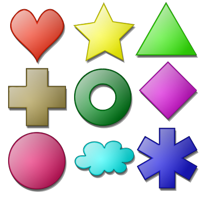
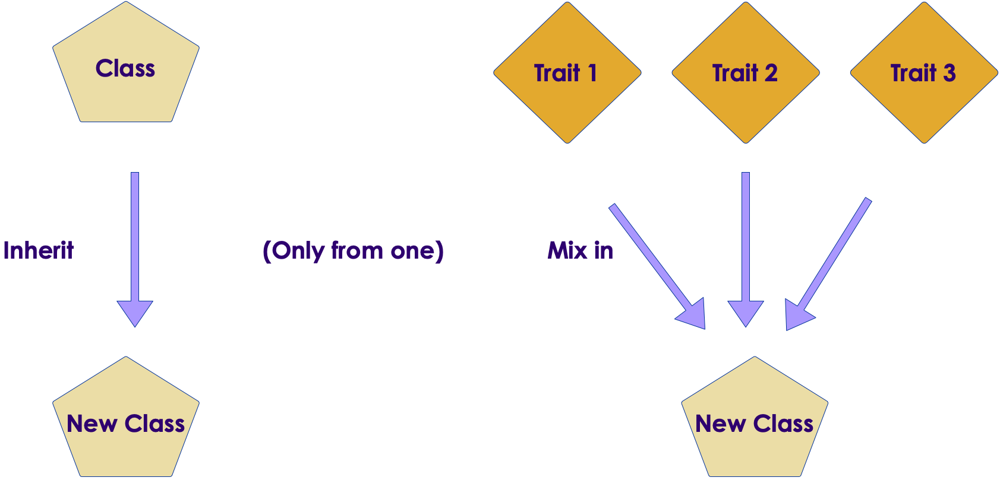

# Scala Classes

<!-- {"left" : 6.49, "top" : 7.66, "height" : 2.07, "width" : 4.52} -->
<!-- {"left" : 6.49, "top" : 7.66, "height" : 2.07, "width" : 4.52} -->

---

## Lesson Objectives

* Learn about Scala Classes

Notes:

---

## Scala Language

* Scala is NOT a purely functional language
    - Languages like LISP, Haskell, and Erlang fit this category
    - Scala borrows a lot from these languages

* Scala is NOT purely object oriented language either
    - Scala allows one-liner programs
    - E.g.  `println("hello world!")`

* Scala aims to be **pragmatic and relevant** rather than fitting in a particular box

* **"Scala is a multi-paradigm programming language designed to integrate features of object-oriented programming and functional programming."**

---

## Class Definition

* A class can contain methods / values / variables 

```scala
class User (val name: String, val age : Int) {

    // override default toString method
    override def toString: String =
        s"Name = $name, age = $age"
}

val user1 = new User ("Michael Scott", 40)
user1.name
user1.age
println (user1)
```

* Primary constructor parameters with `val` and `var` are public.

* Here they are declared as `val`  so they can not be changed later

```scala
user1.age = 41 // error
```

* Change the `age` as `var` and try again

* Go ahead and try it out!  🏋️

---

## Class Definition Private Members

* Parameters without val or var are private values, visible only within the class.

```scala
class User (name: String, age : Int) 

val user1 = new User ("Dwight Schrute", 30)
user1.name // error!  not visible
```

```scala
class User (name: String, age : Int)  {
    def getName :String = name

    def getAge : Int = age
}

val user1 = new User ("Dwight Schrute", 30)
user1.getName // works, we are using 'getters'
```

* Go ahead and try it out!  🏋️

---

## Singleton Objects

* You can define singleton objects with the keyword  **object**

* Singletons are first class Objects

```scala
object Counter {
    var count = 0
       
    def currentCount: Long = count

    def incCount: Long = {
      count += 1
      count
    }
}

Counter.currentCount //  Long = 0
Counter.incCount     //  Long = 1
Counter.incCount     //  Long = 2
Counter.currentCount //  Long = 2
```

* Go ahead and try it out!  🏋️

---

## Main Method

* Like Java, we need a main method

* This must be in an Object (not a class)

```scala
// file : Runme.scala
object Runme {
    var count = 0
       
    def main(args: Array[String): Unit = {
        println("Hello from Main Method!")
  }
}
```

* And run it as below

```bash
// compile
$   scalac Runme.scala
$   scala Runme
#   Hello from Main Method!
```

* Go ahead and try it out!  🏋️

---

## Packages and Imports

* Packages organize code and control namespace

    - Package names are hierarchical and dot-separated 
    - e.g. `scala.math`

* Declare a package with a  **package**  statement
    - e.g., **package com.mycompany.time**

* Import type names from other packages with  **import** 

```scala
// Import all types from this package
import com.mycompany.time._

// Import Timer only
import com.mycompany.time.Timer
```

---

## Packages and Imports

* Here is a sample usage

```scala
// file: Timer.scala
package com.mycompany.time

class Timer (val name : String) {
    private var startTime  = 0L
    private var endTime  = 0L

    def startTimer : Unit = {
        // startTime = get_current_time()
    }

    def stopTimer : Unit = {
        // endTim = get_current_time()
    }

    def elapsedTime : Long = (endTime - startTime)
}
```

```scala
// file: Test.scala

package com.mycompany.test

import com.mycompany.time.Timer

val timer1 = new Timer("foo timer")
timer1.startTimer // say 10
foo()
timer1.stopTimer // say 15
timer1.elapsedTime // returns 5 (15 - 10)
```

---

## Inheritance

```scala
class Person (val name : String)

class Student (override val name : String, val grade : Int) extends Person (name)

class Teacher (override val name : String, val subject : String, val grade : Int) extends Person (name)

val person1 = new Person ("Amy")
person1.name // Amy

val student1 =  new Student ("John", 5)
student1.name // John
student1.grade // 5

val teacher1 = new Teacher ("Brian", "Math", 5)
teacher1.name // Brian
teacher1.subject // Math
```

* Can only extend ONE base class (no multiple inheritance.  Yay!)

* `override` keyword is required if we overwriting `val` parameters of base class

* Go ahead and try it out!  🏋️

---

## Traits

* Traits are similar to Java interfaces, but improved

```scala
trait Shape {
    def area : Int

    def sides : Int
}

class Triangle (a: Int, b: Int, c:Int ) extends Shape {

    override def area : Int {
        0 
    }

    override def sides : Int = 3
}

class Square (a : Int) extends Shape {
    override def area : Int = a * a

    override def sides : Int = 4
}
```

---

## Traits vs Inheritance

* You can inherit from only one class

* But you can mix in any number of traits

<!-- {"left" : 6.53, "top" : 2.66, "height" : 2.52, "width" : 3.79} -->

---

## Multiple Traits

```scala

trait Shape {
    def area : Int
}

trait Drawable {
    def drawAt (x : Int, y: Int) : Unit
}

class Square (a : Int) extends Shape with Drawable {
    override def area : Int = a * a

    override def drawAt (x : Int, y : Int) : Unit = {
        // draw the square at these coordinates
    }
}
```

---

## Abstract Class

* Since Scala's traits are so powerful, we rarely need to use abstract class

* Use abstract classes in these circumstances
    - You want to create a base class that requires constructor arguments
    - Your Scala code will be called from Java code

```scala
// this won’t compile, as traits don’t allow constructor parameters
trait Pet(name: String)
```

```scala
abstract class Pet(name: String) {
    def speak(): Unit = println("Yo")
}

class Dog(name: String) extends Pet(name) {
    override def speak() = println("Woof")
}

class Cat(name: String) extends Pet(name) {
    override def speak() = println("Meow")
}
```

---

## Lab: Classes

<!-- {"left" : 6.76, "top" : 0.88, "height" : 4.37, "width" : 3.28} -->

* **Overview:**
  - Work with classes and traits

* **Approximate run time:**
  - 20-30 mins

* **Instructions:**
  - Please complete **CLASSES and TRAITS** section

Notes:


---

## Review and Q&A

<!-- {"left" : 8.56, "top" : 1.21, "height" : 1.15, "width" : 1.55} -->
<!-- {"left" : 6.53, "top" : 2.66, "height" : 2.52, "width" : 3.79} -->

* Let's go over what we have covered so far

* Any questions?