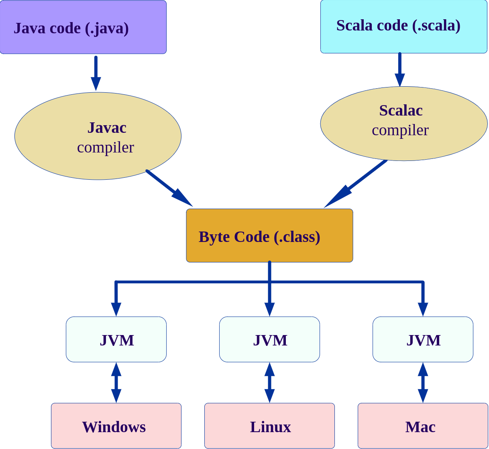
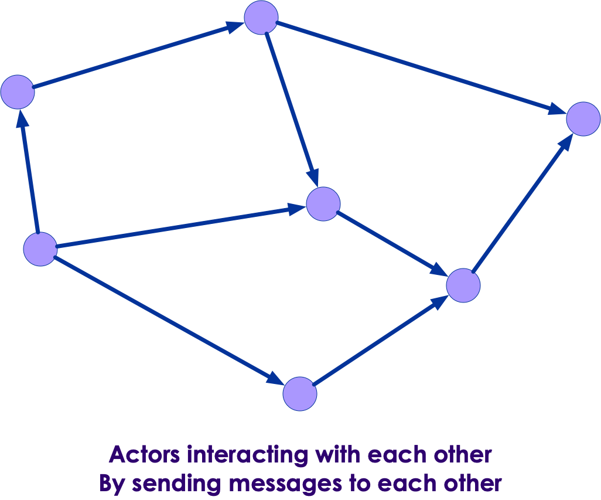
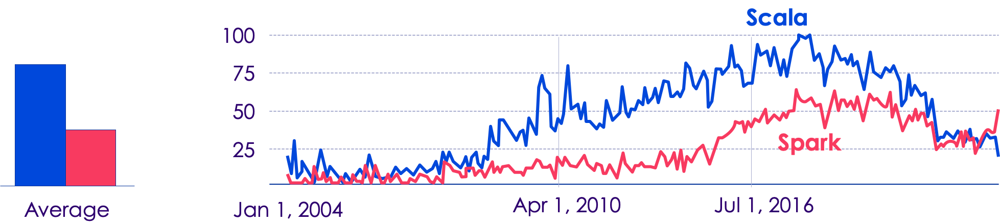

# Scala Intro

<!-- {"left" : 6.49, "top" : 7.66, "height" : 2.07, "width" : 4.52} -->

---

## Module Objectives

* A quick intro to Scala
* Learn Scala ecosystem

---

# Scala Introduction

---

## Scala Features

<!-- {"left" : 13.18, "top" : 1.89, "height" : 1.66, "width" : 3.63} -->

 <!-- {"left" : 13.28, "top" : 3.4, "height" : 3.43, "width" : 3.43} -->

* Scala is **JVM based** language. It builds on Java / JVM.

* **Fully object oriented**
    - Every thing in Scala is an object!
    - Even primitive types like numbers and functions

* **Fully functional:** Scala supports and encourages functional programming style

* **Statically typed:**  Checks types during compile time

* **Very concise:** You will see examples of this soon enough

Notes:

This is a quick overview of Scala features. We will deep-dive into these features in the next few sections.

---

## A Better Java!

 <!-- {"left" : 13.71, "top" : 1.89, "height" : 1.14, "width" : 2.63} -->

<!-- {"left" : 13.38, "top" : 3.32, "height" : 5.06, "width" : 3.28} -->

* Sun released Java in 1996

* In late 1990s and 2000s Java took off.
    - Lot of enterprises adopted Java
    - Huge ecosystem developed around Java
    - And it attracted a lot of developers

* Oracle acquired Sun in 2009

* After Java 8 (2014) the Java evolution slowed down
    - Developers wanted modern features to keep up with modern development needs

* [Martin Odersky](https://en.wikipedia.org/wiki/Martin_Odersky), who worked in Java team at Sun, thought Java made too many compromises.
    - He designed Scala to include better features he wanted in Java
    - Scala was released to public in 2004

Notes:

Martin Odersky  worked at Sun Java.  He worked on Java Generics and javac compiler.  In 2007 he became a fellow at ACM (Association of Computing Machinery)

On 12 May 2011, Odersky and collaborators launched Typesafe Inc. (renamed Lightbend Inc., February 2016), a company to provide commercial support, training, and services for Scala.

Source : https://en.wikipedia.org/wiki/Martin_Odersky

---

## Scala Version History

| Date       | Scala version | Description            |
|------------|---------------|------------------------|
| 2001       |               | Work starts on Scala   |
| 2004       | v 1.0         | Initial public release |
| 2006 March | v 2.0         |                        |
| 2021       | V 3           | Big update!            |

<!-- {"left" : 1.89, "top" : 2.71, "height" : 2.5, "width" : 13.78} -->
Notes:

---

## Scala is a JVM Language

 <!-- {"left" : 11.3, "top" : 2.16, "height" : 5.42, "width" : 5.9} -->

* Scala source code compiles into a byte code

* `A.scala --> scalac compiler --> A.class`

* Then the byte code is executed by Java Virtual Machine (JVM)

* Why JVM is great
    - Cross platform.  JVM can run on multiple platforms and operating systems (Windows, Mac, Linux)
    - Byte code is portable across platforms (write-once-run-anywhere)
    - JVM can manage memory automatically
    - JVM is one of the best run-times, evolved over the years of research and experiment
    - Sports really good optimizers like Just in Time (JIT) compilers

---

## Scala Features: Pure OO

* Scala is a **purely object oriented language**

* Every thing is an object, including numbers and functions!

```java
// in java, i is a primitive, not an object
int i = 10;

// in Scala, i is an object
val i : Int = 10
```
<!-- {"left" : 0.85, "top" : 3.12, "height" : 1.26, "width" : 5.77} -->

* Classes

```scala
class Point(var x: Int, var y: Int) {
    // class methods
}
```
<!-- {"left" : 0.85, "top" : 4.97, "height" : 1.15, "width" : 6.93} -->

* Traits

```scala
trait Printable{  
    def print()  {
        println ("Default")
    }
}  
  
class A4 extends Printable{  
    def print(){  
        println("A4 paper")  
    }  
}  
```
<!-- {"left" : 0.85, "top" : 6.98, "height" : 3.18, "width" : 5.12} -->

---

## Scala Features: Functional

* **Scala is a functional language**

* Every function is a value; It supports anonymous functions, and higher order functions

```scala
val square = (x: Int) => x * x
```
<!-- {"left" : 0.85, "top" : 3.96, "height" : 0.82, "width" : 8.32} -->

<br/>

* Higher order functions allow concise programming

```scala
val salaries = Seq(20000, 70000, 40000)
val newSalaries = salaries.map(x => x * 2) // List(40000, 140000, 80000)
// another option
val doubleSalary = (x: Int) => x * 2
val newSalaries2 = salaries.map(doubleSalary) // List(40000, 140000, 80000)
```
<!-- {"left" : 0.85, "top" : 6.3, "height" : 2.13, "width" : 16.29} -->

---

## Scala Features: Statically Typed

* Scala has **static typing**.  It's expressive type system enforces **compile-time type checking**.  This catches type mis-matches early on, and avoids costly run-time bugs

* **Type inference** facilitates cleaner, concise code

```scala
val i = 10  // i is automatically inferred as Int
val name = "John" // name is String

// types can be explicitly defined, but not necessary
val point: Point = Point (10, 20)
```
<!-- {"left" : 0.85, "top" : 4.5, "height" : 1.74, "width" : 9.63} -->

---

## Scala Features: Immutability

* Immutability is a preferred paradigm in functional programming
    - Eliminates lot of programming errors
    - Facilitates distributed programming

* Scala by default prefers immutability
    - Most variables are created as `val` fields
    - Immutable collections classes are preferred

```scala
val x = 10
x = 20 // error!  can not reassign an immutable variable
```

* If collections are immutable, how do we change them?
    - Usually we don't mutate existing collection; we create a new collection

```scala
val list1 = List("jane", "jon", "mary", "joe")
val list2 = list1.filter(_.startsWith("j"))
// list2 = List(jane, jon, joe)
// list1 unchanged
```

---

## Scala Features: Mutability

* Though Scala emphasizes immutability, we can create mutable variables and collections

* Scala makes us to do this **explicitly** so the intent is clear

* Declare variables as `var`

```scala
var x = 10
x = 20 // ok, vars can be changed
```

* Collections are explicitly declared mutable too

```scala
var capitals = Map ("US" -> "Washington", "France" -> "Paris")
// capitals : scala.collection.immutable.Map[java.lang.String, java.lang.String]

capitals += ("Japan" -> "Tokyo") // error, modifying immutable collection is not allowed
```

* Explicitly define a **`scala.collection.mutable`** collection

```scala
var capitals2 = scala.collection.mutable.Map("US" -> "Washington", "France" -> "Paris")

capitals2("Japan") = "Tokyo" // add a new entry

capitals2 
// HashMap(France -> Paris, US -> Washington, Japan -> Tokyo):
//                   scala.collection.mutable.Map[java.lang.String, java.lang.String]
```

---

## Scala Features: Growing New Types

* Say we need to deal with large integer numbers
* We can define a new **`BigInt`**  type that behaves like native type
* Java also allows creating new types, but they don't behave like native types

```java
// Java version
import java.math.BigInteger
BigInteger a = new BigInteger("10000000000");
BigInteger b = new BigInteger("20000000000");
BigInteger c = a + b;   // error!
BigInteger c = a.add(b);  // ok.  c ==> 30000000000
 
BigInteger factorial (BigInteger x) {
    if (x == BigInteger.ZERO)
        return BigInteger.ONE;
    else
        return x.multiply (factorial (x.subtract(BigInteger.ONE)));
}
factorial(new BigInteger ("100"));
 ```

```scala
// Scala version
val a = BigInt (10000000000)
val b = BigInt (22000000000)
val c = a + b    // perfect, just like a native type!
// c: scala.math.BigInt = 30000000000

def factorial (x: BigInt) : BigInt  = 
    if (x == 0) 1 else x * factorial(x - 1)

factorial (100)
// val res1: BigInt = 9332621544394415268169923885626670049071596826438162146859296389521759999
//  3229915608941463976156518286253697920827223758251185210916864000000000000000000000000
```

---

## Scala Features: Singleton Classes

* **Singleton classes** are supported at language level, no need for kludegy fixes

```scala
object Singleton{  
    def main(args:Array[String]){  
        println ("Hi from main")
    }  
} 
```
<!-- {"left" : 0.85, "top" : 3.03, "height" : 1.64, "width" : 6.25} -->


```scala
package logging
object Logger {
  def info(message: String): Unit = println(s"INFO: $message")
}
// ----
import logging.Logger.info
object Run{  
    def main(args:Array[String]){  
        info("hi from main")  // -->  INFO: hi from main
    }  
} 
```
<!-- {"left" : 0.85, "top" : 4.79, "height" : 2.49, "width" : 7.94} -->

<br/>

* Compare with Java singleton

```java

public class Elvis {  // one and only
    public static final Elvis INSTANCE = new Elvis ();
    private Elvis(){} // must make constructor private, so no one can create new
}

// access it like this:
Elvis elvis = Elvis.INSTANCE;
```
<!-- {"left" : 0.85, "top" : 8.13, "height" : 2.32, "width" : 14.13} -->

---

## Scala Features: Case Classes

* **Case classes** compact representation of classes, that are **immutable** and support **pattern matching**

```scala
abstract class Fruit 

case class Apple (color:String, price:Int) extends Fruit 
case class Orange (color:String, price:Int)  extends Fruit
case class Banana (color:String, price:Int)  extends Fruit

def matchFruit (fruit: Fruit) = {
    fruit match {
        case Apple (_, _) => "Got an Apple"
        case _            => "Got another fruit"
    }
}

val orange = Orange ("Orange", 1)
val greenApple = Apple ("Green", 2)
val redApple  = Apple ("Red", 3)
val banana = Banana ("Yellow", 4)

matchFruit(orange)     // => Got another fruit
matchFruit(greenApple) // => Got an Apple
matchFruit(redApple)   // => Got an Apple
```
<!-- {"left" : 0.85, "top" : 3.28, "height" : 2.61, "width" : 9.94} -->

---

## Akka Framework

 <!-- {"left" : 7.32, "top" : 1.09, "height" : 1.17, "width" : 2.84} -->

 <!-- {"left" : 7.32, "top" : 1.09, "height" : 1.17, "width" : 2.84} -->

* Today, there are multiple CPUs and GPUs

* But multi-thread programming is hard

* Enter Akka
    - Framework for building powerful reactive, concurrent, and distributed applications more easily
    - Based on the notion of 'actors'
    - Actors can send and receive message

* [Akka.io](https://akka.io/)

Notes:

---

## Scala Features: DSL (Domain Specific Language)

* DSLs are easy to use languages for a specific domain

* For example SQL is a DSL for relational data

* Scala's flexibility allows us to create custom DSLs very easily

* This is one of the reason [Apache Spark](https://spark.apache.org/) was written in Scala
    - Spark used DSL capability to create a simple query language for Big Data analysis

* Take a look at an example implementation of Lunar lander in 'Baysick' language [here](https://www.scala-lang.org/old/node/1403)

---

## Scala Features: JVM Language

* Since Scala runtime is JVM, it benefits from extensive Java eco system

* Scala can interoperate relatively seamlessly with Java libraries

* Here is an example of using the popular [Joda time](https://www.joda.org/joda-time/) Java library in Scala

```scala
import  org.joda.time.format.DateTimeFormat
import org.joda.time.DateTime

val dateStr = "2021-06-13"
val formatter = DateTimeFormat.forPattern("yyyy-MM-dd")
val dateTime:DateTime = formatter.parseDateTime(dateStr)
println(dateTime.dayOfWeek().getAsText(Locale.getDefault()))  // Prints "Sunday"
```
<!-- {"left" : 0.85, "top" : 4.27, "height" : 2.62, "width" : 15.95} -->

---

## Scala Use Cases

* Scala is a general purpose language (like Java) so can be used in wide variety of projects.  How ever there are some areas it really excels in.   Here are few:

* High performance, highly concurrent Web services

* Large scale distributed applications, like Spark applications

* Distributed, Cloud-native apps

* References:
    - [What is Scala good for](https://news.ycombinator.com/item?id=25043915)

---

## Scala Adoption

* Scala enjoyed a good uptake among Java and Functional programmers

* Some popular Big data and distributed systems were developed in Scala, boosting popularity!
    - [Apache Spark](https://spark.apache.org/) was written in Scala and caused a good deal of interest in Scala language
    - [Apache Kafka](https://kafka.apache.org/) is another popular messaging system, written in Scala

* The New York Times'  internal content management system Blackbeard is built using Scala, Akka and Play Framework. (2014, [Source](https://open.nytimes.com/building-blackbeard-a-syndication-system-powered-by-play-scala-and-akka-9ae867d47da6))

* Twitter uses Scala for its backend code

* References: [1](https://www.javatpoint.com/history-of-scala)

Notes:

---

## Scala Trend

* Language #50 in 2008

* Language #20 in 2015

* Language #35 in 2021

* What happened?

1. Promoted by Martin Odersky, creator of Java generics

2. Promoted by Spark

3. Finding its  place as a high performance distributed / DSL programming language with Akka

 <!-- {"left" : 14.33, "top" : 1.6, "height" : 2.16, "width" : 2.87} -->

---

## Scala 3.0

 <!-- {"left" : 14.33, "top" : 1.6, "height" : 2.16, "width" : 2.87} -->


* This is a big release for Scala, eight years in the making with 28,000 commits, 7,400 pull requests, and 4,100 closed issues

* New 'quiet' syntax, no brackets around conditions, and loops


```scala
if x < 0 then
  "negative"
else if x == 0 then
  "zero"
```
<!-- {"left" : 0.85, "top" : 5.2, "height" : 1.24, "width" : 3.39} -->

* Type system improvements. [Union types](https://dotty.epfl.ch/docs/reference/new-types/union-types.html)

* Language simplified;  dropped some features like [Delayed Init](https://dotty.epfl.ch/docs/reference/dropped-features/delayed-init.html).  See [more dropped features](https://dotty.epfl.ch/docs/Dropped%20Features/index.html)

* Metaprogramming.  [more details](https://docs.scala-lang.org/scala3/guides/macros/index.html)

* References:
    - [What's new in Scala 3.0](https://docs.scala-lang.org/scala3/new-in-scala3.html)
    - [Scala 3 new features](https://www.infoq.com/news/2021/06/scala-3-overhaul/)
    - [Martin Odersky goes over Scala 3 and beyond](https://www.youtube.com/watch?v=NXTjnowBx-c)

---

## Scala Criticisms

 <!-- {"left" : 11.02, "top" : 1.89, "height" : 4.29, "width" : 6.1} -->


* Scala can be a steep learning curve

* The 'different thinking and concepts' might take some getting used to

* Functional programming requires a different way of thinking

* Good tooling (IDEs, fast compilers) lacked in early years,  that was a hinderance for new developers

* Java is adding some functional programming constructs, that may encourage Java developers to stick with Java, instead of moving to Scala

* References:
    - [Kotlin vs Scala](https://medium.com/digitalfrontiers/why-did-kotlin-succeed-and-scala-not-1a8e279d2077)

---

## Scala EcoSystem

* **Build:** sbt, maven, gradle

* **IDEs:** IntelliJ,  Eclipse with Scala plugin, Netbeans, [Metals](https://scalameta.org/metals/)

* **Target JVM:** Java 8 is most popular, followed by Java 11

* **Unit Testing:** ScalaTest, JUnit, specs2

* **Web development:** Akka-http, Play

* **Misc tools:** Scalafmt, Scalastyle, Scoverage

* References:
    - [Scala ecosystem in 2021 by JetBrains](https://www.jetbrains.com/lp/devecosystem-2021/scala/)
    - [What is missing in scala ecosystem?](https://www.reddit.com/r/scala/comments/ir8ygb/what_is_missing_in_scala_ecosystem/)

---

## Group Discussion: Scala Use Cases

<!-- {"left" : 11.99, "top" : 2.62, "height" : 3.81, "width" : 5.25} -->

* Let's discuss some of your project needs and where Scala would be applicable

* Back-end / Front-end / Distributed / Realtime

Notes:

---

# Getting Scala

---

## Scala Setup

* Recommended stack:
    - Scala 2.13
    - Java SDK 11

* IDEs / Editors
    - [IntelliJ](https://www.jetbrains.com/idea/) - highly recommended
    - [VSCode](https://code.visualstudio.com/) - modern editor

* Optional tools, that would improve your Scala experience
    - [Ammonite](https://ammonite.io/) - a modern Scala REPL environment, with syntax highlighting and lets you run scripts
    - [Mill](https://com-lihaoyi.github.io/mill/mill/Intro_to_Mill.html) - a modern build tool for Scala

---

## Scala Setup 1 - JDK

* First thing, is to get JDK 11 setup

* Check your Java version

```bash
$   java -version

# Output:
Openjdk version "11.0.11" 2021-04-20
OpenJDK Runtime Environment (build 11.0.11+9-Ubuntu-0ubuntu2)
OpenJDK 64-Bit Server VM (build 11.0.11+9-Ubuntu-0ubuntu2, mixed mode, sharing)
```
<!-- {"left" : 0.85, "top" : 3.21, "height" : 2.24, "width" : 15.38} -->

<br/>

* If you don't have JDK-11, follow instructions to your platform to setup JDK for your system

---

## Scala Setup 2 - Scala

* The most straight-forward way to get Scala is download the Scala binary bundle (zip or tgz) for your platform.  This way you can control what version of Scala you would be using

* [Scala 2 download page](https://www.scala-lang.org/download/scala2.html)

* At this time of writing, the latest version of Scala is 2.13.8

* Here is how to set it up on command line system

```bash
$   wget https://downloads.lightbend.com/scala/2.13.8/scala-2.13.8.tgz
$   tar xvf scala-2.13.8.tgz

# Setup PATH variable
$    export PATH=$(pwd)/scala-2.13.8/bin:$PATH

# invoke scala
$   scala

# Sample output:
#   Welcome to Scala 2.13.8 (OpenJDK 64-Bit Server VM, Java 11.0.11).
#   Type in expressions for evaluation. Or try :help.

#   scala> 
```
<!-- {"left" : 0.85, "top" : 5.78, "height" : 4.36, "width" : 12.44} -->

---

## Scala Setup 3 - Install IDEs

* A good IDE will tremendously help with Scala coding.  We heartily recommend [IntelliJ](https://www.jetbrains.com/idea/)

* Also a a decent editor like [VSCode](https://code.visualstudio.com/) is highly recommended

<!-- {"left" : 2.24, "top" : 5.36, "height" : 2.15, "width" : 6.71} --> <!-- {"left" : 8.81, "top" : 4.8, "height" : 2.62, "width" : 6.24} -->

---

## Recommended Resources

 <!-- {"left" : 12.58, "top" : 1.89, "height" : 5.86, "width" : 4.47} -->

 <!-- {"left" : 12.58, "top" : 1.89, "height" : 5.86, "width" : 4.47} -->

* Books
    - [Scala 3 book](https://docs.scala-lang.org/scala3/book/introduction.html) - Free online
    - [Programming Scala, 3rd edition](https://learning.oreilly.com/library/view/programming-scala-3rd/9781492077886/) - Learn the language
    - [Hands on Scala](https://www.handsonscala.com/) - Practical approach to Scala and [code on github](https://github.com/handsonscala/handsonscala)

* Online
    - [Scastie - Scala online playground](https://scastie.scala-lang.org/)
    - [Scala cookbook](http://scalacookbook.com/) - Sample code you can use
    - [#ThisWeekInScala!](https://medium.com/disney-streaming/tagged/thisweekinscala) - great blog to keep up with Scala news
    - [Should I learn Scala](https://www.toptal.com/scala/why-should-i-learn-scala)

---

## Lab: Setting up Scala

<!-- {"left" : 6.76, "top" : 0.88, "height" : 4.37, "width" : 3.28} -->

* **Overview:**
  - Setup a Scala development environment

* **Approximate run time:**
  - 20-30 mins

* **Instructions:**
  - Please complete Lab **1-INSTALL**

Notes:

---

## Review and Q&A

 <!-- {"left" : 13.05, "top" : 2.09, "height" : 2.68, "width" : 3.63} -->


* Let's go over what we have covered so far

* Any questions?

<!-- {"left" : 4.9, "top" : 6.11, "height" : 5.14, "width" : 7.7} -->
