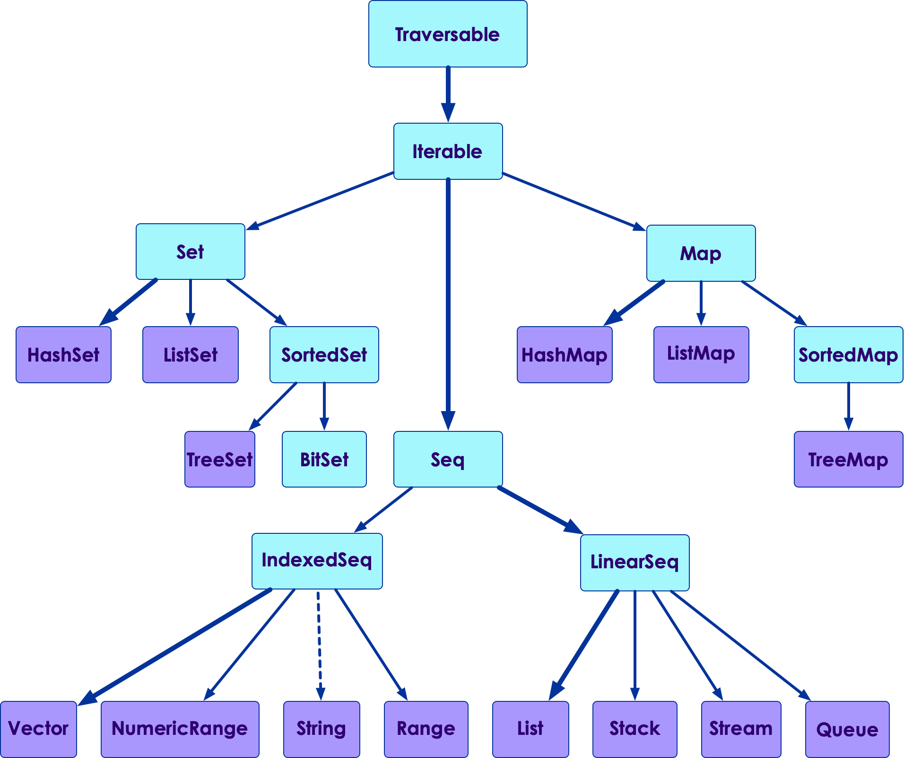

# Scala Collections

<!-- {"left" : 6.49, "top" : 7.66, "height" : 2.07, "width" : 4.52} -->
<!-- {"left" : 6.49, "top" : 7.66, "height" : 2.07, "width" : 4.52} -->

---

## Lesson Objectives

* Learn about Scala collections

Notes:

---

## Scala Collections

<!-- {"left" : 8.56, "top" : 1.21, "height" : 1.15, "width" : 1.55} -->

* Here are the classes in **`scala.collection`**

* Most of them will have **mutable** and **immutable** implementations

* Scala distinguishes between mutable and immutable collections

* A mutable collection (in package **`scala.collection.mutable`**) can be updated or extended in place. This means you can change, add, or remove elements of a mutable collection

* Immutable collections (in package **`scala.collection.immutable`**) never change

---

## Scala Immutable Collections

<!-- {"left" : 8.56, "top" : 1.21, "height" : 1.15, "width" : 1.55} -->

* Here are classes in **scala. collection. immutable** package

* These are the **default implementations** for collections

---

## Scala Mutable Collections

* Here are classes from **`scala.collection.mutable`** package

<!-- {"left" : 8.56, "top" : 1.21, "height" : 1.15, "width" : 1.55} -->

---

## Immutable vs. Mutable Collections

* Scala defaults to **immutable collections** by default

* For example if you simply instantiate a **`Set`** you will get the immutable version

* To use an mutable version, you have to explicitly ask for it

```scala
// default Set, immutable version
> val s = Set (1,2,3,4)
val s: scala.collection.immutable.Set[Int] = Set(1, 2, 3, 4)

> s += 5
// error : immutable collections is not modifiable

// mutable version
> > val s2 = scala.collection.mutable.Set (1,2,3,4)
val s2: scala.collection.mutable.Set[Int] = HashSet(1, 2, 3, 4)

// add to the set
> s2 += 5  // ok!
s2.type = HashSet(1, 2, 3, 4, 5)
```

---

## Collections Overview

| Class       | Description                                                                       |
|-------------|-----------------------------------------------------------------------------------|
| Array       | an indexed, mmutable sequence.  Size is fixed                                                      |
| ArrayBuffer | an indexed, mutable sequence.  Size can change                                                      |
| List        | a linear (linked list), immutable sequence.  Order maintained, duplicates allowed |
| Vector      | an indexed, immutable sequence                                                    |
| Map         | the base Map (key/value pairs) class                                              |
| Set         | the base Set class.  No order, no duplicates                                      |

---

## Array

* Mutable, indexed collection

* Array's contents can be changed

* Array size has to be set at the declaration time, can't be changed later (fixed!)

* Arrays are implemented on JVM level, meaning that they are the most efficient way to store sequences of objects - no extra memory overhead

```scala
> val a = Array (1,2,3,4)
a: Array[Int] = Array(1, 2, 3, 4)

// we can update contents
> a(1) = 20
Array[Int] = Array(1, 20, 3, 4)

// but can not change the size
> a += 5  // error, not allowed
```

---

## ArrayBuffer

* This very similar to Java array

* Mutable: so contents can be modified

* Indexed: so elements can be accessed effectively

```scala
> import scala.collection.mutable.ArrayBuffer

> val x = ArrayBuffer[Int]()

> x += 1
x.type = ArrayBuffer(1)

> x += 2
x.type = ArrayBuffer(1, 2)

// access using 0 based index
> x(0)
Int = 1

> val y = ArrayBuffer(1, 2, 3)
> y += 4
y.type = ArrayBuffer(1, 2, 3, 4)

// remove an element
> y -= 3
y.type = ArrayBuffer(1, 2, 4)
```

* [More examples](https://docs.scala-lang.org/overviews/scala-book/arraybuffer-examples.html)

---

## List

* List is immutable (Linked list implementation)
* List can not be modified.  When you add/delete elements a new list is created
* **ProTip**: Since List is a Linear Linked List implementation, accessing elements in the front are faster.  Accessing elements at the end are relatively slower operation.  Vector or ArrayBuffer are better options

```scala
> val a = List(10, 20, 30, 40)
a: List[Int] = List(10, 20, 30, 40)

// remove first 2 elements.  We get a new list
> val b = a.drop(2)
> b
b: List[Int] = List(30, 40)

// original list a is unchanged
> a 
a: List[Int] = List(10, 20, 30, 40)

// take first 3 elements
> a.take(3)
List[Int] = List(10, 20, 30)

// prepend to list
> val b = 0 +: a
val b: List[Int] = List(0, 10, 20, 30, 40)

// append to list
> val c  = a :+ 50
c: List[Int] = List(10, 20, 30, 40, 50)
```

---

## Vector

* Vector is **indexed and immutable**

* Because of indexing, we can access elements very quickly, both in the beginning and at the end

* Making any changes to Vector will result in a new Vector

```scala
> val v1 = Vector (10,20,30,40)
v1: scala.collection.immutable.Vector[Int] = Vector(10, 20, 30, 40)

// append to the end
> val v2 = v1 :+ 50
v2: scala.collection.immutable.Vector[Int] = Vector(10, 20, 30, 40, 50)

// v1 is not changed
> v1
v1: scala.collection.immutable.Vector[Int] = Vector(10, 20, 30, 40)
```

---

## Set

* Set doesn't maintain order of elements

* Set doesn't allow duplicates

* Set has both mutable and immutable implementations

* Scala has several more Set classes, including **SortedSet**, **LinkedHashSet**, and more. Please see the [Set class documentation](https://docs.scala-lang.org/overviews/collections-2.13/sets.html) for more details on those classes.

```scala

// List will allow duplicates (two 2s)
> List(1,2,2,3,4)
List[Int] = List(1, 2, 2, 3, 4)

// Set doesn't allow duplicates  (only one 2)
> Set (1,2,2,3,4)
scala.collection.immutable.Set[Int] = Set(1, 2, 3, 4)

// list maintains order
> (1 to 10).toList
List[Int] = List(1, 2, 3, 4, 5, 6, 7, 8, 9, 10)

// Set doesn't maintain order
> (1 to 10).toSet
scala.collection.immutable.Set[Int] = HashSet(5, 10, 1, 6, 9, 2, 7, 3, 8, 4)
```

---

## Set

* Default implementation of Set is immutable; mutable Set has to be explicitly initialized

```scala
// default Set is immutable
> val s1 = Set (1,2,3,4)
scala.collection.immutable.Set[Int] = Set(1, 2, 3, 4)

> s1 += 5  // error!  can not modify immutable set


> val s2 = scala.collection.mutable.Set(1,2,3,4)
scala.collection.mutable.Set[Int] = HashSet(1, 2, 3, 4)

> s2 += 5
s2.type = HashSet(1, 2, 3, 4, 5)

// accessing a set
> s1(4) // Boolean = true
> s1(10) // Boolean = false

// remove an element from Set
> s2.remove(3)
Boolean = true
// 3 is removed
> s2
scala.collection.mutable.Set[Int] = HashSet(1, 2, 4, 5)

// remove all elements from Set
> s2.clear()
scala.collection.mutable.Set[Int] = HashSet()
```

---

## Map

* Map stores key-value pairs

* No sorting order, and no duplicate keys

```scala
> val capitals = Map (
    "US" -> "Washington",
    "UK" -> "London",
    "France" -> "Paris"
)

capitals: scala.collection.immutable.Map[String,String] = Map(US -> Washington, 
UK -> London, France -> Paris)

// adding new keys won't work as the map is immutable
>  capitals("Japan") = "Tokyo"  // error

// accessing values
> capitals("US")  // ==> String = Washington

// no key found
> capitals("Canada")
java.util.NoSuchElementException: key not found: Canada

// check if key exists
> capitals.contains("US") //  Boolean = true
> capitals.contains("Canada") //  Boolean = false


```

---

## Map

* Let's try a mutable Map

```scala
> val capitals = scala.collection.mutable.Map[String, String]()
capitals: scala.collection.mutable.Map[String,String] = HashMap()

> capitals("US") = "Washington"
> capitals("UK") = "London"
> capitals

scala.collection.mutable.Map[String,String] = HashMap(UK -> London, US -> Washington)

// traversing a map
> for ((k,v) <- capitals) println(s"key: $k, value: $v")
key: UK, value: London
key: US, value: Washington
```

---

## Lab: Working With Collections

<!-- {"left" : 6.76, "top" : 0.88, "height" : 4.37, "width" : 3.28} -->

* **Overview**
    - Work with collections

* **Duration**
    - 20 mins

* **Instructions**
    - **Collections** lab

---

## Review and Q&A

<!-- {"left" : 8.56, "top" : 1.21, "height" : 1.15, "width" : 1.55} -->
<!-- {"left" : 6.53, "top" : 2.66, "height" : 2.52, "width" : 3.79} -->

* Let's go over what we have covered so far

* Any questions?