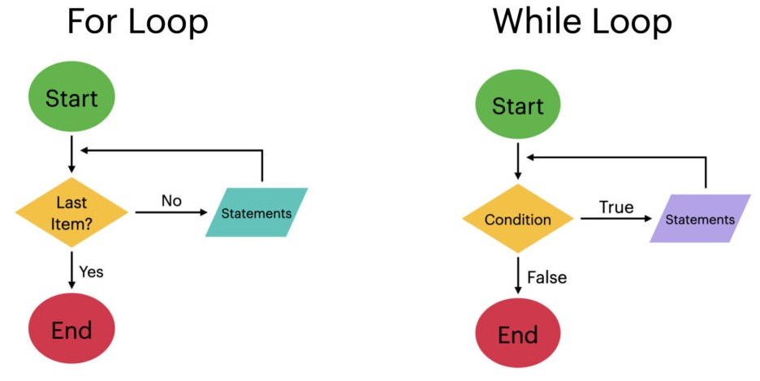

# Scala Control Structures and Functions

<!-- {"left" : 6.49, "top" : 7.66, "height" : 2.07, "width" : 4.52} -->
<!-- {"left" : 6.49, "top" : 7.66, "height" : 2.07, "width" : 4.52} -->

---

## Lesson Objectives

* Learn about Scala's control structures
* Learn about Scala's functions

Notes:

---

# Control Statements

---

## Control Statements

* Let's look at the following

* if/else

* for loops and expressions

* match expressions

* while loops

* try/catch

---

## Mini Labs: Try as We Learn!

<!-- {"left" : 6.76, "top" : 0.88, "height" : 4.37, "width" : 3.28} -->

* We are going to learn control structures in the next few slides

* As we learn them,  please try them out in REPL environment!

---

## IF-ELSE  (Try It!)

```scala
// scala-2
if (x < 0)
    println ("negative") // single statement
else if (x == 0) {
    println ("zero") // block with {}
}
else 
    println ("positive")
```

* Scala-3 has a **quiet** syntax; we can ski parenthesis and has **then** keyword  ([Reference](https://docs.scala-lang.org/scala3/book/taste-control-structures.html))

```scala
// scala 3 example
if x < 0 then   // no parenthesis and using then
  println("negative")
else if x == 0 then
  println("zero")
else
  println("positive")
```

* In Scala this is actually an **expression, not a statement**, meaning we can assign it to a variable!

```scala
// In Scala, if/else is an expression and can be assigned to a variable
val max = if a > b then a else b
```

* Go ahead and try it out!

---

## For Loops (Try It!)

```scala
// Scala 2 version
val numbers = List (1,2,3,4)

for (i <- numbers) { // this is GENERATOR pattern
    println (i)
}
// one liner
for (i <- numbers) println (i)
```

```scala
// Scala-3 version
// no brackets needed for conditions
for i <- numbers do println(i)
```

* Using **`foreach`** method in collections

```scala
val numbers = List (1,2,3,4)
numbers.foreach (println)
```

```scala
val ratings = Map(
    "Matrix"  -> 5.0, 
    "Snakes on a Plane"  -> 4.0, 
    "Usual Suspects" -> 5.5
)
for ((name,rating) <- ratings) println(s"Movie: $name, Rating: $rating")

ratings.foreach {
    case(movie, rating) => println(s"key: $movie, value: $rating")
}

```

* Go ahead and try it out!

---

## For Expressions  (Try It!)

* **`for expressions`** offer powerful functional programming constructs.  This is done using **`yield`** construct

```scala
val numbers = List(1,2,3,4)

val double = for (n <- numbers) yield n *2
```

```scala
val names = List ("John", "Lisa", "Adam")
val namesUpper = for (n <- names) yield n.toUpperCase
```

```scala
// yield with block of code
val names = List("michael_scott", "jim_halpert", "dwight_schrute")

val initials = for (n <- names)  yield {
    val tokens = n.split("_") // split the name by _
    val first = tokens(0)(0)  // extract first letter of first name
    val last = tokens(1)(0)   // extract first letter of last name
    s"${first}.${last}".toUpperCase
}
```

* Go ahead and try it out!

---

## While Loops  (Try It !)

```scala
var count = 20
while (count > 0) {
    println (count)
    count -= 1
}
```

```scala
var count = 20
do {
    println (count)
    count -= 1
} while (count > 0)
```

```scala
// keep reading input and check for palindromes until I say stop
// palindromes are words that read the same forward and backward
// examples:  civic,   radar,  level,   kayak
import scala.io.StdIn.readLine

println ("Enter a word:")
var word = readLine()
while (! word.equalsIgnoreCase("stop")) {
    val reverseWord = word.reverse
    if (reverseWord.equalsIgnoreCase(word)) 
        println ("     palindrome!")
    else
        println ("     not palindrome")

    println ("\nEnter a word:")
    word = readLine()
}
println ("Stopping... bye!")
```

* Go ahead and try it out!  🏋️

---

## Match Expressions (Try It!) ️

* Scala's **`match`** expression may look like a simple `switch` statement.  But it is far more powerful

```scala
// convert a number to month
val month = 1

month match {
    case 1 => println ("January")
    case 2 => println ("February")
    //...
    case _ => println ("Invalid month") // default
}
```

```java
// java switch equivalent
int month = 1;

switch (month) {
    case 1 : 
        System.out.println("January");
        break;
    case 2:
        System.out.println("Feburary");
        break;
    // ...
    default:
        System.out.println("Unknown Month");
        break;
}
```

* Go ahead and try it out!  🏋️

---

## Match Expressions Have Value!

* **Match expressions can be assigned to a variable** as well

```scala
val month = 2

val monthName = month match {
    case 1 => "January"
    case 2 => "February"
    //...
    case _ => "Invalid month" // default
}
```

```java
// java equivalent
// switch statement has no value and can not be assigned to a variable
int month = 8;
String monthName;

switch (month) {
    case 1:  
        monthName = "January";
        break;
    case 2:  
        monthName = "February";
        break;
    default:
        monthName = "Invalid month";
        break;
}
System.out.println (monthName)
```

* Go ahead and try it out!  🏋️

---

## Match Expressions

* Case statements can match multiple scenarios

```scala
val i = 4
val evenOrOdd = i match {
    case 1 | 3 | 5 | 7 | 9 => println("odd")
    case 2 | 4 | 6 | 8 | 10 => println("even")
    case _ => println("some other number")
}
// What is the value of evenOrOdd?  Is that something you expected?  
// How can you fix it?
```

```scala
val cmd = "go"
cmd match {
    case "start" | "go" => println("starting")
    case "stop" | "quit" | "exit" => println("stopping")
    case _ => println("doing nothing")
}
// TODO: Tweak the above so it will match ignoring case
// GO or Start  ==> starting
// Quit or QUIT ==> stopping
```

```scala
// block matches
month match {
    case 1 => {
        // statement 1
        // statement 2
        "return value"
    }
}
```

* Go ahead and try it out!  🏋️

---

## Try/Catch/Finally

* Pretty much same syntax as **`match`** expressions

```scala
var text = ""
try {
    text = openAndReadAFile(filename)
} catch {
    case e: FileNotFoundException => println("Couldn't find that file.")
    case e: IOException => println("Had an IOException trying to read that file")
}
```

```scala
try {
    // your scala code here
} 
catch {
    case foo: FooException => handleFooException(foo)
    case bar: BarException => handleBarException(bar)
    case _: Throwable => println("Got some other kind of Throwable exception")
} finally {
    // perform any cleanup, such as closing a database connection
    // or file handle
}
```

---

## Lab: Control Structures

<!-- {"left" : 6.76, "top" : 0.88, "height" : 4.37, "width" : 3.28} -->

* **Overview**
    - Understand control structures

* **Duration**
    - 30 mins

* **Instructions**
    - **CONTROL** lab

---

# Functions

<!-- {"left" : 3.19, "top" : 1.78, "height" : 3.31, "width" : 3.09} -->

---

## Functions are First Class Objects

<!-- {"left" : 3.19, "top" : 1.78, "height" : 3.31, "width" : 3.09} -->

* In Scala, functions are first class objects

* Functions can:

    - Be assigned to a variable

    - Passed as arguments to other functions

    - Set as members of a class.

    - Used inside of Collections

* This is NOT like Java

    - But it is like JavaScript and some other languages.

---

## Functions (Try It!)

* A Scala function definition is like this

```scala
def functionName ([list of parameters]) : [return type]
```

* Let's do a simple `max` function

* Java version

```java
int max (int a, int b) {
    if (a > b)
       return a;  // must return explicity
    else
       return b;  // must return explicity
}
int m = max (10, 20);
```

* Scala version (compare the syntax against Java version)

```scala
// Specify function parameters  types (a : Int)
// Also specify return type (: Int)
// return keyword is optional, will return the 'last evaluated expression'
def max (a : Int,  b: Int) : Int = {
    if (a > b) a
    else b
}
val m = max(10, 20)
```

---

## Functions That Don't Return Anything  (VOID) (Try It!)

* Java version

```java
// return type is void
void printIt (Object obj) {
    System.out.println (obj)
}
```

* Scala version

```scala
// return type is Unit
def printIt (x : Any) : Unit = {
    println (x)
}

printIt (1)
printIt ("hello world")
```

* Go ahead and try it out!  🏋️

---

## Functions (Try It!)

* Here is a classic Fibonacci function, implemented as recursive.  Try it and improve it.

```scala
def fib (x : Int) : Int = {
    if ( x == 0) 1
    else  x *  fib (x-1)
}
fib (1)
fib (10)
fib (20) // -2102132736  What!?
fib (50) // 0 !!
// TODO: fix the errors

// Hint: Inspect the types are we returning with and their range limit
```

Notes:

fix 1 : Long will buy us some range

```
def fib (x : Long) : Long = {
    if ( x == 0) 1
    else  x *  fib (x-1)
}
```

fix 2 : BigInt is probably the best approach

```
def fib (x : BigInt) : BigInt = {
    if ( x == 0) 1
    else  x *  fib (x-1)
}
```

---

## Named and Default Parameters (Try It!)

* Scala functions support default arguments to functions

```scala
// this function repets a string , default 3 times
def repeatString (str : String, times : Int = 3 ) : String =  {
    str * times
}

repeatString ("x", 5) // xxxxx  (5 times)

// using default param for times
repeatString ("x") // xxx  (3 times, default)
```

```scala
// using named parameters

// see the param order 
repeatString (times=10, str="x")
repeatString (str="x") // named parameter
```

* Go ahead and try it out!  🏋️

---

## Anonymous Functions  (Try It!)

* Functions do not need a name!

* No need for `def` keyword

```scala
// function doesn't have a name!
> val sayHI = (name : String) => println ("Hi " + name)
val sayHI: String => Unit = $Lambda$1420/0x0000000840743040@4479447c

> sayHI ("John")
"Hi John"
```

* Multiline requires braces

```scala
> val sayHI = (str : String) => {
    val upperStr = str.toUpperCase
    println ("Hi " + upperStr)
}

sayHI("Jon")
```

* Go ahead and try it out!  🏋️

---

## Functions are Objects! (Try It!)

* In Scala every thing is an object, including functions!  So we can pass them around like objects

```scala
val upper = (str: String) => str.toUpperCase

print (upper("hi"))
```

* Go ahead and try it out!  🏋️

---

## Higher Order Functions (Try It!)

* **Higher order functions** take other functions as parameters or return a function as a result

* This is possible because in Scala functions are objects  and first class values!

```scala

// Anonymous function
val upper = (str: String) => str.toUpperCase

val names = List ("michael", "jim", "dwight")

names.map(upper)  // List(MICHAEL, JIM, DWIGHT)

// here 'map' is a higher order function
// it 'applies' the upper function to each element
```

* Go ahead and try it out!  🏋️

---

## Functions that Take Functions (Try It!)

```scala
// 5%
def smallRaise (salary: Int) : Int = (salary * 1.05).toInt

// 20%
def decentRaise (salary: Int) : Int = (salary * 1.20).toInt

// double the salary
def greatRaise (salary: Int) : Int = (salary * 2).toInt

// this function takes 'raiseCalculator' which is a function!
def promotion (name: String, currentSalary : Int,
               raiseCalculator : Int => Int ) : Unit = {
    val newSalary = raiseCalculator(currentSalary) // using a passed function!
    println (s"$name's new salary is : $newSalary")
}

promotion ("Michael Scott", 100000, greatRaise)
promotion ("Jim Halpert", 70000, smallRaise)
promotion ("Dwight Shrute", 70000, decentRaise)
```

* Go ahead and try it out!  🏋️

---

## Pure Functions

* In [Functional Programming, Simplified](https://alvinalexander.com/scala/functional-programming-simplified-book), Alvin Alexander defines a pure function like this:
    - The function’s output depends only on its input variables
    - It doesn’t mutate any hidden state
    - It doesn’t have any "back doors": It doesn’t read data from the outside world (including the console, web services, databases, files, etc.), or write data to the outside world

* Any time you call a pure function with the same input value(s), you’ll always get the same result

* Some examples of pure functions
    - max, min, abs

* Examples of impure functions:
    - getTimeOfDay(),  getTodaysDate()
    - Every time you call these functions, the results are not the same

---

## Practical Programming

* Scala encourages and greatly simplifies writing pure functions

* How ever to solve real-world problems, we need impure functions too

* So the best practice is
    - break up huge functions into smaller pure/impure functions
    - This makes the code more readable / maintainable
    - Also makes it easy to test

```text
// not easy to test, as the output depends on current date
def calculatePayForDay() {
    date = getDate() // gets current date
    salary = // does some calculation based on the day (may be weekends are time and a half!)
}

break this into 

// this function is easily testable for various dates
// and this is a 'purer' function than before
def calculatePayForDay (day) {
    // do your calculation
}

and call it as
// we get the date out of the function
calculatePayForDay (getDate())

---

## Lab: Functions

<!-- {"left" : 6.76, "top" : 0.88, "height" : 4.37, "width" : 3.28} -->

* **Overview**
    - Work with functions

* **Duration**
    - 30 mins

* **Instructions**
    - **FUNCTIONS** lab

---

## Review and Q&A

<!-- {"left" : 8.56, "top" : 1.21, "height" : 1.15, "width" : 1.55} -->
<!-- {"left" : 6.53, "top" : 2.66, "height" : 2.52, "width" : 3.79} -->

* Let's go over what we have covered so far

* Any questions?