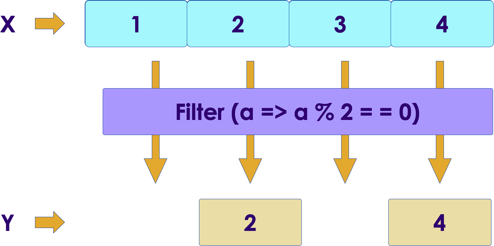
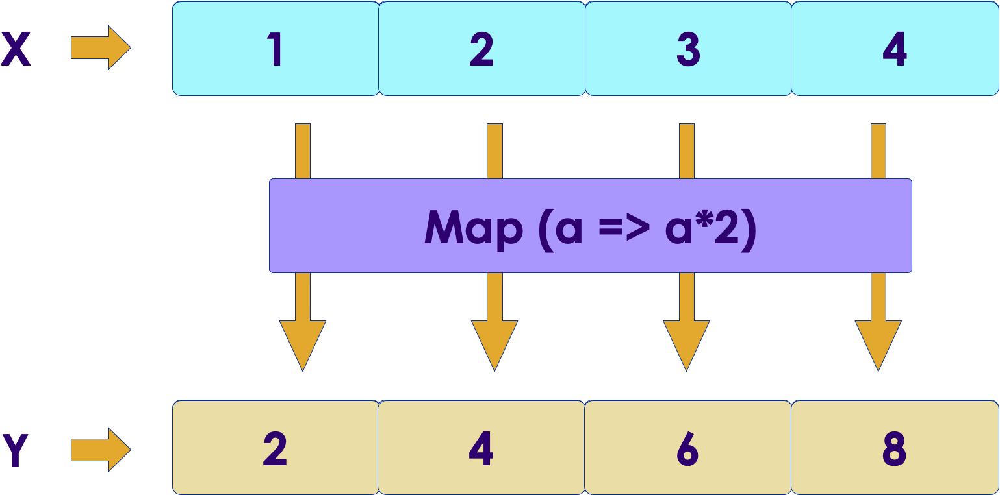

# Functional Programming in Scala

<!-- {"left" : 6.49, "top" : 7.66, "height" : 2.07, "width" : 4.52} -->
<!-- {"left" : 6.49, "top" : 7.66, "height" : 2.07, "width" : 4.52} -->

---

## Lesson Objectives

* Understand the rise of functional programming

* Understand core functional programming concepts

* Use Scala to write functional programming code

---

# Evolution of Programming

---

## Evolution

<!-- {"left" : 8.13, "top" : 1.11, "height" : 1.71, "width" : 1.85} -->

* Once Upon A Time... (pre 1990s)
    - we had single core processors
    - Programs ran in single 'thread' mode
    - Faster code required faster and faster clock speeds (200MHZ ! ...)

<!-- {"left" : 7.67, "top" : 4.34, "height" : 1.84, "width" : 2.45} -->

* 2000s: multi core processors
    - Multiple threads / programs running in parallel
    - Number of cores mattered more than clock speed
    - We can spin up multiple threads and process tasks in parallel
    - Java made multi-threaded programming easier

---

## The Problem: Shared State

<!-- {"left" : 7.67, "top" : 4.34, "height" : 1.84, "width" : 2.45} -->

* What if two threads want to share a memory location?

* For example both want to increment a counter shared by both

* Shared access to variables has to be synchronized

* We can use programming constructs like **Locks, mutex, semaphores**

* This leads locking / blocking

---

## New Model: Distributed Computing

* Distributed systems with

    - Multiple nodes

    - Each with multiple cores

* Imagine every thread wants to increment a global counter

* How do we co-ordinate them all?

<!-- {"left" : 0.52, "top" : 4.15, "height" : 3.08, "width" : 9.21} -->

---

# Functional Programming

---

## Functional Programming

* Functions are First Class Objects
    - Can be stored in variables
    - They can be passed as arguments

* Functions should be "pure functions" with no side-effects
    - Functions should **transform data rather than modify data**
    - No shared state --> **immutablility**
    - Immutability simplifies programming significantly, as we don't have worry about shared states changing underneath us
    - Also immutability allows a great deal of compiler optimizations

---

## Functional Programming Implementations

* LISP
    - LISP is an early functional-type language.
    - Used a lot in academia ("Common LISP")
    - Interpreted, and Slow

* Clojure
    - A JVM based LISP like language
    - Compiles and Runs on the JVM

* Many many more

---

## Multi-Paradigm Languages

* Languages like Scala are **multi-paradigm**
    - They are **functional**
    - and **object oriented**

* This makes Scala very practical and relevant (not just an academic exercise)

* Also Java has implemented some functional features (lambda functions ..etc)

---

# Functional Programming API

---

## Functional Programming API

* We will look at the following APIs

* **`filter`**

* **`map`**

* **`reduce`**

---

## Filter

<!-- {"left" : 0.52, "top" : 4.15, "height" : 3.08, "width" : 9.21} -->

* A ‘filter’ function is applied to each element in a collection

* Only elements that pass the filter function are kept in the new collection.

* Collection-1 (N elements)  => filter  => Collection-2 (M elements)  (usually  N > M)

* Original collection ('collection-1') does not change

```scala
// Let's find even numbers

> val x = List (1,2,3,4)
x: List[Int] = List(1, 2, 3, 4)

> val y = x.filter(a => a%2 == 0)
y: List[Int] = List(2, 4)

// x is unchanged
> x
x: List[Int] = List(1, 2, 3, 4)
```

* Go ahead and try it out!  🏋️

---

## Filter With Underscore Shorthand

* In this code below, the variable in filter() function 'a' is a temporary variable

```scala
> val x = List (1,2,3,4)
> val y = x.filter(a => a%2 == 0)
```

* So we don't even need to give it a name!  We will use and underscore (_) as a placeholder

```scala
> val x = List (1,2,3,4)
> val y = x.filter( _%2 == 0)
```

* As you get more familiar with Scala, you will start to use more and more underscore notation :-)

* Go ahead and try it out!  🏋️

---

## More Filter Examples


```scala
> val x = List (1,-2,-3,4)
> val positive = x.filter ( _ > 0)
```

```scala
> val names = List ("John", "Jane", "Michael", "Jim")

> val jNames = names.filter (  _.toLowerCase.startsWith ("j"))
val jNames: List[String] = List(John, Jane, Jim)
```

```scala
// chaining filters

> val a = (1 to 100).toList

// only find numbers dividable by 4 and 5
> val b = a.filter (_ % 4 == 0)

> val c = b.filter ( _ % 5 == 0)

// one liner
> val c   = a.filter (_ % 4 == 0).filter( _ % 5 == 0)
```

* Go ahead and try these out!  🏋️

---

## More Complex Filters

* We may need more complex filters than one-liners

* Filter functions:
    - take an input
    - and return a boolean true / false

```scala
// filter function
> def isShortName (name : String) : Boolean = {
    val trimmed = name.trim
    val length = trimmed.length
    length < 5  // returns true/false
}
> val names = List ("Jon", "Michael Scott", "    Jim   ", "Pamela")
> val shortNames = names.filter(isShortName) // "Jon", "    Jim   "
> val longNames = names.filterNot(isShortName)   // "Michael Scott", "Pamela"
```

```scala
// a complex fraud detection function
def isFraud (t : Transaction) : Boolean = {
    // query a db, query a ML model
    return true / false
}
val transactions = List (.....)
// filter fraudulent transactions
val fraud = transactions.filter (isFraud)
val notFraud = transactions.filterNot (isFraud)  // not condition
```

* Go ahead and try it out!  🏋️

---

## Map

<!-- {"left" : 0.52, "top" : 4.15, "height" : 3.08, "width" : 9.21} -->

* Maps are used to **transform** data
* Map applies a function to every element in a collection
* Map is a 1-1 mapping  
    - If the original collection had 10 elements, the result will also have 10 elements

```java
// Java version – specify "how" to do
List<Int> x = new ArrayList();
// add elements to x

List<Int> y = new ArrayList()
for (int i: x) {
   y.add(i * 2);
}
```

```scala
// scala – specify "what" to do
> val x = List (1,2,3,4)
x: List[Int] = List(1, 2, 3, 4)

> val y = x.map (a => a*2)
> val y = x.map ( _*2 )  // use underscore
y List[Int] = List(2, 4, 6, 8)
// Both x and y have same number of elements (4)
```

* Go ahead and try it out!  🏋️

---

## Map Examples

```scala
// uppercase all elements in a collection
> val a = Vector ("san jose", "san francisco", "new york")

> val b = a.map( _.toUpperCase )  // (SAN JOSE, SAN FRANCISCO, NEW YORK)
```

```scala
// we are going to calculate word-lengths
> val a = Vector ("san jose", "san francisco", "new york")

> val b = a.map ( _.length )  // (8, 13, 8)
```

```scala
// maps and lookups
val capitals = Map (
    "US" -> "Washington",
    "UK" -> "London",
    "France" -> "Paris"
)

val countries = Vector ("US", "Canada", "UK", "France")

// let's create a List of capitals
// We are using 'getOrElse' to avoid any exceptions when looking up
val capitalCities =  countries.map ( capitals.getOrElse( _ , "Unknown"))
```

* Go ahead and try these out!  🏋️

---

## Flatten

* Flatten will **unwind or flatten** nested structures

* Say we have a 'list of lists' and we want to flatten them to a single list

```scala
// say we are recording readings from various sensors
// now temps are groups or readings from 3 different sensors
val temps = List (List (10,20),  
                  List (20, 40, 50), 
                  List (60, 70, 80, 90))

val allTemps = temps.flatten // List(10, 20, 20, 40, 50, 60, 70, 80, 90)
```

```scala
// turn Strings to sequence of characters
val strings = List ("Hello", "World")
val characters = strings.flatten // List[Char] = List(H, e, l, l, o, W, o, r, l, d)
```

```scala
val dancePartners = List (List ("kim", "al"),
                          List ("julia", "terry"),
                          List ("debbie", "david")
                         )

val allDancers = dancePartners.flatten //  List(kim, al, julia, terry, debbie, david)

// sort the results
val allDancersSorted = dancePartners.flatten.sorted 
// List[String] = List(al, david, debbie, julia, kim, terry)
```

* Go ahead and try it out!  🏋️

---

## FlatMap

* **`FlatMap`** combines both **`map`** and  **`flatten`** operations

* N inputs --> flatMap --> M outputs
    - M can be greater/less/equal to N  (M <=> N)

```scala
> val fruits = Seq("apple", "banana", "orange")

> fruits.map(_.toUpperCase) //  List(APPLE, BANANA, ORANGE)

> fruits.flatmap (_.toUpperCase) 
//  List(A, P, P, L, E, B, A, N, A, N, A, O, R, A, N, G, E)
```

* We can get the same results of `flatMap` by running `map` and then `flatten`

```scala
> val fruits = Seq("apple", "banana", "orange")

> val mapResult = fruits.map(_.toUpperCase) // List(APPLE, BANANA, ORANGE)

> val flattenResult = mapResult.flatten
// //  List(A, P, P, L, E, B, A, N, A, N, A, O, R, A, N, G, E)
```

* Go ahead and try it out!  🏋️

---

## FlatMap

* Easier handling of Option/Some/None classes

```scala
// convert a string into Int
// we get an Option (Some or None)
def toInt(s: String): Option[Int] = {
    try {
        Some(Integer.parseInt(s.trim))
    } catch {
        case e: Exception => None
    }
}
```

```scala
> val strings = Seq("1", "2", "foo", "3", "bar")

> strings.map(toInt) // 
// List(Some(1), Some(2), None, Some(3), None)

> strings.flatMap(toInt) 
// List(1, 2, 3)
//## See how it eliminated None values!

> strings.flatMap(toInt).sum  
// Int = 6
```

* Go ahead and try it out!  🏋️

---

## FlatMap

* flatmap is great when we need to 'expand' input

```scala
// given  10, returns (9, 10, 11)
def plusEqualMinus (a : Int) = List (a-1,  a,  a+1)

val nums = List (1,2,3,4,5)

val expanded = nums.flatMap( x => plusEqualMinus (x))
//  List(0, 1, 2, 1, 2, 3, 2, 3, 4, 3, 4, 5, 4, 5, 6)


// same with underscore
val expanded = nums.flatMap( plusEqualMinus (_))
//  List(0, 1, 2, 1, 2, 3, 2, 3, 4, 3, 4, 5, 4, 5, 6)
```

* Go ahead and try it out!  🏋️

---

## Reduce

<!-- {"left" : 0.52, "top" : 4.15, "height" : 3.08, "width" : 9.21} -->

* Reduce function will apply a function to a collection to produce a “minimal” result

* Perfect example of a reduce function is SUM
    - Sum up all in list and produce a single Int
    - N elements => SUM => single element (Int)

```java
// Java version – specify "how" to do
List<Int> x = ...

int sum  = 0;
for (int i: x) {
   sum += i;
}
```

```scala
> val x = List (1,2,3,4)
x: List[Int] = List(1, 2, 3, 4)

> x.reduce ( (a,b) => a+b)
res0: Int = 10

// using _
> x.reduce (_+_)
```
<!-- {"left" : 0, "top" : 5.29, "height" : 1.41, "width" : 4.83} -->

* Go ahead and try it out!  🏋️

---

## Reduce

* Here we are reducing the list by 2 numbers (a, b)  => a+b

<!-- {"left" : 0.52, "top" : 4.15, "height" : 3.08, "width" : 9.21} -->

---

## Summary for Map/Filter/Reduce

```scala
val x = List (1,2,3,4)
```
<!-- {"left" : 0, "top" : 1.34, "height" : 1.15, "width" : 5.94} -->

| Operation | Code                       | Output         | Comments           |
|-----------|----------------------------|----------------|--------------------|
| map       | x.map ( a => a* 2)         | List (2,4,6,8) | Same size as input |
| filter    | x.filter (a => a % 2 == 0) | List (2,4)     | Reduced size       |
| reduce    | x.reduce ( (a,b) => a+b)   | Int (10)       | Reduction          |

<!-- {"left" : 0.25, "top" : 3.35, "height" : 2.38, "width" : 9.75} -->

---

## Understanding Underscores

* _ can be used for anonymous function parameters
As long as the parameters are used only once

* Below, we show examples without and with placeholders
Note how we use _ twice in the anonymous function with two params
    - The first use means the first param, the second use the second param

```scala
> (1 to 4).filter( a => a%2 == 0)  // See notes on filter (1)
res30: scala.collection.immutable.IndexedSeq[Int] = Vector(2, 4)

> (1 to 4).filter(_%2 == 0)  // Placeholder equivalent - one param
res31: scala.collection.immutable.IndexedSeq[Int] = Vector(2, 4)

> (1 to 3).reduce( (a:Int, b:Int) => a+b ) // Anonymous function
res22: Int = 6

> (1 to 3).reduce( _+_ )   // Placeholder equivalent - two params
res113: Int = 6
```

---

## Lab: Functional Programming

<!-- {"left" : 6.76, "top" : 0.88, "height" : 4.37, "width" : 3.28} -->

* **Overview:**
  - Get familiar with functional programming constructs

* **Approximate run time:**
  - 20-30 mins

* **Instructions:**
  - **functional**

Notes:

---

## Review and Q&A

<!-- {"left" : 8.56, "top" : 1.21, "height" : 1.15, "width" : 1.55} -->
<!-- {"left" : 6.53, "top" : 2.66, "height" : 2.52, "width" : 3.79} -->

* Let's go over what we have covered so far

* Any questions?
