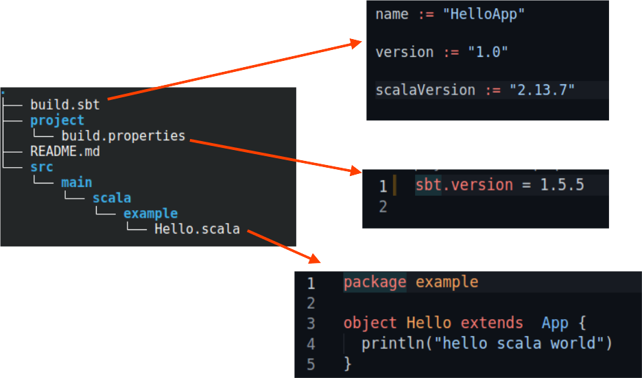

# Scala Getting Started

<!-- {"left" : 6.49, "top" : 7.66, "height" : 2.07, "width" : 4.52} -->

---

## Objectives

* Get familiar with Scala REPL environment
* Use REPL environment to experiment with Scala
* Run simple Scala codes
* Getting started with Scala projects

---

# REPL Environments

---

## Scala REPL

* **REPL (Read-Evaluate-Print-Loop)** is a command line interpreter for Scala

* Will execute statements interactively and immediately

* Easy way to experiment with code

* We will use standard Scala REPL

* [Ammonite](https://ammonite.io/) is another modern Scala REPL. We will show introduce you to ammonite later.

---

## Starting Scala Interpreter

* We will execute the following as **MINI-LABS**.  Follow along with the instructor

* Start Scala as follows

```bash
$   scala

# is Scala is not in your path, use the following
#   /PATH/TO/SCALA/INSTALL/bin/scala
```
<!-- {"left" : 0.85, "top" : 3.87, "height" : 2.08, "width" : 12.87} -->

<br/>

* You will see output like below (your output may vary based on your setup)
    - Here we see we are using **scala 2.13.7** version running on **Open JDK 11**

```text

Welcome to Scala 2.13.7 (OpenJDK 64-Bit Server VM, Java 11.0.11).
Type in expressions for evaluation. Or try :help.

scala> 

```
<!-- {"left" : 0.85, "top" : 7.37, "height" : 1.83, "width" : 14.71} -->

---

## Scala REPL - TAB Completion

* Hit TAB once, it will show first 30 methods; Double TAB to see all methods

```scala
scala> "hello world".[TAB key]
scala> "hello world".[TAB key][TAB key]

!=(                   (universal)   groupBy(                            scan(
##                    (universal)   groupMap(                           scanLeft(

scala> "hello world".toUpperCase
res0: String = HELLO WORLD
```
<!-- {"left" : 0.85, "top" : 2.78, "height" : 2.75, "width" : 15.05} -->

</br>

* What is **`res0`** ?
    - If we don't assign the result of your expression to a variable, the REPL automatically creates variables that start with the name **`res`**. The first variable is **`res0`**, the second one is **`res1`**, etc.:

* Try it:

```scala
scala>  println (res0)
HELLO WORLD
```
<!-- {"left" : 0.85, "top" : 7.72, "height" : 0.98, "width" : 5.04} -->

---

## Scala REPL - Numbers

```scala
scala> val x = 1
x: Int = 1

scala> val y = x + 1
y: Int = 2

// integer division
scala> 10/3
val res7: Int = 3

// floating point division
scala> 10.0 / 3
val res9: Double = 3.3333333333333335

scala> val z = 100000000000
       error: integer number too large

// make it a Long
scala> val z = 100000000000L
val z: Long = 100000000000

// BigInteger for large numbers
scala> val b = BigInt(1000000000)
val b: scala.math.BigInt = 1000000000
```
<!-- {"left" : 0.85, "top" : 1.98, "height" : 8.93, "width" : 8.72} -->

---

## Scala REPL - Strings

```scala
// string concat
scala> val x = "hello " + "world"
val x: String = hello world

scala> x.toUpperCase
val res0: String = HELLO WORLD

// Check string
scala> x.contains(" ")
val res1: true

// string search
scala> x.indexOf(" ")
val res2: Int = 5

// split
scala> x.split(" ")
val res3: Array[String] = Array(hello, world)

// multi-line string, use """
scala> val s = """hello world
     | good bye 
     | world"""
val s: String =
hello world
good bye
world

// string formatting
scala> "Hi %s, value of PI is %.2f".format("Jack", scala.math.Pi)
val res4: String = Hi Jack, value of PI is 3.14
```
<!-- {"left" : 0.85, "top" : 1.89, "height" : 9.64, "width" : 12.01} -->

---

## Scala REPL - Experimenting

* Let's have a little more fun

```scala
scala> 1 to 10
val res0: scala.collection.immutable.Range.Inclusive = Range 1 to 10

scala> (1 to 10).foreach (println)
1
2
3
4
5
6
7
8
9
10
```
<!-- {"left" : 0.85, "top" : 2.8, "height" : 5.28, "width" : 14.66} -->

---

## Scala REPL - Command Line Options

* Scala will respect **`JAVA_OPTS`** environment variable

* Also can use **`-J`** option

```bash
$ env JAVA_OPTS="-Xmx512M -Xms64M" scala

# Or 

$ scala -J-Xms256m -J-Xmx512m

scala> Runtime.getRuntime.maxMemory
477626368
```
<!-- {"left" : 0.85, "top" : 3.46, "height" : 3.69, "width" : 10.52} -->

---

# Ammonite

---

## Ammonite - A Modern Scala REPL

* [Ammonite](https://ammonite.io/) is by [Li Haoyi](http://www.lihaoyi.com/) has following features:
    - A modern Scala REPL (syntax highlights, pretty printing)
    - Allows you to run Scala scripts

* Installing Ammonite, just one executable

```bash
$   curl -L https://github.com/lihaoyi/ammonite/releases/download/2.4.0/2.13-2.4.0-bootstrap > amm 
$   chmod +x amm
```
<!-- {"left" : 0.85, "top" : 4.19, "height" : 0.66, "width" : 13.23} -->

* Start `Ammonite` and experiment

```bash
$   ./amm
Loading...
Welcome to the Ammonite Repl 2.4.0 (Scala 2.13.6 Java 11.0.11)
```
<!-- {"left" : 0.85, "top" : 5.56, "height" : 1.3, "width" : 12.55} -->

```scala
@ "hello world".size 
res0: Int = 11

@ Seq.fill(3)(Seq.fill(5)("Foo")) 
res3: Seq[Seq[String]] = List(
  List("Foo", "Foo", "Foo", "Foo", "Foo"),
  List("Foo", "Foo", "Foo", "Foo", "Foo"),
  List("Foo", "Foo", "Foo", "Foo", "Foo")
)
```
<!-- {"left" : 0.85, "top" : 7.02, "height" : 3.54, "width" : 9.48} -->

---

## Ammonite - Scripting

* Create a file **`a.scala`** with the following content

```scala
println (1)
```
<!-- {"left" : 0.85, "top" : 2.58, "height" : 0.57, "width" : 2.61} -->

* On a terminal start ammonite in watch mode

```bash
$   ./amm   --watch a.scala
Compiling /home/sujee/tmp/a.scala
1
```
<!-- {"left" : 0.85, "top" : 3.89, "height" : 1.15, "width" : 6.28} -->

* Now change **`a.scala`** to

```scala
println (2)
```
<!-- {"left" : 0.85, "top" : 5.63, "height" : 0.57, "width" : 2.61} -->

* And watch the ammonite terminal output; it will print the updated value

```bash
$   ./amm   --watch a.scala
Compiling /home/sujee/tmp/a.scala
1
Compiling /home/sujee/tmp/a.scala
2
```
<!-- {"left" : 0.85, "top" : 7.34, "height" : 1.74, "width" : 6.28} -->

---

# First Program in Scala

---

## First Scala App

* SBT is great for experimenting, but we will be writing code for real world applications

* Let's start with a very simple Scala app in file `HelloWorld.scala`

```scala
// HelloWorld.scala
object HelloWorld extends App {
  println("Hello, world!")
}
```
<!-- {"left" : 0.85, "top" : 3.79, "height" : 1.69, "width" : 6.95} -->

</br>

* Compile

```bash
$   scalac  HelloWorld.java
```
<!-- {"left" : 0.85, "top" : 6.12, "height" : 0.57, "width" : 5.28} -->

* We see the following file generated

```text
HelloWorld$.class
HelloWorld$delayedInit$body.class
HelloWorld.class
```
<!-- {"left" : 0.85, "top" : 7.34, "height" : 1.25, "width" : 6.79} -->

* Run the app

```bash
$   scala HelloWorld
# output:
#   Hello, world!
```
<!-- {"left" : 0.85, "top" : 9.29, "height" : 1.29, "width" : 4.58} -->

---

## Using Java and Scala

* Let's use Java classes from Scala

```scala
import java.util.Calendar;

object CurrentTime extends App {
      val c = Calendar.getInstance();
      println("Current time: " + c.getTime());
}
```
<!-- {"left" : 0.85, "top" : 2.86, "height" : 2.59, "width" : 10.76} -->

<br/>

* Compile

```bash
$   scalac  CurrentTime.scala
```
<!-- {"left" : 0.85, "top" : 6.2, "height" : 0.57, "width" : 5.61} -->

* Run

```bash
$   scala  CurrentTime

# output
#   Current time: Mon Nov 08 22:21:19 PST 2021
```
<!-- {"left" : 0.85, "top" : 7.37, "height" : 1.44, "width" : 8.44} -->

---

# SBT

---

## SBT REPL

* **SBT** is Scala Build Tool

* SBT has a REPL environment too, this one can handle projects easily

* More at [https://www.scala-sbt.org](https://www.scala-sbt.org/)

* Let's do a quick SBT project

---

## Installing SBT

* IDEs like IntelliJ Idea, will include SBT;  But it is a good idea to have command line SBT installed as well

* Simple way to install SBT is to download the 'universal package (zip)'

```bash
$   wget https://github.com/sbt/sbt/releases/download/v1.5.5/sbt-1.5.5.zip
$   unzip sbt-1.5.5.zip 
# this will create 'sbt/' directory

# now you can invoke sbt as follows
$   ./sbt/bin/sbt
# or
$   PATH/TO/SBT/bin/sbt

# First time you run this, it will take several seconds to download dependencies and bootstrap

```
<!-- {"left" : 0.85, "top" : 4.03, "height" : 3.1, "width" : 15.95} -->

---

## SBT Project Structure

```text
project_dir
    build.sbt <-- main build file
    project/
        build.properties  <-- build specs
    src/
        main/
            resources/ <-- files to include in main jar here
            scala/ <-- main Scala sources
            java/ <-- main Java sources

        test/
            resources/ <-- files to include in test jar here
            scala/ <-- test Scala sources
            java/ <-- test Java sources

```
<!-- {"left" : 0.85, "top" : 2.35, "height" : 5.26, "width" : 13.1} -->

---

## Working with SBT (Mini Lab)

* We have a very simple SBT project here : **`03-sbt`**

* Inspect the file structure

<!-- {"left" : 2.82, "top" : 3.64, "height" : 6.99, "width" : 11.86} -->


---

## Running SBT

* Invoke SBT

```bash
# Go to project directory
$  cd ~/scala-labs/03-sbt

# invoke sbt
$   sbt  # or   /PATH/TO/SBT/bin/sbt
```
<!-- {"left" : 0.85, "top" : 2.55, "height" : 1.24, "width" : 4.82} -->

* You may see output like this

```console
[info] welcome to sbt 1.5.5 (Ubuntu Java 11.0.11)
[info] loading project definition from /home/sujee/work/ElephantScale/scala-labs/03-sbt/project
[info] loading settings for project root-03-sbt from build.sbt ...
[info] set current project to HelloApp (in build file:/home/sujee/work/ElephantScale/scala-labs/03-sbt/)
[info] sbt server started at local:///home/sujee/.sbt/1.0/server/2a5e749b9fb5832e371d/sock
[info] started sbt server
sbt:HelloApp>  cd ~/scala-labs/03-sbt
```
<!-- {"left" : 0.85, "top" : 4.57, "height" : 2.13, "width" : 16.61} -->

<br/>

* Kick off a compile

```bash
sbt:HelloApp>  compile
# it would take a few seconds to download dependencies and compile code
```
<!-- {"left" : 0.85, "top" : 7.36, "height" : 0.86, "width" : 12.61} -->

* Package

```bash
sbt:HelloApp> package
# this will create a JAR at  ./target/scala-2.13/helloapp_2.13-1.0.jar
```
<!-- {"left" : 0.85, "top" : 8.64, "height" : 0.86, "width" : 12.44} -->

---

## Running Code SBT

* Let's run the code

```bash
sbt:HelloApp> run
[info] running example.Hello 

hello scala world
```
<!-- {"left" : 0.85, "top" : 2.47, "height" : 1.34, "width" : 5.23} -->

* Above it is running the only main method it found. We can specify a class to run as follows

```bash
sbt:HelloApp> runMain example.Hello 
```
<!-- {"left" : 0.85, "top" : 4.78, "height" : 0.57, "width" : 6.61} -->

* We can also specify argruments

```bash
sbt:HelloApp> runMain example.Hello  param1   param2
```
<!-- {"left" : 0.85, "top" : 6.43, "height" : 0.57, "width" : 9.44} -->

---

## Continuos SBT

* Starting SBT for every time, might have high overhead.  We can minimize this by running SBT in continuos mode

* Continuous build by using **`~compile`**
    - **ENTER** key exit this mode

```bash
sbt:HelloApp> ~compile
# now SBT will watch any file changes and compile them immediately
```
<!-- {"left" : 0.85, "top" : 4.35, "height" : 0.95, "width" : 13.03} -->

</br>

* Go ahead and modify `/src/main/scala/example/Hello.scala` and save.  Watch the sbt compile output

* Try continuous run with **`~run`**

```bash
sbt:HelloApp> ~run
# now SBT will watch any file changes and execute them immediately
```
<!-- {"left" : 0.85, "top" : 7.45, "height" : 0.95, "width" : 13.03} -->

---

## SBT Package and Run

* So far we have been executing commands from SBT shell.  Let's package the app and run it as scala app

```bash
# be in project dir
$   cd scala-labs/03-sbt

# invoke sbt package
$   sbt clean package

# inspect hte created jar
$   find . | grep jar
# ./target/scala-2.13/helloapp_2.13-1.0.jar
```
<!-- {"left" : 0.85, "top" : 3.01, "height" : 3.13, "width" : 8.58} -->

</br>

* Run the jar as a Scala app

```bash
$   scala   ./target/scala-2.13/helloapp_2.13-1.0.jar

# output
#   hello scala world

```
<!-- {"left" : 0.85, "top" : 6.82, "height" : 1.44, "width" : 9.61} -->

---

## SBT Project

* Let's try another project; This is an Scala3 project; Good thing is SBT will compile it with right version of Scala!

* Example project: [https://github.com/scala/scala3-example-project](https://github.com/scala/scala3-example-project)

```bash
# get the project
$   git clone https://github.com/scala/scala3-example-project

# compile
$   cd scala3-example-project
$   sbt compile

# after compile, run it
$   sbt run

# And test it
$   sbt test
```
<!-- {"left" : 0.85, "top" : 3.99, "height" : 4.41, "width" : 12.79} -->

---

## Other Scala Build Tools

* SBT is the most popular build tool for Scala.  Here are a few others

* [Gradle](https://docs.gradle.org/current/userguide/scala_plugin.html)

* [Bazel](https://github.com/bazelbuild/rules_scala) - for large scale projects

* [Mill](https://com-lihaoyi.github.io/mill/mill/Intro_to_Mill.html) - a new simpler build tool

---

## Lab: Quick SBT

<!-- {"left" : 12.93, "top" : 1.89, "height" : 5.07, "width" : 3.8} -->


* **Overview:**
  - Work with SBT

* **Approximate run time:**
  - 10-20 mins

* **Instructions:**
  - Please complete lab **`03-sbt`**

Notes:

---

## Review and Q&A

 <!-- {"left" : 13.05, "top" : 2.09, "height" : 2.68, "width" : 3.63} -->


* Let's go over what we have covered so far

* Any questions?

<!-- {"left" : 4.9, "top" : 6.11, "height" : 5.14, "width" : 7.7} -->