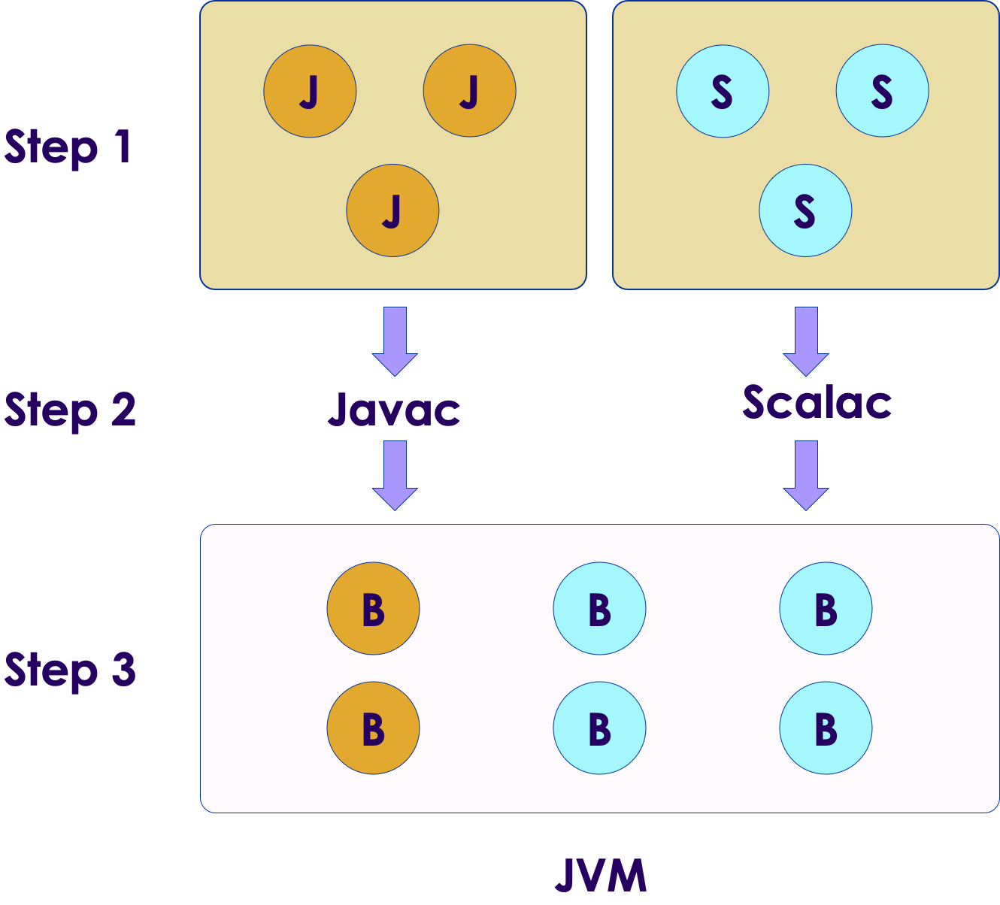

# Scala Intro

<!-- {"left" : 6, "top" : 7, "height" : 4, "width" : 6.5} -->

---

## Module Objectives

* A quick intro to Scala
* Learn Scala ecosystem

---

# Scala Introduction

---

## Scala Features

<!-- {"left" : 12.86, "top" : 2.46, "height" : 0.97, "width" : 4.17} -->
  <!-- {"left" : 5.88, "top" : 6.56, "height" : 1.23, "width" : 1.45} -->

* Scala is **JVM based** language.  It builds on Java / JVM.

* **Fully object oriented**
    - Every thing in Scala is an object!
    - Even primitive types like numbers and functions

* **Fully functional**: Scala supports and encourages functional programming style

* **Statically typed**:  Checks types during compile time

* **Very concise**: You will see examples of this soon enough

Notes:

This is a quick overview of Scala features.  We will deep-dive into these features in the next few sections.

---

## A Better Java!

  <!-- {"left" : 5.88, "top" : 6.56, "height" : 1.23, "width" : 1.45} -->
  <!-- {"left" : 5.88, "top" : 6.56, "height" : 1.23, "width" : 1.45} -->

* Sun released Java in 1996

* In late 1990s and 2000s Java took off.
    - Lot of enterprises adopted Java
    - Huge ecosystem developed around Java
    - And it attracted a lot of developers

* Oracle acquired Sun in 2009

* After Java 8 (2014) the Java evolution slowed down
    - Developers wanted modern features to keep up with modern development needs

* [Martin Odersky](https://en.wikipedia.org/wiki/Martin_Odersky), who worked in Java team at Sun, thought Java made too many compromises.
    - He designed Scala to include better features he wanted in Java
    - Scala was released to public in 2004

Notes:

Martin Odersky  worked at Sun Java.  He worked on Java Generics and javac compiler.  In 2007 he became a fellow at ACM (Association of Computing Machinery)

On 12 May 2011, Odersky and collaborators launched Typesafe Inc. (renamed Lightbend Inc., February 2016), a company to provide commercial support, training, and services for Scala.

Source : https://en.wikipedia.org/wiki/Martin_Odersky

---

## Scala Version History

| Date       | Scala version | Description            |
|------------|---------------|------------------------|
| 2001       |               | Work starts on Scala   |
| 2004       | v 1.0         | Initial public release |
| 2006 March | v 2.0         |                        |
| 2021       | V 3           | Big update!            |

Notes:

---

## Scala is a JVM Language

  <!-- {"left" : 5.88, "top" : 6.56, "height" : 1.23, "width" : 1.45} -->

* Scala source code compiles into a byte code

* `A.scala --> scalac compiler --> A.class`

* Then the byte code is executed by Java Virtual Machine (JVM)

* Why JVM is great
    - Cross platform.  JVM can run on multiple platforms and operating systems (Windows, Mac, Linux)
    - Byte code is portable across platforms (write-once-run-anywhere)
    - JVM can manage memory automatically
    - JVM is one of the best run-times, evolved over the years of research and experiment

---

## Scala Features: Pure OO

* Scala is a **purely object oriented language**

* Every thing is an object, including numbers and functions!

```java
// in java, i is a primitive, not an object
int i = 10;

// in Scala, i is an object
val i : Int = 10
```

* Classes

```scala
class Point(var x: Int, var y: Int) {
    // class methods
}
```

* Traits

```scala
trait Printable{  
    def print()  {
        println ("Default")
    }
}  
  
class A4 extends Printable{  
    def print(){  
        println("A4 paper")  
    }  
}  
```

---

## Scala Features: Functional

* **Scala is a functional language**

* Every function is a value; It supports anonymous functions, and higher order functions

```scala
val square = (x: Int) => x * x
```

* Higher order functions allow concise programming

```scala
val salaries = Seq(20000, 70000, 40000)
val newSalaries = salaries.map(x => x * 2) // List(40000, 140000, 80000)
// another option
val doubleSalary = (x: Int) => x * 2
val newSalaries2 = salaries.map(doubleSalary) // List(40000, 140000, 80000)
```

---

## Scala Features: Statically Typed

* Scala has **static typing**.  It's expressive type system enforces **compile-time type checking**.  This catches type mis-matches early on, and avoids costly run-time bugs

* **Type inference** facilitates cleaner, concise code

```scala
val i = 10  // i is automatically inferred as Int
val name = "John" // name is String

// types can be explicitly defined, but not necessary
val point: Point = Point (10, 20)
```

---

## Scala Features: Singleton Classes

* **Singleton classes** are supported at language level, no need for kludegy fixes

```scala
object Singleton{  
    def main(args:Array[String]){  
        println ("Hi from main")
    }  
} 
```

```scala
package logging
object Logger {
  def info(message: String): Unit = println(s"INFO: $message")
}
// ----
import logging.Logger.info
object Run{  
    def main(args:Array[String]){  
        info("hi from main")  // -->  INFO: hi from main
    }  
} 
```

* Compare with Java singleton

```java

public class Elvis {  // one and only
    public static final Elvis INSTANCE = new Elvis ();
    private Elvis(){} // must make constructor private, so no one can create new
}

// access it like this:
Elvis elvis = Elvis.INSTANCE;
```

---

## Scala Features: Case Classes

* **Case classes** compact representation of classes, that are **immutable** and support **pattern matching**


```scala
case class Fruit (name:String, color:String, price:Int)

val orange = Fruit ("Naval Orange", "Orange", 1)
val greenApple = Fruit ("Apple", "Green", 2)
val redApple  = Fruit ("Apple", "Red", 3)
val banana = Fruit ("Yellow Banana", "Yellow", 4)

// TODO: Write a match expression to select Apples

```

---

## Scala Popularity

* Scala enjoyed a good uptake among Java and Functional programmers

* Some popular Big data and distributed systems were developed in Scala, boosting popularity!
    - [Apache Spark](https://spark.apache.org/) was written in Scala and caused a good deal of interest in Scala language
    - [Apache Kafka](https://kafka.apache.org/) is another popular messaging system, written in Scala

* The New York Times'  internal content management system Blackbeard is built using Scala, Akka and Play Framework. (2014, [Source](https://open.nytimes.com/building-blackbeard-a-syndication-system-powered-by-play-scala-and-akka-9ae867d47da6))

* Twitter uses Scala for its backend code

* References: [1](https://www.javatpoint.com/history-of-scala)

Notes:

---

## Scala 3.0

  <!-- {"left" : 5.88, "top" : 6.56, "height" : 1.23, "width" : 1.45} -->

* This is a big release for Scala, eight years in the making with 28,000 commits, 7,400 pull requests, and 4,100 closed issues

* New 'quiet' syntax, no brackets around conditions, and loops

```scala
if x < 0 then
  "negative"
else if x == 0 then
  "zero"
```

* Type system improvements.  [Union types](https://dotty.epfl.ch/docs/reference/new-types/union-types.html)

* Language simplified;  dropped some features like [Delayed Init](https://dotty.epfl.ch/docs/reference/dropped-features/delayed-init.html).  See [more dropped features](https://dotty.epfl.ch/docs/Dropped%20Features/index.html)

* Metaprogramming.  [more details](https://docs.scala-lang.org/scala3/guides/macros/index.html)

* References:
    - [What's new in Scala 3.0](https://docs.scala-lang.org/scala3/new-in-scala3.html)
    - [Scala 3 new features](https://www.infoq.com/news/2021/06/scala-3-overhaul/)
    - [Martin Odersky goes over Scala 3 and beyond](https://www.youtube.com/watch?v=NXTjnowBx-c)

---

## Scala Criticisms

  <!-- {"left" : 5.88, "top" : 6.56, "height" : 1.23, "width" : 1.45} -->

* Scala can be a steep learning curve

* The 'different thinking and concepts' might take some getting used to

* Functional programming requires a different way of thinking

* Good tooling (IDEs, fast compilers) lacked in early years,  that was a hinderance for new developers

* Java is adding some functional programming constructs, that may encourage Java developers to stick with Java, instead of moving to Scala

* References:
    - [Kotlin vs Scala](https://medium.com/digitalfrontiers/why-did-kotlin-succeed-and-scala-not-1a8e279d2077)

---

## Good References

  <!-- {"left" : 5.88, "top" : 6.56, "height" : 1.23, "width" : 1.45} -->

* Books
    - [Programming Scala, 3rd edition](https://learning.oreilly.com/library/view/programming-scala-3rd/9781492077886/)

* Online
    - [#ThisWeekInScala!](https://medium.com/disney-streaming/tagged/thisweekinscala) - great blog to keep up with Scala news
    - [Should I learn Scala](https://www.toptal.com/scala/why-should-i-learn-scala)

---

## Lab: Doing XYZ

<!-- {"left" : 6.76, "top" : 0.88, "height" : 4.37, "width" : 3.28} -->

* **Overview:**
  - Work with xyz

* **Approximate run time:**
  - 20-30 mins

* **Instructions:**
  - Please complete A, B, C

Notes:

---

## Group Lab: Doing XYZ

<!-- {"left" : 6.76, "top" : 0.88, "height" : 4.37, "width" : 3.28} -->

* **Overview:**
  - Work with xyz

* **Approximate run time:**
  - 20-30 mins

* **Instructions:**
  - Please complete A, B, C

Notes:

---

## Review and Q&A

<!-- {"left" : 8.56, "top" : 1.21, "height" : 1.15, "width" : 1.55} -->
<!-- {"left" : 6.53, "top" : 2.66, "height" : 2.52, "width" : 3.79} -->

* Let's go over what we have covered so far

* Any questions?
