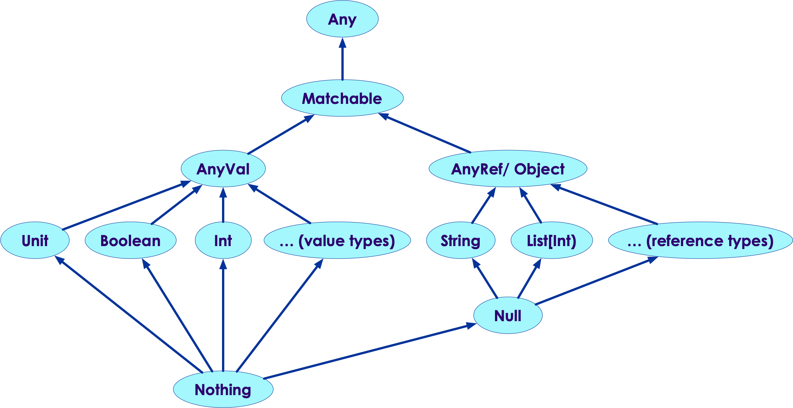

# Scala Types

<!-- {"left" : 6.49, "top" : 7.66, "height" : 2.07, "width" : 4.52} -->

---

## Lesson Objectives

* Learn about Scala Types

* Type Inference / Duck Typing

Notes:

---

# Core Scala Types

---

## Scala Types

* In Scala, all values have a type, including numerical values and functions.

<!-- {"left" : 6.76, "top" : 0.88, "height" : 4.37, "width" : 3.28} -->

---

## Scala Types

* **`Any`** is the supertype of all types. It defines certain universal methods such as `equals`, `hashCode`, and `toString`.

* The top-type Any has a subtype **`Matchable`**, which is used to mark all types that we can perform pattern matching on

* Matchable has two important subtypes: `AnyVal` and `AnyRef`

<!-- {"left" : 6.76, "top" : 0.88, "height" : 4.37, "width" : 3.28} -->

---

## Value Types

* **`AnyVal`** represents value types. There are a couple of predefined value types and they are non-nullable: **`Double, Float, Long, Int, Short, Byte, Char, Unit, and Boolean`**

* **`Unit`** is a value type which carries no meaningful information (like void)

<!-- {"left" : 6.76, "top" : 0.88, "height" : 4.37, "width" : 3.28} -->

---

## Reference Types

* **`AnyRef`** represents reference types (java.lang.Object)

* All non-value types are defined as reference types

* Every user-defined type in Scala is a subtype of AnyRef

<!-- {"left" : 6.76, "top" : 0.88, "height" : 4.37, "width" : 3.28} -->

---

## Unit

* **`Unit`** is equivalent to **`void`**

* Since **`Any`** is the top level object, all objects can be treated as Any

```java
// java code
public void printIt(Object x) {
    System.out.println (x)
}
```

```scala
// Scala code
def printIt(x : Any) : Unit = {
    println (x)
}
```

---

## Value Types

* In Scala all value types are full blown objects!

```scala
val b: Byte = 1
val i: Int = 1
val l: Long = 1
val s: Short = 1
val d: Double = 2.0
val f: Float = 3.0
```

* Also specify specific numeric types

```scala
val x = 1_000L   // val x: Long = 1000
val y = 2.2D     // val y: Double = 2.2
val z = 3.3F     // val z: Float = 3.3
```

---

## Value Types

| Data Type | Values                                                                                         |
|-----------|------------------------------------------------------------------------------------------------|
| Boolean   | true or false                                                                                  |
| Byte      | 8-bit signed two’s complement integer (-2^7 to 2^7-1, inclusive). -128 to 127                  |
| Short     | 16-bit signed two’s complement integer (-2^15 to 2^15-1, inclusive).  -32,768 to 32,767        |
| Int       | 32-bit two’s complement integer (-2^31 to 2^31-1, inclusive).  -2,147,483,648 to 2,147,483,647 |
| Long      | 64-bit two’s complement integer (-2^63 to 2^63-1, inclusive). (-2^63 to 2^63-1, inclusive)     |
| Float     | 32-bit IEEE 754 single-precision float.  1.40129846432481707e-45 to 3.40282346638528860e+38    |
| Double    | 64-bit IEEE 754 double-precision float.  4.94065645841246544e-324 to 1.79769313486231570e+308  |
| Char      | 16-bit unsigned Unicode character (0 to 2^16-1, inclusive).  0 to 65,535                       |
| String    | a sequence of Char                                                                             |

---

## BigInt and BigDecimal

* **`BigInt`** and **`BigDecimal`** types help with large numbers

```scala
val a = BigInt(1_234_567_890_987_654_321L)
val b = BigDecimal(123_456.789)

// and treat these like any numbers
a * 2
a + b
```

---

## Declaring Variables

* **`var`**: Defines a variable
* **`val`**: Defines a constant (immutable/read-only)
* Type is optional—Scala infers it if not supplied
    - Compile time checking, generally works well 

```scala
val x = 10   // Constant  (Integer type)
x=11         // error: can not change a val

var y = 5    // Variable  (Integer type)
y = 10        // Change the value 
// Java equivalent: int x = 5;
// question: spot the differences between Java declaration
// Hint : type declaration (int)  & semicolon

// Explicit type declaration of Double
var d: Double = 5.0   
// Java equivalent:    double d = 5.0;

// Error-type mismatch. 1.1 is a double, not assignable to Int
val n: Int = 1.1
```
<!-- {"left" : 0, "top" : 3.17, "height" : 4.02, "width" : 10.25} -->

Notes:

Scala supports type inference. 
Scala has a built-in type inference mechanism which allows the programmer to omit certain type annotations. It is, for instance, often not necessary in Scala to specify the type of a variable, since the compiler can deduce the type from the initialization expression of the variable. Also return types of methods can often be omitted since they correspond to the type of the body, which gets inferred by the compiler.
[Scala Tutorial: http://docs.scala-lang.org/tutorials/tour/local-type-inference.html]

---

## Immutability

* **`val`** types are Immutable
    - This means that they can't be changed.

    - This is like const in C++ or final in java

* Scala **prefers** immutable types

* Why immutable?

    - Cornerstone of functional programming

    - Safe for concurrent programming

    - Can be used in distributed systems without locking or blocking

```scala
val x = 10

val p = Person(...)
```

Notes:

---

## Var Types

* **`var`** types are mutable.

* That means that if we use them, we need to be safe

* More about Concurrent programming later

```scala
var y = 0
y = 1
y = 3.1 // error, can not change type.  y was Integer


var current_location = Geo (...)
current_location = Geo (...)
```

Notes:

---

## Operator Overloading

* Arithmetic operators look pretty normal, e.g., adding two Ints: a, b
    - **`a + b`**
    - But this actually calls the method  **`a.+(b)`**
    - This is a special case of calling  **`a.foo(b)`**  using  **`a foo b`**

* Overloading's available for other types, and used in the Scala libs
    - E.g., for BigInt shown below

* It's easy to add nifty new methods/operators
     - E.g., **`1 to 10`** // Really **`1.to(10)`**
     - numbers ranging from 1 to 10

```scala
scala> val bi: BigInt = 1
bi: BigInt = 1

scala> bi + 2  // Same as bi.+(2)
res14: scala.math.BigInt = 3

scala> 1 to 10  // We'll work with collections and ranges soon
res15: scala.collection.immutable.Range.Inclusive = Range(1, 2, 3, 4, 5, 6, 7, 8, 9, 10)
```
<!-- {"left" : 0, "top" : 5.72, "height" : 1.73, "width" : 10.25} -->

Notes: 

Since everything is an object in Scala, numbers actually have methods defined on them.
Such as the method named "+"
To make life easy, though, Scala allows you to call a method via the syntax
variable methName argument
This allows you to say 5 + 3 instead of (5).+(3)
Scala allows you to call any method with one explicit parameter using a shorthand notation.
E.g., given a variable "a" of a type that supports a method "meth1" that takes a single parameter b, you would normally call it as:
a.meth1(b)
However, with the shorthand notation, you can call it in the same way that operators are used:
a meth1 b
This gives a LOT of power to create new types with their own operators. 
Very useful, but take care not to make an unintelligible mess; have pity on your future coders and maintainers!
scala.math.BigInt is part of the standard Scala library, and is designed to hold large integer values.

---

## Scala vs. Java Types

| Type         | Scala                                                                                                | Java                                      |
|--------------|------------------------------------------------------------------------------------------------------|-------------------------------------------|
| Primitives   | Int, Double   <br/> Objects, starts with capital letters. Have methods.   <br/>Int.foo (another int) | int, double  <br/>Primitives, not objects |
| Rich Objects | Helper modules can be "mixed in" bringing in rich functionality                                      | List (2,4)                                |
| Root Object  | Any/AnyVal (numerics)                                                                                | Int (10)                                  |
| Void         | Unit                                                                                                 | Void                                      |

Notes:

---

## Mini Lab: Scala Types

<!-- {"left" : 6.76, "top" : 0.88, "height" : 4.37, "width" : 3.28} -->

* [API docs](http://www.scala-lang.org/api)

* Try these statements in Scala shell

```scala
val x = 10
val y: Double = 1.3
y = 3.1 // error
var greeting = "hello world"
greeting = "good bye world"  // ok 

val r = 1 to 10
// what is r ?
r(0)
```
<!-- {"left" : 0, "top" : 1.68, "height" : 5.24, "width" : 9.61} -->

Notes:

---

# Type Inference

---

## Duck Typing

<!-- {"left" : 6.49, "top" : 7.66, "height" : 2.07, "width" : 4.52} -->

* Scala features "Duck Typing"

* What is "Duck Typing"

    - If it walks like a duck...

    - Quacks like a duck...

    - Then I call it..

    - A Duck!

* What it means is that Scala can infer types (at compile time)

* No need to specify types explicitly as we do in Java.
    - However we CAN do that if we want.

Notes:

---

## Examples of Type Inference

* Implicit type inferring is very powerful
    - Preferred way as it makes the code more compact and readable

* We can explicitly specify the types; but most of the time it is not  necessary.
    - More verbose

```scala
scala> val a = 10  // implicit Integer, the compiler infers the type 
val a: Int = 10


scala> val a: Integer = 10 //Explicitly Specified
val a: Int = 10


scala> val b = 4.5 // Double
val b: Double = 4.5

scala> val b: Double = 4 // Forced to be a Double
val b: Double = 4.0

scala> val s = "hi" // String type (Implicit)
scala> val s: String = "hi" // Explicit definition
val s: String = hi

scala> val nums = List(1, 2, 3) // Implicit
scala> val nums:List[Int] = List(1, 2, 3)  // Explicit
val nums: List[Int] = List(1, 2, 3)
```
<!-- {"left" : 0, "top" : 1.28, "height" : 4.08, "width" : 9.48} -->

Notes:

---

## Strings

* Scala strings are like Java strings

* Enclose strings in double-quotes, triple-quotes for multiline strings; and enclose a character in single-quotes.

```scala
val s = "Hello"  // string
val c = 'H'      // char
// below is a multi line string, enclosed within """
val quote = """The essence of Scala:
               Fusion of functional and object-oriented
               programming in a typed setting."""
```

* **String interpolation** is very readable way to use variables inside strings

```scala
val street = "123 Main St"
val city = "San Jose"
val state = "California"

// notice the 's' at the beginning of string
print (s"Full address is : $street, $city, $state" ) 

// enclose expressions within {}
println(s"2 + 2 = ${2 + 2}")   // prints "2 + 2 = 4"
println (s"sqrt of 2 is ${math.sqrt(2)}") // prints "sqrt of 2 is 1.4142135623730951"
```

---

## Number Formatting

* Thousands separator

```scala
scala> val formatter = java.text.NumberFormat.getIntegerInstance

scala> formatter.format(10000)
res0: String = 10,000

scala> formatter.format(1000000)
res1: String = 1,000,000
```

* Formatting floats

```scala
scala> val pi = scala.math.Pi
scala> pi
val pi: Double = 3.141592653589793

scala> println ("Nicely printed PI: %.2f".format(pi))
Nicely printed PI: 3.14


scala> println ("Nicely printed PI: %06.2f".format(pi))
Nicely printed PI: 003.14

// comma (,) and period (.) for formatting
scala> "%,.2f".format(123456.789)
val res2: String = 123,456.79
```

---

## Mini Lab: Working With Variables

<!-- {"left" : 6.76, "top" : 0.88, "height" : 4.37, "width" : 3.28} -->

* Define a few variables

```scala
val city = "New York"
val state  = "NY"
val population = 5000000
val temp_in_F = 42.5

// TODO: print out the following
// "New York, NY has population of 5,000,000 and the current temperature is 5.8' C"

// Hint: formula to convert F --> C is
//  C = ( F -32) * 5/9


---

# Tuples

---

## Pairs and Other Tuples


 * Tuples combine a fixed number of items together

     - E.g., a pair combines two items

     - Items can be of different types

     - Access them via notation: ._n (n is the 1-based index) (1 <= n <= 22)

```text
> val pair = ("apple", 4)
pair: (String, Int) = (apple,4)

> pair._1
res149: String = apple

> println(pair._2)
4

> val wordCounts = Array(("apple",3), ("pear",2), ("grape",1))
wordCounts: Array[(String, Int)] = Array((apple,3), (pear,2), (grape,1))

> wordCounts(0)._1
res152: String = apple

> val edge = (1L,2L, 7)      // A triple
edge: (Long, Long, Int) = (1,2,7)

```
<!-- {"left" : 0, "top" : 3.51, "height" : 4.2, "width" : 10.25} -->

Notes: 

Tuple is a class containing miscellaneous collection of elements. 
Name of the tuple class will be of the form TupleN where n is the number of items in the tuple. getClass method returns the name of the tuple. 
You can have anywhere from 2 to 22 items in a tuple.
What's the difference between a list and a tuple? A tuple can contain any type, whereas a list should have only one type. 


