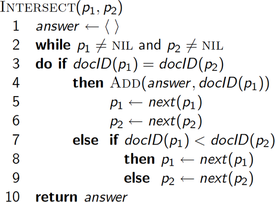

# Inverted Index
---

## Inverted Index

  * Each document has an id and a list of terms.
  * For each term "t" we must store a list of all documents that contain "t".
  * Identify each document by its id.

 <!-- {"left" : 2.82, "top" : 3.51, "height" : 4.14, "width" : 4.6} -->


Notes:


---

## Inverted Index

  * For each term -t- , we must store a list of all documents that contain t .
  * Identify each doc by a **docID** , a document serial number
  * Can we used fixed-size arrays for this?
  * What happens if the word **Caesar** is added to document 14?


 <!-- {"left" : 1.02, "top" : 4.75, "height" : 1.96, "width" : 8.21} -->

Notes:


---

## Inverted index

  * We need variable-size postings lists
    -  On disk, a continuous run of postings is normal and best
    - In memory, can use linked lists or variable length arrays
      - Some tradeoffs in size/ease of insertion

<!-- {"left" : 1.3, "top" : 4.81, "height" : 1.82, "width" : 7.64} -->


  * Sorted by docID (more later on why).

Notes:


---

## Inverted Index construction

<!-- {"left" : 0.7, "top" : 1.99, "height" : 5.66, "width" : 8.85} -->

Notes:


---

## Initial stages of text processing

  * Tokenization
    - Cut character sequence into word tokens
      - Deal with **"John's" , a state-of-the-art solution**
  * Normalization
    - Map text and query term to same form
      - You want **U.S.A.** and **USA** to match
  * Stemming
    - We may wish different forms of a root to match
      - **authorize , authorization**
  * Stop words
    - We may omit very common words (or not)
      - **the, a, to, of**


Notes:


---

## Indexer steps: Token sequence

  *  Sequence of (Modified token, Document ID) pairs.


<!-- {"left" : 0.62, "top" : 2.13, "height" : 4.81, "width" : 9.01} -->

Notes:


---

## Indexer steps: Sort

<!-- {"left" : 5.29, "top" : 1.24, "height" : 6.58, "width" : 4.71} -->

  * Sort by terms
    - And then docID
  * **Core indexing step**


Notes:


---

## Indexer steps: Dictionary & Postings

<!-- {"left" : 6.4, "top" : 1.3, "height" : 6.46, "width" : 3.54} -->

  * Multiple term entries in a single document are merged.
  * Split into Dictionary and Postings
  * Doc. frequency information is added.


Notes:


---

## Where do we pay in storage?

<!-- {"left" : 6.22, "top" : 1.31, "height" : 6.62, "width" : 3.63} -->

  * IR system implementation
    - How do we index efficiently?
    - How much storage do we need?


Notes:


---

## The index we just built

  * How do we process a query?
    - Later - what kinds of queries can we process?
  * Our focus


Notes:


---

## Query processing: AND

  * Consider processing the query:
    - **Brutus** *AND* **Caesar**
    - Locate **Brutus** in the Dictionary;
      - Retrieve its postings.
    - Locate **Caesar** in the Dictionary;
      - Retrieve its postings.
    - "Merge" the two postings (intersect the document sets):
  * 128
  * 34
  * **Brutus**
  * **Caesar**


Notes:


---

## The merge

  * Walk through the two postings simultaneously, in time linear in the total number of postings entries
  * If the list lengths are x and y , the merge takes `O( x+y )`
  * operations.
  * Crucial: postings sorted by docID.

Notes:


---

## Intersecting two postings lists

  * (a "merge" algorithm)


<!-- {"left" : 0.26, "top" : 2.07, "height" : 4.92, "width" : 6.6} -->


Notes:


---

## Boolean queries: Exact match

  * The Boolean retrieval model is being able to ask a query that is a Boolean expression:
   - Boolean Queries are queries using AND, OR and NOT to join query terms
     - Views each document as a set of words
     - Is precise: document matches condition or not.
   - Perhaps the simplest model to build an IR system on
  * Primary commercial retrieval tool for 3 decades.
  * Many search systems you still use are Boolean:
   - Email, library catalog, Mac OS X Spotlight

Notes:


---

## Example: WestLaw   

* http://www.westlaw.com/
* Largest commercial (paying subscribers) legal search service (started 1975; ranking added 1992)
* Tens of terabytes of data; ~700,000 users
* Majority of users still use boolean queries
* Example query:
  - What is the statute of limitations in cases involving the federal tort claims act?
  - LIMIT! /3 STATUTE ACTION /S FEDERAL /2 TORT /3 CLAIM
   `- /3 = within 3 words, /S = in same sentence`


Notes:


---

## Example: WestLaw 

  * Another example query:
    - Requirements for disabled people to be able to access a workplace
    - disabl! /p access! /s work-site work-place (employment /3 place
  * Note that SPACE is disjunction, not conjunction!
  * Long, precise queries; proximity operators; incrementally developed; not like web search
  * Many professional searchers still like Boolean search
    - You know exactly what you are getting
    - But that doesn't mean it actually works better ... .

Notes:


---

## Boolean queries:

 * More general merges
 * Boolean queries: More general merges
 * Exercise: Adapt the merge for the queries:
 * **Brutus** *AND NOT* **Caesar**
 * **Brutus** *OR NOT* **Caesar**
 * Can we still run through the merge in time O( x+y )? What can we achieve?

Notes:


---

## Merging

  * What about an arbitrary Boolean formula?
  * (**Brutus** *OR* **Caesar**) *AND NOT*
  * (**Antony** *OR* **Cleopatra**)
  * Can we always merge in "linear" time?
    - Linear in what?
  * Can we do better?


Notes:


---

## Query optimization

  * What is the best order for query processing?
  * Consider a query that is an AND of n terms.
  * For each of the n terms, get its postings, then AND them together.

  * Query: Brutus AND Calpurnia  AND Caesar


<!-- {"left" : 1.02, "top" : 4.82, "height" : 1.79, "width" : 8.21} -->


Notes:


---

## Query Optimization Example

  * Process in order of increasing freq:
  * start with smallest set, then keep cutting further.
  * This is why we kept document freq. in dictionary
  * Execute the query as ( **Calpurnia** *AND* **Brutus**) *AND* **Caesar.**

<!-- {"left" : 1.02, "top" : 4.67, "height" : 1.79, "width" : 8.21} -->


Notes:


---

## More general optimization


 * e.g.,  *(*  **madding**  *OR*  **crowd**  *) AND (*  **ignoble**  *OR*  **strife**  *)* 

 * Get doc. freq.'s for all terms.

 * Estimate the size of each  *OR*  by the sum of its doc. freq.'s (conservative).

 * Process in increasing order of  *OR*  sizes.


Notes: 


---

## Exercise


 * Recommend a query processing order for

 * Which two terms should we process first?

 *  **(tangerine**  *OR*  **trees)**  *AND*  **(marmalade**  *OR*  **skies)**  *AND*  **(kaleidoscope**  *OR*  **eyes)** 

| Term         | Freq   |
|--------------|--------|
| eyes         | 234334 |
| kaleidoscope | 78949  |
| marmalade    | 123321 |
| skies        | 263432 |
| tangerine    | 46653  |
| trees        | 334234 |

<!-- {"left" : 0.25, "top" : 3.32, "height" : 3.5, "width" : 9.75, "columnwidth" : [4.88, 4.88]} -->

Notes: 


---

## Query processing exercises


 * Exercise: If the query is  **friends**   *AND*  **romans**  *AND (NOT*  **countrymen**  *),* how could we use the freq of  **countrymen** ?

 * Exercise: Extend the merge to an arbitrary Boolean query.  Can we always guarantee execution in time linear in the total postings size?

 * Hint: Begin with the case of a Boolean  *formula*  query: in this, each query term appears only once in the query.

Notes: 


---

## Exercise


 * Try the search feature at http://www.rhymezone.com/shakespeare/

 * Write down five search features you think it could do better

Notes: 


---

## Phrase queries


 * We want to be able to answer queries such as  **"Calvin Klein"** – as a phrase

 * Thus the sentence  *"My best friend is Mary Klein. My name is Calvin."*  is not a match. 

     - The concept of phrase queries has proven easily understood by users; one of the few "advanced search" ideas that works

     - Many more queries are  *implicit phrase queries* 

 * For this, it no longer suffices to store only

 *    < *term*:  *docs* > entries


Notes: 


---

## A first attempt: Biword indexes


 * Index every consecutive pair of terms in the text as a phrase

 * For example the text "Friends, Romans, Countrymen" would generate the biwords

     -  **friends romans** 

     -  **romans countrymen** 

 * Each of these biwords is now a dictionary term

 * Two-word phrase query-processing is now immediate.


Notes: 


---

## Longer phrase queries


 * Longer phrases can be processed by breaking them down

 *  **Calvin**  **Klein**  **new**  **york** can be broken into the Boolean query on biwords:

 *  **calvin**  **klein**  *AND*  **new**  **york**   *AND*  **new**  **york** 

 * Without the docs, we cannot verify that the docs matching the above Boolean query do contain the phrase.

 * Can have false positives!

Notes: 


---

## Issues for biword indexes


 * False positives, as noted before

 * Index blowup due to bigger dictionary

     - Infeasible for more than biwords, big even for them

 * Biword indexes are not the standard solution (for all biwords) but can be part of a compound strategy

Notes: 


---

## Solution 2: Positional indexes


 * In the postings, store, for each  **term** the position(s) in which tokens of it appear:

     - < **term**  `*,*` number of docs containing  **term** ;

     -  *doc1*: position1, position2 ... ;

     -  *doc2*: position1, position2 ... ;

     - etc.>

Notes: 


---

## Positional Index Example

 * Which of docs 1,2,4,5 could contain " **to be or not to be** "?

```text
  < **be** : 993427;
    1 : 7, 18, 33, 72, 86, 231;
    2 : 3, 149;
    4 : 17, 191, 291, 430, 434;
    5 : 363, 367, ...>
```
<!-- {"left" : 0, "top" : 1.8, "height" : 2.05, "width" : 5.11} -->

<br/>

 * For phrase queries, we use a merge algorithm recursively at the document level

 * But we now need to deal with more than just equality


Notes: 


---

## Processing a phrase query


 * Extract inverted index entries for each distinct term: **to, be, or, not.** 

 * Merge their *doc:position* lists to enumerate all positions with " **to be or not to be** ".

    -  **to:** *2* :1,17,74,222,551; **4:8,16,190,429,433;** *7* :13,23,191; ...

    -  **be:** *1* :17,19;  **4:17,191,291,430,434;** *5* :14,19,101; ...

 * Same general method for proximity searches


Notes: 


---

## Proximity queries


 * `LIMIT! /3 STATUTE /3 FEDERAL /2 TORT `

     - Again, here, `/k`  means "within  *k*  words of".

 * Clearly, positional indexes can be used for such queries; biword indexes cannot.

 * Exercise: Adapt the linear merge of postings to handle proximity queries.  Can you make it work for any value of  *k* ?

     - This is a little tricky to do correctly and efficiently


Notes: 


---

## Positional index size


 * A positional index expands postings storage  *substantially* 

     - Even though indices can be compressed

 * Nevertheless, a positional index is now standardly used because of the power and usefulness of phrase and proximity queries ... whether used explicitly or implicitly in a ranking retrieval system.


Notes: 


---

## Positional index size


 * Need an entry for each occurrence, not just once per document

 * Index size depends on average document size **Why?**

     - Average web page has <1000 terms

     - SEC filings, books, even some epic poems ... easily 100,000 terms

 * Consider a term with frequency 0.1%

| Document Size | Postings | Positional Postings |
|---------------|----------|---------------------|
| 1000          | 1        | 1                   |
| 100,000       | 1        | 100                 |


Notes: 


---

## Rules of thumb


 * A positional index is 2–4 as large as a non-positional index

 * Positional index size 35–50% of volume of original text

     - Caveat: all of this holds for "English-like" languages


Notes: 


---

## Combination schemes


 * These two approaches can be profitably combined

     - For particular phrases ( **"Michael Jackson", "Britney Spears"** ) it is inefficient to keep on merging positional postings lists

        * Even more so for phrases like  **"The Who"** 

 * Williams et al. (2004) evaluate a more sophisticated mixed indexing scheme

     - A typical web query mixture was executed in ¼ of the time of using just a positional index

     - It required 26% more space than having a positional index alone


Notes: 


---

## Lab: What Is An Inverted Index

- Approximate time: 30 minutes
- Instructions: inverted-index/README.md


Notes:


