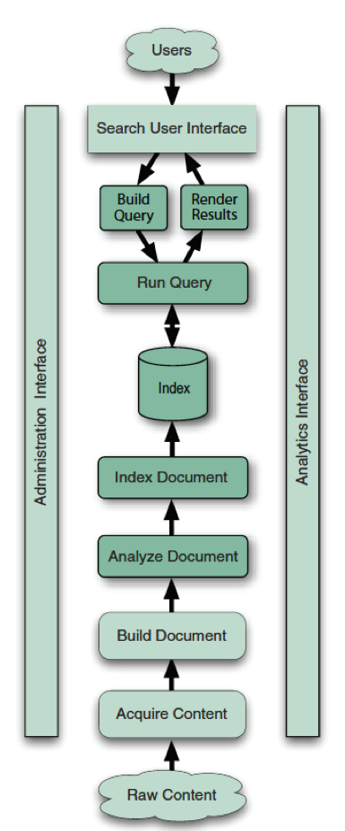
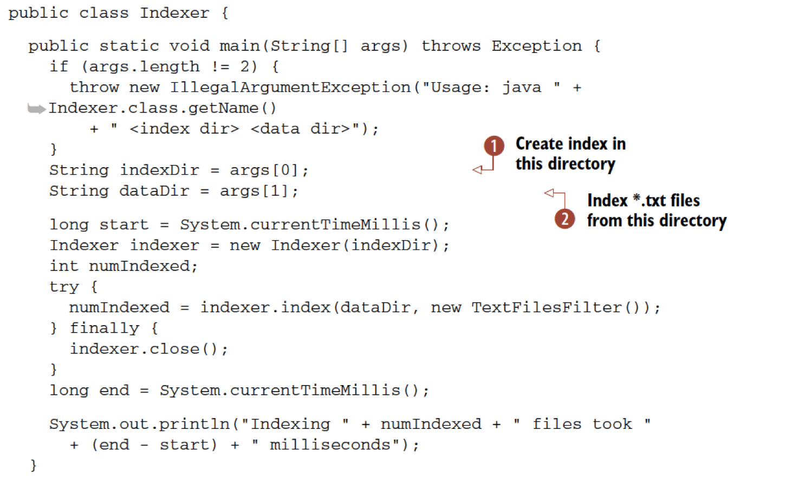
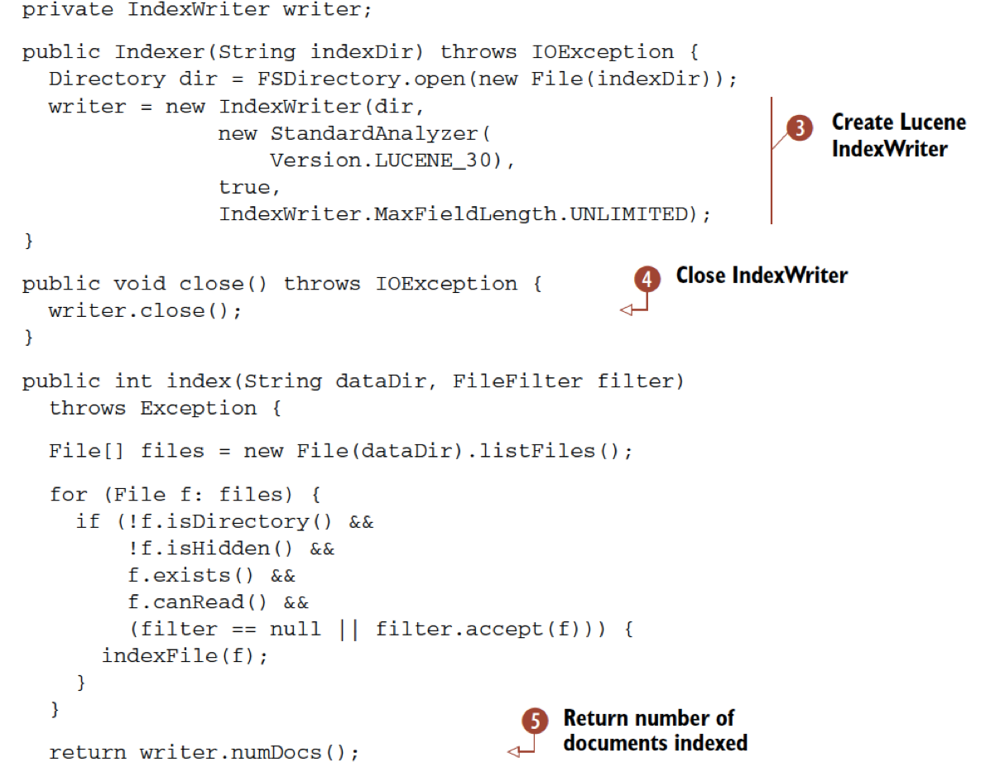
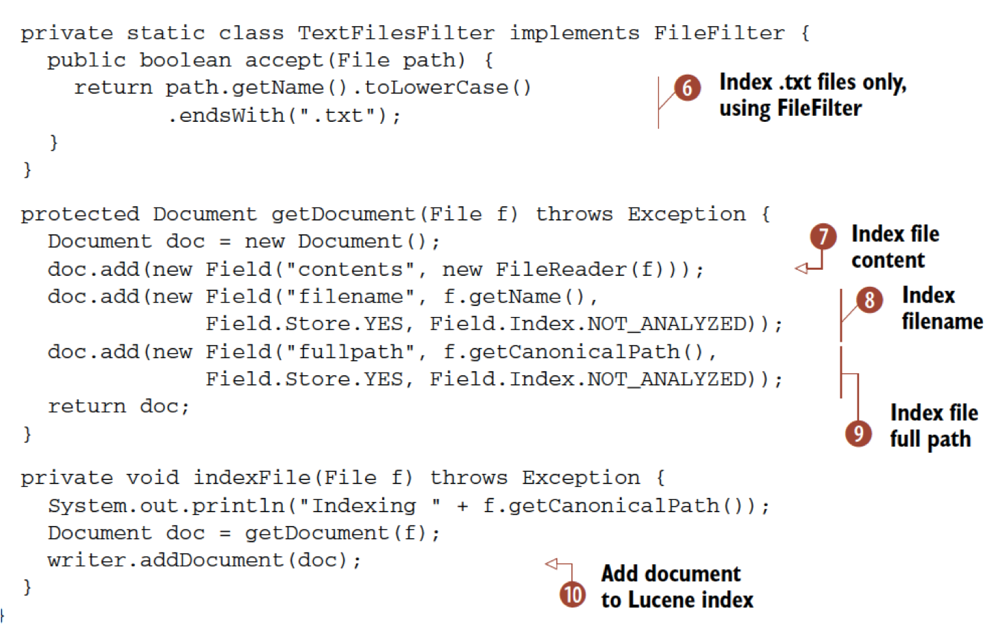
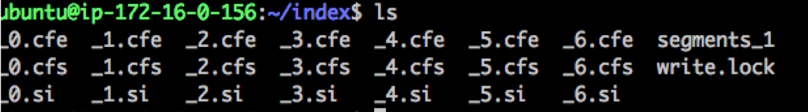
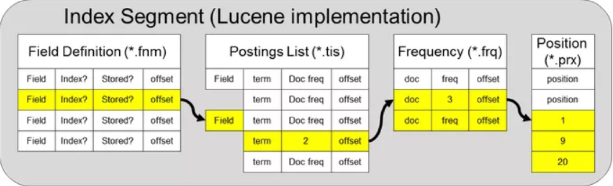
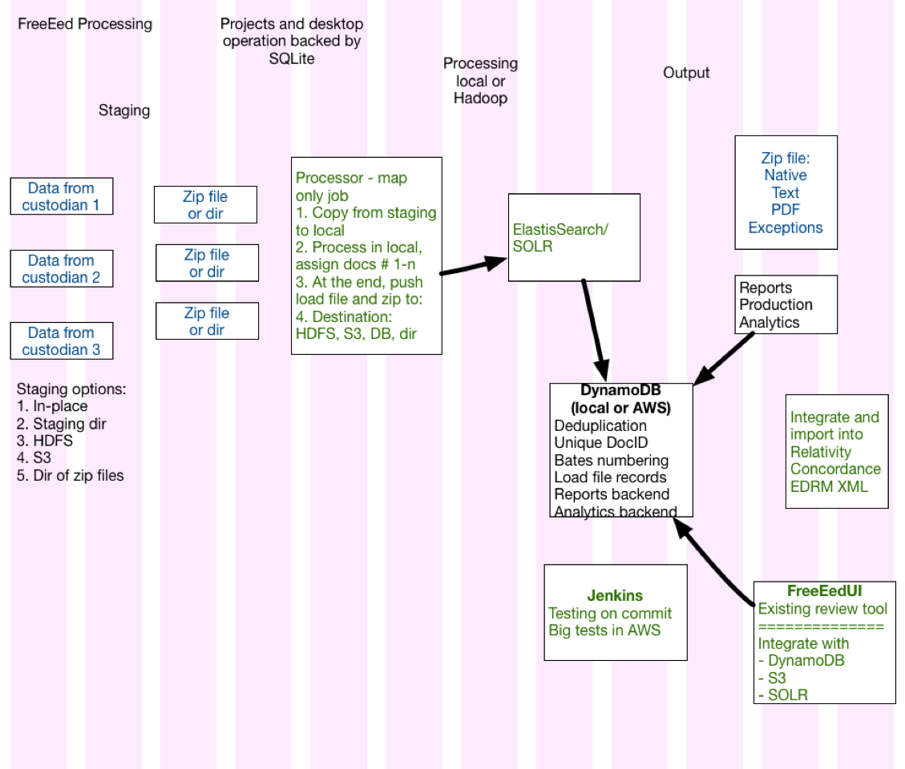

# Lucene
---

## Section Objectives

* Get familiar with Lucene
* Explore Lucene capabilities

Notes:

---

# Lucene Intro

---

## What is Lucene

* Lucene Core
* Java library
* Basics
  - Inverted index
  - Search spellchecking
* Advanced
  - Hit highlighting
  - Advanced analysis and tokenization

<!-- {"left" : 0.25, "top" : 1.4, "height" : 3.36, "width" : 9.75} -->

Notes:

---

## Lucene Benefits

* Information Retrieval (IR) library
  - Scalable, high-performance
* Inverted index of documents
* Vector space model
* Advanced search options
  - Synonyms
  - Stop words
  - Similarity
  - Proximity

Notes:

---

## Brief history

## Brief History 

 <!-- {"left" : 8.03, "top" : 1.22, "height" : 2.34, "width" : 1.98} -->

  * Lucene written by Doug Cutting in 1999
  * Replaces commercial search engines, such as Inktomi ($10K/year => $0)
  * Solr written by Yonik Seeley for CNET and contributed to Apache in 2006
  * LucidWorks – 2009
  * ElasticSearch – 2010

 <!-- {"left" : 7.97, "top" : 4.1, "height" : 2.09, "width" : 2.09} --> &nbsp;&nbsp;  &nbsp; &nbsp;<!-- {"left" : 0.33, "top" : 5.78, "height" : 2.79, "width" : 4.2} --> <!-- {"left" : 4.8, "top" : 6.43, "height" : 2.09, "width" : 2.79} -->

Notes:

Engine image: https://wonderopolis.org/wonder/how-does-an-engine-work

---

## Lucene Sites

* http://lucene.apache.org/core/
   - Resources
* https://wiki.apache.org/lucene-java/
  - Wiki
* https://wiki.apache.org/lucene-java/PoweredBy
  - Powered by Lucene”
    - Almost 300 entries
    - Stopped adding in 2015 (became commodity)

Notes:

---

## Lucene Users

* Netflix
* Digg
* LinkedIn
* FedEx
* Apple
* Ticketmaster
* Salesforce
* Microsoft Outlook
* More...

Notes:

---

## Search Application Steps

<!-- {"left" : 3.78, "top" : 1.57, "height" : 6.5, "width" : 2.7} -->

Notes:

---

## Indexing Steps

* Overall goal: 
  - Prepare an optimized data structure to efficiently answer queries
  - (Obviously, linearly going through all documents won't work)
* Acquire content
* Build document
* Analyze document
* Index document
* Search interface
* Queries
* Analytics

Notes:

---

## Indexing Steps: Acquire Content

* Acquire content
  - Easy
    - collection of JSON files
  - Hard
    - File systems
    - Content management systems
    - Microsoft Exchange
    - Various websites
    - Databases
    - and so forth

Notes:

---

## Indexing Steps: Build Document

* 'Document' is a unit for search
* Document fields
  - Title
  - Body
  - Abstract
  - Author
  - URI 
  - Text
* Format
  - JSON (for Elasticsearch)

Notes:

---

## Indexing Steps: Acquire Binary Content

* Acquire binary content
  - PDF
  - Microsoft Office
  - LibreOffice
  - Adobe Flash
  - Streaming video
  - Audio 
  - Multimedia files
* TIKA processes 
  - **1,400 document types**
  - Helps you build documents

Notes:

---

## Indexing Steps: Structure the Document

<!-- {"left" : 6.75, "top" : 1, "height" : 2.25, "width" : 3.38} -->

* Indexing a book or a large document
  - What is 'body text'?
  - Chapter?
  - Page? 
  - Paragraph?

* Some documents need to be boosted
  - Most recent documents
  - Press releases
  - Static boost (while indexing)
  - Dynamic boost (while searching)

Notes:

---

## Indexing Steps: Analyzing the Document

* Document -> tokens
* Token is roughly a word
* But what about
  - Compound words
  - Stemming (running -> run)
  - Synonyms (notebook and laptop)
  - Similar questions
* Analyzers
  - Lucene has a bunch of analyzers
  - Or you can build your own

Notes:

---

## Indexing Steps: Putting it in the Index

* Simple API
* Re-index or update documents
* New NoSQL-like features
  - Rebuilding the index is fast
  - Now, updating the index became faster
    - Updating not a document but one field at a time

Notes:

---

## Indexing Code

<!-- {"left" : 0.23, "top" : 1.16, "height" : 5.54, "width" : 9.05} -->

Notes:

---

## Write the Index

<!-- {"left" : 0.27, "top" : 1.18, "height" : 6.58, "width" : 8.57} -->

Notes:

---

## Indexing Text Files

<!-- {"left" : 0.25, "top" : 1.11, "height" : 5.76, "width" : 9.15} -->

Notes:

---

## Search Step

* Precision and Recall

Notes:

---

## Lab: Lucene

* Please do this lab: 

- `lucene/lucene.md`

Notes:

---

## What we did in Lucene lab

* **IndexFiles** class creates a Lucene Index
  - The main() method parses the command-line parameters
  - Prepares for instantiating **IndexWriter**
  - Opens a **Directory**
  - Instantiates **StandardAnalyzer** and **IndexWriterConfig**
* But how are the documents handled?

Notes:

---

## Indexing the Documents

* Lucene Analyzers 
  - processing pipelines
  - break up text into indexed tokens (a.k.a. terms)
  - optionally 
    - Downcasing
    - Synonym insertion
    - Filtering out unwanted tokens
* StandardAnalyzer
  - Uses the Word Break rules 
  - Converts tokens to lowercase
  - Filters out stopwords
  - Different rules for every language

Notes:

---

## Lab: Luke

* Please do this lab: 

- `lucene/luke.md`

Notes:

---

## A Look Inside the Lucene Index

* ./index

<!-- {"left" : 0.31, "top" : 2.25, "height" : 1.34, "width" : 9.64} -->

<!-- {"left" : 0.41, "top" : 4.55, "height" : 2.87, "width" : 9.43} -->

Notes:

---

## Use Case: Legal Search

* eDiscovery
  - Company P (Plaintiff) has a problem with company D (Defendant)
  - Company P asks for “all documents that are related to the lawsuit” from D
  - This is called “discovery” or “eDiscovery”
  - Company P also produces a list of key words that it wants to search

Notes:

---

## eDiscovery Search

* After P and D agree (with the help of a judge) to the list of key words
* Company D has to do eDiscovery
  - Collect data from custodians
  - “Process the data” – that is, index it
  - Run review (privilege, counsel-client, responsive)
  - Produce

Notes:

---

## Interesting Tidbits About eDiscovery

* Most of these are proprietary or under NDA 
* Representative case size: 5GB to 500GB 
* Cost per GB of processing: $5-200, ~$100
* Takes 25-50% of litigation budget
* Days to process and months to review
* Preservation: 3-7 years
* 500 providers, with 10 majors

Notes:

---

## eDiscovery Implementations

* Relativity
* FTI, Recommind, NUIX
* Thomson Reuters LexisNexis
* FreeEed (pic of popcorn)

<!-- {"left" : 1.02, "top" : 4.25, "height" : 2.87, "width" : 8.21} -->

Notes:

---

## Process

<!-- {"left" : 1.02, "top" : 1.33, "height" : 6.98, "width" : 8.21} -->

Notes:

---

## Indexing steps

* Staging
  - Prepare the files (copy to zip)
* Processing (each processor unit)
  - Open the assigned zip
  - Mount it as a file system
  - For each file
    - Extract metadata (dozens of fields)
    - Create temp Lucene index in memory, do culling
    - Commit responsive files to Elasticsearch or Solr

Notes:

---

## Demo: FreeEed and FreeEedUI

<!-- {"left" : 1.02, "top" : 1.33, "height" : 6.98, "width" : 8.21} -->

Notes:

---

## Review Steps

* Responsive files (index per case) are in Elasticsearch or Solr
* Metadata on hard drive or database
* Native files provided
* PDF, HTML provided

Notes:

---

## Use Case

* You are the defendant and need to produce
  - Process data
  - Review
  - Produce
* You are the plaintiff and you were given a large production
  - Load the produced data
* You are the researcher
  - Add annotations
  - Download into a research tool
  - Look for discoveries

Notes:

---

## More Lucene

* Document Analyzers
* Queries
  - Sounds like
  - More like that
  - Stemming
  - Filtering and sorting
  - Range queries
* Tika (now with OCR)
* After that...
  - Elasticsearch
  - SOLR

Notes:

