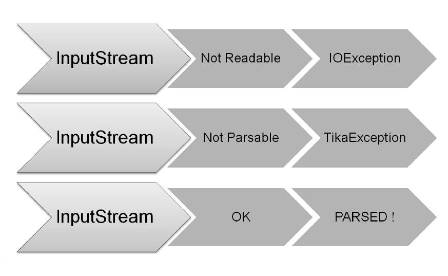

# Developing With Lucene API
---

## Section Objectives

* Learn about Lucene
* Learn about core classes
* Learn about Scaling Lucene  


Notes:

---

# About Lucene 

---

## Open source IR systems


 * Widely used academic systems

     - Terrier (Java, U. Glasgow) http://terrier.org  
     - Indri/Galago/Lemur (C++ (& Java), U. Mass & CMU)
     - Tail of others (Zettair, …)

 * Widely used non-academic open source systems
     -  **Lucene** 
        * Things built on it: Solr, ElasticSearch
     - A few others (Xapian, …)

Notes: 


---

## Lucene


 * Open source Java library for indexing and searching
     - Lets you add search to your application
     - Not a complete search system by itself
     - Written by Doug Cutting

 * Used by: Twitter, LinkedIn, Zappos, CiteSeer, Eclipse, …
     - … and many more (see http://wiki.apache.org/lucene-java/PoweredBy)
 * Ports/integrations to other languages
     - C/C++, C#, Ruby, Perl, Python, PHP, …

Notes: 


---

## Resources


 * Lucene: http://lucene.apache.org
 * Lucene in Action: http://www.manning.com/hatcher3/
     - Code samples available for download
 * Ant: http://ant.apache.org/
     - Java build system used by "Lucene in Action" code

Notes: 


---

## Lucene in a search system


 * Raw Content
 * Acquire content
 * Build document
 * Analyze document
 * Index document
 * Index
 * Users
 * Search UI
 * Run query

Notes: 


---

# Lucene Index
---

## Let's Create An Index

* Tree Structure
  - Sorted for range queries
  - O(log(n)) search

 <!-- {"left" : 0.76, "top" : 2.63, "height" : 2.81, "width" : 8.73} -->


* But Lucene does not index this way

Notes:

---

## A New Index

* Terms and documents are stored in arrays

 <!-- {"left" : 0.45, "top" : 2.36, "height" : 3.47, "width" : 9.34} -->

Notes:

---

## Insertions

* Means writing a new segment
* In case of too many segments, merge them
* Merging: concatenate docs, merge terms dictionaries and postings lists (merge sort)


 <!-- {"left" : 0.15, "top" : 3.35, "height" : 3.62, "width" : 9.95} -->

Notes:

---

## Insertion, contd


 <!-- {"left" : 0.32, "top" : 2.22, "height" : 3.52, "width" : 9.61} -->
Notes:

---

## Deletion

* Means a bit off
* Ignore deleted documents when searching and merging 
* Merge policies favor segments with many deletions

 <!-- {"left" : 0.18, "top" : 3.32, "height" : 2.61, "width" : 9.89} -->


Notes:

---

## Pros And Cons

* Pros:
  - Segments never modified
    - Properly used cache by file system
    - Lock-free
  - Terms are de-duplicated
    - Leads to save more space for high-frequency terms
  - An ord identifies docs uniquely
    - Good for cross-API comm.
    - Several indexes in a single query can be used 
  - An ord identifies terms uniquely
    - Sorting: compare longs, not strings
    - Faceting

---

## Pros and Cons (contd)

* Cons:
  - When updating, a new segment is written
    - Better to update in bulk not single
    - They are written sequentially
Notes:

---

## Example of adding document

* `addDoc()`: Adds documents to the index

```java
private static void addDoc(IndexWriter w, String title, String isbn) throws
IOException{
  Document doc = new Document();
  doc.add(new TextField("title",title,Field.Store.YES));
  doc.add(new StringField("isbn",isbn,Field.Store.YES));
  w.addDocument(doc);
}
```
<!-- {"left" : 0, "top" : 1.84, "height" : 1.8, "width" : 10.25} -->


---

## Core indexing classes


 * `IndexWriter`
     - Central component that allows you to create a new index, open an existing one, and add, remove, or update documents in an index
     - Built on an `IndexWriterConfig` and a `Directory`
 * `Directory`
     - Abstract class that represents the location of an index
 * `Analyzer`
     - Extracts tokens from a text stream

Notes: 


---

## Creating an IndexWriter

```java
import org.apache.lucene.analysis.Analyzer 
import org.apache.lucene.index.IndexWriter 
import org.apache.lucene.index.IndexWriterConfig 
import org.apache.lucene.store.Directory 

private IndexWriter writer;

public Indexer(String dir) throws IOException {
  Directory indexDir = FSDirectory.open(new File(dir));
  Analyzer analyzer = new StandardAnalyzer ();
  IndexWriterConfig cfg = new IndexWriterConfig(analyzer);
  cfg.setOpenMode(OpenMode.CREATE);
  writer = new IndexWriter (indexDir, cfg)
}
```
<!-- {"left" : 0, "top" : 1.44, "height" : 3.9, "width" : 10.25} -->

Notes: 


---

## Core indexing classes (contd.)


 * `Document`
     - Represents a collection of named Fields.  Text in these Fields are indexed.
 * Field
     - Note : Lucene Fields can represent both "fields" and "zones" as described in the textbook
     - Or even other things like numbers.
     - `StringFields` are indexed but not tokenized
     - `TextFields` are indexed and tokenized

Notes: 


---

## A Document contains Fields

```java
import org.apache.lucene.document. Document ;
import org.apache.lucene.document. Field ;
  ...
protected Document getDocument(File f) throws Exception {
  Document  doc = new  Document ();
  doc.add (new  TextField ("contents", new FileReader(f))) 
  doc.add (new  StringField ("filename",
                           f.getName(),
                           Field.Store.YES)); 
  doc.add (new  StringField ("fullpath",
                           f.getCanonicalPath(),
                           Field.Store.YES));
  return doc;
}
```
<!-- {"left" : 0, "top" : 1.44, "height" : 3.84, "width" : 10.25} -->


Notes: 


---

## Index a Document with IndexWriter

```java
  private IndexWriter writer;
  ...
  private void indexFile(File f) throws
  		Exception {
  	Document doc = getDocument(f);
  	writer.addDocument (doc);
  }
```
<!-- {"left" : 0, "top" : 1.44, "height" : 2.6, "width" : 8.15} -->

Notes: 


---

## Indexing a directory

```java
private IndexWriter writer;
  ...
public int index(String dataDir,
  				   FileFilter filter)
  		throws Exception {
  	File[] files = new File(dataDir).listFiles();
  	for (File f: files) {
  		if (... &&
  			 (filter == null || filter.accept(f))) {
  			indexFile(f);
  		}
  	}
  	return writer. numDocs ();
}
```
<!-- {"left" : 0, "top" : 1.44, "height" : 4.73, "width" : 10.25} -->

Notes: 


---

## Closing the IndexWriter

```java
private IndexWriter writer;
  ...
public void close() throws IOException {
  writer.close ();
}
```
<!-- {"left" : 0, "top" : 1.44, "height" : 2.06, "width" : 8.85} -->

Notes: 


---

## The Index


 * The Index is the kind of inverted index we know and love

 * The default Lucene50 codec is:

     - variable-byte and fixed-width encoding of delta values

     - multi-level skip lists

     - natural ordering of docIDs

     - encodes both term frequencies and positional information

 * APIs to customize the codec

Notes: 


---

# Searching, Viewing and Debugging
---

## Reading Query

```java
String qstr = args.length > 0 ?args[0]:"lucene";
Query qry = new
QueryParser(Version.LUCENE_40,"title",analyzer)/parse(qstr);
```
<!-- {"left" : 0, "top" : 1.44, "height" : 1.1, "width" : 10.25} -->

Notes:

---

## Searching

* You can create a searcher to search the index by query

* Top 10 ranked results are collected by instantiation of `TopScoreDocCollection`

```java

int hitsPerPage = 10;
IndexReader rd = IndexReader.open(index);
IndexSearcher srchr = new IndexSearcher(rd);
TopScoreDocCollector cltr = TopScoreDocCollector.create(hitsPerPage,true);
srchr.search(q,collector);
ScoreDoc[] hits = cltr.topDocs().scoreDocs
```
<!-- {"left" : 0, "top" : 2.74, "height" : 1.59, "width" : 10.25} -->

Notes:

---

## Providing View For Users 

* Now it's time to display results to the user
```java
System.out.println("Found"+hits.lengh+"hits.");
for (int i = 0; i < hits.lengh;++i){
  int documentId = hits[i].doc;
  Document doc = srchr.doc(documentId);
  System.out.println((i+1)+"."+doc.get("isbn")+"\"+d.get("title"))
}
```
<!-- {"left" : 0, "top" : 1.74, "height" : 1.62, "width" : 10.25} -->

---

## Core searching classes


 * `IndexSearcher`
     - Central class that exposes several search methods on an index
     - Accessed via an IndexReader
 * `Query`
     - Abstract query class.  Concrete subclasses represent specific types of queries, e.g., matching terms in fields, boolean queries, phrase queries, …
 * `QueryParser`
     - Parses a textual representation of a query into a Query instance

Notes: 


---

## IndexSearcher


 * IndexReader

 * Directory

 * Query

 * TopDocs

Notes: 


---

## Creating an IndexSearcher

```java
import org.apache.lucene.search. IndexSearcher ;
...
public static void search(String indexDir, String q)
  throws IOException, ParseException {
   IndexReader  rdr =
  		DirectoryReader.open(FSDirectory.open(
  								new File(indexDir)));
   IndexSearcher is = new IndexSearcher (rdr);
  	...
  }
```
<!-- {"left" : 0, "top" : 1.44, "height" : 3.41, "width" : 10.25} -->

Notes: 


---

## Query and QueryParser

```java
import org.apache.lucene.queryParser.QueryParser ;

import org.apache.lucene.search.Query;

...
public static void search(String indexDir, String q)
  throws IOException, ParseException 
...
QueryParser parser =
   new QueryParser ("contents",
		 new StandardAnalyzer ());                                 
Query query = parser.parse (q);
... 
}
```
<!-- {"left" : 0, "top" : 1.44, "height" : 3.41, "width" : 10.25} -->

Notes: 

---

## Core searching classes (contd.)


 * `TopDocs`
     - Contains references to the top documents returned by a search
 * `ScoreDoc`
     - Represents a single search result

Notes: 


---

## search() returns TopDocs


```java
  import org.apache.lucene.search. TopDocs ;
  ...
  public static void search(String indexDir,
  										 String q)
  		throws IOException, ParseException 
  	...
  	IndexSearcher is = ...;
  	...
  	Query query = ...;
  	...
  	 TopDocs  hits = is. search (query, 10);
  }
```
<!-- {"left" : 0, "top" : 1.44, "height" : 4.25, "width" : 10.25} -->

Notes: 


---

## TopDocs contain ScoreDocs

```java
  import org.apache.lucene.search. ScoreDoc;
  ...
  public static void search(String indexDir, String q)
  		throws IOException, ParseException 
  	...
  	IndexSearcher is = ...;
  	...
  	TopDocs hits = ...;
  	...
  	for( ScoreDoc  scoreDoc : hits. scoreDocs ) {
  		Document doc = is. doc (scoreDoc. doc );
  		System.out.println(doc. get ("fullpath"));
  	}
  }
```
<!-- {"left" : 0, "top" : 1.44, "height" : 4.57, "width" : 10.25} -->

Notes: 


---

## Closing IndexSearcher

```java
  public static void search(String indexDir,
  										 String q)
  		throws IOException, ParseException 
  	...
  	IndexSearcher is = ...;
  	...
  	is.close ();
  }
```
<!-- {"left" : 0, "top" : 1.44, "height" : 2.94, "width" : 10.25} -->

Notes: 


---

## How Lucene models content


 * A Document is the atomic unit of indexing and searching

     - A Document contains Fields

 * Fields have a name and a value

     - You have to translate raw content into Fields 

     - Examples: Title, author, date, abstract, body, URL, keywords, ...

     - Different documents can have different fields

     - Search a field using `name:term`, e.g., `title:lucene`

Notes: 


---

## Fields

 * Fields may
     - Be indexed or not
        * Indexed fields may or may not be analyzed (i.e., tokenized with an Analyzer)
          * Non-analyzed fields view the entire value as a single token (useful for URLs, paths, dates, social security numbers, ...)
     - Be stored or not
        * Useful for fields that you'd like to display to users
     - Optionally store term vectors
        * Like a positional index on the Field's terms
        * Useful for highlighting, finding similar documents, categorization

Notes: 


---

## Field construction

 * Lots of different constructors

 * Field constructionLots of different constructors

```java
import org.apache.lucene.document.Field

import org.apache.lucene.document.FieldType

Field(String name,
	 String value,
     FieldType type);
```
<!-- {"left" : 0, "top" : 2.24, "height" : 2.61, "width" : 8.96} -->

---

## Field construction

 * value can also be specified with a `Reader`, a `TokenStream`, or a `byte[]`.  

 * `FieldType` specifies field properties.

 * Can also directly use sub-classes like `TextField`, `StringField`, …

Notes: 


---

## Using Field properties

| Index          | Store | TermVector               | Example Usage           |
|----------------|-------|--------------------------|-------------------------|
| `NOT_ANALYZED` | Yes   | No                       | identifiers, phone, SSN |
| `ANALYZED`     | Yes   | `WITH_POSITIONS_OFFSETS` | Title, abstract         |
| `ANALYZED`     | No    | `WITH_POSITIONS_OFFSETS` | Body                    |
| `NO`           | Yes   | NO                       | Document Type           |
| `NOT_ANALYZED` | No    | NO                       | Hidden Keywords         |

<!-- {"left" : 0.25, "top" : 1.47, "height" : 3.53, "width" : 9.75} -->

Notes: 


---

## Multi-valued fields


 * You can add multiple Fields with the same name

     - Lucene simply concatenates the different values for that named Field

```java
Document  doc = new  Document ();
  doc. add (new  TextField ("author",
					     "chris manning"));
doc. add (new  TextField ("author",
					     "prabhakar raghavan"));
...
```
<!-- {"left" : 0, "top" : 2.66, "height" : 2.19, "width" : 9.48} -->

Notes: 


---

## Analyzer


 * Tokenizes the input text

 * Common s
     - `WhitespaceAnalyzer`: Splits tokens on whitespace
     - `SimpleAnalyzer`: Splits tokens on non-letters, and then lowercases
     - `StopAnalyzer`: Same as SimpleAnalyzer, but also removes stop words
     - `StandardAnalyzer`: Most sophisticated analyzer that knows about certain token types, lowercases, removes stop words, ...

Notes: 


---

## Analysis example


 * "The quick brown fox jumped over the lazy dog"
 * `WhitespaceAnalyzer`
     - `[The] [quick] [brown] [fox] [jumped] [over] [the] [lazy] [dog]`
 * SimpleAnalyzer
     - `[the] [quick] [brown] [fox] [jumped] [over] [the] [lazy] [dog]`
 * StopAnalyzer
     - `[quick] [brown] [fox] [jumped] [over] [lazy] [dog]`
 * StandardAnalyzer
     - `[quick] [brown] [fox] [jumped] [over] [lazy] [dog]`

Notes: 


---

## Another analysis example


 * "XY&Z Corporation – xyz@example.com"

 * WhitespaceAnalyzer

     - `[XY&Z] [Corporation] [-] [xyz@example.com]`

 * SimpleAnalyzer

     - `[xy] [z] [corporation] [xyz] [example] [com]`

 * StopAnalyzer

     - `[xy] [z] [corporation] [xyz] [example] [com]`

 * StandardAnalyzer

     - `[xy&z] [corporation] [xyz@example.com]`

Notes: 


---

## What's inside an Analyzer?


 * Analyzers need to return a `TokenStream`:
   - `public TokenStream tokenStream(String fieldName, Reader reader)`

 * `TokenStream`
 * `Tokenizer`
 * `TokenFilter`

Notes: 


---

## Tokenizers and TokenFilters


 * `Tokenizer`
     - `WhitespaceTokenizer`
     - `KeywordTokenizer`
     - `LetterTokenizer`
     - `StandardTokenizer`
     - ...
 * `TokenFilter`
     - `LowerCaseFilter`
     - `StopFilter`
     - `PorterStemFilter`
     - `ASCIIFoldingFilter`
     - `StandardFilter`
     - ...

Notes: 


---

## Adding/deleting Documents to/from an IndexWriter

 * `void addDocument(Iterable<IndexableField> d);`
 * IndexWriter's Analyzer is used to analyze document.
 *  Important: Need to ensure that Analyzers used at indexing time are consistent with Analyzers used at searching time

```java
// deletes docs containing terms or matching
// queries.  The term version is useful for
// deleting one document.
void deleteDocuments(Term... terms);
void deleteDocuments(Query... queries);   
```
<!-- {"left" : 0, "top" : 3.44, "height" : 2.19, "width" : 10.25} -->

Notes: 


---

## Index format


 * Each Lucene index consists of one or more segments
     - A segment is a standalone index for a subset of documents
     - All segments are searched
     - A segment is created whenever IndexWriter flushes adds/deletes
 * Periodically, `IndexWriter` will merge a set of segments into a single segment
     - Policy specified by a `MergePolicy`
 * You can explicitly invoke `forceMerge()` to merge segments

Notes: 


---

## Basic merge policy


 * Segments are grouped into levels
 * Segments within a group are roughly equal size (in log space)
 * Once a level has enough segments, they are merged into a segment at the next level up

Notes: 


---

## Searching a changing index

```java
Directory dir = FSDirectory.open(...);
DirectoryReader reader = DirectoryReader.open(dir);
IndexSearcher searcher = new IndexSearcher(reader);
```
<!-- {"left" : 0, "top" : 1.24, "height" : 1.27, "width" : 10.25} -->

<br/>

 * Above reader does not reflect changes to the index unless you reopen it.

 * Reopening is more resource efficient than opening a brand new reader.

```java
DirectoryReader newReader = DirectoryReader.openIfChanged(reader);

If (newReader != null) {
  reader.close();
  reader = newReader;
  searcher = new IndexSearcher(reader);
}
```
<!-- {"left" : 0, "top" : 4.83, "height" : 1.85, "width" : 10.25} -->


Notes: 


---

## Near-real-time search

```java
IndexWriter writer = ...;
DirectoryReader reader = 
    DirectoryReader.open(writer, true);
IndexSearcher searcher = new IndexSearcher(reader);
// Now let us say there's a change to the index using writer
writer.addDocument(newDoc);
DirectoryReader newReader =
    DirectoryReader.openIfChanged(reader, writer, true);
if (newReader != null) {
  reader.close();
  reader = newReader;
  searcher = new IndexSearcher(reader);
}
```
<!-- {"left" : 0, "top" : 1.44, "height" : 3.53, "width" : 10.25} -->

Notes: 


---

## QueryParser

 * Constructor

  - `(String defaultField, Analyzer analyzer);`

 * Parsing methods
     - `Query parse(String query) throws ParseException;`
     - ... and many more

Notes: 


---

## QueryParser syntax examples

| Query Expression                          | Document Matches If..                                             |
|-------------------------------------------|-------------------------------------------------------------------|
| Java                                      | Contains the term "java" in the default field                     |
| Java junit, java OR junit                 | Contains the term "java" or "junit" or both in the default filed. |
| +java +junit, java AND junit              | Contains the term "ant" in the title field                        |
| title:ant, title:extreme --subject:sports | Contains "extreme" in the "title" and not "sports" in the subject |
| (agile OR extreme) AND java               | Boolean expression matches                                        |
| title:"junit in action"                   | Phrase Matches in Title                                           |
| title:"junit action"~5                    | Proximity Matches (within 5) in Title                             |
| `java*`                                   | Wildcard Matches                                                  |
| `java~`                                   | Fuzzy Matches                                                     |
| `lastmodified:[1/1/19 TO 12/31/19]`       | Range Matches                                                     |

<!-- {"left" : 0.25, "top" : 1.51, "height" : 6.05, "width" : 9.75} -->

Notes: 


---

## Construct Querys programmatically


 * TermQuery
     - Constructed from a Term
 * TermRangeQuery

 * NumericRangeQuery

 * PrefixQuery

 * BooleanQuery

 * PhraseQuery

 * WildcardQuery

 * FuzzyQuery

 * MatchAllDocsQuery

Notes: 


---

## IndexSearcher


 * Methods

     - `TopDocs search(Query q, int n);`

     - `Document doc(int docID);`

Notes: 


---

## TopDocs and ScoreDoc


 * TopDocs methods

     - Number of documents that matched the searchtotalHits

     - Array of ScoreDoc instances containing resultsscoreDocs

     - Returns best score of all `matchesgetMaxScore()`

 * ScoreDoc methods

     - Document iddoc

     - Document scorescore

Notes: 


---

## Scoring


 * Original scoring function uses basic tf-idf scoring with
     - Programmable boost values for certain fields in documents
     - Length normalization
     - Boosts for documents containing more of the query terms
 * `IndexSearcher` provides an `explain()` method that explains the scoring of a document

Notes: 


---

## Lucene Scoring


 * As well as traditional tf.idf vector space model, Lucene has:

     - BM25

     - drf (divergence from randomness)

     - ib (information (theory)-based similarity)

```java
indexSearcher.setSimilarity(
   new BM25Similarity());
BM25Similarity custom =
  new BM25Similarity(1.2, 0.75); // k1, b
indexSearcher.setSimilarity(custom);
```
<!-- {"left" : 0, "top" : 3.18, "height" : 1.98, "width" : 8.66} -->

Notes: 


---

# Tika
---

## The Main Problem

* Many documents are not in plain text
  - Audio
  - Video
  - PDF
  - Picture
  and many more...


<!-- {"left" : 1.65, "top" : 3.89, "height" : 4.03, "width" : 6.96} -->

Notes:

---

## Other Problems

* License
* Dependencies
* Efforts breaking up
* Custom solution limits

---

## Tika Design

* Parser interface
* Document input stream
* XHTML SAX events
* Document metadata
* Parser implementation

Notes:

---
## Parser interface

```java
void parse(InputStream stream, ContentHandler handler, 
Metadata metadata) throws IOException, 
SAXException, TikaException;
```
<!-- {"left" : 0, "top" : 1.44, "height" : 1.01, "width" : 10.25} -->


<!-- {"left" : 1.01, "top" : 3.19, "height" : 4.71, "width" : 7.73} -->

Notes:

---

## Document input stream

<!-- {"left" : 1.02, "top" : 2.01, "height" : 5.05, "width" : 8.21} -->


Notes:

---

## XHTML SAX events

```html
<html xmlns="http://www.w3.org/1999/xhtml">
  <head>
    <title>...</title>
  </head>
  <body>...</body>
</html>
```
<!-- {"left" : 1.02, "top" : 1.38, "height" : 2.03, "width" : 7.94} -->

<!-- {"left" : 0.7, "top" : 4.26, "height" : 3.72, "width" : 8.84} -->

Notes:

---
## Document Metadata

* Metadata.RESOURCE_NAME_KEY
  - the name of the file or resource that contains the document
* Metadata.CONTENT_TYPE
  - according to the content type the document was parsed to
* Metadata.TITLE
  - if the document format contains an explicit title field
* Metadata.AUTHOR
  - if the document format contains an explicit author field

Notes:

---
## parser Implementation

* Third party libraries:
  - PDFBox
  - Apache POI
* Tika parsers:
  - PDFParser
  - OfficeParser

---

## parser Implementation

* AutoDetectParser:
  - Accumulates all `Tika` functionalities
  - Works on any kind of document
* Supported formats:
  - Word
  - Excel
  - PowerPoint
  - XML
  - HTML
  - MP3
  and much more...

Notes:

---

# Lucene Performance Tuning
---

## Best practices

* Run a Java profiler; `System.nanoTime`
* Run your JVM with the `-server` switch
* Upgrade to the latest release of `Lucene`
* Use a local file system for your index
* Don't re-open `IndexWriter` or `IndexReader/IndexSearcher` any more frequently than required
* Use multiple threads

Notes:

---

## Best practices (contd)

* Use faster hardware
* Put as much physical memory as you can in your computers
* Budget enough memory, CPU and file descriptors for your peak usage
* Turn off any fields or features that your application is not actually using
* Group multiple text fields into a single text field and search only that one

Notes:

---

## Testing process

* Set up a test
* Establish a baseline of your metric
* Take an open minded iterative approach. Make a change at a time and test it

Notes:

---

## Metrics

* You have to understand which metric you need to improve
  - Index-to-search delay
  - Indexing throughput
  - Search latency
  - Search throughput

Notes:

---

## Index-to-search delay

* Time from when you add or update a document until users can actually search it
* the only way to reduce index-to-search delay is to close your writer and reopen your reader
* This operation consumes IO, CPU, and memory
* Reopen a reader:
  - Use the `reopen` method to get a new `IndexReader`
  - Create the IndexSearcher from the new reader
  - If necessary, warm this searcher by running carefully chosen initial searches
  - Once the new searcher is ready, direct new searches to it, but follow-on searches (e.g., another page of
results for a previously run search) back to the original searcher
  - After the completion of serrch sessions close the older searcher

Notes:

---

## indexing throughput on Wikipedia


 <!-- {"left" : 3.54, "top" : 1.62, "height" : 6.4, "width" : 3.1} -->

Notes:

---

## Indexing throughput

* How many documents per second you are able to add to your index
* Use Wikipedia as source of text
* First pre-process the Wikipedia XML content into a single large text file
* Then run the real test

Notes:

---

## Real test

* Run this algorithm:

```java
analyzer=org.apache.lucene.analysis.standard.StandardAnalyzer
doc.maker=org.apache.lucene.benchmark.byTask.feeds.LineDocMaker
directory=FSDirectory
# Use stored fields and term vectors
doc.stored = true 
doc.term.vectors = true
docs.file=/lucene/wikipedia.lines.txt
{ "Rounds" # Run test 3 times
ResetSystemErase
{ "BuildIndex"
-CreateIndex()
{ "AddDocs" AddDoc > : 200000 # Add first 200K doc
-CloseIndex()
}
NewRound
} : 3

RepSumByPrefRound BuildIndex # Report results
```
<!-- {"left" : 0.0, "top" : 1.78, "height" : 4.55, "width" : 10.25} -->

Notes:

---

## Improve indexing throughput

* Use many threads
* Set IndexWriter to flush by memory usage and not document count
* Turn off compound file format `IndexWriter.setUseCompoundFile(false)`
* Use `autoCommit=false`
* Re-use `Document` and `Field` instances
* Make sure your own analyzers and filters are re-using a single Token instance by defining the
`nextToken(Token)` API

Notes:

---

## Improve indexing throughput (contd)

* Test different values of mergeFactor
* Use optimize sparingly
* Index into separate indices
* Test the speed of creating the documents and just tokenizing them by using the `ReadTokens` task in your algorithm

---

## Search latency and throughput

* Use enough threads to fully utilize your computer's concurrency
* Use a read-only IndexReader
* If you are not on Windows, use `NIOFSDirectory`
* Make sure each step between the user and Lucene is not adding unnecessary latency
* Be sure you are using enough threads to fully utilize the computer's hardware
* consider using more than one instance of
`IndexSearcher`

Notes:

---

## Search latency and throughput (contd)

* Warm up your searchers before using them on real searches
* Use `FieldCache` instead of stored fields, if you can afford the RAM
* Decrease `mergeFactor` so there are fewer segments in the index
* Turn off compound file format
* Limit your use of term vectors
* If you must load stored fields, use FieldSelector

Notes:

---

## Search latency and throughput (contd)

* Run optimize or `optimize(maxNumSegments)` periodically on your index
* Don't iterate over more hits than needed
* Only re-open the `IndexReader` when it's really necessary
* Call `query.rewrite().toString()` and print the result
* If you are using `FuzzyQuery`, set the minimum prefix length to a value greater than zero

Notes:

---

## Threads & concurrency

 <!-- {"left" : 6.59, "top" : 1.24, "height" : 5.35, "width" : 3.5} -->

* Using threads for searching
* Using threads for indexing
  - A simple utility class that extends `IndexWriter` and uses `java.util.concurrent`


Notes:

---

## Managing resources consumption 

* Disk space
* File descriptors
* Memory

Notes:

---

## Common errors

* Index corruption
  - Hardware problems
  - The OS or computer crashes
  - Accidentally allowing two writers to write to the same index at the same time
  - Errors when copying
  - It's even possible you've hit a previously undiscovered bug in Lucene

Notes:

---

## Test your index for corruption

  - Run Lucene with assertions enabled
  - Run the `org.apache.lucene.index.CheckIndex` tool

Notes:

---

## Repairing an index

* Final resort is `CheckIndex` tool

```java
java org.apache.lucene.index.CheckIndex <pathToIndex> -fix
```
<!-- {"left" : 0, "top" : 1.53, "height" : 0.53, "width" : 9.74} -->
* Forcefully removes those segments that hit problems


