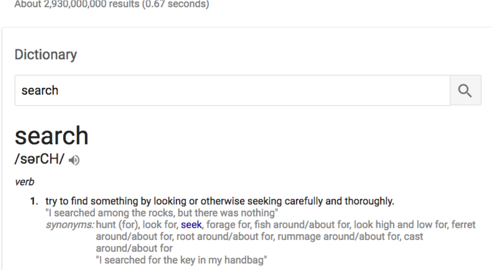
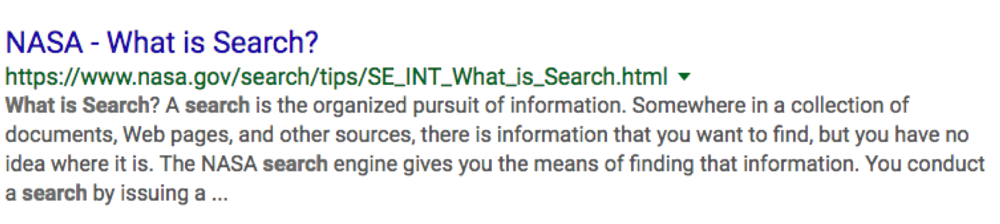
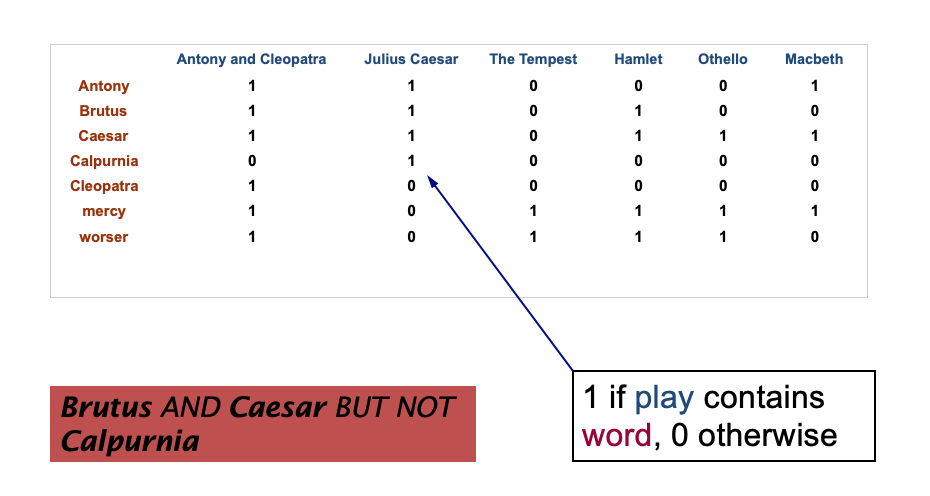

# Search Introduction
---

## Section Objectives

  * Understand Information Retrieval Concepts
  * Understand Inverted Indexes
  * Build An Index

---

# IR Overview
---

## Information Retrieval

* **Search** is about **Information Retrieval** (IR)
* **IR** is 
  - finding material (usually documents) 
  - of an unstructured nature (usually text) 
  - that satisfies an information need 
  - from within large collections (usually stored on computers)" 
  - P. Nayak, Stanford University

Notes:

---

## Character of IR

* IR returns relevant information
* Usually, it comes from unstructured data

<!-- {"left" : 1.02, "top" : 2.56, "height" : 4.52, "width" : 8.21} -->

Notes:

---

## Information Retrieval

* These days, we frequently think first of web search, but there are many other cases:

* E-mail search

* Searching your laptop

* Corporate knowledge bases

* Legal information retrieval

Notes:

---

## How is IR different from SQL?

<!-- {"left" : 5.99, "top" : 1.02, "height" : 2.76, "width" : 4.13} -->

* IR returns relevant information
* Usually it is ranked by relevance
  - Such as "What do we have related to this case"
* By contrast, SQL returns ALL of the data
* `SELECT * FROM * MY_BOOKS`

Notes:

---

## Unstructured (text) vs. structured (database) data in the mid-nineties

 <!-- {"left" : 0.3, "top" : 1.95, "height" : 5.16, "width" : 9.66} -->

Notes:

Mostly structured data in those days.

---

## Unstructured (text) vs. structured (database) data today

 <!-- {"left" : 0.3, "top" : 1.95, "height" : 5.16, "width" : 9.66} -->

Notes:

To the surprise of many, the search box has become the preferred method of information access.
Customers ask: Why can't I search my database in the same way?

---

## IR vs. databases: 

 * IR vs. databases:Structured vs unstructured data

 * Structured data tends to refer to information in "tables"

| Employee | Manager | Salary |
|----------|---------|--------|
| Chang    | Kerzner | 50000  |
| LeBron   | Kumar   | 100000 |
| Rajabi   | Kerzner | 50000  |

<!-- {"left" : 0.25, "top" : 2.01, "height" : 2, "width" : 9.75, "columnwidth" : [3.25, 3.25, 3.25]} -->

 * Typically allows numerical range and exact match

 * (for text) queries, e.g.,

  -   *Salary < 60000 AND Manager = Smith* .

Notes:

---

## Unstructured data

 * Typically refers to free text

 * Allows

     - Keyword queries including operators

     - More sophisticated "concept" queries e.g.,

        * find all web pages dealing with  *drug abuse*

 * Classic model for searching text documents

Notes:

---

## Semi-structured data

 * In fact almost no data is "unstructured"

 * E.g., this slide has distinctly identified zones such as the  *Title*  and  *Bullets*

     -  ... to say nothing of linguistic structure

 * Facilitates "semi-structured" search such as

     -  *Title*  contains data AND  *Bullets*  contain search

 * Or even

     -  *Title* is about Object-Oriented Programming AND  *Author*  something like `stro*rup`

     - where `*` is the wild-card operator

Notes:

---

## Basic assumptions of Information Retrieval

 * Collection: A set of documents

     - Assume it is a static collection for the moment

 * Goal: Retrieve documents with information that is relevant to the user's information need and helps the user complete a task

Notes:

---

## The Classic search model

 <!-- {"left" : 0.93, "top" : 1.93, "height" : 5.2, "width" : 8.4} -->

Notes:

---

## How good are the retrieved docs?

 *  *Precision:* Fraction of retrieved docs that are relevant to the user's information need

 *  *Recall:* Fraction of relevant docs in collection that are retrieved

     - More precise definitions and measurements to follow later

Notes:

---

## NASA – a Case in Point

<!-- {"left" : 0.39, "top" : 1.41, "height" : 2.12, "width" : 9.46} -->

* NASA employs 50,000 engineers
* Some people leave, new people come
* NASA made search a central point of new employee orientation
  - (We taught them search with a few years back)
* Now new engineers can search for the exact manuals the need to start with

Notes:

---

## Term-Document Matrices

 * Term-document incidence matrices

 <!-- {"left" : 1.02, "top" : 2.34, "height" : 4.38, "width" : 8.21} -->

Notes:

---

## Unstructured data in 1620

 * Which plays of Shakespeare contain the words  **Brutus**   *AND*   **Caesar**   but  *NOT*   **Calpurnia** ?
 * One could grep all of Shakespeare's plays for  **Brutus**  and  **Caesar,**  then strip out lines containing  **Calpurnia** ?
 * Why is that not the answer?
     - Slow (for large corpora)
     -  *NOT*   **Calpurnia**  is non-trivial
     - Other operations (e.g., find the word  **Romans near countrymen** ) not feasible
     - Ranked retrieval (best documents to return)

Notes:

Grep is line-oriented; IR is document oriented.

---

## Term-document incidence matrices

 * 1 if play contains word, 0 otherwise

 *  **Brutus**   *AND*   **Caesar**   *BUT*   *NOT*   **Calpurnia**

Notes:

---

## Incidence vectors

 * So we have a 0/1 vector for each term.

 * To answer query: take the vectors for  **Brutus, Caesar**  and  **Calpurnia**  (complemented) -> bitwise  *AND*.

     - 110100  *AND*

     - 110111  *AND*

     - 101111=

     -  **100100**

 

Notes:

---

## Answers to query

 <!-- {"left" : 7.79, "top" : 1.05, "height" : 2.93, "width" : 2.3} -->

  * Antony and Cleopatra, Act III, Scene ii

  *  *Agrippa* [Aside to DOMITIUS ENOBARBUS]: Why, Enobarbus,

  * When Antony found Julius **Caesar** dead,

  * He cried almost to roaring; and he wept

  * When at Philippi he found **Brutus** slain.

  * Hamlet, Act III, Scene ii

  * *Lord Polonius:* I did enact Julius **Caesar** I was killed i' the

  * Capitol; **Brutus** killed me.

Notes:

Wikimedia commons picture of Shake

---

## Bigger collections

 * Consider *N* = 1 million documents, each with about 1000 words.

 * Avg 6 bytes/word including spaces/punctuation

     - 6GB of data in the documents.

 * Say there are *M* = 500K  *distinct*  terms among these.

Notes:

---

## Can't build the matrix

 * 500K x 1M matrix has half-a-trillion 0's and 1's.

 * But it has no more than one billion 1's. **WHY??**

     - matrix is extremely sparse.

 * What's a better representation?

     - We only record the 1 positions.

 * Why?

Notes:

---
# Inverted Index

[Inverted Index](./InvertedIndex.md)

---
# IR Metrics

[IR Metrics](./IR-Metrics.md)
