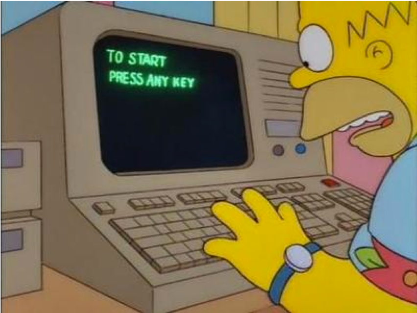
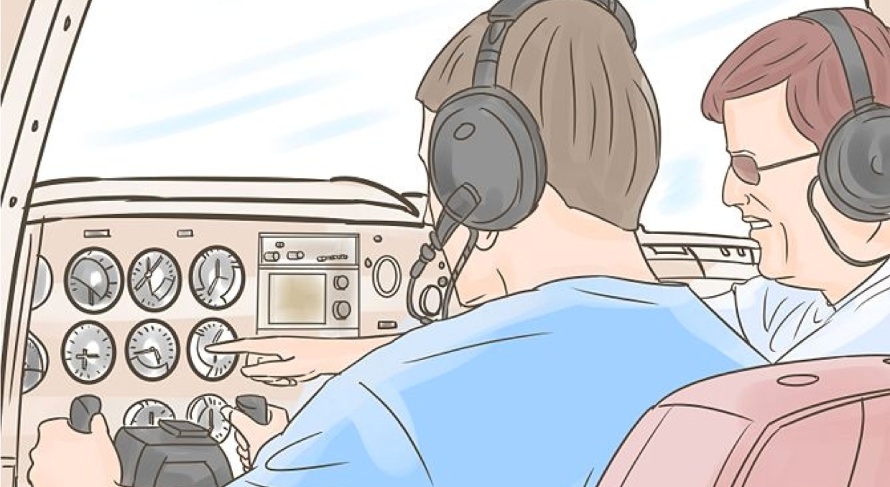
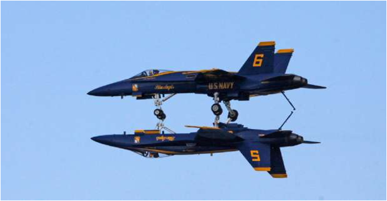
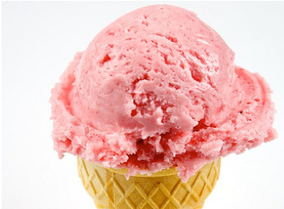

Secure Coding
======

## Agenda - 3 days

| Day | Theme                | Detail                                                                                                |
|-----|----------------------|-------------------------------------------------------------------------------------------------------|
| 1   | Introducing Security | Intro * Threat modeling * Common attacks * Countermeasures * Secure design                                                          |
| 2   | Secure Coding        | Java Security * JavaScript Security * REST endpoint security * Authentication and Authorization (OAuth) * Session security                                   |
| 3   | Secure Frameworks    | Modern security frameworks (Vault and Consul) *  Framework architecture  * Securing the runtime environment * Security future |

Notes: 

---

## Pre-requisites and Expectations

 * Basic coding knowledge is assumed

 * Have a coding development environment

     - We will set this up in class
     
     - Or on the cloud

 * Curiosity!

   - Ask a lot of questions 

 * This is a Secure Coding class
   - No previous knowledge is assumed (but may be helpful) 
   - Class will be based on the pace of majority of the students

Notes: 

---

## Our Teaching Philosophy

 * Emphasis on concepts & fundamentals

 * API - no need to learn anything by heart

 * Highly interactive (questions and discussions are welcome)

 * Hands-on (learn by doing)

Notes: 

---

## Lots of Labs: Learn By Doing

 * Where is the ANY key?

 <!-- {"left" : 1.63, "top" : 2.83, "height" : 4.26, "width" : 5.29} -->

Notes: 

---

## Analogy: Learning To Fly...

  <!-- {"left" : 0.26, "top" : 0.9, "height" : 6.17, "width" : 9.74} -->

Notes: 

---

## Instruction

  <!-- {"left" : 0.26, "top" : 0.9, "height" : 6.17, "width" : 9.74} -->

Notes: 

http://aviation-schools.regionaldirectory.us/learn-to-fly-720.jpg

---

## + Flight Time

  <!-- {"left" : 0.26, "top" : 0.9, "height" : 6.17, "width" : 9.74} -->

Notes: 

http://www.wikihow.com/Become-a-Certified-Flight-Instructor

---

## This Will Take A Lot Of Practice 

  <!-- {"left" : 0.26, "top" : 0.9, "height" : 6.17, "width" : 9.74} -->

Notes: 

---

## Your class!

* Yes, this is your class. What does this mean? You define the value.
* What is the most important ingredient of class – your participation!
* Your feedback and questions are always welcomed.
* There is no protocol in class. Speak up anytime!
* We value your comments during and after class. Just email `mark@elephantscale.com`.

---

## About You And Me

 * About Instructor

 * About you

     - Your Name

     - Your background (developer, admin, manager, ...)

     - Technologies you are familiar with

     - Familiarity with security? (scale of 1 – 4:  1 – new,   4 – expert)

     - Something non-technical about you!(favorite ice cream flavor or hobby...)

  <!-- {"left" : 0.67, "top" : 5.51, "height" : 1.73, "width" : 2.33} -->

   <!-- {"left" : 3.60, "top" : 5.51, "height" : 1.73, "width" : 2.33} -->
 

Notes: 

---

