# Introduction to OAuth2 in JavaScript

# Basics

---


## What Is It

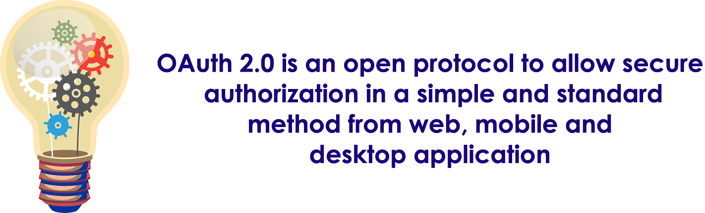 <!-- {"left" : 0.8, "top" : 2.44, "height" : 2.62, "width" : 8.65} -->


---


## Application

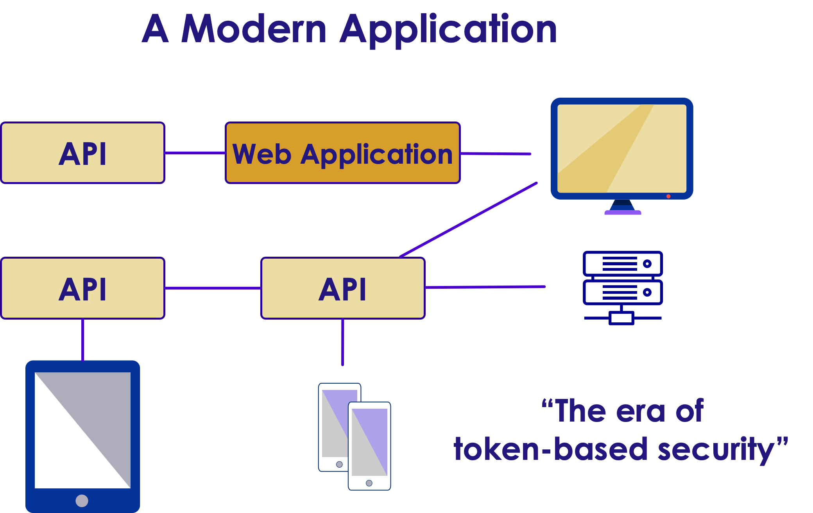 <!-- {"left" : 0.95, "top" : 1.11, "height" : 5.27, "width" : 8.35} -->


---


## Typical Payload of OAuth2 Access Token

```javascript
{
  "client_id": "tripgalleryimplicit",
  "scope":"gallerymanagement",
  "sub":"b05d3546-6ca8-4d32-b95c-77e94d705ddf",
  "amr":"password",
  "auth_time":"1437400047",
  "idp":"idsrv",
  "iss":"https://elephantscale/identity",
  "aud":"https://elephantscale/identity/resources",
  "exp":1437403647,
  "nbf":1437403647

}
```
<!-- {"left" : 0, "top" : 1.15, "height" : 3.94, "width" : 10.05} -->

---


## Defining OAuth 2.0
* Is not an authentication method
* Is an authorization method
* Standard is silent about the user
* RFC6749

---


## Actors

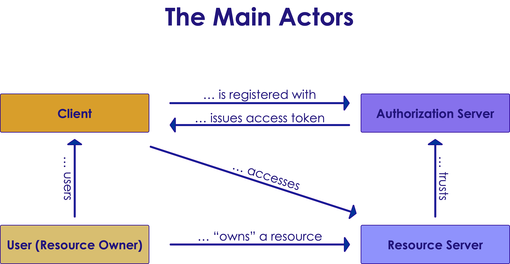 <!-- {"left" : 0.66, "top" : 1.44, "height" : 4.62, "width" : 8.93} -->
## Simple Questions
* Different types of applications require different means to achieve authorization
* Where can the token be delivered to?
* Can the client application safely store secrets?

---


## Making Decision
* How can you safely achieve authorization?
* By answering to this question choose your type of application you are building:
    - Client Credentials
    - Implicit
    - Authorization Code
    - Resource Owner Password Credentials
    - Device Code


---


## Clients
* Confidential clients: 
   -  Clients that can maintain the confidentiality of their credentials
   - Example: web applications
* Public clients:
   -  Clients that cannot maintain the confidentiality of their credentials

---


## Client Examples
* JavaScript clients
    - Native apps
      - iOS
      - Android
      - Windows Phone apps built in a   native or compile to native language
    - User-Agent based apps
    - JavaScript apps


---


## Endpoints: On Authorization Server
  - Authorization endpoint
    - Used by the client to get authorization the owner of resource through user-agent redirection
  - Token endpoint
    - Client uses this token to exchange an authorization grant for an access tokent usualy with client authentication

---


## Endpoints: On Client

* On client

  - Redirection endpoint
    - Authorization server uses it to return responses containing authorization credentials to the client through resource owner user=agent


---


## What About Authorization server?
* We don't have to implement Authorization server
  - Identity server 
    - For example: @leastprivilege and @brockallen Implement OAuth 2.0 and OpenID Connect

---


# Authorizing Access To API

---


## Client Credentials Flow
* Machine to machine communication
  - No human or username and password involved
  - Can be used to get access token using client credentials
* Is used only by  confidential clients
  - A public client doesn't safely store the client secret


---


## Flow In A Picture

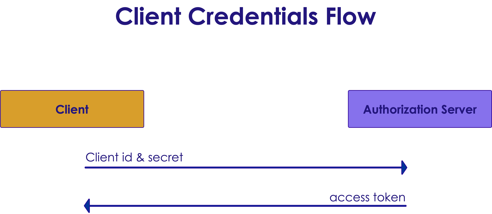 <!-- {"left" : 0.33, "top" : 1.66, "height" : 4.18, "width" : 9.6} -->


---


## How About Angular?

* Question: Can we use client credential for our Angular applications?

* Answer: Yes but __It is not safe__
* It's like to lock the door but leave the key on it 


---


## Implicit Flow 
* For public clients at predefined redirection URI and also might used by confidential clients (JavaScript or Angular apps)

* To obtain access tokens not refresh tokens

* No client authentication because a public user cannot store the secret safely


---


## Implicit Flow In A Picture
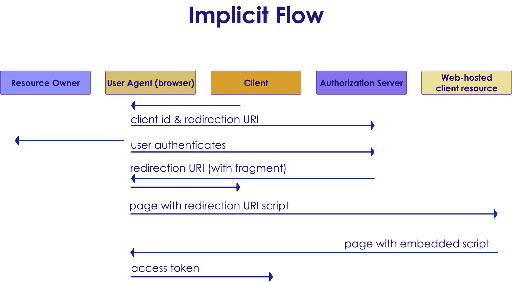 <!-- {"left" : 0.84, "top" : 1.4, "height" : 4.71, "width" : 8.56} -->


---


## Authorization Code Flow
* Optimized for confidential and public clients
* To get access and refresh tokens
* Includes a client authentication step


---


## Authorization Code Flow In A Picture
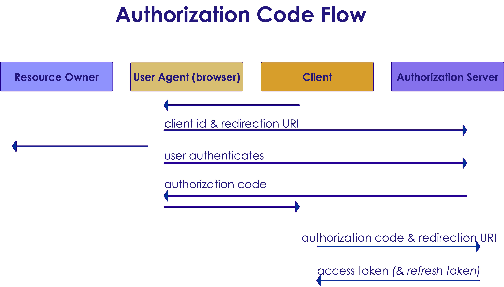 <!-- {"left" : 0.92, "top" : 1.35, "height" : 4.79, "width" : 8.41} -->


---


## Resource Owner Password Credentials Flow 
* Client has to be able to obtain the resource owner's credentials (for example via in-app login screen)
* Just for trusted applications
* Is used to obtain access and refresh tokens 
* Inludes a client authentication step
* High risk in compared to other flows so it is the last choice


---


## Flow In A Picture
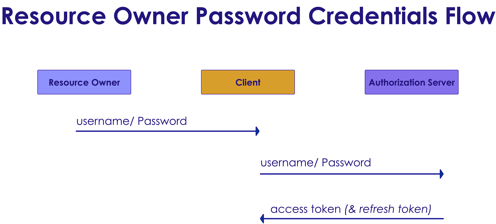 <!-- {"left" : 0.71, "top" : 1.75, "height" : 3.99, "width" : 8.83} -->

---


## Device Code Flow
* Between devices that have Internet connection but not browser
* Flow between smart TVs, media consols, etc.

---


## Device Code Flow In A Picture
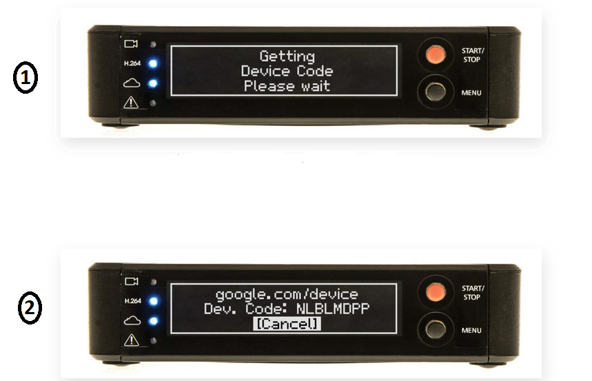

---


## Angular And Cross-Origin Resource Sharing
* Browsers prevent the web page from making AJAX requests to another domain
* `Cross-Origin Resource Sharing (CORS)` is `W3C` standard
* Allows server to relax the same origin policy

---


## Example:
 - Origin: http://elephantscale.com
 - Different domain: http://elephantscale.org
 - Different port: http://elephantscale.com:2546
 - Different scheme: https://elephantscale.com
 - Different subdomain: http://www.elephantscale.com

---


# OpenID Connect

---


## Problem?

* OAuth 2 has to do with authorization
* How can we can handle authentication?
* How can we get information regarding identity

Solution: OpenID Connect


---


## OpenID Connect

* A simple identity layer on the OAuth 2 protocol

* Core functionality:
    - Authentication
    - Claims about the user


---


## How It Works?
* New type of token : ID token
* Example: A typical ID token:

```javascript
{
  "sub": "b05d3546-6ca8-4d32-b95c-77e94d705ddf",
  "amr":"password",
  "auth_time":"1437400047",
  "idp":"idsrv",
  "given_name": "Jack",
  "family_name": "Brown",
  "iss":"https://elephantscale/identity",
  "aud":"https://elephantscale",
  "exp":1443101047,
  "nbf":1443101047

}
```


---


## OpenID Connect token
* `id_token` contains claims about the authentication of an end user (and other requested claims)
* `id_token` can be used for signing in to an application
* Access tokens are for accessing resources

* `UserInfo` endpoint:
 - Can be used by the client to get more user information of the authenticated user
 - These claims are requested with the `access_token`


---


 ## OpenID Connect Flow

Extends authorization code of OAuth 2 and implicit flow

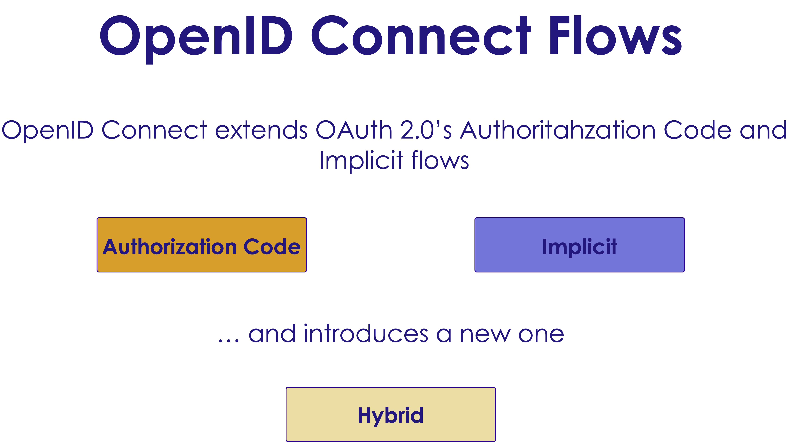 <!-- {"left" : 1.11, "top" : 2, "height" : 4.5, "width" : 8.03} -->

---


## Scopes And Claims 
* OpenID Connect adds `identity` scopes to `OAuth 2.0` resource scopes

* Example:
    - profile scope:
        - name
        - family-name
        - middle-name
        - ...

## Scopes And Claims, cont'd

* Email and phone
    - email scope:
        - email
        - verified-email
    - phone scope:
        - phone-num
        - verified-num

---

# OpenID Connect On Clients

---


## Choosing The Right Flow

* Depends on the `response_type` is requested
* Authorization code: Confidential clients
* Implicit: Public clients
* Hybrid: Confidential or public clients if you send auth code to the server not user agent


---


## Helper Components

* Helper components for `JavaScript`:
    - `oidc` client
    - `oidc` token manager
    ```bash
    https://github.com/IdentityModel/oidc-client
    https://github.com/IdentityModel/oidc-token-manager
    ```


---


# Impersonating The User


---


## A Bit API Level
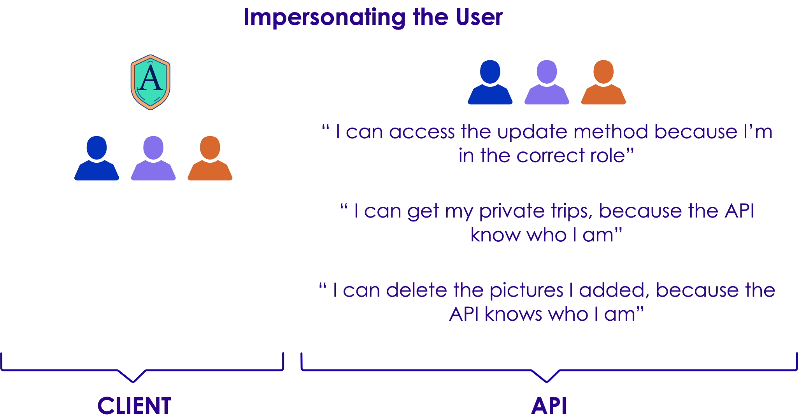  <!-- {"left" : 0.94, "top" : 1.55, "height" : 4.4, "width" : 8.37} -->


---


## Role-Based Authentication
* We are not authorizing access to actions depending on the user (Because of functional requirements)
* We can add additional claims in the acces token and use them for authorization 
 - A role claim is an example, and allows role-based authorization


---


# Credentials

---


## Diagram
 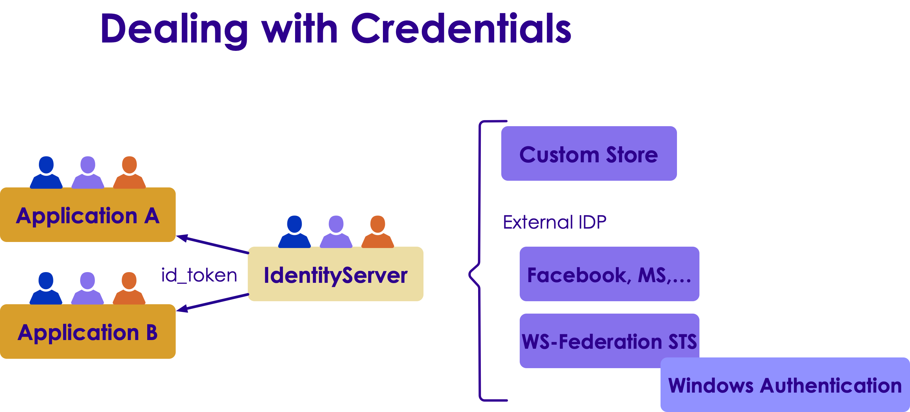  <!-- {"left" : 0.47, "top" : 1.64, "height" : 4.23, "width" : 9.32} -->


---


## Two-Factor Authentication
* 2FA provides identification of users by means of the combination of two different components
* Something you know, something you posses, something that's inseparable from you

* Not all applications might require 2FA
* Use `acr_values` parameter (to authorization endpoint)

 

---


## Additional Resources
* Entity Framework Persistence Layer
```bash
https://github.com/IdentityServer/IdentityServer3.EntityFramework
```

* Identity Manager
```bash
https://github.com/IdentityManager/IdentityManager
```


---


