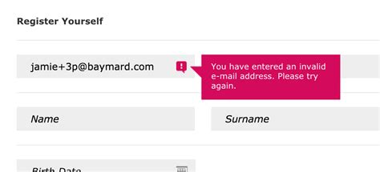
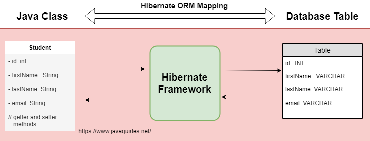

# Counter Measures

---

## Counter measures covered in this module

- Validation and Validation Control
- Strong Typing
- Regular Expressions
- White Listing and Black Listing
- Encoding and Scrubbing 
- Captchas
- Honey Pots
- SQL Injection Prevention
- CSRF Prevention

---

## Input Validation

- Used to ensure only properly formed and correct data enters into a system
- Used to identify and reject malformed inputs that could be part of an attack
  - Like an XSS or SQL injection
- Validation should be done as soon as possible after the data is acquired
- All data from untrusted sources should be validated
  - Any external source of data could be compromised by an attack 
  - Compromised sources could be vectors for attacks
  - Vendors, suppliers, information feeds, etc
- Most effective when validation is used along with other prevention methods
---

## Types of Validation

- Syntactic validation
  - Ensures all data has the right shape and syntax, for example:
  - Phone numbers have just digits, dates have valid formats
  - SSN have the correct number of digits
  - email addresses have a '@' character but not as the first or last char
- Semantic validation
  - Ensures the data is correct in the context it is used
  - Eg. Start dates occur before end dates
  - Prices are not negative
  - Values do not exceed minimum and maximum allowed

---

## Validators

- There are a number of validation libraries available
  - Apache Commons Validators for example
  - Programming languages and frameworks like Angular provide validation libraries
- For structured data like JSon and XML
  - We need to validate that the structure of the data is correct
  - Schemas are used to describe the valid structure of the data
  - Libraries are available that validate JSon and XML against schemas
- For small lists of possible values, like days of the week
  - Validation should be done against using an array of correct values
- Ensure that the inputs are of the right type
  - They often have to be converted from string input
  - Ensure that failed conversions cause the input to be rejected
---
## Validation Block and Allow

- Use allow lists for:
  - Data that must be well-formed (SSN for example)
  - Data that has a limited number of correct values - names of countries
  - Only inputs that strictly match are allowed, everything else is blocked
- Trying to use a block list to prevent certain characters or strings doesn't work
  - These are too easy to avoid by attackers
  - Require massive amounts of upkeep
  - Prone to block unusual but valid data
---

## Syntactic versus Semantic Validation

- Consider an email address `hacker@evil.com`
- Syntactic validation means that checking that it looks like a valid email
- Semantic validation checks
  - Is it a real email address?
  - Is it the email address of the person who provided it?
- Semantic validation could be done by
  - Sending a confirmation email to the address provided
  - Contains a link for the user to visit to validate that it's their email
---

## Validation Controls


- Validation controls are fields that validate user input as it is entered
- Invalid input is not sent to the server
- Eg. If an email address is a required field
  - An email validation control will only accept syntactically valid email addresses
  - Data will not be sent to the server until an email address is entered

Notes:

Image Credit: baymard.com/blog/adaptive-validation-error-messages

---
## Client versus Server Validation
- Validation controls are client side controls
- Many web frameworks and tools provide validation libraries that can be used for validation on controls
- Client side validation can be bypassed
  - Should not be the only validation done
- Validation should also be duplicated on the server
  - Ensures client side validation is not compromised
  - Also ensures data was not altered in transit
---

## Strong Typing

- Strong typing validation ensures that inputs are the correct data type
- The allow list validation mentioned earlier is strong typing
  - If the input is on the list of month names, it is not of type "month"
- Data sent to web applications is textual
- Strong typing ensures that the text actually represents the correct type of value
  - Eg. If the data is supposed to be an integer, "12r4" will be rejected 
  - It cannot be the required type and may have been supplied maliciously
- JavaScript does not have types
  - TypeScript was developed to add types to JavaScript
  - Designed to support strong typing as a security feature
---

## Regular Expressions

- Regular expressions are used to identify patterns in strings
- For example, the following regex expression will reject any username that:
  - Contains non-alphameric characters or
  - Is of length 0 or greater than length 20

```regexp
    RegEx_match("[a-zA-Z0-9]{1,20}", user_input):
```

- The following regex expression will match only any 7 or 10 digit US zip code with either a space or hyphen

```regexp
    ^\d{5}(?:[-\s]\d{4})?$
```
- Using regular expressions can be used to create powerful validation filters

---

## Regular Expression Caveats

- Regular expressions can be very difficult to write
- Poorly written regular expressions:
  - May exclude valid input
  - Eg. The zip code regular expression only looked for hyphens and not spaces in the 10 digit format
  - May be overly general and allow malformed input
- Poorly designed regular expressions may cause massive explosions in execution time
  - This can happen with nested regex patterns applied to invalid input
  - Referred to as _catastrophic backtracking_
---
## Regular Expression Best Practices

- The most effective way to avoid problems with writing regular expressions is to use existing expression libraries
- These can then be customized as needed
  - https://www.regexlib.com, 
  - https://www.thefreecountry.com/sourcecode/regular-expression-libraries.shtml
- All regular expressions should be fully tested before being deployed
  - Even if they come from a library
  - Third party regular expressions may contain deliberate weakness inserted by attackers
- There are also online regex testing tools
  - Eg. https://www.regextester.com/
---

## White and Black Listing

- Complementary ways of allowing access to systems and resources
- Black List or Deny List - a list of entities that are blocked from using resources
  - Allows access to any entity that is not on the black list
  - Often used for websites open to the public but which need to block malware
- White List or Allow List - list of entities that are allowed to use resources
  - Denies access to any entity that is not on the white list
  - Often used for websites designed for a specific population of entities
  - For example, employees, bank customers, etc

---

## Black Listing

- Often called "allow all except for the following"
- A blacklist identifies suspicious or malicious entities that should be denied access
  - Eg. Known hacker or malware sites, IPs, MAC addresses or domains or geolocation, like North Korea
- Can be applied to any aspect of a network
  - Can be used to block access to specific parts of the system or certain resources
- Used for email services
  - Allow all email through except those that originate from known malware sources
- Can also take the form of rules
  - "Block all email that contains the words _hair loss_"
  - "Block any email that has a zip file attachment"
---

## Black Listing

- Black lists are  _threat centric_
- They block known or potential threats
- Everything is trusted until shown to be otherwise
- Often uses lists of bad actors maintained by network security organizations
- The primary black list weakness is that new or unknown threats are not identified
- However, black lists are easy to deploy and requires minimal maintenance
- Black lists are very useful for protecting using public facing sites and applications
  - Eg. Government Covid information sites

---
## White Listing

- White lists are _entity centric_
- They allow access only to known and trusted entities
- Each entity may be whitelisted for different parts of the system
  - For example, only users from admin IP addresses may alter account passwords
- Access is denied to all except for those on the whitelist
- Firewalls are an example of a whitelist
  - Can be configured to only allow access through specified ports to specific domains or IP ranges

---
  
## AWS Security Group


 

- Example of a white list rule - allows access on port 22 ONLY from the IP address 192.168.1.1

---

## White Listing

- Much more secure that black listing
- Requires more configuration and work to set up and support
- May require re-configuration if changes to the system are made
- Many automated tools exist to support white list administration
- These are often built into applications like databases and webservers
- The default is to deny everything
  - Then add white list entries

---

## White and Black Listing

- Often used together
- For example
  - A white list could allow only users from the US
  - Then a black list could be used to filter out US entities that are threats
- The order in which this is done in important
- The order in which applications, like Apache, execute the rules has to be configured
- NIST has published a Guide to Application White listing
- https://nvlpubs.nist.gov/nistpubs/SpecialPublications/NIST.SP.800-167.pdf

---

## Grey Lists

- When using black lists, entities not on the black list may appear suspicious
  - Often flagged because of some sort of pattern, like red flagged key words in content
  - Or the originating domain may be known to have been hacked
- The suspect inputs or emails are flagged as suspicious and held for review
  - Usually held in a holding area or sandbox until they are allowed in or black listed
- This sort of analysis can be used to increase the effectiveness of black lists

---

##  Encoding

- Encoding refers to replacing special characters in HTML, JavaScript and CSS with special codes
- XSS and other attacks rely on being able to inject malicious text into the application
  - The injected text can contain HTML, JavaScript or CSS code
  - This injected text is then "executed" by the browser
- Encoded HTML, JAvaScript or CSS text is not recognized by the browser as executable code
  - It is treated just like plain text
---

## HTML Encoding

- HTML encoding replaces HTML special characters with a standard canonical sequences of characters
  - This forces HTML to be treated as raw text and NOT as executable markup by the browser
  - For example "<" is encoded as "\&lt;"
- In the persistent XSS example, the injected payload was
```html
Well thought out essay, loved it!!
<script>http://attackerwebsite.com/maliciousscript.js</script>
```
- After HTML encoding, it is looks like
```
Well thought out essay, loved it!!
&lt;script&gt;http://attackerwebsite.com/maliciousscript.js&lt;/script&gt;
```

- The encoded HTML is plain text, but it can be decoded back to HTML if necessary
---

## Attribute Encoding

- HTML Attributes can also be targets for injections
- All attributes that can be set dynamically should be HTML encoded
- However, attributes are parsed differently than element content
- Attribute encoding uses a subset of the characters replaced in HTML encoding
- There are many libraries available for HTML encoding
  - Attributes should be encoded and decoded using library functions specifically designed for attributes

---

## Scrubbing

- All untrusted content should be scrubbed or sanitized
- If some HTML markup is allowed in untrusted input, sanitizing removes all the illegal input
- For example, a comment section for a blog allows `<b>`, `<i>` and `<hr>` tags
- The uploaded HTML is
```html
    <b>Well thought out essay, loved it!!</b>
    <script>http://attackerwebsite.com/maliciousscript.js</script>
```
- The sanitized version is
```html
    <b>Well thought out essay, loved it!!</b>
```
- Any untrusted content included in HTTP responses should be sanitized to prevent XSS reflection attacks
---

## Sanitizing Libraries

- There are multiple libraries that can be used for code sanitization
- Some standard libraries are:
- HTML sanitizer from _Google Closure Library_ (JavaScript/Node.js, docs)
  - https://developers.google.com/closure/library/
- DOMPurify (JavaScript, requires jsdom for Node.js)
  - https://github.com/cure53/DOMPurify
- PHP HTML Purifier
  - http://htmlpurifier.org/
- Python Bleach
  - https://pypi.org/project/bleach/
  

---

## Captchas


- Stands for _Completely Automated Public Turing test to tell Computers and Humans Apart_
- Many spam and malware attacks are automated
- Captchas are intended to differentiate between humans and bots
- Originally used warped random text that only humans could read
  - 2014 Google ML study humans could solve Captchas with 33% accuracy but ML bots ahd 99.8% accuracy

Notes:

Image Credit: www.cyberunit.com/blog/the-evolution-of-captchas-for-online-security

---

## Image Capchas


- Next evolution was the use of image captcha
- However, image recognition programs start to outperform humans

Notes:

Image Credit: www.cyberunit.com/blog/the-evolution-of-captchas-for-online-security

---
## Behavioral Captchas

- Current captchas run in the background and monitor input for non-human characteristics
  - eg. Repeated entry of data into an input field or inhumanly fast keystrokes
- If the monitored behavior is "bot like," the user may be asked to authenticate themselves
  - For example, 2FA where users must supply a code texted to their phone
- Current concerns are that bots may be able to emulate non-bot like behavior in the future
- One approach is to set honey pots - items that are not visible on a page but are visible in the HTML code
  - Bots will interact with the invisible item, but humans will not

---

## Value of Captchas

- Captchas are countermeasures that block a number of bot attacks
- Blocking DDos Attacks where websites are flooded with automated requests
- Preventing spoofed signups and fake account creation
  - Bots are used to target free service signups to create thousands of accounts a minute
- Preventing email harvesting and web scraping
  - Bots look for email addresses and other data like phone numbers to create spam lists
- Blocking e-commerce bots that try to place fake orders
- Blocking bots from indexing webpages that should remain unindexed
- Preventing dictionary attacks where hundreds of attempts per second are made to log in
  - Bots try all possible passwords combinations for example.

---
## Honeypots
 - A honeypot is computer or system that mimics targets of cyberattacks
 - Honeypots provide attackers with targets
 - They are used to divert attacks away from actual targets like a decoy
   - Honeyposts either mask or are easier to get into than the actual targets
 - Honeypots are also used to collect information about attackers and the types of attacks that are in use
 - in 2015, a honeypot was set up mimicking a railway control system
   - It was in reality connected to a model train system
   - The honeypot was attacked 2.7 million times in a 2-week period
---
   
## Honeypots


Notes:

Image Credit: hackersenigma.com/honeypot-intrusion-detection-malware-analysis/

---
## Interaction Levels of Honeypots

- Attacks also occur from within a secure network (eg. trojans)
- Honeypots can be used to emulate internal resources to identify rogue activity
- Low interaction honeypots only emulate system or application activity
  - Detectable by sophisticated attackers with some analytic capability
  - Easy to set up and maintain inexpensively
- High interaction honeypots are often shadow or duplicate entire systems and applications
  - Much more difficult to detect by attackers
  - Much more difficult to set up and maintain, and more costly
---
## Honeynets


- A network of honeypots with servers, devices, databases, fake data
  - A fully functional shadow fake network
- Very effective since attackers get trapped in exploring the honeynet

Notes:
Image Credit: sectigostore.com/blog/what-is-a-honeypot-in-network-security-definition-types-uses/

---
## Internal Honeypots

- 75% of threats come from inside a system
- Can be initiated by trojans or other malware on an internal computer
- Or can be initiated by a bad actor, like a malicious employee
- Honeypots and honeynets can also be located on the internal network
- This identifies attacks originating from compromised machines inside the network
- Honeynets should be disabled before security testing or they will corrupt the results

---
## SQL Injection Prevention

- An SQL injection is similar to a XSS attack
- Fragments of SQL are inserted into fields that will be used in an SQL query
- For example, if a login page looks up a user in a database with this query constructed from the input string for user

```javascript
txtUserId = getRequestString("UserId");
txtSQL = "SELECT * FROM Users WHERE UserId = " + txtUserId;
```
-If the input to the user id is _105; DROP TABLE Suppliers_ then the query becomes

```SQL
SELECT * FROM Users WHERE UserId = 105; DROP TABLE Users;
```
- This would have the effect of deleting the table of users
- This is very dangerous if the attacker can infer the names of the tables in the database
---

## SQL Injection

- A common attack is to change the query to return different results
- Eg. The query for a user look-up is given as `105 OR 1=1`
- The resulting SQL query is

```sql
SELECT * FROM Users WHERE UserId = 105 OR 1=1; 
```
- Since "1=1" is always true, this will return all the rows of the Users table
- SQL injections are like XSS attacks in that the system does not check to see that the input data is actually an SQL fragment
- One common mitigation to an SQL injection is limit what characters are allowed in the data
  - Eg. Usernames are limited to numbers, underscores and alphabetic characters
  - Input is then rejected if it contains illegal characters like ";" 
---

## Parameterized Queries and Prepared Statements

- Prepared statements are a database feature to allow efficient execution of a repeated SQL command
- A statement template is created and sent to the database
- The statement has slots for variables identified by '?' below
  
```sql
    SELECT * FROM Users WHERE UserId = ?;
```
- The statement is compiled, optimized and stored by the database but not executed
- When executed, the application supplies values for the slots in the statement
```java
PreparedStatement stmt = conn.prepareStatement("SELECT * FROM Users WHERE name = ?"))
  String userName = request.getParameter("userID")
  // Additional check to ensure well formed userID input
  stmt.setString(1, userName );
  ResultSet rs = statement.executeQuery();
```
---

## Parameterized Queries and Prepared Statements

-A prepared statement breaks apart an SQL query into two phases
- The first phase is preparing the statement
  - Once the statement is compiled, the SQL is not used in calls to the statement
  - The compiled version is executed instead
- The second phase is the execution
  - The data is passed to the compiled query
  - There is no way for the data to alter the SQL used to prepare the query
  - SQL injection attacks may throw an SQL exception that needs to be caught
---
  
## SQL Injections and Stored Procedures

- Stored procedures are similar to prepared statements
- Major difference is that prepared statements must be re-compiled for each session
- Stored procedures can be compiled once and reused indefinitely
- Usually written in some PL/SQL but are stored in the database
- Each has its own use case and pros and cons
- However, to be a mitigation of SQL injection, stored procedures must be correctly constructed

---

## SQL Injections and Stored Procedures

- We assume that the stored procedure already exists in the database

```java

String custname = request.getParameter("customerName");
// validation logic to ensure a well formed customer name
  CallableStatement cs = connection.prepareCall("{call sp_getAccountBalance(?)}");
  cs.setString(1, custname);
  ResultSet results = cs.executeQuery();

```
- This offers a similar sort of SQL Injection mitigation as prepared statements
---

## Object Relational Mappings



- Many applications do not use SQL directly but use an entity framework to supply an object - relational mapping
- These are supplied through entity frameworks like Hibernate or Microsoft EF

---

## Entity Frameworks

- An entity framework turns an API call into an SQL query
- Relationships between the code objects and tables are kept in an XML mapping
```xml
<hibernate-mapping>
  <class name = "Employee" table = "EMPLOYEE">
    <id name = "id" type = "int" column = "id">
      <generator class="native"/>
    </id>
    <property name = "firstName" column = "first_name" type = "string"/>
  ...
  </class>
</hibernate-mapping> 
```
---

## Hibernate Query Language

- Queries are written in Hibernate Query Language (HQL) which is a lot like SQL
- It references program objects rather than the underlying tables
- The HQL queries are then translated into SQL
- Well-formed HQL queries with validated user input should not be vulnerable to SQL injection
- Poorly written code, like using positional parameters in HQL instead of named parameters, can allow raw SQL insertions

---

## Preventing CSRF

- Many modern browsers and tools have CSRF protections
- Many browsers support same-origin policy
- The origin of an HTTP request is 
  - The protocol, URL and port
  - Must be the same for multiple requests
- This is not fully implemented by all browsers
- Additional protection should be enforced
- Many web frameworks have build CSRF prevention capabilities 

---

## Synchronizer Token Pattern

- Every request from a client contains a secret, unique token for each request embedding in the HTML code
```html
<input type="hidden" name="csrfmiddlewaretoken" value="KbyUmhTLMpYj7CD2di7JKP1P3qmLlkPt" />
```
- Can create usability issues for the client as it enforces strict workflows
- Adds additional overhead to the server to compute and verify tokens
- A more secure form is to add the token to the HTTP header

---

## Double Submit Cookie

- Similar to Synchronizer Tokens but the token is not kept on the server
- A token is saved as a cookie and also in a hidden field on each form
- For each request, the cookie is checked to ensure it is the same as submitted token in the form
- A related countermeasure is to keep a copy of the token in the HTTP header

---

## Verifying Origin

- For each request, the Origin and/or Referrer headers are examined
- These can only be set by the browser
- If they are both missing, the request should be blocked
- These headers can be used to identify the source of the request
- If the origin of the request does not match the target, then the request is rejected
- Eg. A web banking site www.bank.com is the target
  - A request is received originating from www.evil.org
  - This is blocked
- The use of VPNs, proxies and firewalls can complicate this approach

---
