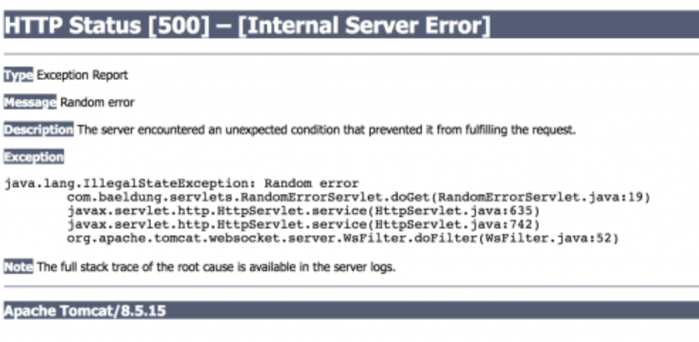
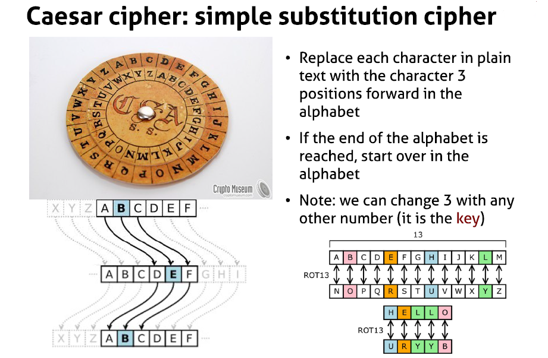
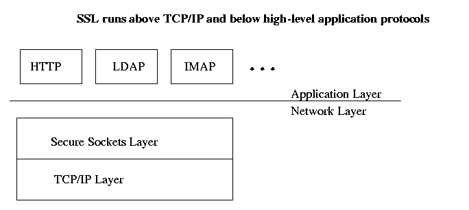
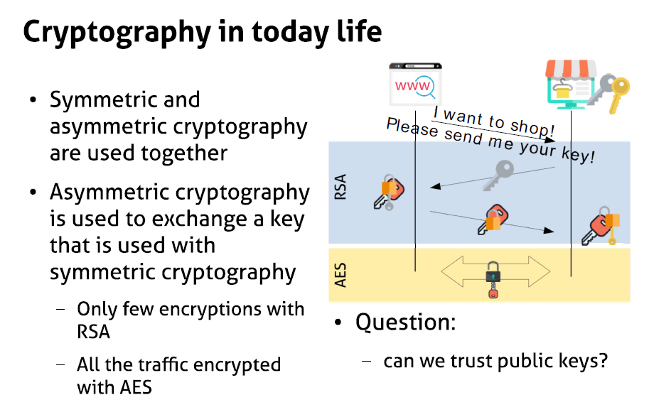
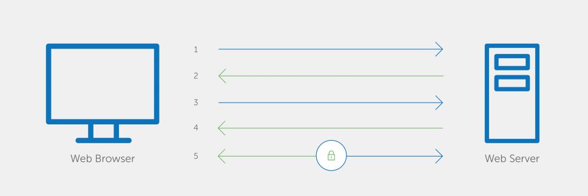
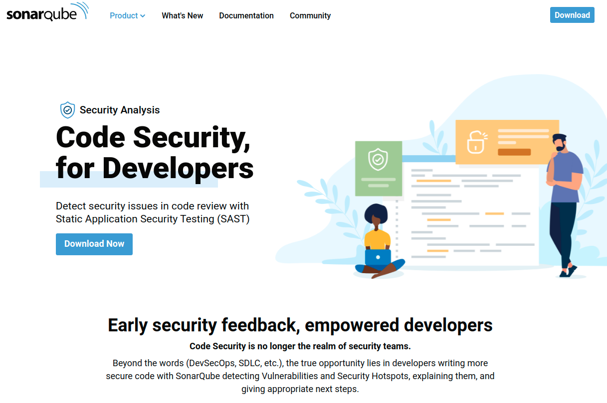
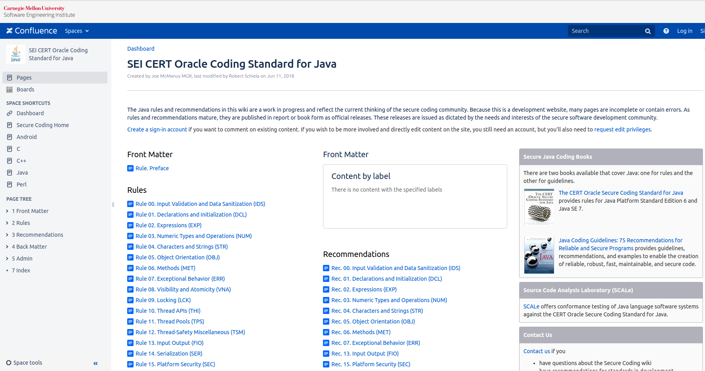

# Defensive programming

## What is it
* An approach to improve software and source code, in terms of:
  - general quality, reducing bugs
  - Making it comprehensible, or understandable
  - Predictable behavior against unexpected inputs or user actions

---

## Rules of defensive programming

* Rule 1: Never assume anything
* Rule 2: Use standards
* Rule 3: Code simple

---


# Rule 1: Never Assume Anything

---


## Input Validation
* User's input and actions are not trustable
* All input and actions must be validated
* Handle exceptions:
- Terminate
- Retry
- Warning

---


## Example
* Imagine a bank transaction and answer these questions:
- What kind of variable you need? int, float, string, etc
- Is it going to be a large or small number?
- Can it be a negative number?
- and other questions

---


## Testing Strategy
* Don't limit you testing process to "it works"
* Test error cases
* Test for the illogical input
- Strange ASCII character
- Rolling head
* Ask others to test the application if possible

---


## Order of Precedence
* Is the set order that statements are resolved
* Sometimes it's difficult to see errors in the order of precedence
- `if(InVar=getc(input)!=EOF)`
* When in doubt, use proper parenthesis

---


## Size of Variables
* Some primitive data types on different OSs or hardware platforms have different values
* You should consider the siza of variables when coding

---


# Rule 2: Use Standards


---


## Coding Standard

* Makes code coherent and easy to understand
* Debugging gets easier
* Wide range of topics
- Variable naming
- Indentation
- Position of brackets
- Content of header files
- Function declaration
- And many more


---


## Variable Naming: Hungarian Notation

* Is a Naming standard
* Starts with one or more lower-case letters that are mnemonics for the type or purpose of the variable:
- iAge: integer type age
- szName: zero-terminated name string


---


## Numbers

* Do not use constant values in the code
- Difficult to understand
- Difficult to maintain
- example: `int Fr = (4.3/1.25)*N;`
* Use constant variable instead
- `cons int PI = 3.1415`
- `int Surface = PI * r * r;`


---


# Rule 3: Code Simple


---


## Contract
* See functions as a contract
* Given input, the execute a specific task
* They should not able to do anything else rather than the specified task
* Exception handling

---


## Refactoring
* Is a technique for restructuring the code, changing its internal structure whithout any change in external behavior
* Does not fix the bugs
* Can be used for battling feature creep:
- Added features during coding
- Usually cause problems
* Keeps your application simple

---


## Third-Party Libraries
* Code reuse a safe choice
* More stable and secure than what you make in a limited time

---


# Error handling in Java EE

---


## A servlet structure

```Java
    @WebServlet(urlPatterns = "/randomError")
    public class RandomErrorServlet extends HttpServlet {
     
        @Override
        protected void doGet(
          HttpServletRequest req, 
          HttpServletResponse resp) {
            throw new IllegalStateException("Random error");
        }
    }
```

---


## Default Error Handling

* Let us deploy our servlet here
  - http://localhost:8080/javax-servlets
  
* Now, let us look at the error here
  - http://localhost:8080/javax-servlets/randomError
  
* What happens? We see the generic error


---


## Custom Error Handling

* Custom error handling 
   - Goes into web.xml file descriptor 
   
* Status code error handling
  - map HTTP error codes (client and server) to
    - a static HTML error page or 
    - an error handling servlet

* Exception type error handling
  - map exception types to 
    - static HTML error pages or 
    - an error handling servlet

---


## With an HTML Page

```Java
        <web-app xmlns:xsi="http://www.w3.org/2001/XMLSchema-instance"
          xmlns="http://java.sun.com/xml/ns/javaee"
          xsi:schemaLocation="http://java.sun.com/xml/ns/javaee 
            http://java.sun.com/xml/ns/javaee/web-app_3_1.xsd"
          version="3.1">
         
            <error-page>
                <error-code>404</error-code>
                <location>/error-404.html</location> <!-- /src/main/webapp/error-404.html-->
            </error-page>
        </web-app>
```

---


## With a Servlet       

* Handling policy for java.lang.Exception

```Java
        <web-app xmlns:xsi="http://www.w3.org/2001/XMLSchema-instance"
          xmlns="http://java.sun.com/xml/ns/javaee"
          xsi:schemaLocation="http://java.sun.com/xml/ns/javaee 
            http://java.sun.com/xml/ns/javaee/web-app_3_1.xsd"
          version="3.1">
            <error-page> 
                <exception-type>java.lang.Exception</exception-type> 
                <location>/errorHandler</location> 
            </error-page>
        </web-app>
```

---


# Type annotation 

---


## Type Annotations

* Annotations that can be placed anywhere you use a type

  - the new operator
  - type casts
  - implements clauses 
  - throws clauses

* Benefits
  - Improved analysis of Java
  - Stronger type checking

---


## Simple Type Annotations Examples

```Java
    @NotNull String str1 = ...
    @Email String str2 = ...
    @NotNull @NotBlank String str3 = ...
```    

* With constructors

```Java
        new @NonEmpty @Readonly List<String>(myNonEmptyStringSet)
```

* For exceptions

```Java
        void monitorTemperature() throws @Critical TemperatureException { ... }
        void authenticate() throws @Fatal @Logged AccessDeniedException { ... }
```
 
---


# Checker Framework

---


## Benefits of the Checker Framework

* Helps get rid of
  - null pointer exceptions
  - unintended side effects
  - SQL injections
  - concurrency errors
  - mistaken equality tests
  - other run-time errors 


---


## Installation

1. Download the Checker Framework distribution
2. Unzip it to create a checker-framework directory.
3. (Optional) Configure
  - IDE
  - build system
  - command shell to include the Checker Framework on the classpath

---


## Using The Checker Framework

```Java
    import org.checkerframework.checker.nullness.qual.*;
    
    public class GetStarted {
        void sample() {
            @NonNull Object ref = new Object();
        }
}
```

---


## Introduce an Error

```Java
    @NonNull Object ref = null;
```

* Get an error message

```Java
    GetStarted.java:5: incompatible types.
    found   : @Nullable <nulltype>
    required: @NonNull Object
            @NonNull Object ref = null;
    1 error
```

---


# Application-layer security

---


## The application layer
 
* A layer in the Open Systems Interconnection (OSI) seven-layer model
* And in the TCP/IP protocol suite
* Consists of protocols that focus on process-to-process communication 
 - across an IP network 
* Provides a firm communication interface and end-user services
* Security is provided through app-to-app negotiations

---


# Transport-layer security

---


## Transport-layer Security

* Cryptographic protocols 
* Designed to provide communications security 
* Over a computer network

---


## Where Transport-layer Security is Used

* Web browsing
* Email
* Instant messaging
* Voice over IP (VoIP)
* Websites use TLS 
  - To secure all communications 
    - servers 
    - web browsers

---


## Where Transport-layer Security is Used

* Aims
  - Privacy 
  - Data integrity

* Properties
  - The connection is private (or secure) 
  - Uses symmetric cryptography
     - to encrypt the data transmitted
     
  - The identity of the communicating parties can be authenticated 
    - using public-key cryptography
    
  - The connection is reliable
     - Each message transmitted includes a message integrity check
     - Uses a message authentication code 
     - Prevents undetected loss or alteration of the data

---


# Message-layer security

---


## Securing the message

* More flexible than TLS
  - parts of the message can be signed or encrypted
  - rather than the entire message
   
* intermediaries are able to view parts of the message intended for them

| Factor to Consider                                         | Transport Layer                                        | Message Layer                                                                                  |
|------------------------------------------------------------|--------------------------------------------------------|------------------------------------------------------------------------------------------------|
| Your application  interacts directly  with the Web service | Transport layer HTTPS provides full message protection | Message layer message protection usually requires more  work and overhead than transport layer |
|                                                            |                                                        |                                                                                                |

---


## Encryption
* The encryption mechanism is a digital coding system to preserve confidentiality and integrity of data
* Encoding plaintext data into a protected and unreadable format
 - Cipher: A standardized algorithm to transform original `plaintext` data into encrypted data (`ciphertext`) and vice versa
  - The cipher is publicly known
 - `Encryption Key` is used during the transformation
  - Usually secret and shared among authorized parties
* Decryption is the revers function

---


## Encryption, cont'd
* Protection against:
 - Traffic eavesdropping
 - Malicious intermediary
 - Insufficient authorization
 - Overlapping trust boundaries security threats
* Two types of encryption:
 - Symmetric (same key to encrypt and decrypt) 
 - Asymmetric (two keys,,one the inverse of the other)

---


## Symmetric Key Cryptography
* Make use of a number of classical encryption techniques
* Substitution
 - Each character in the text is replaced by another character of the same or different alphabet
* Transposition
 - The order, but not the value, of the characters in the text is changed
* Iteration of the same steps multiple times

---


## Example: An Old Technique


---


## Advantages Of Symmetric Cryptography

* It is understandable and easy to use
* It is efficient
 - Efficiency is a key consideration when messages are transmitted frequently and/or are lengthy
* Can be used for many other applications (hash functions, pseudo-random number generators, digital signatures)
* Can be easily combined

---


## Limitations 
* The users must share the same secret key
 - During transmission of the key, someone may intercept the key
* The number of keys requires increases at a rapid rate as the number of users in the network increases
* Because of these reasons, secret key management  challenges are significant
* A key distribution center (KDC) -a trusted third party- may be used for managing and distributing keys
* Secret key cryptography cannot provide an assurance of authentication
 - Problem of non-repudiation

---


## Asymmetric Cryptography
* A pair of private and public keys
* Private key remains with the owner; public key is distributed
 - This solves the key distribution problem encountered in the use of secret keys
 - One may own more than one keys pairs
* Knowledge of public key does not help in finding/deriving the related private key

---


## Asymmetric Cryptography, cont'd
* Keys are related and complementary
 - Plaintext encrypted with a private key can be decrypted using the related public key, and vice versa
* Public key encryption provides confidentiality, but does not offer integrity nor authenticity
 - This is the base for the digital signatures

---


## Asymmetric Encryption Cipher: RSA
* Created by Rivest, Shamir, and Adelman, named RSA
* Based on the notion that a product of two large prime numbers cannot be easily factored to determine the two prime numbers
 - That is, going from results (the product of prime numbers) to inputs (prime numbers) is a nearly impossible task
* Although a public key is related to private key, it is nearly impossible to calculate the private key using the knowledge of its related public key


---


## RSA Principles

* Consider blocks as large numbers
 - Example: 2048 bit long number ~617 decimal long nmber
* Uses the modular arithmetic (residuals)
 - Example: 73 = 70 + 3 = 14 * 5 + 3 >> 73 mod 5 = 3
* Encryption and decryption are based on the concept of modular inverses:
 - X is the inverse of Y modulo Z if X*Y=1 modulo Z
 - Then (m^x)^y = (m^y)^x = m^1 = m

---


## Advantages of Public Key Cryptography

* There is no need to communicate private key
 - Related public key is widely distributed (not secret)
* A sender who private-key encrypts the message or any part thereof can be authenticated because no one else is supposed to have the sender's private key
* External parties can confidentially communicate with an owner of the key pair by sending a message encrypted using the owner's public key
* A brute-force attack on a message is time consuming and is nearly impossible

---


## Limitations of Public Key Cryptography
* The use of PKC takes a significant amount of processing power, it is computationally intensive
 - Therefore, it negatively affects efficiency of communication
 - It is used selectively
 - An entire message may not be encrypted using PKC
* Published keys may be altered by someone
 - Additional measures to ensure that a valid public key of the owner is obtained before its use (PKI certificates)


---


# Secure connection with SSL


---


## What Is It?
* A protocol by Netscape
* On Layer 4 (TCP) of OSI model
## 


---


## Cryptography Today 



---


## What Is SSL
* Is a standard security technology for establishing an encrypted link between a server and a client typically a web server (website) and a browser, or a mail server and a mail client (e.g., Outlook).

---


## What Does It?
* Allows sensitive information like credit card information to be transmitted securely
* Determines variables of the encryption for both the link and the data being transmitted
* All browsers are able to interact with secured web servers using the SSL protocol
* Needs SSL certificates

---


## How?
* 1 - Browser connects to a web server (website) secured with SSL (https). Browser requests that the server identify itself.
* 2 - Server sends a copy of its SSL Certificate, including the server's public key.
* 3 - Browser checks the certificate root against a list of trusted CAs 

---


## How? cont'd
* Then it creates, encrypts, and sends back a symmetric session key using the server's public key.
* 4 - Server decrypts the symmetric session key using its private key and sends back an acknowledgement encrypted with the session key to start the encrypted session.
* 5 - Server and Browser now encrypt all transmitted data with the session key.


---


## Flow Picture



---

## Static code scanners

* Sonar Qube
* https://www.sonarqube.org/features/security/


---

## Labs

* SonarQube lab for static code analysis

[https://github.com/elephantscale/secure-coding-labs/tree/main/sonarqube](https://github.com/elephantscale/secure-coding-labs/tree/main/sonarqube)


## Labs

* Labs for this section come from this link
* [https://wiki.sei.cmu.edu/confluence/display/java/SEI+CERT+Oracle+Coding+Standard+for+Java](https://wiki.sei.cmu.edu/confluence/display/java/SEI+CERT+Oracle+Coding+Standard+for+Java)



---
