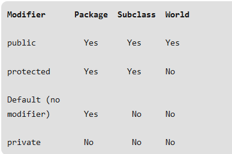
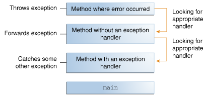

# Java Secure Coding

---

## What We Will Cover

 * Denial of Service (DoS)
 * Input Validation
 * Mutability
 * Variable Scopes
 * Thread Safety
 * Exception Handling
 * Role-Based Authentication

---


# Denial of Service (DoS)

## DoS Resources Attacked

* Affects Resources 
  - CPU
  - Memory
  - Disk Space
  - etc.

---

  
## DoS Examples

  - Requesting images with large size
  - Failure of Sanity checking of sizes by integer overflow errors
  - Memory allocation to an object graph much more than usual
  - Zip bombs: Huge decompressed file from a tiny zip file
  - Billion laughs attack: Growing XML documents dramatically during parsing

---


## DoS Examples, cont'd

  - Increasing executing cost for example from `O(n)` to `O(n^2)`
  - Exhibiting catastrophic backtracking by regular expression
  - Processor time may be consumed by XPath expressions
  - Infinite loops
  - and many more ...

---


## (DoS): Release Resources

A good sample pattern to extracting the paired acquire and release operations in Java SE 8:
```java
long sum = readFileBuffered(InputStream in -> {
            long current = 0;
            for (;;) {
                int b = in.read();
                if (b == -1) {
                    return current;
                }
                current += b;
            }
      });
```

---


## DoS: Integer Overflow
The following piece of code avoids overflow:
```java
 private void checkGrowBy(long extra) {
            if (extra < 0 || current > max - extra) {
                  throw new IllegalArgumentException();
            }
        }
```

---


# Input Validation

## Validate All Inputs
* Inpute Sources:
    - Method Arguments
    - External Streams
* If from untrusted sources, validate it

---


## Validate Output From Objects As Input

* Example: `Class` object returned by `ClassLoaders`
* ClassLoader instances which 
    - get passed as arguments 
    - or are set in `Thread` context can be controled by attacker
* So, don't make many assumptions when calling this method


---


## Define Wrappers Around Native Methods

* Java code unlike native methods is secure, so :
    - Do not make a native method public
    - Instead expose the functionality through a public java-based wrapper method
    - Example: Next slide


---


## Example of Wrapper

```java
public final class NativeMethWrap {

            // private native method
            private native void nativeOperation(byte[] data, int offset,
                                                int len);

            // wrapper method performs checks
            public void doOperation(byte[] data, int offset, int len) {
                // copy mutable input
                data = data.clone();

                // validate input
                // Note offset+len would be subject to integer overflow.
                // For instance if offset = 1 and len = Integer.MAX_VALUE,
                //   then offset+len == Integer.MIN_VALUE which is lower
                //   than data.length.
                // Further,
                //   loops of the form
                //       for (int i=offset; i<offset+len; ++i) { ... }
                //   would not throw an exception or cause native code to
                //   crash.

                if (offset < 0 || len < 0 || offset > data.length - len) {
                      throw new IllegalArgumentException();
                }

                nativeOperation(data, offset, len);
            }
        }
```

---


## Quiz

* What is DoS?
  - (in the context of security)
* What areas of Java SE can be attacked?
* What are the defences against DoS?


---


## Lab
* Input validation:
    - Overview: A Java code to set Boiler temperature using JNI implementation
    - Requirements: Linux, JDK 64bit, gcc compiler 64-bit
    - Approximate time: 60 minutes
    - Instructions: labs/java-security-validation/labs/input_validation.md
    - https://github.com/elephantscale/secure-coding-labs/blob/main/java_security_validation/labs/input_validation.md


---

    
# Mutability

## Introduction

* Mutable object: it is possible to change the state and fields after creation

* Immutable object: you cannot change anything after creation

* Most classes are created as mutable

* Mutable classes may result in a variety of security issues


---


## How to Create Mutable and Immutable
```java
class MutableClass{
  private string value;

  public MutableClass(string value) {
     this.value = "SomeString";
  }

  //getter and setter for value
}

class ImmutableClass {
  private final string value;

  public ImmutableClass(string value) {
     this.value = "SomeString";
  }

  //only getter
}
```


---


## Immutability In Value Types

* Should not be subclassable
* Hiding constructors helps more flexibility in creation of instances
* Is a protection against mutable inputs and outputs


---


## Copy Mutable Output Values

Example of copying a trusted mutable object:
```java
public class OutputCopy {
            private final java.util.Date date;
            ...
            public java.util.Date getDate() {
                return (java.util.Date)date.clone();
            }
        }
```


---


## Copies of Mutable Classes
* Mutable objects can be changed during and after execution of the method or constructor call
* Types which are subclassed can behave incorrectly
* Following example creates a copy of mutable object, calls a copy constructor


---


## Copy of Mutable as Subclass

```java
public final class CopyMutableInput {
            private final Date date;

            // java.util.Date is mutable
            public CopyMutableInput(Date date) {
                // create copy
                this.date = new Date(date.getTime());
            }
        }
```


---


## Support Copy Functionality
* Let it be possible creating safe copy 
* Static creation method, a copy constructor and public copy method for final classes may help in this regard
* Do not use `java.lang.Cloneable` mechanism


---


## Overridable Identity Equality
* Overridable methods sometimes behave strange
* You may get `True` value from two different objects by `Object.equal`
* Example: When using key in a `Map`, an object may be able to pass itself off as a different object that it should not have access to
* Solution: If possible collection implementation that enforces identity equality like `IdentityHashMap`


---


## Collection Implementation Example

```java
private final Map<Window,Extra> extras = new IdentityHashMap<>();

        public void op(Window window) {
            // Window.equals may be overridden,
            // but safe as we are using IdentityHashMap
            Extra extra = extras.get(window);
        }
```
<!-- {"left":0.0,"top":2.33,"height":2.13,"width":10.25}-->


---


## Package Private Key
If such a collection is not available: Package private key helps
```java
public class Window {
            /* pp */ class PrivateKey {
                // Optionally, refer to real object.
                /* pp */ Window getWindow() {
                    return Window.this;
                }
            }
            /* pp */ final PrivateKey privateKey = new PrivateKey();

            private final Map<Window.PrivateKey,Extra> extras =
                                             new WeakHashMap<>();
            ...
        }

        public class WindowOps {
            public void op(Window window) {
                // Window.equals may be overridden,
                // but safe as we don't use it.
                Extra extra = extras.get(window.privateKey);
                ...
            }
        }
```
<!-- {"left":0.0,"top":1.86,"height":6.08,"width":10.25}-->


---


## Input to Untrusted Object As Output

* Previous instructions on output objects are applicable when passed to untrusted objects
* Apply proper copying
```java
private final byte[] data;

        public void writeTo(OutputStream out) throws IOException {
            // Copy (clone) private mutable data before sending.
            out.write(data.clone());
        }
```
<!-- {"left":0.0,"top":3.0,"height":1.86,"width":10.25}-->

---


## Output From Untrusted Objects As Input
* Previous instructions on input objects are applicable when returned from untrusted objects
* Apply proper copying and validation
```java
private final Date start;
        private Date end;

        public void endWith(Event event) throws IOException {
            Date end = new Date(event.getDate().getTime());
            if (end.before(start)) {
                throw new IllegalArgumentException("...");
            }
            this.end = end;
        }
```
<!-- {"left":0.0,"top":3.08,"height":2.92,"width":10.25}-->


---


## Wrapper Methods 
* If you need public access to a internal state of calss declaring a private field and enabling access via public wrapper method would help
* If you need access from sublclsses declaring a private field and enabling access via protected wrapper method is a good idea
* Wrapper methods enable us validate input before setting a new value

---


## Example of Wrapped State
```java
public final class WrappedState {
            // private immutable object
            private String state;

            // wrapper method
            public String getState() {
                return state;
            }

            // wrapper method
            public void setState(final String newState) {
                this.state = requireValidation(newState);
            }

            private static String requireValidation(final String state) {
                if (...) {
                    throw new IllegalArgumentException("...");
                }
                return state;
            }
        }
```
<!-- {"left":0.0,"top":1.18,"height":5.82,"width":10.25}-->


---


## Making Public Static Fields Final

```java
public class Files {
            public static final String separator = "/";
            public static final String pathSeparator = ":";
        }
```
<!-- {"left":0.0,"top":1.67,"height":1.33,"width":10.25}-->


---


## Public Static Final Field Values
* Only immutable and unmodifiable values should be stored in public static fields

Following example shows prevention the list from being modified
```java
import static java.util.Arrays.asList;
        import static java.util.Collections.unmodifiableList;
        ...
        public static final List<String> names = unmodifiableList(asList(
            "Fred", "Jim", "Sheila"
        ));
```
<!-- {"left":0.0,"top":3.5,"height":1.86,"width":10.25}-->


---


# Variable Scope

## Class Level Scope 
* 
* Also called member variables
* Are declared inside the class but outside any function
* Can be access outside the class with these rules:



<!-- {"left":4.5,"top":3.5,"height":4.44,"width":6.69}-->


---


## Class Level Declaration

```java
public class ClassLevelVar
{
    int num;
    private String address
    void method1() {
        }
    int method2() {
        }
    char a;
}
```
<!-- {"left":2.21,"top":1.83,"height":2.92,"width":5.29}-->


---


## Method Level Scope
* 
* Also called local variables
* Declared inside the method
* Only accessible inside the method
* When execution of the method finishes, they disapear


---


## Method Level Declaration
```java
public class MethodLevelVar
{
    void method() 
    {
       // Local variable
       int x;
    }
}
```
<!-- {"left":2.21,"top":2.33,"height":2.33,"width":5.25}-->


---


## Block Scope
* 
* Also called Loop variables
* Are declared inside brackets `{}`
* Are valid only inside the bracket
* Example:
```java

public class BlockScope
{ 
    public static void main(String args[]) 
    { 
        { 
            int temp = 10; 
            System.out.println(temp); 
        } 
          
          
        System.out.println(temp); // you will get an error
    } 
} 

```
<!-- {"left":0.0,"top":2.99,"height":3.71,"width":10.25}-->


---


## Method Scopes

* The discussion of scopes for methods 
follows the same guidelines as for variables

---


## Class Scopes
* 
* Public and package access
* Private class dosn't make sense
* Default modifier is package access

---


# Thread Safety

## Introduction

* Many techniques provide secure threading
some of them are:
    - No state
    - No shared state (one of the best ways)
    - Message passing
    - Immutable state
    - Synchronized blocks
    - Volatile fields


---


 ## No State

 * an instance or static variable may be used by multiple threads
 * Avoid instance or static variables
 * Example: (part of `class.lang.Math`)
```java
public static int subtractExact(int x, int y) {

    int a = b - c;

    if (((b ^ c) & (b ^ a)) < 0) {

        throw new ArithmeticException("integer overflow");

    }

    return a;

}
```
<!-- {"left":0.0,"top":2.94,"height":3.71,"width":10.25}-->


---


## No Shared State

* You cannot avoid state? At least don't share it
* One way is extending the thread class and adding an instance variable
* Pool and workQueue are local to a single worker thread in the example
* Example:
```java
package java.util.concurrent;

public class ForkJoinWorkerThread extends Thread {

    final ForkJoinPool pool;                

    final ForkJoinPool.WorkQueue workQueue; 

}
```

---


## Message Passing
* You don't want to share the state? Let the threads communicate
* How? pass messages between them

An example of sending a message with `Akka` framework:
```java
target.tell(message, getSelf());
```
<!-- {"left":1.38,"top":2.91,"height":0.54,"width":6.11}-->

And receive a message:
```java
@Override

public Receive createRcv() {

     return rcvBuilder()

        .match(String.class, s -> System.out.println(s.toLowerCase()))

        .build();

}
```
<!-- {"left":0.0,"top":4.32,"height":3.18,"width":10.25}-->


---


## Immutable State

* If you don't want the message to be changed by another thread make it immutable
* When implementing an immutable class, declare its fields as final
* Example:
```java
public class aFinalField

{

    private final int finalField;

    public aFinalField(int value)

    {

        this.finalField = value;

    }

}
```
<!-- {"left":2.85,"top":2.67,"height":4.24,"width":6.28}-->


---


## Synchronized Blocks

* Put a lock inside a sync block
* To be sure two threads won't execute this section simultaneously

```java
synchronized(lock)
{

    counter++;

}
```
<!-- {"left":3.01,"top":2.82,"height":1.86,"width":3.78}-->


---


## Volatile Fields
* By declaration of a variable you tell the JVM and the compiler to return the latest written value

```java
public class aVolatileField

{

    private volatile int  volatileField;

}
```
<!-- {"left":1.21,"top":2.69,"height":2.13,"width":7.44}-->


---


## Lab
* Thread safety:
    - Overview: A Railway Ticket Booking System for explaining the Thread-safe and Exception Handling.
    - Requirements: Linux, JDK 1.8 and Apache Maven 3.5.4
    - Approximate time: 60 minutes
    - Instructions: labs/thread-safety-labs/labinfo/thread_safe.md & thread_unsafe.md 
    - https://github.com/elephantscale/secure-coding-labs/tree/main/thread-safety-labs/labinfo

---


# Exception Handling

## What Is An Exception?

* Exception = exceptional event
* A disruption during normal flow of program's instruction
* An object is created containing information about the error



<!-- {"left":0.77,"top":3.0,"height":3.92,"width":8.36}-->


---


## Kinds of Exception?

* Checked exception; subject to exception handling

* Error

* Runtime exception

* An exception must be enclosed by one of these:
 - `try` statement
 - `throws` clause


---


## How to Throw an Exception?

* It's done by `throw` statement:
 ```java
public Object pop() {
    Object obj;

    if (num == 0) {
        throw new EmptyStackException();
    }

    obj = objectAt(num - 1);
    setObjectAt(num - 1, null);
    num--;
    return obj;
}
 ```


---


## The try-with-resources Statement

* Ensures that the resource will be closed at the end

Example:
```java
public static void viewTable(Connection conn) throws SQLException {

    String query = "select COFFEE_NAME, SUPPLIER_ID, PRICE, SALES, TOTAL from COFFEES";

    try (Statement stmt = conn.createStatement()) {
        ResultSet rs = stmt.executeQuery(query);

        while (rs.next()) {
            String coffeeName = rs.getString("COFFEE_NAME");
            int supplierID = rs.getInt("SUPPLIER_ID");
            float price = rs.getFloat("PRICE");
            int sales = rs.getInt("SALES");
            int total = rs.getInt("TOTAL");

            System.out.println(coffeeName + ", " + supplierID + ", " + 
                               price + ", " + sales + ", " + total);
        }
    } catch (SQLException e) {
        JDBCTutorialUtilities.printSQLException(e);
    }
}
```
<!-- {"left":0.27,"top":2.33,"height":3.71,"width":9.75}-->


---


## Advantages of Exceptions

* Separating error-handling code from regular code

* Propagating errors up the call stack

* Grouping and differentiating error types


---


# Role-Based Authentication

## Introduction

* Allows user to authenticate to a role
* For every instance of authentication specify the following attributes:
 - Conflict resolution level
 - Autentication configuration
 - Login success URL
 - Authentication post processing classes


---


 ## Login URLs
 * Can be specified in The User Interface Login URL.
 * Calls the role authentication module
 * Redirection:
  - Upon successful or failed login, `Access Manager` redirects the user to the right page

---

