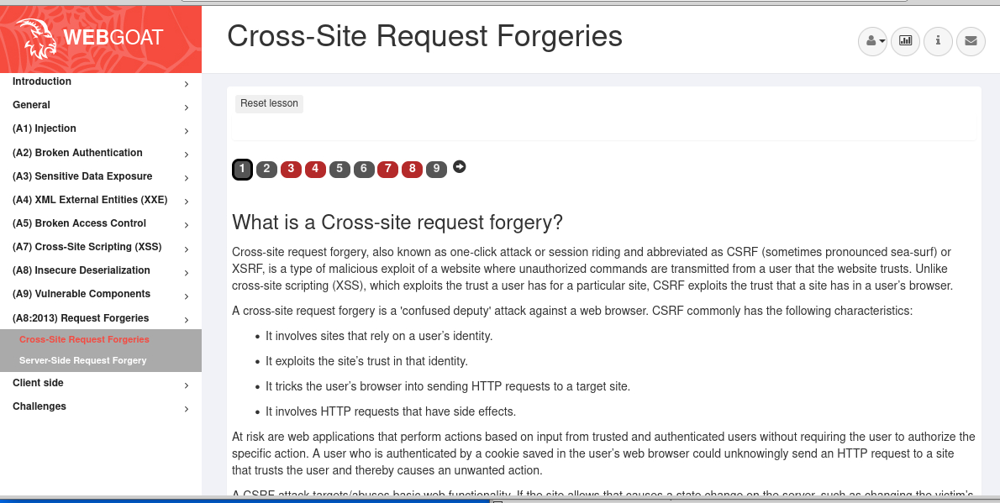

# Introduction to JavaScript Security

## What We Will Cover

 * Cross-Site Scripting (XSS)
 * Cross-Site Request Forgery
 * Database Injection
 * Session Hijacking
 * DDoS
 * Data Protection

---

# Cross-Site Scripting (XSS)

## What Is It?

  * What is it? 
    - Code injection attack
    - Enables attacker to execute malicious JavaScript in user's browser.

  * How?
    - By injecting a script into the page that the victim will download.

  * Consequences:
    - Cookie theft
    - Keylogging
    - Phishing


---

    
## Mechanism

<!-- {"left" : 0.39, "top" : 1.3, "height" : 5.38, "width" : 9.48} -->


---


## Example

  * Following server-side script is used to display the last comment:

```javascript
    print "<html>"
    print "last comment:"
    print database.latestComment
    print "</html>"
```
<!-- {"left" : 0, "top" : 1.86, "height" : 1.9, "width" : 8.72} -->

  * Now attacker sends his script as comment "<script>...</script>"

  * Finally, user visits the page would get the response like this:

```html
    <html>
    last comment:
    <script>...</script>
    </html>
 ```
<!-- {"left" : 0, "top" : 5.56, "height" : 1.77, "width" : 6.33} -->

---


## How To Prevent

  * Web developers use two methods performing secure input handling

    - Encoding: browser considers the malicious script as data, not code.

    - Validation: filters the user input so that the browser just run the code without malicious commands.


---

  
## Encoding

  * Encoding user input on server-side: &lt; instead of < and &gt; instead of > 
```javascript    
    print "<html>"
    print "last comment:"
    print encodeHtml(userInput)
    print "</html>"
```    
<!-- {"left" : 0, "top" : 2.02, "height" : 1.83, "width" : 8.18} -->

  * Resulting HTML would be like this:
```html   
    <html>
    &lt;script&gt;...&lt;/script&gt;
    </html>
```
<!-- {"left" : 0, "top" : 5.12, "height" : 1.29, "width" : 8.18} -->


---


## Validation

  * Allowing certain tags and elements
    - `<em> <strong>`  allowed
    - `<script>`       not allowed
  * How? 
    - Classification strategy
      - Blacklisting: High complexity, Updating is a problem
      - Whitelisting: Simple, Easy updating so is much better
    - Validation outcome
      - Rejection: Simple implementation, 
      - Sanitisation: More useful


---


## Which Method To Use?

  * First line of protection
    - Encoding and in some cases validation is a complementary 
  * Second line of protection
    - Inbound validation
  * If you think of full protection of entire website 
    - Content security policy (CSP)
    - XSS protection


---


## CSP

  * Makes browser download content from trusted sources
    - Validation
  * Even if injection happens, CSP can avoid downloading to user's computer
    - Inbound validation
  * If you think of full protection of entire website 
    - Content security policy (CSP)

---


## CSP Example

  * By default browsers don't use CSP
  * To enable CSP on your website add the following additional HTTP header "Content-Security-Policy"
  
  Example Policy:
```html
    Content‑Security‑Policy:
      script‑src 'self' scripts.mysite.com;
      media‑src 'none';
      img‑src *;
      default‑src 'self' http://*.mysite.com 
```  
<!-- {"left" : 0, "top" : 3.03, "height" : 1.92, "width" : 9.74} -->


Notes:
add header to every page you want to be secured

---

## Lab
* Cross Site Scripting:
    - Overview: We will run a script attack
    - Pre-requisites: Browser-Google Chrome   
    - Approximate time: 20 minutes
    - Instructions: labs/javascript_security_labs/labs/Cross_site_Scripting.md
    - https://github.com/elephantscale/secure-coding-labs/blob/main/javascript_security_labs/labs/Cross_site_Scripting.md


# Cross-Site Request Forgery


---


## Synonyms

  * CSRF 
  * XSRF
  * Sea Surf
  * Session Riding
  * Cross-Site Reference Forgery
  * Hostile Linking


---


## How?

  * Attacker sends a link to the user via for example email or social network
  * When clicks on the link, user performs the action on the web application they usually use
  * A state changes on the server

---


## Examples:
  - Transferring funds
  - Changing email address
  - Changing password
  * The attacker is not able to perform theft since there is no way to get the response

## Mechanism

 <!-- {"left" : 1.76, "top" : 1.09, "height" : 6.14, "width" : 6.74} -->


---


## Scenarios

  * GET
  * POST
  * And others like PUT and DELETE


---


## GET

  * Alice wants to transfer $100 to Bob via bank's website "bank.com"
  ```javascript
     - example GET request:
       - `GEThttp://bank.com/transfer.do?acct=BOB&amount=100 HTTP/1.1`
  ```
<!-- {"left" : 0.0, "top" : 1.86, "height" : 0.81, "width" : 10.25} -->
    - Eve as eavesdropper creates an exploit URL like this:
  ```javascript
       - `GEThttp://bank.com/transfer.do?acct=EVE&amount=1000 HTTP/1.1`
  ```
  <!-- {"left" : 0.0, "top" : 3.25, "height" : 0.5, "width" : 10.25} -->


---


## Get: cont'd
    - Now via social engineering:
```javascript
       - `<a href="http://bank.com/transfer.do?acct=EVE&amount=1000">Click to earn money!</a>`
```
or

```javascript
       - ``
```


---


## POST

  * Normal request:
    `POST http://bank.com/transfer.do HTTP/1.1`
    `acct=BOB&amount=100`
     
  * Vulnerable request and wait for the victim to submit:

```html
    <form action="<nowiki>http://bank.com/transfer.do</nowiki>" method="POST">
    <input type="hidden" name="acct" value="MARIA"/>
    <input type="hidden" name="amount" value="100000"/>
    <input type="submit" value="View my pictures"/>
    </form>
```
<!-- {"left" : 0, "top" : 2.39, "height" : 1.94, "width" : 10.25} -->


---


## POST, cont'd
  * if you don't want to wait for the victim and send it automatically:

```html
    <body onload="document.forms[0].submit()">
    <form action="<nowiki>http://bank.com/transfer.do</nowiki>" method="POST">
    <input type="hidden" name="acct" value="MARIA"/>
    <input type="hidden" name="amount" value="100000"/>
    <input type="submit" value="View my pictures"/>
    </form>
```
<!-- {"left" : 0, "top" : 2.96, "height" : 1.37, "width" : 10.25} -->


Notes:
The only difference between GET and POST attacks is how the victim executes the attack. 

---


---


## Primary Defense Techniques

  * Token Based Mitigation
  
    - Synchronizer Token Pattern
        - A state changing operation needs a secure random token
        - Every session has a unique token
        
    - Encryption based Token Pattern
        - Instead of comparing tokens to validate an action uses cryptography
        - For applications that don't maintain states at the server side


---


## Defense In Depth Techniques

  * Verifying origin with standard headers
  * Double Submit Cookie
  * Samesite Cookie Attribute
  * Use of Custom Request Headers
  * User Interaction Based CSRF Defense (CAPTCHA)
  


Notes:

These are beyond the scope of the lesson

---

## What Methods Do Not Work?

  * Using a secret cookie
  * Only accepting POST requests
  * Multi-Step Transactions
  * URL Rewriting
  * HTTPS


---


# Database Vulnerabilities

## Common DBs

  * Most common databases:

    - SQL
    - NoSQL (MongoDB)


---


## SQL Injection

Executing malicious SQL instructions by exploiting query parameters

   A non-secure query with concatenation:

```javascript
   db.query('SELECT address FROM users WHERE id = ' + req.query.id);
``` 
<!-- {"left" : 0, "top" : 2.37, "height" : 0.48, "width" : 10.18} -->
   
   query gets the id from user and gives the address.


---


## Retrieving All Database Tables 

  * Normal user input: A number like 258

  * Resulting query: `SELECT address FROM users WHERE id = 258`
   
  * Malicious attacker input:

```sql
                "1 UNION SELECT group_concat(table_name) 
                FROM information_schema.tables 
                WHERE table_name = database()"
```  
<!-- {"left" : 0, "top" : 2.39, "height" : 1.27, "width" : 10.25} -->
                          
  * Resulting query:

```sql
                "SELECT address FROM users 
                WHERE id = 1 
                UNION SELECT group_concat(table_name) 
                FROM information_schema.tables 
                WHERE table_name = database()"
```
<!-- {"left" : 0, "top" : 4.74, "height" : 1.67, "width" : 10.25} -->

Gets a list of all database tables


---


## Writing File To Disk

  * Attacker input:

     `1 UNION SELECT "<h1>some text</h1>" INTO OUTFILE "/home/website/public_html`
   
  * Resulting query would be:
```sql
  
   `SELECT address FROM users WHERE id = 1 UNION SELECT "<h1>hello world</h1>" INTO OUTFILE "/home/website/public_html"`
```

It works with the right permission 


---


## Solution

  * If expected input is a number
    Input validation will work by not allowing strings as input
  * If not
    Prepared Statements or Parameterized Queries instead of concatenation

---


## NoSQL Injection

  * According to DB-Engines.com MongoDB is the most popular NoSQL database
  
  * JavaScript can access directly to MongoDB server by the following operations:
    - $Where
    - mapReduce
    - group


---


## Where

  * Is used where you need pass a string as query. example:
      `$where: 'this.UserID = ' + req.query.id`
    
  * Returns the document whose id is the input
  
  * Attacker types `"0; return true"` as input
  
  * The equivalent SQL query would be :
  ```sql
     `SELECT * FROM Users WHERE UserID = 0 OR 1 = 1`
  ```


---


## Solution

  * Validation
```javascript
      $where: 'this.UserID = new Number(' + req.query.id + ')'
```

<!-- {"left" : 0, "top" : 1.38, "height" : 0.55, "width" : 10.25} -->

    
Notes:

Validation mitigates the problem more than half

---

# Session Hijacking

## Session Establishment 


   * The request is made by the client
   * Along with a response, the server transmits an identifier
   * The client reads and persists the identifier sent unchanged (is sent through cookies)
   * The client sends the identifier read and persisted on step 3 as a request

---


## Session Establishment, cont'd
   * The server reads and validates the identifier
   * Go to step 2
   
   * Identifier is a key part of the process
   * It must be created on a trusted system (server)


---


## How? 


 <!-- {"left" : 2.6, "top" : 1, "height" : 6.28, "width" : 5.04} -->


---


## Protect Identifier

  * To protect identifier:

    - Always use HTTPS.
    - Try not to switch between HTTP and HTTPS. 
    - If you have to switch, deactivate the previous identifier and generate new one
    - Per-request identifier is better than per-session identifier
    - From all protected pages logout must be available
    - Logout must terminate all sessions


---


# Distributed Denial of Service (DDoS)

---


## What Is It?

  * Common attack 
  * Making many systems involved
  * If not protected JavaScript would be a DDoS weapon 

---


## Sample Malicious Code

```javascript
    function flood_attack() {
      var TARGET = 'target_website.com'
      var URI = '/index.php?'
      var picture = new Image()
      var rand = Math.floor(Math.random() * 1000)
      picture.src = 'http://'+TARGET+URI+rand+'=val'
    }
    setInterval(flood_attack, 10)
```
<!-- {"left" : 0, "top" : 1.25, "height" : 2.59, "width" : 10.25} -->

---


## Sample Malicious code, cont'd

  * Creates an image 100 times per second
  * Each visitor of the website containing this code would be a participant to attack to the target_website


---


## Mechanism

 <!-- {"left" : 0.53, "top" : 1.44, "height" : 4.62, "width" : 9.19} -->


---


## Solution

Depends on how the attacker inserts the code into the page

---


# Data Protection

---


## Right Privileges
* Let every user do what they really need not more
* Example in an online store:
  - Salespersons should have read permission to view catalog
  - Market users should have permission to check statistics
  - Developers should have permission to modify pages and web application options

---


## Deleting Sensitive Info When Not Needed


* Temp and cache files
* If you need it encrypt or move it to a protected area

---


## Comments

* Do not put comments like `TODO` list in source-code
* Do not comment credentials:

```javascript
// secret API endpoint - /api/mytoken?callback=myToken
console.log("a random code")
```


---


## URL
* Do not pass important information through HTTP GET because:
  - If not using HTTPS data can be intercepted by `Man In The Middle Attack`
  - User's information can be stored in browser's history including session IDs, pins and tokens


---


## Cache
* Disable cache control in pages containing sensitive information through setting header flags
* Example: in an `express` app
```javascript
const exp = require('express');

const appl = exp();

// ...

appl.use((req,resp,next) => {
  resp.header('Cache-Control', 'private, no-cache, no-store, must-revalidate');
  resp.header('Pragma', 'no-cache');

  next();
});

// ...
```

---


## encryption and password hash

* Encrypt every sensitive information

* Example of `aes-256-cbc` in Node.js using `crypto` module:


---


## Example
```javascript
const crypt = require('crypto');

// get password's md5 hash
const pswd = 'test';
const pswd_hash = crypt.createHash('md5').update(pswd, 'utf-8').digest('hex').toUpperCase();
console.log('key=', pswd_hash); // 098F6BCD4621D373CADE4E832627B4F6

// our data to encrypt
const data = 'Sample text to encrypt';
console.log('data=', data);

// generate random initialization vector
const iv = crypt.randomBytes(16)
console.log('iv=', iv);

// encrypt data
const cipher = crypt.createCipheriv('aes-256-cbc', pswd_hash, iv);
const encryptedData = cipher.update(data, 'utf8', 'hex') + cipher.final('hex');
console.log('encrypted data=', encryptedData.toUpperCase());
```


---


## Output

```javascript
key= 098F6BCD4621D373CADE4E832627B4F6
data= Sample text to encrypt
iv= <Buffer d7 98 9a 54 a0 e6 bc 45 f3 7f bc 33 c2 0f 7d 00>
encrypted data= 83640168A86A9F2BC0BEEEDEB39756E195EF3D0758A3262F012697C3D718B039
```


---


## Disable Unnecessary Apps and Services

* So simple: Check if there is any unnecessary app or service and disable it


---


## Disable Autocomplete

* For the whole form:
```html
          <form method="post" action="/form" autocomplete="off">
          ```
          for a certain element:
          ```html
          <input type="text" id="cc" name="cc" autocomplete="off">
        
```
<!-- {"left" : 0.0, "top" : 3.09, "height" : 1.6, "width" : 10.25} -->


---


## Lab
* JavaScript security:
    - Overview: We will run a URL attack
    - Pre-requisites: Browser-Google Chrome   
    - Approximate time: 60 minutes
    - Instructions: labs/javascript_security_labs/README.md
    - https://github.com/elephantscale/secure-coding-labs/tree/main/javascript_security_labs

---