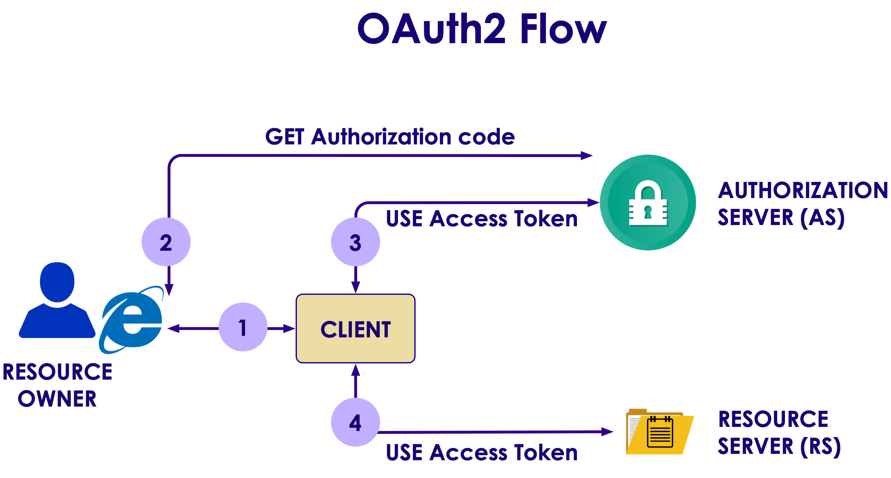
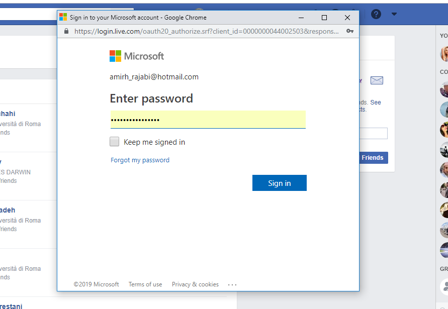
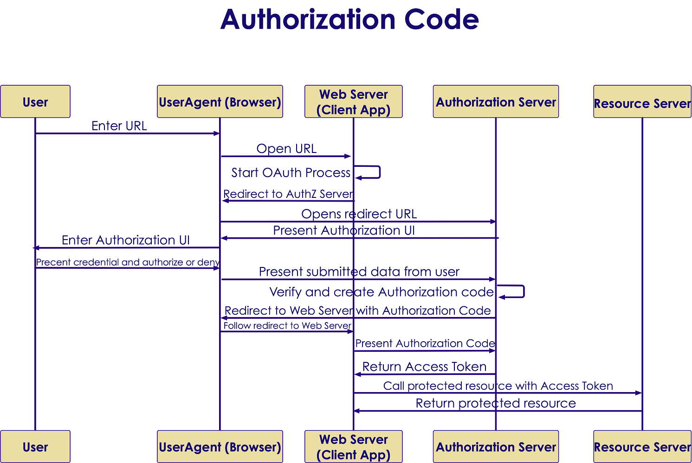
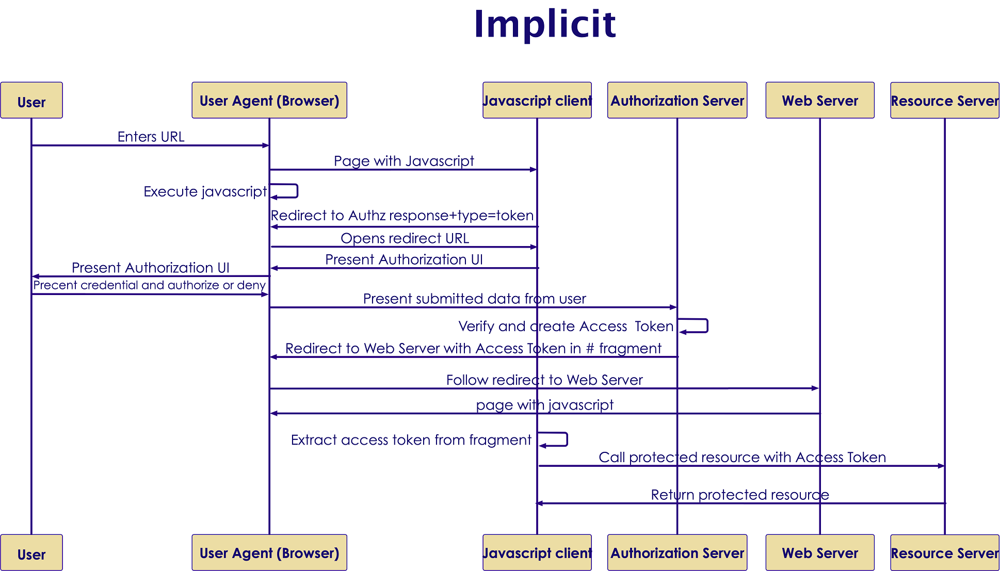
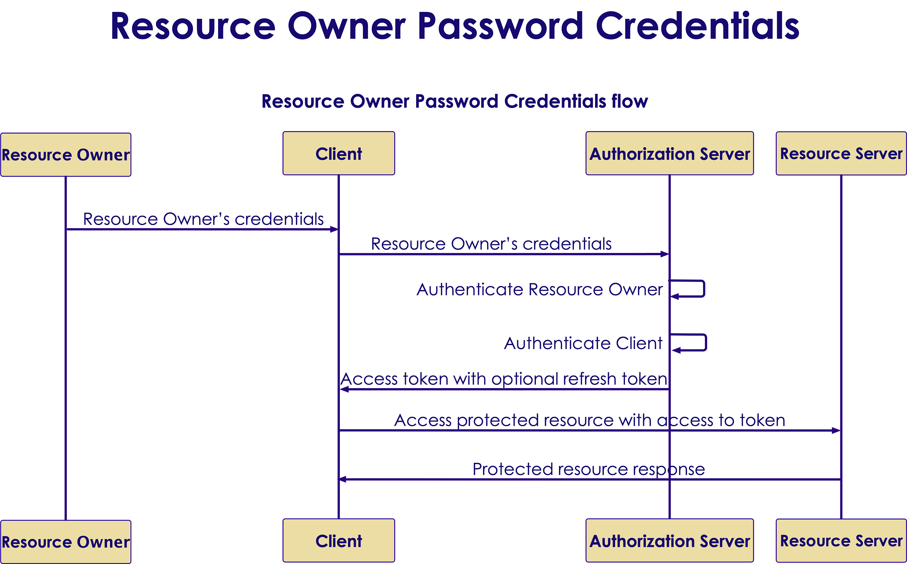
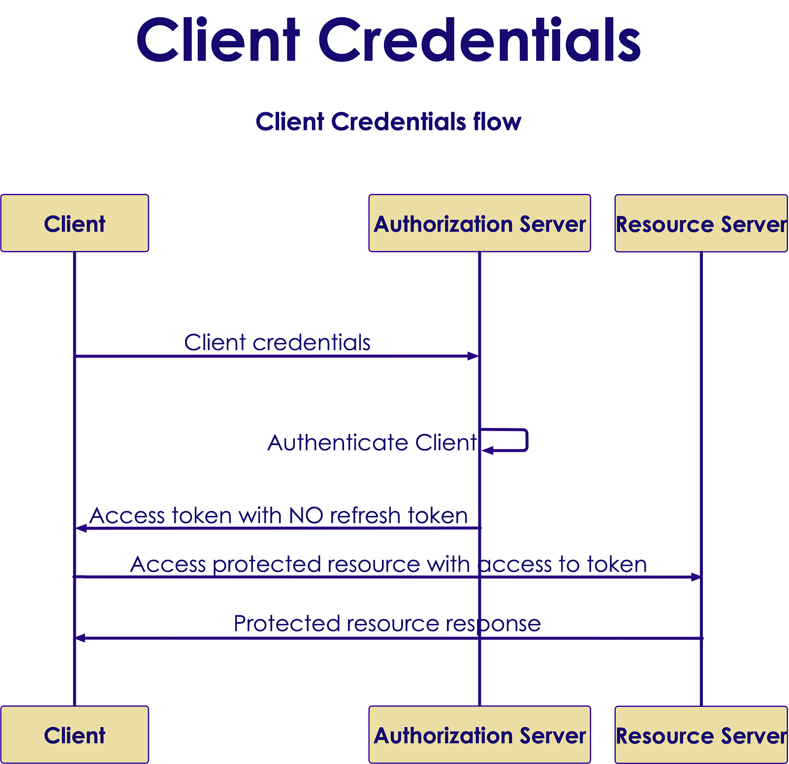

# Introduction to REST Endpoint Security

## Lesson Objectives

 * Understand the needs that OAuth2 addresses
 * Be familiar with OAuth2 capabilities and advantages
 * Gain an understanding of a basic OAuth2 Implementation

# OAuth2

## What Is It?

 <!-- {"left" : 0.94, "top" : 1.73, "height" : 4.51, "width" : 8.38} -->


## Why OAuth?
* Third party applications can access user's resources without knowing their credentials
* Limits access to HTTP services
* Softwares and packages don't store user's credentials anymore (only tokens)
* Based on TLS/SSL
* No backward compatibility
* Easily revokable


## A Little of History

* OAuth 1.0
 - Core specification - 2007

* OAuth 1.0a
 - A security issue was fixed - 2009

* OAuth 2.0
 - Standardized - 2012
 - More security and simplicity


## A Good Use Case
* In some websites you can invite your friends by importing your contant list

Look at the address bar:

 <!-- {"left" : 1.85, "top" : 2.51, "height" : 4.52, "width" : 6.55} -->

## Roles

* Resource owner
* Resource server
* Client
* Authorization server

## Grant Types
* Authorization code (web applications)
* Implicit (mobile and browser-based applications)
* Resource owner password credentials (user + password)
* Client credentials (application)
* Device Code (electronic device)

## Authorization Code
* This grant type is used by confidential and public clients
* Exchanges an authorization code for an access token
* User returns to the client through redirect URL
* Then application gets the authorization code from URL
* Then use it to request an access token
## Authorization Code In A Picture
 <!-- {"left" : 1.25, "top" : 0.89, "height" : 6.22, "width" : 7.76} -->

## Implicit 
* Used by public clients
* Access token is returned without an extra authorization code exchange
* Some servers ban this flow
* It is not recommended

## Implicit In A Picture
 <!-- {"left" : 1, "top" : 1.17, "height" : 5.77, "width" : 8.25} -->


## Resource Owner Password Credentials
* First-party clients use this type to exchange user's credential for a token
* Asks the user for their credential
* Don't let third party clients to use it
* Username and password are exchanged directly for a token

## Password Credentials In A Picture 

 <!-- {"left" : 0.88, "top" : 1.14, "height" : 5.92, "width" : 8.5} -->

## Client credentials
* Is used by clients to obtain a token out of the user's context
* To access resources about themselves instead of accessing a user's resource 

## Client credentials In A Picture


 <!-- {"left" : 2.54, "top" : 1.1, "height" : 5.55, "width" : 5.17} -->

## Device Code
* Is used by browserless or input-constrained devices 
* To exchange a previously obtained device code for an access token
* Value: `urn:ietf:params:oauth:grant-type:device_code`


## Tokens

* Types according to properties
  - Bearer
    - Large random
    - Uses SSL to protect
    - It is stored as a hash on the server
  - Mac (Not Recommended)
    - Uses a nonce to prevent replay
    - Does not use SSL
    - OAuth 1.0 only supported

* Types according the life cycle
  - Access token
    - Short
  - Refresh token
    - Long

## Bearer Token
* Predominant type of access token 
* An opaque string, without any meaning
* Some servers issue short string and some issue `JSON Web Tokens` 
## Pros and Cons of OAuth2

* Pros
  - Enables integration of third party applications to websites
  - Enables granting limited access either scope or duration
  - User does not have to enter password on third party site

* Cons
  - Complexity in development of authorization server
  - Compatibility issues


# Java Implementations
## Some Java Implementations

* Jersey
* Apache oltu
* Spring security (Pretty Popular)


## Jersey 

* It is an Open source RESTful web services framework
* Supports and extends JAX-RS API and extends 
* Integrates with the Java EE  standard security
  - `@RolesAllowed`
  - `@PermitAll`
  - `@DenyAll`
* Supports entity filtering
  - `@EntityFiltering`

* Only supports OAuth2 at client side

## Goals of Jersey Project
* Track the JAX-RS API and provide regular releases of production quality Reference Implementations that ships with GlassFish
* Provide APIs to extend Jersey & Build a community of users and developers; and finally
* Make it easy to build RESTful Web services utilising Java and the Java Virtual Machine

## Java EE security integration

```java
@Path("restricted-resource")
@Produces("application/json")
public class restricted_resource {
  @GET @Path("denyAll")
  @DenyAll
  public restricted_entity denyAll() {...}

  @GET @Path("rolesAllowed")
  @RolesAllowed({"manager"})
  public restricted_entity rolesAllowed() {...}
}
```
<!-- {"left" : 0, "top" : 1.23, "height" : 3.72, "width" : 10.08} -->

## Client support
```java
OAuth2CodeGrantFlow.Builder builder = 
  OAuth2ClientSupport
    .authorizationCodeGrantFlowBuilder(
      clientId,
      "https://example.com/oauth/authorization",
      "https://example.com/oauth/token"
    );

OAuth2CodeGrantFlow flow = builder.property(
  OAuth2CodeGrantFlow.Phase.AUTHORIZATION,
    "readOnly","true")
    .scope("contact")
    .build();

String authorizationUri = flow.start();
...
final TokenResult result = flow.finish(code,state);
...
```
<!-- {"left" : 0, "top" : 0.97, "height" : 5.55, "width" : 10.25} -->


## Apache Oltu
* Apache OAuth protocol implementation
* Also covers other implementations
  - JSON Web Token (JWT)
  - JSON Web Signature (JWS)
  - OpenID connect
* Supports OAuth2 features completely
  - Authorization server
  - Resource server
  - Client
* Provides predefined OAuth2 client types
  - `Github`, `Facebook`, `Google`, etc


## Authorization endpoint
```java
protected void do_get(HttpServletRequest req,
       HttpServletResponse resp)
           throws ServletException, IOException {

      //dynamically recognize an OAuth profile and perform validation
      OAuthAutzhRequest oauth_req = new OAuthAuthzRequest(req);
      validateRedirectionURI(oauth_req)

      //build OAuth response
      OAuthResponse resp = OAuthASResponse
        .authorizationResponse(HTTPServletResponse.SC_FOUND)
        .setCode(oauthIssuerImpl.authorizationCode())
        .location(ex.getRedirectUri())
        .buildQueryMessage();

      resp.sendRedirect(resp.getLocationUri());
    }
```
<!-- {"left" : 0, "top" : 1.02, "height" : 4.45, "width" : 10.25} -->

## Token endpoint

```java
protected void do_post(HttpServletRequest req,
       HttpServletResponse resp)
           throws ServletException, IOException {

          OAuthIssuer oauthIssuerImpl = 
              new OAuthIssuerImpl (new MD5Generator());

          OAuthTokenRequest oauth_req = 
              new OAuthTokenRequest (req);

          validateClient(oauth_req);

          String authz_code = oauth_req.getCode();
          String access_token = oauthIssuerImpl.accessToken();
          String refresh_token = oauthIssuerImpl.refreshToken();

          OAuthResponse r = OAuthASResponse(...);
           }
```
<!-- {"left" : 0, "top" : 1.08, "height" : 4.5, "width" : 10.25} -->

## Protecting resources

```java
Protected void do_get(HttpServletRequest req,
   HttpServleResponse resp)
      throws ServletException, IOException {

        //OAuth request and validation
    OAuthAccessResourceRequest oauth_req = new
      OAuthAccessResourceRequest (req,
           ParameterStyle.BODY);

        //Getting access token
        String accessToken = 
           oauth_req.getAccessToken();

        // ... validate access token
      }
```
<!-- {"left" : 0, "top" : 1.08, "height" : 4.88, "width" : 9.74} -->

## OAuth2 client
```java
OAuthClientRequest req = OAuthClientRequest
  .tokenProvider(OAuthProviderType.FACEBOOK)
  .setGrantType(GrantType.AUTHORIZATION_CODE)
  .setClientId("your-facebook-client-id")
  .setClientSecret("your-facebook-client-secret")
  .setRedirectURI("http://www.mysite.com/redirect")
  .setCode(code)
  .buildQueryMessage();

//create OAuth client that uses custom http client under the hood
OAuthClient oauth_client = new OAuthClient(new URLConnectionClient());
OAuthAccessTokenResponse oauth_resp = oauth_client.accessToken(req);
String access_token = oauth_resp.getAccessToken();
String expires_in = oauth_resp.getExpiresIn();
```
<!-- {"left" : 0, "top" : 1.11, "height" : 3.89, "width" : 9.74} -->

## Spring security OAuth
* Supports OAuth (1a) and OAuth2
* Implements 4 types of authorization grants
* Supports all OAuth2 features:
  - Authorization server
  - Resources server
  - Client
* Good integration with JAX-RS and Spring MVC
* Configuration using annotation support
* Integrates with the `Spring` platform

## Authorization server
* `@EnableAuthorizationServer`
  - For configuring OAuth2 authorization server
  - XML configuration related: `<authorization-server/>`
* `ClientDetailsServiceConfigurer`
  - Defines the client details service
  - In-memory or JDBC implementation
* `AuthorizationServerTokenServices`
  - Operations to manage OAuth2 tokens
  - Tokens in-memory, JDBC or JSON Web Token (JWT)
* `AuthorizationServerEndpointConfigurer`
  - Supports grant types
  - Password types not supported


## Resource server
* can be the same as Authorization server or in a separate application
* Authentication filter for web protection
* `@EnableResourceServer`
  - For configuring OAuth2 resource server
  - `XML` config `<resource-server/>`
*Supports expresson-based access control
  - `#oauth2.clientHasRole`
  - `#oauth2.clientHasAnyRole`
  - `#oauth2.denyClient`

## Client
* Storing the current request and context by creating filter
* Manages:
  - redirection to OAuth
  - redirection from OAuth
* `@EnableOAuth2Client`
  - To configure OAuth2 client
  - XML config related `<client/>`
* `OAuth2RestTemplate`
  - Wrapper client object to access the resources
  
## Lab

* Spring + REST
1. Set up the framework
2. Secure it
* https://github.com/timfox456/java-fsd-phase3/tree/main/SpringSecurity


