# Secure Design

---

## Defining Secure by Design

- Means software systems and products are designed from inception through retirement to be secure
- Security is a fundamental part design and operations, not added on later
- The design process must be secure - not susceptible to being subverted
- Software development implementation of the core engineering practice _secure by design_
- Built into the standard engineering lifecycle or product development workflow
- Used in all forms of engineering, not just software engineering

---

## The Engineering Lifecycle

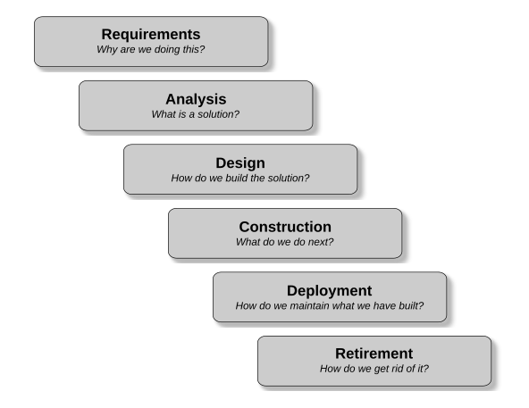

Notes:

Image Credit: Rod Davison

---

## Application Lifecycle Management (ALM)

- Application of engineering product management to software
- The lifecycle of a software product is defined to be:
  - _"the entire time an organization spends money of the product from the initial idea to the end of the application's life when it is no longer in use"_
- Three major milestones: idea, initial deployment, end-of-life
- Three main areas of concern
  - _Governance:_ Making business decisions like when a product should be retired
  - _Development:_ Building and releasing software
  - _Operations:_ Maintaining and supporting the software in production
- We will focus primarily on development

---
## Application Lifecycle Management (ALM)

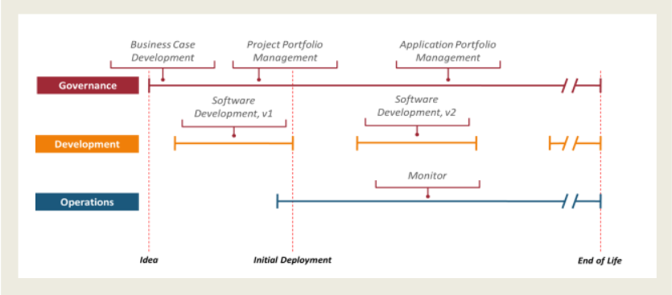

- ALM accommodates all development SDLCs: waterfall, Agile, DevOps, etc

Notes:

Image Credit: James Chappell

---

## Iot Secure by Design

# 

- Secure lifecycle concepts applied to Internet of Things
- Very similar to software secure by design lifecycle

Notes:

Image Credit: www.epsprogramming.com/blog-posts/secure-by-design-for-the-internet-of-things

---

## Secure Requirements

- Security requirements _must_ be part of the requirements for the project
- Includes prioritized assessment of potential attackers during the product lifecycle
- Inventory of attacks that should be expected
- A robust and thorough threat analysis
- Requirements from all security stakeholders
- Government and industry standards and requirements
  - Eg. NSA Cyber Security Standards 
  - https://www.nsa.gov/What-We-Do/Cybersecurity/Partnership/Standards/

---

## Nonfunctional Requirements

- Nonfunctional requirements are the performance requirements of a system
  - For example, response time, load and stress capacity
- Many attacks overstress system operations to destabilize it
- Nonfunctional requirements must fully define the performance levels the system will experience in production
- System design depends _directly_ on the non-functional requirements
- Systems that are patched up to meet performance requirements present a greater attack surface
- Standardized nonfunctional requirements models provide "checklists" for completeness

---

## FURPS Requirements Model

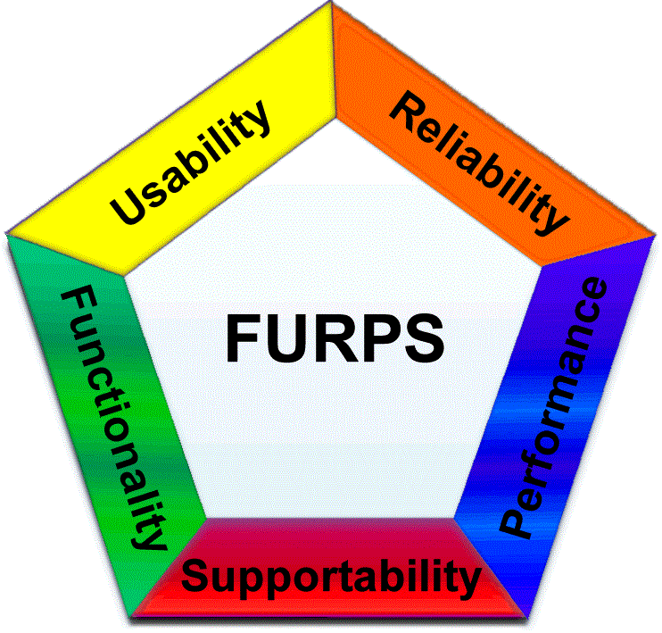

- Reliability
  - Mean time to failure
  - Failure severity
  - Failure frequency
  - Accuracy and Predictability
  - Allowable downtime and recovery time

Notes:

Image Credit: Unknown

---

## FURPS Requirements Model

- Operational Performance 
  - Speed
  - Response time
  - Throughput
  - Efficiency
  - Resource consumption
  - Load and stress

---
## FURPS Requirements Model

- Supportability
  - Testability
  - Extensibility and adaptability
  - Maintainability 
  - Compatibility
  - Configurability
  - Backup and recovery
  - Disaster management

---

##  The Specification

- A spec is a description of what is to be built, its capabilities and functionality
- All engineering projects are built to a specification 
- Provides a baseline for testing and quality analysis
- Not a design - only describes what the deliverable should be
- Designs describe how to build something from a spec with the resources and technology available to the development team
- One spec may give rise to multiple designs
- Designs are the phase where solutions to nonfunctional requirements are crafted

---

## The Generic Software Development Process

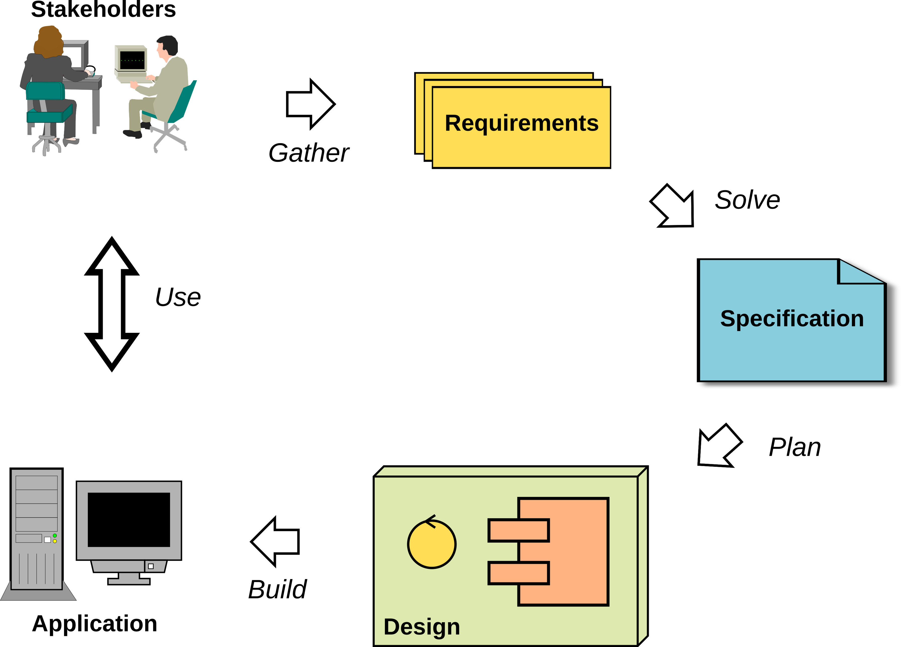

- Waterfall executes this once, Agile/DevOps execute this in multiple iterations

Notes:

---

## Why a Specification?

- Poorly designed software is inherently insecure
- We can't have well-designed software unless we know:
  - Exactly what the software should do
  - What the software must not do
  - How the software should handle errors and exceptions
  - How the software should respond to attacks
- _"The most important single aspect of software development is to be clear about what you are trying to build."_  Edsger Dijkstra
- _"First solve the problem, THEN write the code."_ Donald Knuth

---

## IEEE Best Practices

- The IEEE _Best Practices for Software Requirements Specifications_ is the gold standard for software specs
- It represents the minimum level of rigour for secure software
- Developers should never have to speculate on what the software should do
  - When developers make assumptions about what code should do, it introduces vulnerabilities
  - Especially when their assumptions are wrong
- The spec defines what the software does, the developer designs how the software will do what the spec describes
- The IEEE Best Practices lists a set of properties that all software specs should have

---

## IEEE Spec Standards

Notes:

Image Credit: Rod Davison

---
## Specs and Testing

- Since the spec describes exactly how the software will perform
  - Testers start developing tests based on the specification
  - Security testers also start developing penetration and exploit tests
- As part of the specification, a full suite of acceptance tests will also be developed
- If a tester cannot write a test to spec item, a developer cannot write code to it for the same reason
- Eg. The spec does not cover what should happen with invalid input for a feature
  - The tester has no idea what the correct system response should be
  - The developer does not know what their code should produce

---
## Securing the Development Process

- Design process security prevents the insertion of malicious code during development
- Three examples of malicious code insertion
  - Backdoors: Programmers insert code that allows unauthorized access to the system 
  - Logic Bombs: Code designed to compromise or damage the system when triggered by an attacker
  - Surprise Functionality: Functionality that is not in the spec that can be exploited by an attacker
- Malicious code insertion is generally cannot be identified by standard testing
  - White box testing that exercises all the code must also be employed
  - Part of what testers do in exploratory testing is to look for surprise functionality
---
  
## Logic Bomb Examples

- July 2019, contractor for Siemens set logic bombs to go off after a period fo time to force the company to hire him to fix the resulting damage
- June 2008, systems administrator at UBS used a logic bomb to try and drive down the price of the company's stock
- February 2002, a logic bomb was planted by a programmer at Deutsche Morgan Grenfell
  - It was discovered before it went off but took months to remove
- 2012, a contractor for the US Army placed a logic bomb into the payroll systems for the US Army Reserves
  - His employer had lost the contract to build the system which would affect his job

---

## Backdoor Examples

- A systems administrator for the City of San Francisco created a hidden admin account and backdoor
  - When he was fired, he used the backdoor to lock everyone out of the system
- Software and hardware manufactures often install backdoors for testing during development
  - These are undocumented, not secure and often not removed after development
  - Once these backdoors are known, they provide an easily breached attack surface
- In 2014. SerComm, a company that assembled routers for LinkSys and Netgear was found to have installed backdoors in the routers
- Borland's Interbase (versions 4 to 6) had a backdoor that allowed anyone to take full control of all the Interbase databases

---

## Surprise Functionality

- Occurs when developers reuse source code or libraries from other projects or sources
- The reused code is not vetted or inspected thoroughly
- The resulting application now has undocumented and untested functionality
- This unknown code now presents a potential exploit
- This is not a deliberate attack, but rather just sloppy programming
---

## Securing the Codebase

- Source code is an asset that needs to be secure
- Best practice is to use a VCS like git with audit capabilities
- Allows tracking of where all source code and subsequent changes originated
- Once code has been finalized, it is "frozen" and cannot be changed
- Only vetted code from the codebase is used in builds
- Code management and access policies can enforced to establish a chain of possession for all code
- Projects should use a standard code style so that everyone can read and understand the code

---

## Securing Writing the Code

- Pair programming is used to improve security and code quality
- One person codes while the other reviews the code as it is written
- In addition to catching bugs, it makes malicious code insertion very difficult
- As an extra layer of security and quality, the code is reviewed by a third developer on a random basis
- To prevent collusion
  - The programmers paired together every day are chosen randomly
  - The third programmer who acts as reviewer is chosen randomly

---

## Code Reviews

- All production code should subject to formal code reviews and walk-throughs
- Participants should include people not involved in the project, ie. fresh eyes
- Testers and security experts should be part of the review
- No code is included in a build until it is passes a full review
- Reviews and walk-throughs find errors and possible exploits as well as potential malicious code
- Code reviews are done with reference to code standards, vulnerability lists and known potential problem areas
- OWASP guide for conducting code reviews:
- https://owasp.org/www-pdf-archive/OWASP_Code_Review_Guide-V1_1.pdf

---

## Coding Standards

- There exist coding best practice standards for most languages
- These are intended at starting points for organizations to develop their own coding standards
- There are also secure coding standards
  - These focus on how to avoid code that introduced vulnerabilities
  - These are often the result of poor programming practices
- Eg. A vulnerability is introduced in Java by failing to properly handle unchecked exceptions

---

## CERT Security Standards

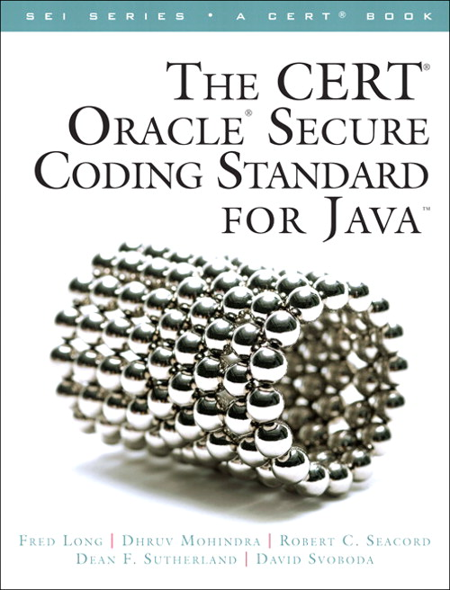

- Software Engineering Institute, NIST and CERT provide secure coding standards for Java, C, C++, Android and PERL
- Newer languages like Rust are designed to reduce the ability of programmers to write insecure code
---

## Secure Architectural Design

- Part of a larger approach referred to as _In depth defence_ 
- This includes the design architecture for a system
- The goal is to provide layers of protection for high value assets
- High value assets include data and features control the system like admin accounts
- There are a number of standards developed that can be used as a starting point
- CERT, NIST, SEI and other organizations

---

## Layered Security Model

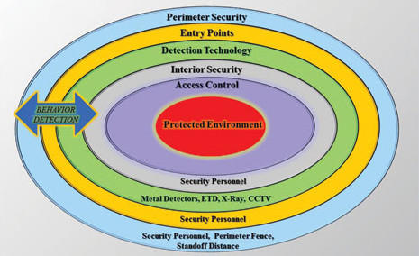

- There are multiple variations on the basic concept of layered security
- They all are implementations of security in depth
- Assets are only reachable by going through multiple layers of security
- Each layer provides a set of defences against the various types of attacks

Notes:

Image Credit: www.securitymagazine.com/articles/83537-us-security-shifting-to-preventative-methods

---

## Layered Security Model

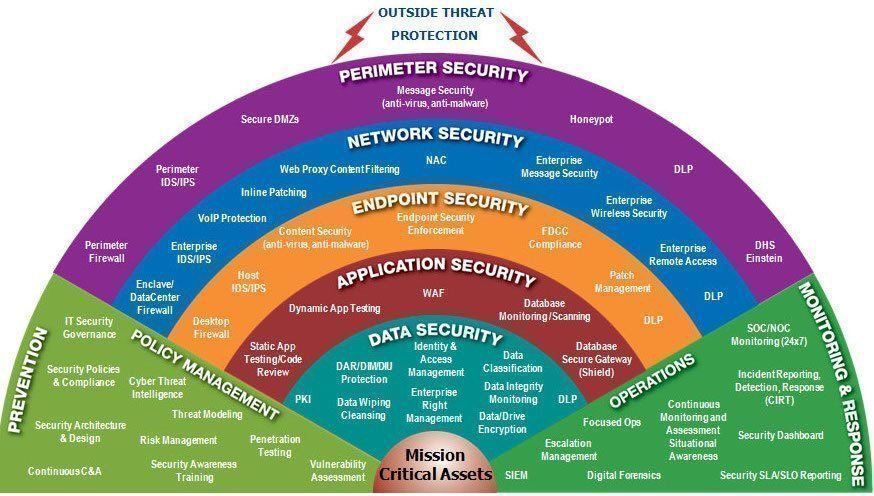

- Another variation of the model is the "fan" model
- The same basic layer approach but just different levels of detail

Notes:

Image Credit: twitter.com/fisher85m/status/1030976170181976064

---

## Design Layers

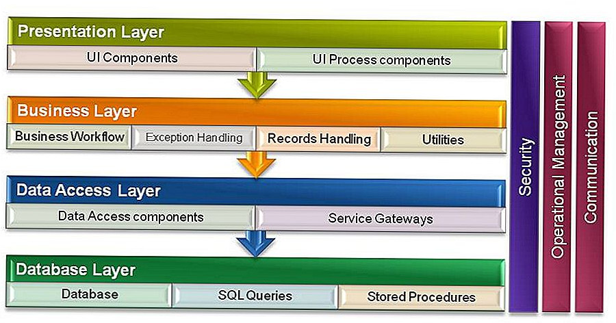
- At the design level, this is partly implemented as a n-tier model
- The basic form is the 3-tier model

Notes:

Image Credit: tr.waldorf-am-see.org/589338-what-is-n-tier-architecture-OYJTJO

---

## The Layers

- The data access layer is responsible for accessing the actual databases
  - It can only be accessed from the business logic layer
  - It is often behind a firewall that will only accept connections from applications running in the Business Logic Layer
  - There is no other access to the data
- The business layer provides the application functionality
  - It contains a series of checks to ensure that only well-formed requests are processed
  - Implements various access controls and authorization mechanisms
  - Rejects requests that do not pass security measures
- The presentation Layer interacts with the user
  - It validates input and presents only the functionality allowed for a specific user
  - Role based authorization often means different types of users see different interfaces

---

## Physical Layer Implementation

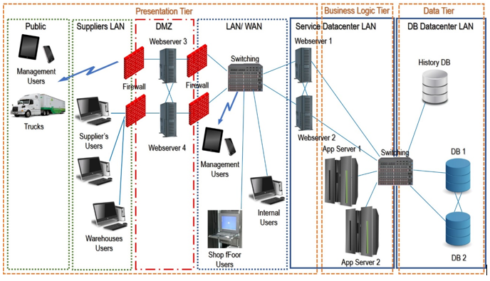

- The tiers in the layered model are often implemented in different physical architectural zones
- Usually implemented by different networks and host environments
- Enables the control of low level physical access between tiers

Notes:
Image Credit: www.bmc.com/blogs/n-tier-architecture-tier-2-tier-3-and-multi-tier-explained/

---

## Using a DMZ (Demilitarized Zone)

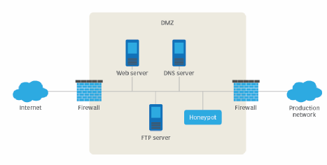
- It is an area of the system that is accessible to the outside world
  - Hosts services available to the public - web sites, etc.
  - Has no direct access to the internal networks
  - Often contains a honeynet as a security trap

Image Credit: searchsecurity.techtarget.com/definition/honey-pot

---

## DevOps and Security

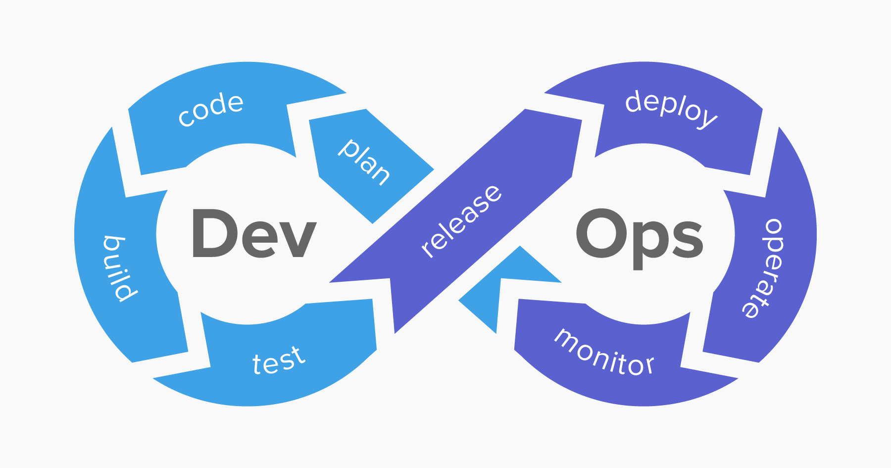

- DevOps is a production model for software which emphasizes the integration of both development and prodcution
- DevOps stresses continuous development, testing, integration and deployment
- It relies heavily on automation
- 
Notes:

Image Credit: www.netsparker.com/blog/web-security/what-is-devsecops/

---

## DevSecOps

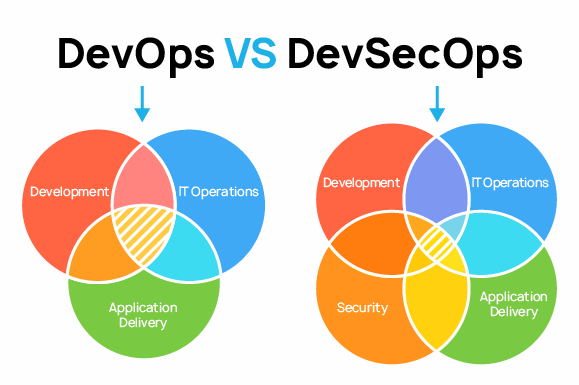

- DevSecOps implements the idea presented early in this module
- Security is built into the whole development and production process

Notes:

Image Credit: pvs-studio.com/en/blog/posts/0710/

---
 
## DevSecOps

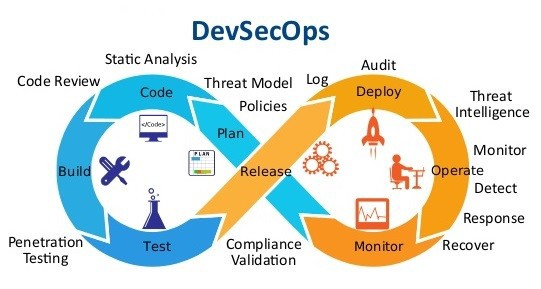

- Integration of the security into the DevOps model

Notes:

Image Credit: levelup.gitconnected.com/top-15-devsecops-tools-for-an-enterprise-ci-cd-pipeline-bd865b47ed5f
---

