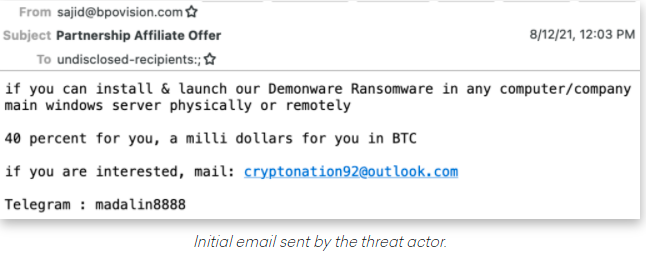

Security Intro
==============

## Personal Story
* Hacker comes to town!
* Jeremiah Grossman

---

## Grossman's Lessons

* Make life (work) harder for hackers
* And they will go elsewhere

---

## Hacking is a lifestyle

---

## Told by GrugQ

---

## Summary of hacker advice

---

## GrugQ Twitter

Notes:

* Followed by 118K
* @thegrugq

---

## Practically

* You could do this:
* Validate all inputs
* Protect against all (?) attacks
* Encrypt your data, in motion and in rest
* And you will not be blamed
* But this is boring
  - and brings no new functionality

---

 
## Suggestion
* At times, let us play games
* Red Team attacks
* Blue Team defends
* Tell your boss, you are doing security :)

---

## Criminal Economy

* Criminal marketplaces
* Escrow services
* Bitcoin
* Malware as a service

---

## Insider job recruitement

---

## Is FBI involved?

* Yes
* Working with other agencies
* Across borders
* But they can only do so much

---

## Criminal Operations
* Highly specialized
* Productized
* How can we imitate it?
* By acquiring either a Red Team of Blue Team specialization

---

