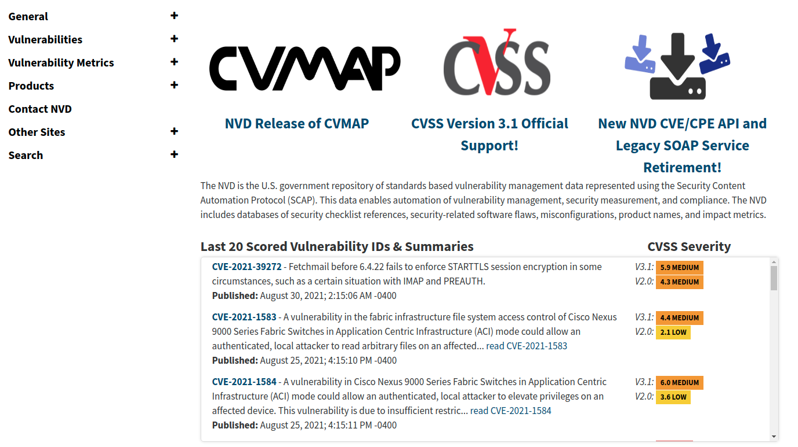
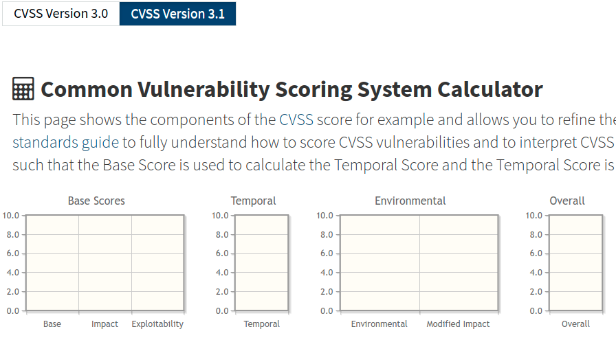
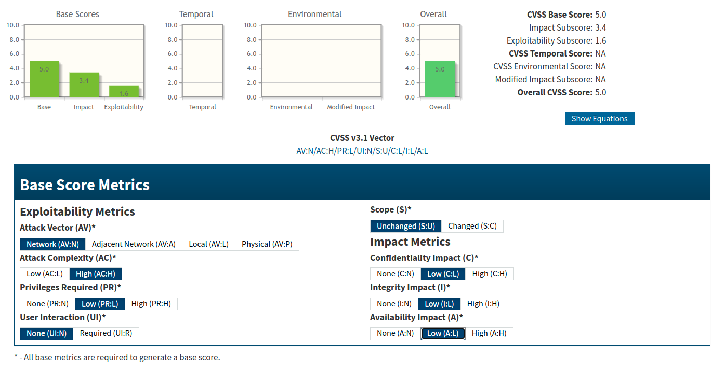

# Threat Modeling


# STRIDE

## STRIDE attack classification

* STRIDE is an acronym for
  * Spoofing
  * Tampering
  * Repudiation
  * Information Disclosure
  * Denial of Service
  * Elevation of Privilege. 

Notes:

* STRIDE was invented by Loren Kohnfelder and Praerit Garg in 1999
* Help people developing software identify the types of attacks that software tends to experience.

---

## STRIDE a.k.a
* finding threats
* threat enumeration
* threat analysis 
* threat elicitation
* threat discovery

Notes:

* Each connotes a slightly different flavor of approach. Do the threats exist in the software or the diagram? Then you're finding them. Do they exist in the minds of the people doing the analysis? Then you're doing analysis or elicitation. No single description stands out as always or clearly preferable, but this book generally talks about finding threats as a superset of all these ideas.

* Using STRIDE is more like an elicitation technique, with an expectation that you or your team understand the framework and know how to use it. If you're not familiar with STRIDE, the extensive tables and examples are designed to teach you how to use it to discover threats.

---

## Our plan of mastering STRIDE

* For each specific threat,
  * Provide a deeper explanation
  * Give detailed examples
  * Discuss these examples
* STRIDE can be
  * Per-element
  * Per interaction
  * DESIST
  
Notes:

This chapter explains what STRIDE is and why it's useful, including sections covering each component of the STRIDE mnemonic. Each threat-specific section provides a deeper explanation of the threat, a detailed table of examples for that threat, and then a discussion of the examples. The tables and examples are designed to teach you how to use STRIDE to discover threats. You'll also learn about approaches built on STRIDE: STRIDE-per-element, STRIDE-per-interaction, and DESIST

---

## Spoofing

| Threat   | Property Violated | Threat Definition                                         | Typical Victims                      | Examples                                                                                                        |
|----------|-------------------|-----------------------------------------------------------|--------------------------------------|-----------------------------------------------------------------------------------------------------------------|
| Spoofing | Authentication    | Pretending to be something or someone other than yourself | Processes, external entities, people | Falsely claiming to be Acme.com, winsock .dll, US President, a police officer, or the Nigerian Anti-Fraud Group |


Notes:

* Invite students to find their own examples


---


## Tampering

| Threat    | Property Violated | Threat Definition                                       | Typical Victims                    | Examples                                                                                                                                                                                                                                                                                        |
|-----------|-------------------|---------------------------------------------------------|------------------------------------|-------------------------------------------------------------------------------------------------------------------------------------------------------------------------------------------------------------------------------------------------------------------------------------------------|
| Tampering | Integrity         | Modifying something on disk, on a network, or in memory | Data stores, data flows, processes | Changing a spreadsheet, the binary of an important program, or the contents of a database on disk; modifying, adding, or removing packets over a network, either local or far across the Internet, wired or wireless; changing either the data a program is using or the running program itself |

---

## Repudiation

| Threat      | Property Violated | Threat Definition                                                                                                                                                            | Typical Victims | Examples                                                                                                                                                                                                                         |
|-------------|-------------------|------------------------------------------------------------------------------------------------------------------------------------------------------------------------------|-----------------|----------------------------------------------------------------------------------------------------------------------------------------------------------------------------------------------------------------------------------|
| Repudiation | Non- Repudiation  | Claiming that you didn't do something, or were not responsible. Repudiation can be honest or false, and the key question for system designers is, what evidence do you have? | Process         | Process or system: “I didn't hit the big red button” or “I didn't order that Ferrari.” Note that repudiation is somewhat the odd-threat-out here; it transcends the technical nature of the other threats to the business layer. |

---

## Information Disclosure

| Threat                 | Property Violated | Threat Definition                                         | Typical Victims                    | Examples                                                                                                                                                                                                                      |
|------------------------|-------------------|-----------------------------------------------------------|------------------------------------|-------------------------------------------------------------------------------------------------------------------------------------------------------------------------------------------------------------------------------|
| Information Disclosure | Confidentiality   | Providing information to someone not authorized to see it | Processes, data stores, data flows | The most obvious example is allowing access to files, e-mail, or databases, but information disclosure can also involve filenames (“Termination for John Doe.docx”), packets on a network, or the contents of program memory. |

---

## Denial of Service

| Threat            | Property Violated | Threat Definition                             | Typical Victims                    | Examples                                                                                                                                                      |
|-------------------|-------------------|-----------------------------------------------|------------------------------------|---------------------------------------------------------------------------------------------------------------------------------------------------------------|
| Denial of Service | Availability      | Absorbing resources needed to provide service | Processes, data stores, data flows | A program that can be tricked into using up all its memory, a file that fills up the disk, or so many network connections that real traffic can't get through |

---

## Elevation of Privilege

| Threat                 | Property Violated | Threat Definition                                             | Typical Victims | Examples                                                                                                     |
|------------------------|-------------------|---------------------------------------------------------------|-----------------|--------------------------------------------------------------------------------------------------------------|
| Elevation of Privilege | Authorization     | Allowing someone to do something they're not authorized to do | Process         | Allowing a normal user to execute code as admin; allowing a remote person without any privileges to run code |

---

## Lab: Intro to threat modeling

* Lab: Intro to threat modeling
  * secure-coding-labs/threat-modeling/README_01.md
  * https://github.com/elephantscale/secure-coding-labs/blob/main/threat-modeling/README_01.md

---

## The goal of STRIDE

* The goal of STRIDE is to help you find attacks
* Categorizing?
  * Categorizing them might help you figure out the right defenses, 
  * or it may be a waste of effort. 
  * Trying to use STRIDE to categorize threats can be frustrating
  * But this is a bit like throwing out the baby with the bathwater

Notes:

* You'll sometimes hear STRIDE referred to as “STRIDE categories” or “the STRIDE taxonomy.” This framing is not helpful because STRIDE was not intended as, nor is it generally useful for, categorization. It is easy to find things that are hard to categorize with STRIDE. For example, earlier you learned about tampering with the authentication database and then spoofing. Should you record that as a tampering threat or a spoofing threat? The simple answer is that it doesn't matter. If you've already come up with the attack, why bother putting it in a category? The goal of STRIDE is to help you find attacks. Categorizing them might help you figure out the right defenses, or it may be a waste of effort. Trying to use STRIDE to categorize threats can be frustrating, and those efforts cause some people to dismiss STRIDE, but this is a bit like throwing out the baby with the bathwater.

---

## Spoofing a person

| Threat Examples                        | What the Attacker Does                 | Notes                                        |
|----------------------------------------|----------------------------------------|----------------------------------------------|
| Spoofing a process on the same machine | Creates a file before the real process |                                              |
|                                        | Renaming/linking                       | Creating a Trojan “su” and altering the path |
|                                        | Renaming                               | Naming your process “sshd”                   |

Notes:

* Spoofing is pretending to be something or someone other than yourself. Table 3.1 includes the examples of claiming to be Acme.com, winsock.dll, Barack Obama, or the Nigerian Anti-Fraud Office. Each of these is an example of a different subcategory of spoofing. The first example, pretending to be Acme.com (or Google.com, etc.) entails spoofing the identity of an entity across a network. There is no mediating authority that takes responsibility for telling you that Acme.com is the site I mean when I write these words. This differs from the second example, as Windows includes a winsock.dll. You should be able to ask the operating system to act as a mediating authority and get you to winsock. If you have your own DLLs, then you need to ensure that you're opening them with the appropriate path (%installdir%\dll); otherwise, someone might substitute one in a working directory, and get your code to do what they want. (Similar issues exist with unix and LD_PATH.) The third example, spoofing Barack Obama, is an instance of pretending to be a specific person. Contrast that with the fourth example, pretending to be the President of the United States or the Nigerian Anti-Fraud Office. In those cases, the attacker is pretending to be in a role. These spoofing threats are laid out in Table 3.2.

* If an attacker creates a file before the real process, then if your code is not careful to create a new file, the attacker may supply data that your code interprets, thinking that your code (or a previous instantiation or thread) wrote that data, and it can be trusted. Similarly, if file permissions on a pipe, local procedure call, and so on, are not managed well, then an attacker can create that endpoint, confusing everything that attempts to use it later.

* Spoofing a process or file on a remote machine can work either by creating spoofed files or processes on the expected machine (possibly having taken admin rights) or by pretending to be the expected machine, covered next.

---

## Spoofing a file

| Threat Examples | What the Attacker Does                       | Notes                                                                                                                   |
|-----------------|----------------------------------------------|-------------------------------------------------------------------------------------------------------------------------|
| Spoofing a file | Creates a file in the local directory        | This can be a library, executable, or config file.                                                                      |
|                 | Creates a link and changes it                | From the attacker's perspective, the change should happen between the link being checked and the link being accessed.   |
|                 | Creates many files in the expected directory | Automation makes it easy to create 10,000 files in /tmp, to fill the space of files called /tmp /′pid.NNNN, or similar. |

---

## Spoofing a machine

| Threat Examples    | What the Attacker Does | Notes                                     |
|--------------------|------------------------|-------------------------------------------|
| Spoofing a machine | ARP spoofing           |                                           |
|                    | IP spoofing            |                                           |
|                    | DNS spoofing           | Forward or reverse                        |
|                    | DNS Compromise         | Compromise TLD, registrar or DNS operator |
|                    | IP redirection         | At the switch or router level             |


Notes:

* Attackers can spoof remote machines at a variety of levels of the network stack. These spoofing attacks can influence your code's view of the world as a client, server, or peer. They can spoof ARP requests if they're local, they can spoof IP packets to make it appear that they're coming from somewhere they are not, and they can spoof DNS packets. DNS spoofing can happen when you do a forward or reverse lookup. An attacker can spoof a DNS reply to a forward query they expect you to make. They can also adjust DNS records for machines they control such that when your code does a reverse lookup (translating IP to FQDN) their DNS server returns a name in a domain that they do not control—for example, claiming that 10.1.2.3 is update.microsoft.com. Of course, once attackers have spoofed a machine, they can either spoof or act as a man-in-the-middle for the processes on that machine. Second-order variants of this threat involve stealing machine authenticators such as cryptographic keys and abusing them as part of a spoofing attack.
* Attackers can also spoof at higher layers. For example, phishing attacks involve many acts of spoofing. There's usually spoofing of e-mail from “your” bank, and spoofing of that bank's website. When someone falls for that e-mail, clicks the link and visits the bank, they then enter their credentials, sending them to that spoofed website. The attacker then engages in one last act of spoofing: They log into your bank account and transfer your money to themselves or an accomplice. (It may be one attacker, or it may be a set of attackers, contracting with one another for services rendered.)

---

## Spoofing a person or a role

| Threat Examples   | What the Attacker Does              | Notes                                                    |
|-------------------|-------------------------------------|----------------------------------------------------------|
| Spoofing a person | Sets e-mail display name            |                                                          |
|                   | Takes over a real account           |                                                          |
| Spoofing a role   | Declares themselves to be that role | Sometimes opening a special account with a relevant name |

Notes:

* Major categories of spoofing people include access to the person's account and pretending to be them through an alternate account. Phishing is a common way to get access to someone else's account. However, there's often little to prevent anyone from setting up an account and pretending to be you. For example, an attacker could set up accounts on sites like LinkedIn, Twitter, or Facebook and pretend to be you, the Adam Shostack who wrote this book, or a rich and deposed prince trying to get their money out of the country.

---

## Tampering Threats

* Tampering is modifying something
  * on disk, 
  * on a network, 
  * in memory.

Notes:

* Tampering is modifying something, typically on disk, on a network, or in memory. This can include changing data in a spreadsheet (using either a program such as Excel or another editor), changing a binary or configuration file on disk, or modifying a more complex data structure, such as a database on disk. On a network, packets can be added, modified, or removed. It's sometimes easier to add packets than to edit them as they fly by, and programs are remarkably bad about handling extra copies of data securely. More examples of tampering are in Table 3.3.


---

## Tampering with a file

| Threat Examples       | What the Attacker Does                         | Notes                                                   |
|-----------------------|------------------------------------------------|---------------------------------------------------------|
| Tampering with a file | Modifies a file they own and on which you rely |                                                         |
|                       | Modifies a file you own                        |                                                         |
|                       | Modifies a file on a file server that you own  |                                                         |
|                       | Modifies a file on their file server           | Loads of fun when you include files from remote domains |
|                       | Modifies a file on their file server           | Ever notice how much XML includes remote schemas?       |
|                       | Modifies links or redirects                    |                                                         |


Notes:

* Tampering with a File
* Attackers can modify files wherever they have write permission. When your code has to rely on files others can write, there's a possibility that the file was written maliciously. While the most obvious form of tampering is on a local disk, there are also plenty of ways to do this when the file is remotely included, like most of the JavaScript on the Internet. The attacker can breach your security by breaching someone else's site. They can also (because of poor privileges, spoofing, or elevation of privilege) modify files you own. Lastly, they can modify links or redirects of various sorts. Links are often left out of integrity checks. There's a somewhat subtle variant of this when there are caches between things you control (such as a server) and things you don't (such as a web browser on the other side of the Internet). For example, cache poisoning attacks insert data into web caches through poor security controls at caches (OWASP, 2009).

---

## Tampering with memory and network

| Threat Examples          | What the Attacker Does                      | Notes                                                                       |
|--------------------------|---------------------------------------------|-----------------------------------------------------------------------------|
| Tampering with memory    | Modifies your code                          | Hard to defend against once the attacker is running code as the same user   |
|                          | Modifies data they've supplied to your API  | Pass by value, not by reference when crossing a trust boundary              |
| Tampering with a network | Redirects the flow of data to their machine | Often stage 1 of tampering                                                  |
|                          | Modifies data flowing over the network      | Even easier and more fun when the network is wireless (WiFi, 3G, et cetera) |
|                          | Enhances spoofing attacks                   |                                                                             |


Notes:

* Tampering with Memory
* Attackers can modify your code if they're running at the same privilege level. At that point, defense is tricky. If your API handles data by reference (a pattern often chosen for speed), then an attacker can modify it after you perform security checks.

* Tampering with a Network
* Network tampering often involves a variety of tricks to bring the data to the attacker's machine, where he forwards some data intact and some data modified. However, tricks to bring you the data are not always needed; with radio interfaces like WiFi and Bluetooth, more and more data flow through the air. Many network protocols were designed with the assumption you needed special hardware to create or read arbitrary packets. The requirement for special hardware was the defense against tampering (and often spoofing). The rise of software-defined radio (SDR) has silently invalidated the need for special hardware. It is now easy to buy an inexpensive SDR unit that can be programmed to tamper with wireless protocols.


---

## Repudiation Threats

* Repudiation is claiming you didn't do something, 
  * or were not responsible for what happened. 
* People can repudiate honestly or deceptively.

Notes:

* Repudiation is claiming you didn't do something, or were not responsible for what happened. People can repudiate honestly or deceptively. Given the increasing knowledge often needed to understand the complex world, those honestly repudiating may really be exposing issues in your user experiences or service architectures. Repudiation threats are a bit different from other security threats, as they often appear at the business layer. (That is, above the network layer such as TCP/IP, above the application layer such as HTTP/HTML, and where the business logic of buying products would be implemented.)

* Repudiation threats are also associated with your logging system and process. If you don't have logs, don't retain logs, or can't analyze logs, repudiation threats are hard to dispute. There is also a class of attacks in which attackers will drop data in the logs to make log analysis tricky. For example, if you display your logs in HTML and the attacker sends </tr> or </html>, your log display needs to treat those as data, not code. More repudiation threats are shown in the table

---

## Repudiating an action

| Threat Examples       | What the Attacker Does                                       | Notes                                                                                                                                                                 |
|-----------------------|--------------------------------------------------------------|-----------------------------------------------------------------------------------------------------------------------------------------------------------------------|
| Repudiating an action | Claims to have not clicked                                   | Maybe they really did                                                                                                                                                 |
|                       | Claims to have not received                                  | Receipt can be strange; does mail being downloaded by your phone mean you've read it? Did a network proxy pre-fetch images? Did someone leave a package on the porch? |
|                       | Claims to have been a fraud victim                           |                                                                                                                                                                       |
|                       | Uses someone else's account                                  |                                                                                                                                                                       |
|                       | Uses someone else's payment instrument without authorization |                                                                                                                                                                       |

Notes:

* Repudiating an Action
* When you're discussing repudiation, it's helpful to discuss “someone” rather than “an attacker.” You want to do this because those who repudiate are often not actually attackers, but people who have been failed by technology or process. Maybe they really didn't click (or didn't perceive that they clicked). Maybe the spam filter really did eat that message. Maybe UPS didn't deliver, or maybe UPS delivered by leaving the package on a porch. Maybe someone claims to have been a victim of fraud when they really were not (or maybe someone else in a household used their credit card, with or without their knowledge). Good technological systems that both authenticate and log well can make it easier to handle repudiation issues.

---

## Attacking the logs

| Threat Examples    | What the Attacker Does                                                                   | Notes |
|--------------------|------------------------------------------------------------------------------------------|-------|
| Attacking the logs | Notices you have no logs                                                                 |       |
|                    | Puts attacks in the logs to confuse logs, log-reading code, or a person reading the logs |       |

Notes:

* Attacking the Logs
* Again, if you don't have logs, don't retain logs, or can't analyze logs, repudiation actions are hard to dispute. So if you aren't logging, you probably need to start. If you have no log centralization or analysis capability, you probably need that as well. If you don't properly define what you will be logging, an attacker may be able to break your log analysis system. It can be challenging to work through the layers of log production and analysis to ensure reliability, but if you don't, it's easy to have attacks slip through the cracks or inconsistencies.

---

## Information Disclosure Threats

* Information disclosure is about allowing people to see information they are not authorized to see.
* Some information disclosure threats are shown on the next slide

---

## Information disclosure against a process

| Threat Examples                          | What the Attacker Does                                                     | Notes                                                                   |
|------------------------------------------|----------------------------------------------------------------------------|-------------------------------------------------------------------------|
| Information disclosure against a process | Extracts secrets from error messages                                       |                                                                         |
|                                          | Reads the error messages from username/passwords to entire database tables |                                                                         |
|                                          | Extracts machine secrets from error cases                                  | Can make defense against memory corruption such as ASLR far less useful |
|                                          | Extracts business/personal secrets from error cases                        |                                                                         |

Notes:

* Information Disclosure from a Process
* Many instances in which a process will disclose information are those that inform further attacks. A process can do this by leaking memory addresses, extracting secrets from error messages, or extracting design details from error messages. Leaking memory addresses can help bypass ASLR and similar defenses. Leaking secrets might include database connection strings or passwords. Leaking design details might mean exposing anti-fraud rules like “your account is too new to order a diamond ring.”

---

## Information Disclosure from a Data Store

| Threat Examples                            | What the Attacker Does                           | Notes |
|--------------------------------------------|--------------------------------------------------|-------|
| Information disclosure against data stores | Takes advantage of inappropriate or missing ACLs |       |
|                                            | Takes advantage of bad database permissions      |       |
|                                            | Finds files protected by obscurity               |       |
|                                            | Finds crypto keys on disk (or in memory)         |       |
|                                            | Sees interesting information in filenames        |       |
|                                            | Reads files as they traverse the network         |       |
|                                            | Gets data from logs or temp files                |       |
|                                            | Gets data from swap or other temp storage        |       |
|                                            | Extracts data by obtaining device, changing OS   |       |

Notes:

* As data stores, well, store data, there's a profusion of ways they can leak it. The first set of causes are failures to properly use security mechanisms. Not setting permissions appropriately or hoping that no one will find an obscure file are common ways in which people fail to use security mechanisms. Cryptographic keys are a special case whereby information disclosure allows additional attacks. Files read from a data store over the network are often readable as they traverse the network.

* An additional attack, often overlooked, is data in filenames. If you have a directory named “May 2013 layoffs,” the filename itself, “Termination Letter for Alice.docx,” reveals important information.

* There's also a group of attacks whereby a program emits information into the operating environment. Logs, temp files, swap, or other places can contain data. Usually, the OS will protect data in swap, but for things like crypto keys, you should use OS facilities for preventing those from being swapped out.

* Lastly, there is the class of attacks whereby data is extracted from the device using an operating system under the attacker's control. Most commonly (in 2013), these attacks affect USB keys, but they also apply to CDs, backup tapes, hard drives, or stolen laptops or servers. Hard drives are often decommissioned without full data deletion. (You can address the need to delete data from hard drives by buying a hard drive chipper or smashing machine, and since such machines are awesome, why on earth wouldn't you?)

---

## Information Disclosure from a Data Flow

| Threat Examples                            | What the Attacker Does                                         | Notes |
|--------------------------------------------|----------------------------------------------------------------|-------|
| Information disclosure against a data flow | Reads data on the network                                      |       |
|                                            | Redirects traffic to enable reading data on the network        |       |
|                                            | Learns secrets by analyzing traffic                            |       |
|                                            | Learns who's talking to whom by watching the DNS               |       |
|                                            | Learns who's talking to whom by social network info disclosure |       |

Notes:

* Information Disclosure from a Data Flow
* Data flows are particularly susceptible to information disclosure attacks when information is flowing over a network. However, data flows on a single machine can still be attacked, particularly when the machine is shared by cloud co-tenants or many mutually distrustful users of a compute server. Beyond the simple reading of data on the network, attackers might redirect traffic to themselves (often by spoofing some network control protocol) so they can see it when they're not on the normal path. It's also possible to obtain information even when the network traffic itself is encrypted. There are a variety of ways to learn secrets about who's talking to whom, including watching DNS, friend activity on a site such as LinkedIn, or other forms of social network analysis.

---

## Denial-of-Service Threats

| Threat Examples                        | What the Attacker Does                        | Notes |
|----------------------------------------|-----------------------------------------------|-------|
| Denial of service against a process    | Absorbs memory (RAM or disk)                  |       |
|                                        | Absorbs CPU                                   |       |
|                                        | Uses process as an amplifier                  |       |
| Denial of service against a data store | Fills data store up                           |       |
|                                        | Makes enough requests to slow down the system |       |
| Denial of service against a data flow  | Consumes network resources                    |       |

Notes:

* Denial-of-service attacks can be split into those that work while the attacker is attacking (say, filling up bandwidth) and those that persist. Persistent attacks can remain in effect until a reboot (for example, while(1){fork();}), or even past a reboot (for example, filling up a disk). Denial-of-service attacks can also be divided into amplified and unamplified. Amplified attacks are those whereby small attacker effort results in a large impact. An example would take advantage of the old unix chargen service, whose purpose was to generate a semi-random character scheme for testing. An attacker could spoof a single packet from the chargen port on machine A to the chargen port on machine B. The hilarity continues until someone pulls a network cable.

---

## Elevation of Privilege Threats

* Allowing someone to do something they're not authorized to do—for example, 
* Allowing a normal user to execute code as admin, or 
* Allowing a remote person without any privileges to run code.

Notes:

* Elevation of privilege is allowing someone to do something they're not authorized to do—for example, allowing a normal user to execute code as admin, or allowing a remote person without any privileges to run code. Two important ways to elevate privileges involve corrupting a process and getting past authorization checks. Examples are shown in next slide.

---

## Elevation of privilege examples

| Threat Examples                                                    | What the Attacker Does                                                                      | Notes                                                      |
|--------------------------------------------------------------------|---------------------------------------------------------------------------------------------|------------------------------------------------------------|
| Elevation of privilege against a process by corrupting the process | Send inputs that the code doesn't handle properly                                           | These errors are very common, and are usually high impact. |
| Gains access to read or write memory inappropriately               | Writing memory is (hopefully obviously) bad, but reading memory can enable further attacks. |                                                            |
| Elevation through missed authorization checks                      |                                                                                             |                                                            |

Notes:

* Elevate Privileges by Corrupting a Process
* Corrupting a process involves things like smashing the stack, exploiting data on the heap, and a whole variety of exploitation techniques. The impact of these techniques is that the attacker gains influence or control over a program's control flow. It's important to understand that these exploits are not limited to the attack surface. The first code that attacker data can reach is, of course, an important target. Generally, that code can only validate data against a limited subset of purposes. It's important to trace the data flows further to see where else elevation of privilege can take place. There's a somewhat unusual case whereby a program relies on and executes things from shared memory, which is a trivial path for elevation if everything with permissions to that shared memory is not running at the same privilege level.

---

## Elevate Privileges through Authorization Failures

| Threat Examples                              | What the Attacker Does                                                         | Notes                                                |
|----------------------------------------------|--------------------------------------------------------------------------------|------------------------------------------------------|
| Elevation through buggy authorization checks |                                                                                | Centralizing such checks makes bugs easier to manage |
| Elevation through data tampering             | Modifies bits on disk to do things other than what the authorized user intends |                                                      |


Notes:

Elevate Privileges through Authorization Failures
There is also a set of ways to elevate privileges through authorization failures. The simplest failure is to not check authorization on every path. More complex for an attacker is taking advantage of buggy authorization checks. Lastly, if a program relies on other programs, configuration files, or datasets being trustworthy, it's important to ensure that permissions are set so that each of those dependencies is properly secured.

---

# CVSS attack assessment

## Common Vulnerability Scoring System

* Common Vulnerability Scoring System (CVSS)
    * A scoring system for prioritizing vulnerabilities, not threats. 
    * CVSS provides consistent scoring of vulnerabilities across the technology community.
* CVSS is a composite number consisting of several metrics:
  * Base Group
  * Temporal Group
  * Environmental Group


## CVSS Base

* Exploitability metric
  * Attack vector
  * Attack complexity
  * Privileges required
  * User interaction
  * Scope
* Impact metric
  * Confidentiality
  * Integrity
  * Availability


---

## CVSS Temporal

* This group consists of metrics that can change over time
  * Exploit code maturity
  * Remediation level
  * Report confidence


---

## CVSS Environmental

* The Environmental is a miscellaneous group.
  * Modified base metrics
  * Impact subscore modifiers


---

## CVSS Tools

* National Institute of Standards and Technology
  * (NIST) National Vulnerability Database (DVD):
  * https://nvd.nist.gov/



---

## CVSS Calculator

* NIST provides a CVSS calculator
  * https://nvd.nist.gov/vuln-metrics/cvss/v3-calculator



---

## CVSS Score



---

## CVSS Score to send


```text
CVSS v3.1 Vector
AV:N/AC:H/PR:L/UI:N/S:U/C:L/I:L/A:L
```

---


## CVSS Lab

* secure-coding-labs/threat-modeling/README_02.md
* https://github.com/elephantscale/secure-coding-labs/blob/main/threat-modeling/README_02.md

---


## Threat enumeration lab

* secure-coding-labs/threat-modeling/README_03.md
* https://github.com/elephantscale/secure-coding-labs/blob/main/threat-modeling/README_03.md

---


