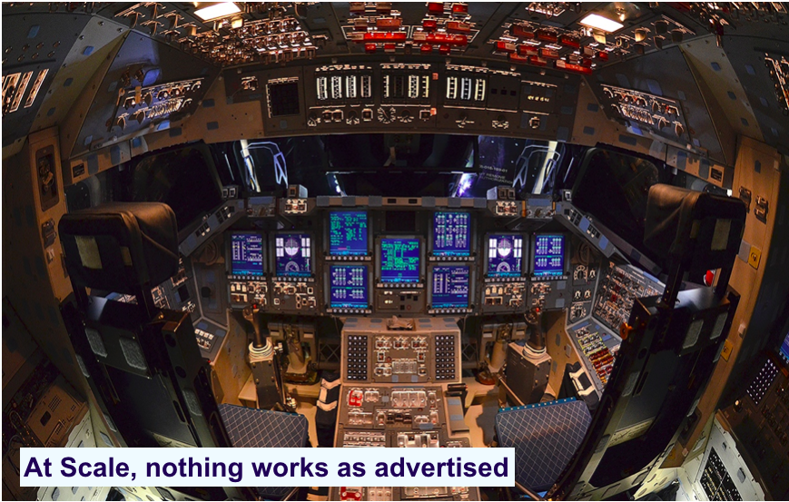

# Solr for Developers
---

## Agenda

| Day   | Agenda                                                                                                 |
|-------|--------------------------------------------------------------------------------------------------------|
| One   | 1. Fundamentals                                                                                        |
|       | 2. Searching                                                                                           |
|       | 3. Indexing                                                                                            |
|       | 4. Schema updating                                                                                     |
| Two   | 1. Relevance                                                                                           |
|       | 2. Extended Features                                                                                   |
|       | 3. Multicore                                                                                           |
|       | 4. SolrCloud                                                                                           |
| Three | 1. Developing with Solr API                                                                            |
|       | 2. Developing With Lucene API                                                                          |
|       | 3. E-Discovery Application                                                                             |
|       | 4. Future Directions                                                                                   |

<!-- {"left" : 2.14, "top" : 1.74, "height" : 4.56, "width" : 5.97, "columnwidth" : [1.79, 4.18]} -->

Notes:

---

## Prerequisites for Solr Dev Class

  * Have background in software development, in particular, web applications

  * Helpful:

    - Know some Java
    - Basic Linux command line skills (we will be working on Amazon EC2 server running Linux)
    - Basic knowledge of Linux command line editors
      - Vi
      - Nano

  * Curiosity!

    - Ask a lot of questions 
    - Questions are MOST WELCOME
    

Notes:

---

## Our Teaching Philosophy

  * Emphasis on concepts & fundamentals
  * API
  * Highly interactive (questions, discussions, etc. are welcome)
  * Hands-on (learn by doing)
  * Everyone gets his/her own server to play with

Notes:

---

## Lots of Labs: Learn By Doing

 <!-- {"left" : 2.05, "top" : 2.05, "height" : 4.97, "width" : 6.16} -->

Notes:

---

## Press all keys to continue

 <!-- {"left" : 5.69, "top" : 1.52, "height" : 5.79, "width" : 4.04} -->

  * Alternatively...
    - Press every key to continue

Notes:

---

## Analogy: Learning To Fly ...

 <!-- {"left" : 0.26, "top" : 1.74, "height" : 6.17, "width" : 9.74} -->

Notes:

---

## Instruction

 <!-- {"left" : 0.26, "top" : 1.74, "height" : 6.17, "width" : 9.74} -->

Notes:

---

## + Flight Time

 <!-- {"left" : 0.26, "top" : 1.74, "height" : 6.17, "width" : 9.74} -->

Notes:

---

## I Will Show You How To Fly!

  * Solid theory.
  * You will get plenty of 'flight time'.
  * Tell you about real world examples.
  * And best practices ...

Notes:

---

## Real World Can Be Complicated...

 <!-- {"left" : 0.26, "top" : 1.74, "height" : 6.17, "width" : 9.74} -->

Notes:

---

## This Will Take A Lot Of Practice

 <!-- {"left" : 0.26, "top" : 1.74, "height" : 6.17, "width" : 9.74} -->

Notes:

---

## About You And Me

  * About Instructor

  * About you
    - Little background
    - What you are hoping to get out of this class
    - A fun fact about you outside of work
      - Hobby
      - Ice cream you like
      - Movie you have seen

Notes:

---

## About the Instructor

 <!-- {"left" : 7.96, "top" : 1.15, "height" : 2.45, "width" : 2.04} -->

  * 10 years+ software development experience.

  * Consulting & Training in search.

  * Hadoop / Big Data for the last seven years.

  * Co-Author of open source  Hadoop book: http://hadoopilluminated.com

  * Open Source stuff: 

  * LinkedIn: https://www.linkedin.com/in/markkerzner

  * Mensa, languages, books, patents, JD, etc.

---

## My search projects

 <!-- {"left" : 8.31, "top" : 1.2, "height" : 1.65, "width" : 1.77} -->

* FreeEed and FreeEedUI – legal search for eDiscovery, using Solr, Lucene, Hadoop
* DARPA Memex
* Cision – scaling up marketing information search, using Solr, Hadoop, HBase
* IHS Petrodata – Lucene search in O&G information

 <!-- {"left" : 0.69, "top" : 5.84, "height" : 1.65, "width" : 3} --> &nbsp; &nbsp;  <!-- {"left" : 4.42, "top" : 6.27, "height" : 0.94, "width" : 5.14} -->

Notes:

---

## Recommended Reading

  * Solr in Action by Trey Grainger and Timothy Potter
and...
  * 'Hadoop illuminated' – open source Hadoop book at http://hadoopilluminated.com/ 

Notes:

---

## Class Logistics

  * Instructor's email: 
  * Slides are here: Adobe Connect
  * Labs are here: Adobe Connect download
  * Servers: will be assigned

Notes:

---

## Image Credits

  * http://aviation-schools.regionaldirectory.us/learn-to-fly-720.jpg
  * http://www.wikihow.com/Become-a-Certified-Flight-Instructor

