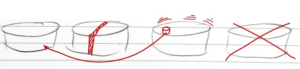

# SolrCloud Autoscaling

---

## Introduction
  * SolrCloud Autoscaling allows us to dynamically adjust cluster based on load.
  * Distinct form Kubernetes Autoscaling
  * Goal of Autoscaling:
    - Management Easier
    - More Automatic
    - More Intelligent
  * Provides Intelligent Defaults

---

## Autoscaling questions
  * When to run cluster management tasks? For example, we might want to add a replica when an existing replica is no longer alive.
  * Which cluster management task to run? For example, do we add a new replica or should we move an existing one to a new node?
  * How do we run the cluster management tasks so the cluster remains balanced and stable?

---

## How to add a replica?
  * Simple example: add a replica
  * API call: `/admin/collections?action=CREATE&name=_name_of_collection_&numShards=1&replicationFactor=3&autoAddReplicas=true`  

---

## Preferences 

 * Cluster preferences allow you to tell Solr how to assess system load on each node. 
 * Guides election of the node(s) on which cluster management operations will be performed.
 * Example: increases replica counts, the least loaded qualified node will be chosen, 
 * Example: When the operation reduces replica counts, the most loaded qualified node will be chosen.
 * Default Cluster Preferences: `[{minimize:cores},{maximize:freedisk}]`

---

## Cluster Policy
 * A **cluster policy** is a set of rules:
   -  for a node, shard, or collection
   - before it can be a taret of an operation.
 * Example: rule `{"cores":"<10", "node":"#ANY"}` 
   -  any node *must* have less than 10 Solr cores in total, regardless of which collection they belong to.

 * Metrics are the criteria for the rules:
   - system load average
   - heap
   - free disk
   - etc
 * Violation: when node/shard/collection does not satisfy the rule.
   - will cause operation to **fail**.
   - You can override with `"strict":false`


---


## Triggers
 * Asynhronous events:
   - node joining cluster
   - node leaving cluster
   - etc
 * Triggers have *actions*:
   - operation to handle the trigger
   - operation must reflect cluster policy.
 * `autoAddReplica` parameter:
   - Watches for node going away
   - Executes set of actions to move replicas

---


## Trigger Actions
 * A trigger executes actions that tell Solr what to do in response to the trigger. Solr ships with two actions that are added to every trigger by default. 
 *  2 default trigger actions:
    - ComputePlanAction - computes cluster management operationsk
    - ExecutePlanAction - Executes on cluster

---


## Listeners
 * An Autoscaling listener can be attached to a trigger. 
 * Solr calls the listener each time the trigger fires as well as before and after the actions performed by the trigger. Listeners are useful as a call back mechanism to perform tasks such as logging or informing external systems about events. 
 * Example: listener is automatically added by Solr to each trigger to log details of the trigger fire and actions to the .system collection.

 * You can learn more about Listeners in the section Autoscaling Listeners.


---

## Autoscaling APIs
 * The autoscaling APIs available at /admin/autoscaling can be used to read and modify each of the components discussed above.


## Overview
* Provides good defaults
* Results in a `SolrCloud` cluster remaining balanced and stable in cluster change events
* Easier, more automatic and intelligent

 <!-- {"left" : 2.56, "top" : 2.71, "height" : 1.18, "width" : 5.13} -->


* Example:
 Adding a replica for a `SolrCloud` collection When a node containing an existing replica goes down

Notes:


---

## Goals

* Making cluster management easier
* More automatic
* More intelligent
* Providing good defaults such that the cluster remains balanced and stable in the face of different events such as a node joining the cluster or leaving the cluster

Notes:


---

## Use Cases

* Problems will be addressed:
  - Deciding when to run cluster management task.
    - Example: Fault tolerance
  - Deciding which cluster management task to run
    - Example: adding a new replica or move to a new node
  - How to run the cluster management to provide balance and stability for the cluster

Notes:


---

## A Problem

* Maintaining three replicas for every shard:
```java
replication Factor = 3
```
 <!-- {"left" : 0, "top" : 1.54, "height" : 0.61, "width" : 4.99} -->

* Problem: What if a node with replica(s) crashed?
* Solution: We need additional replicas to replace
* There is an simple way. See the next slide

 <!-- {"left" : 3.38, "top" : 4.25, "height" : 2.89, "width" : 3.12} -->

Notes:


---

## Adding Replicas Automatically

* Additional parameter when creating a collection with `CREATE` command of the collection API

```java
autoAddReplicas = true
```
<!-- {"left" : 0, "top" : 1.92, "height" : 0.6, "width" : 4.91} -->

* Solr monitors this collection
* Adds new replica on other nodes after 30 sec. waiting
* Example

```java
/admin/collections?action=CREATE&name
```
<!-- {"left" : 0, "top" : 4.37, "height" : 0.54, "width" : 6.89} -->

```java
=_name_of_collection_&numShards =1&replicationFactor =3&autoAddReplicas=true
```
<!-- {"left" : 0, "top" : 5.38, "height" : 0.41, "width" : 10.25} -->

Notes:


---

## Cluster Preferences

* Will be applied on all collections
* Is a set of conditions that helps `Solr` select nodes that either maximize or minimize given metrics
* Example
```java
{minimize:cores}
```
<!-- {"left" : 0, "top" : 2.82, "height" : 0.72, "width" : 4.55} -->

* Helps `Solr` select nodes that the number. of cores on each node is minimized
* To reduce the overall load on the system

Notes:


---

## Cluster Policy

* A set of conditions that nodes, shards and collections must satisfy
* Are applied across the cluster
* Example

```java
{"cores":"<5","node":"#ANY"}
```
<!-- {"left" : 0, "top" : 2.76, "height" : 0.72, "width" : 7.25} -->


Any node must have less than 5 `Solr` cores in total regardless of which collection they belong to

Notes:


---

## Other Metrics

* System load Average
* Heap usage
* Free disk space

Notes:


---

## Collection-Specific Policies

* `set-policy` API is used to create a new policy
* `policy = <policy_name` parameter of `CREATE` command

```java
/admin/collections?action=CREATE&name= myCollection&
```
<!-- {"left" : 0, "top" : 2.58, "height" : 0.59, "width" : 10.25} -->


```java
numShards=1&replicationFactor =2&policy=myPolicy
```
<!-- {"left" : 0, "top" : 3.43, "height" : 0.63, "width" : 10.25} -->


* Associates `myPolicy` with `myCollection`

Notes:


---
## Conditions
* The collection follows all conditions:
  - Cluster policy
  - Collection specific policy. Only if the collection is addressed by this policy
  - Cluster preferences

Notes:


---

## Triggers

* Watches for events like node joining or leaving the cluster
* Executes a set of action that compute and execute a `plan`
* `plan` is a set of operations to change the cluster
* Policies and preferences are respected

Notes:


---

## Example

* `autoAddReplicas` parameter we talked about
* Automatically creates a trigger
* Trigger watches for a node going away
* When the trigger fires, it executes the plan
* Here plan is moving all replicas to new nodes

Notes:


---

## Trigger Actions

* A trigger executes actions that tell Solr what to do in response to the trigger.
* Two actions are added to every trigger by default:
- `ComputePlanAction` computes the cluster management operations necessary to stabilize the cluster
- `ExecutePlanAction` executes them on the cluster

 <!-- {"left" : 2.72, "top" : 4.3, "height" : 2.62, "width" : 4.49} -->

Notes:


---

## Listeners

* Can be attached to a trigger
* Solr calls it every time the trigger fires
* As a call back mechanism
* Example: Logs details about trigger fire to `.system` collection

 <!-- {"left" : 2.75, "top" : 3.44, "height" : 3.57, "width" : 4.75} -->

Notes:


---

## Autoscaling APIs

* Is available at:
`/admin/autoscaling`
* can be used to read and modify each of the components discussed above

Notes:


---
