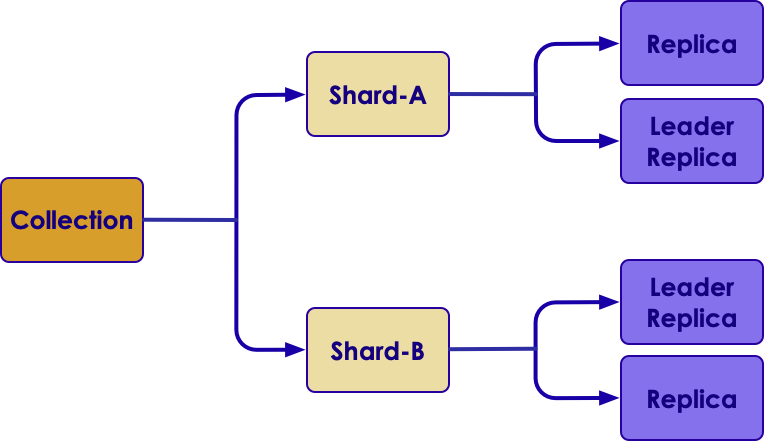
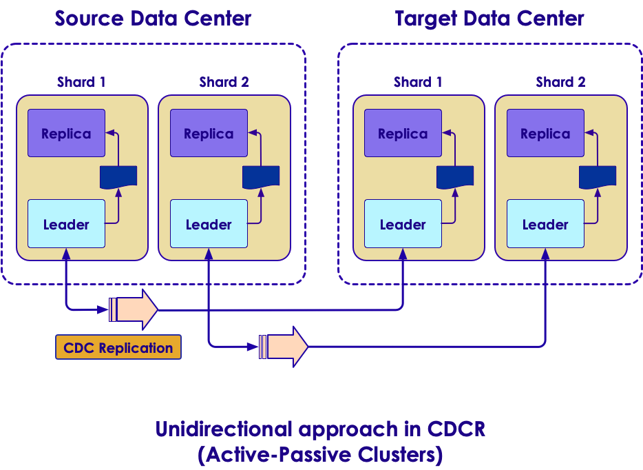
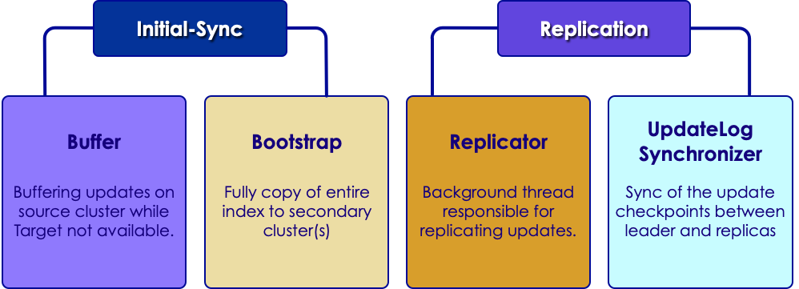
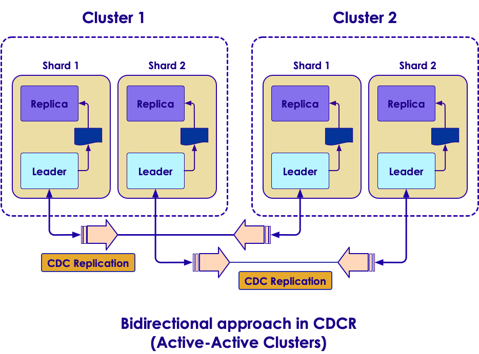
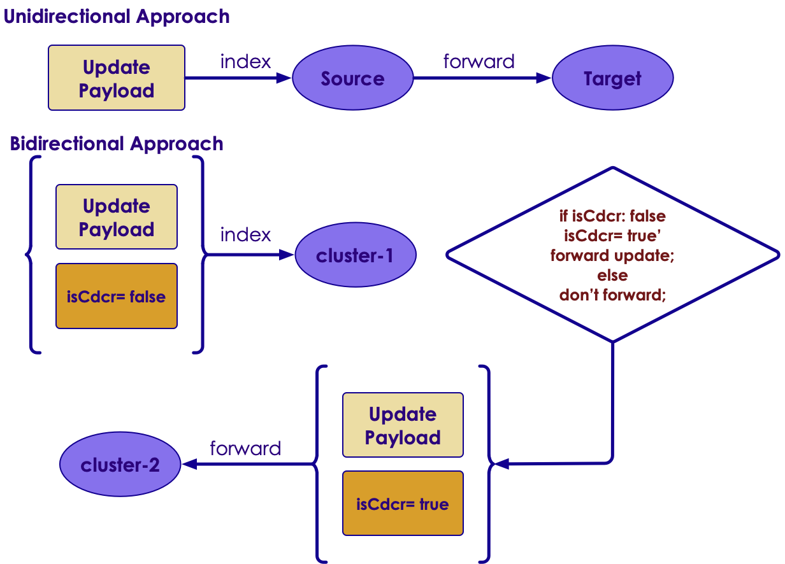
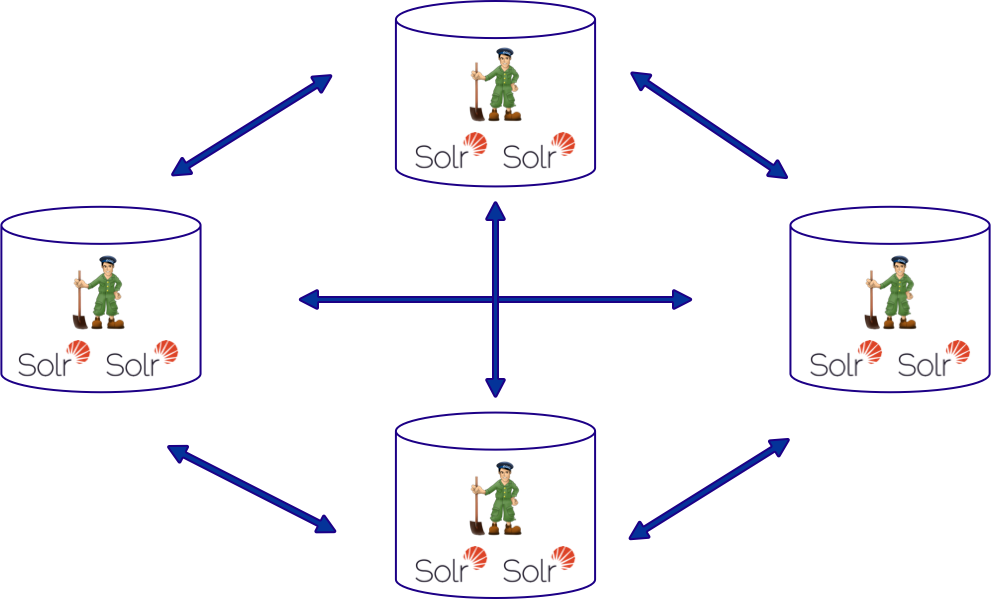

# CDCR

---

## Uni-Directional 


---

## Uni-Directional Architecture
 * A shard leader receives a new update that is processed by its update processor chain.
 * The data update is first applied to the local index.
 * Upon successful application of the data update on the local index, the data update is added to CDCR’s Update Logs queue.
 * After the data update is persisted to disk, the data update is sent to the replicas within the data center.
 * After Step 4 is successful, CDCR reads the data update from the Update Logs and pushes it to the corresponding collection in the Target data center. This is necessary in order to ensure consistency between the Source and Target data centers.
 * The leader on the Target data center writes the data locally and forwards it to all its followers.

## Bi-directional Architecture

i

## Securing Your Data

 * "Don't put all your eggs in one basket!"
 * Having one copy of your data is not safe
 * Do we need to make a copy of the data?
   - How do we ensure that data is not corrupted?
   - How do we keep backup in sync?
   - How do we recover from backup if needed?


Notes:


---
## Disaster Recovery

 <!-- {"left" : 0.78, "top" : 1.08, "height" : 5.8, "width" : 8.7} -->


Notes:


---
## Disaster Recovery Strategies

| Option                                                | Risk                                                                                                                                                                                                          |
|--------------------------------------------------     |-------------------------------------------------------------------------------------------------------------------------------------------------------------------------------------------------------------  |
| Index to two instances in different data centers      | Often require additional custom development (may need messaging service like Apache Kafka) - No guarantee that the instances are identical                                                                    |
| Disk Mirroring                                        | - What if entire index, file is not copied?  - What state is the disk at the time of abrupt event? - In either case, entire index gets corrupted                                                              |
| Regular Backups                                       | - Works if you have low volume index updates with controlled schedule - Managing backups, storing offsite and retrieving quickly when needed is a challenge - If backup is incomplete, index gets corrupted   |
| Backup API                                            | - Available in Solr at collection level - Takes backup of entire data of collection along with configurations - Prone to failure at live indexing and abrupt event                                            |


Notes:


---
## What is CDCR?
* Cross Data Center Replication (CDCR)
* Allows to
  - create multiple SolrCloud data centers
  - keep them in sync in case they are needed at a future time
* Now suited for separated data clusters connected by an expensive pipe
  - Because of near-real-time traffic
* Rather
  - CDCR features exist to help mitigate the risk of an entire data center outage


Notes:


---
## CDCR Details
* Source data center
* Target data center
* Source => Target
* Not Target => Source


Notes:


---
## CDCR Glossary

* Zookeeper: Centralized service for maintaining configuration and cluster state info
* Collection: A complete logical index in a SolrCloud
* Shard: A logical piece (or slice) of a collection
* Replica: One copy of a shard


Notes:


---
## CDCR Glossary contd
* Node
  - A JVM instance running Solr; a server
* Cluster
  - A set of Solr nodes managed as a single unit by a ZooKeeper ensemble, hosting one or more Collections.
* Leader
  - Each shard has one node identified as its leader
  - All the writes for documents belonging to a shard are routed through the leader
* Replica
  - A copy of a shard for use in failover or load balancing
  - Replicas comprising a shard can either be leaders or non-leaders
* Follower
  - A convenience term for a replica that is not the leader of a shard.
* Collection
  - Multiple documents that make up one logical index
  - A cluster can have multiple collections.
* Updates Log
  - An append-only log of write operations maintained by each node.


Notes:


---
## CDCR Architecture

 <!-- {"left" : 0.96, "top" : 1.83, "height" : 4.31, "width" : 8.32} -->

Notes:


---
## Cross Data Center Replication (CDCR)
* Version 6 or later
* Supports unidirectional (active-passive) and bidirectional (active-active)
* At collection level data is replicated not configurations
* APIs:
```bash
/cdcr/action=START
/cdcr/action=STOP
/cdcr/action=STATUS
```
<!-- {"left" : 0, "top" : 3.61, "height" : 1.67, "width" : 6.17} -->

Notes:

---
## Image Of Unidirectional
* Direction: source to target
* If source goes down, you need to point querying and indexing to target cluster collection

 <!-- {"left" : 2.02, "top" : 2.52, "height" : 4.54, "width" : 6.21} -->


Notes:


---
## Concept
* Updating forwards from source data center leader nodes to target data center leader nodes at regular intervals
* Each update operation contains unique `version`, time-based import clock
* Example: `_version_`:`1601701044254525698`

Notes:


---
## Concept, contd

* The unique `version` is maintained as checkpoint, as ephemeral node on source and persistent node on target across all solr nodes

* No need any additional network traffic
* The unique ‘version’ is maintained as checkpoint, as ephemeral node on source and persistent node on target across all solr nodes.

Notes:


---
## Core Components

 <!-- {"left" : 0.35, "top" : 2.03, "height" : 3.45, "width" : 9.54} -->

Notes:


---
## Image Of Bidirectional
* Indexing and querying must be done on a single cluster
* Second cluster is used when the first cluster is down

 <!-- {"left" : 1.38, "top" : 1.83, "height" : 5.45, "width" : 7.45} -->

Notes:


---
## CDCR Bidirectional Approach
* Decentralized, no source nor target
* No single point of failure anymore
* Indexing can be redirected to failover clusters swiftly without much human effort
* Overall traffic can be distributed to multiple data centers based on their geographical location to avoid network delay, not applicable for real-time

Notes:


---
## Update Strategy
* Must provide consistency between source and target data centers
* Minimal network traffic


 <!-- {"left" : 1.72, "top" : 2.37, "height" : 4.9, "width" : 6.8} -->

Notes:


---
## Decentralized Multi-Cluster Setup

* Avoids single point of failure

 <!-- {"left" : 1.03, "top" : 1.83, "height" : 5.0, "width" : 8.2} -->

Notes:


---
