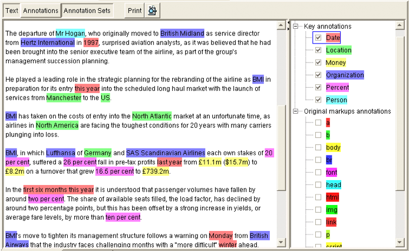

# Solr – Modern development environment
---

## Section Objectives

  * Provide an overview of modern development environment
  * Make sure we are on the same page and compare notes
  * Ensure software development success

Notes:

---

# Agile approach

---

## Agile approach

  * Individuals and interactions 

    - over processes and tools

  * Working software 

    - over comprehensive documentation

  * Customer collaboration 

    - over contract negotiation

  * Responding to change 

    - over following a plan

Notes:

---

# Solr API

---

## Lucene index

  * Can we create a Lucene index?

    - https://lucene.apache.org/core/6_3_0/index.html
    - Live demo 
    - (Or use this, https://github.com/shmsoft/FreeEed/blob/master/freeeed-processing/src/main/java/org/freeeed/data/index/LuceneIndex.java)

  * Can we see it?
    - Yes, use Luke

Notes:

---

## Lab: Luke

* Overview: we will use a tool called Luke, in order to analyze Lucene index.
* Pre-requisites: solr-labs/install/README.md   
* Approximate time: 30 minutes
* Instructions: solr-labs/luke/README.md

Notes:

---

## Solr API

  * SolrJ: Java library to talk to Solr

     - https://cwiki.apache.org/confluence/display/solr/Using+SolrJ
  * Connect
  * Perform queries
  * Test with EmbeddedSolrServer

Notes:

---

## Solr API

  * Live Demo
  * Lab: https://github.com/elephantscale/solr/tree/master/solrapi

Notes:

---

## Lab: SolrJ

  * Please do the steps in this lab
  * Solr-labs/solrapi

Notes:

---

# Not just SOLR

---

## Beyond IR – Information Extraction

 <!-- {"left" : 0.52, "top" : 1.71, "height" : 5.66, "width" : 9.2} -->

Notes:

---

## GATE

  * General Architecture for Text Engineering
  * Entity extraction (people, places, organizations)
  * Trainable
  * Programmable

  * Site: https://gate.ac.uk/
  * Competing products (such as LingPipe)
  * Commercial entities (such as Sintelix)

Notes:

---

## Worthy of mention

  * ElasticSearch
  * DataStax Enterprise: Solr+Cassandra
  * Cloudera Solr integration
  * Blur

Notes:

---

## ElasticSearch

  * SOLR's competitor
  * SOLR is “true open source,” with a community behind it
  * Thus, government agencies prefer SOLR (personal view)
  * ElasticSearch came up as “search done right”
  * For a while, ElasticSearch was moving faster
  * By now, they have evened out
  * Note : Cloudera integrated SOLR, not ES

Notes:

---

## DataStax enterprise

  * DataStax Enterprise: Solr+Cassandra
  * Proprietary 
  * Why?

  * Problem:
 
    - Often, you need a NoSQL for metadata fields
    - And search for text-based search
    - How do you keep them in sync?

  * Solution:

    - Store SOLR index (Lucene) in Cassandra
    - Re-index on the back end (triggers)

Notes:

---

## Cloudera SOLR integration

  * Say, you have a lot of data in HBase
  * How do you make it searchable?

  * Cloudera has added SOLR to index HBase fields
  * And sync's them up with fields change

Notes:

---

## What is Blur?

  * Blur= Lucene + Hadoop (HDFS)
  * Take out SOLR!
  * Store Lucene indices in HDFS
  * Serve Lucene indices in memory
  * Blur orchestrates this 

  * Top level Apache project

  * Big implementation at Pearson training

Notes:

---

# SOLR future

---

## SOLR 2016 in review

  * From Google Search Appliance to SOLR
    - Example: InfoBlox
  * Data Platform on SOLR (LucidWorks Fusion)
    - Example: County of Sacramento
  * SOLR and Spark
  * SOLR 4-5-6

Notes:

---

## From GSA to SOLR

 <!-- {"left" : 6.54, "top" : 1.27, "height" : 0.99, "width" : 3.52} -->

  * What was good about GSA?
    - Immediate results
    - Easy to deploy
    - Natural language query
  * What was lacking in GSA
    - Customization
    - Knowledge of the specific enterprise needs
    - Cost-effective scalability
  * What LucidWorks claims
    - Better relevancy with Fusion
      - And you still control your data
    - Cost effective at scale

Notes:

---

## Building agency platform on SOLR

 <!-- {"left" : 8.94, "top" : 1.01, "height" : 1.01, "width" : 1.22} -->

  * County of Sacramento (withdrawn?)
  * NASA
    - 18,000 people work at NASA
    - New hires need to be brought up to speed quickly
    - All manuals are input into SOLR
    - Provides relevant answers from the most relevant docs
  * USPTO
    - Patent search

 <!-- {"left" : 8.06, "top" : 5.24, "height" : 0.56, "width" : 2.13} -->

  * DARPA/Memex
    - 300 hundred researchers
    - Dozens of projects
    - Store all data into common format in SOLR
    - Any group can query the other group's work

Notes:

---

## SOLR and Spark

 <!-- {"left" : 7.28, "top" : 1.15, "height" : 1.45, "width" : 2.71} -->

  * What is Apache Spark?
  * In-memory computation engine
  * Can replace Hadoop, 100 time s faster
  * Spark 2 offers DataFrames
    - Think of them as data with description
  * Each query into Solr can be transformed into Spark DataFrame

Notes:

---

## Conclusion

  * SOLR tries hard to be state-of-the-art
  * It integrates with other libraries
    - Real time
    - Spark
    - Machine learning
  * Take SOLR out and remain with Lucene alone?
    - That is what Blur has done
    - But the current trend seems to keep SOLR

Notes:

