# Solr: Extended Features
---

## Section Objectives

  * Being able to set up extended features, such as spell-check, suggestions and highlighting

  * Determine the best Multi-language approach

Notes:


---

# More-like-this

---

## More-like-this – 2	

  * Using Solr way:

    - http://wiki.apache.org/solr/MoreLikeThis	

    - TermVectors in the schema.xml for fields you will use for similarity

`<field name="cat" ... termVectors="true" />`

  * Constructs a Lucene query based on terms in a document.
  * Pulling terms from the defined list of fields (mlt.fl parameter in TermVectors)

Notes:


---

## More-like-this – better way

  * Based on document clustering

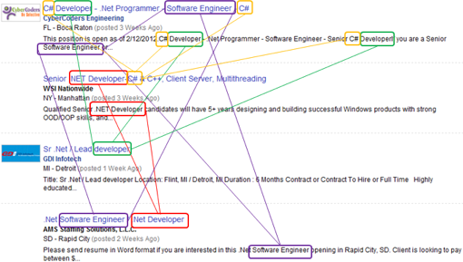 <!-- {"left" : 0.97, "top" : 2.39, "height" : 4.86, "width" : 8.32} -->


Notes:


---

## More-like-this

  * Experiment
  * Download a slide deck from SlideShare.net (when you are logged in)
  * Get the "More like this" email
  * Analyze what's "more like this"
  * Using Solr way:
    - http://wiki.apache.org/solr/MoreLikeThis	


Notes:


---

## Clustering in Solr - Carrot


 <!-- {"left" : 1.44, "top" : 1.78, "height" : 5.52, "width" : 7.37} -->

Notes:


---

## Clustering in Solr – with Carrot


 <!-- {"left" : 0.58, "top" : 1.88, "height" : 5.31, "width" : 9.09} -->


Notes:


---

## Clustering in Solr – setup


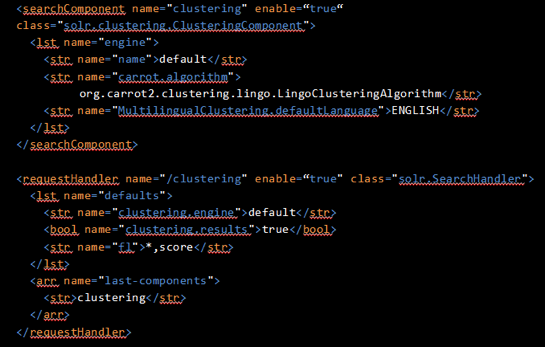 <!-- {"left" : 0.98, "top" : 1.89, "height" : 5.29, "width" : 8.29} -->


Notes:


---

## Clustering in Solr – result


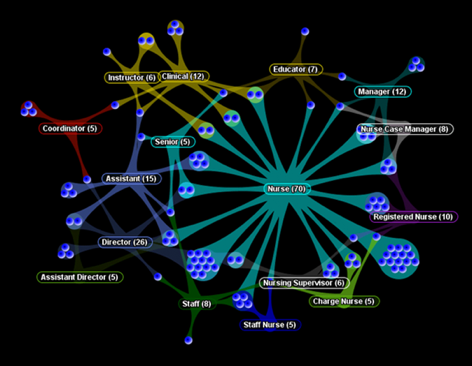 <!-- {"left" : 1.55, "top" : 1.76, "height" : 5.56, "width" : 7.15} -->

Notes:

http://project.carrot2.org/applications.html


---

## Lab: Carrot clustering and Solr

* Overview: We will install Carrot clustering.
* Pre-requisites: solr-labs/install/README.md   
* Approximate time: 30 minutes
* Instructions: solr-labs/clustering/README.md

Notes:


---

# Geospatial
---

## Geospatial search

  * Location-based searching
  * Index a field in each document containing a geographical point (a latitude and longitude)
  * At query time…
    - filter out documents that do not fall within a specified radius of some other point


Notes:


---

## Geospatial search - implementation

  * Old way:
   - Distance from point
  * New way
   - Based on shapes
   - Arbitrarily complex polygons


Notes:


---

## Geospatial search - setup

  * In schema.xml

```xml
<fieldType name="location"
class="solr.LatLonType"
subFieldSuffix="_coordinate" />
```
<!-- {"left" : 0, "top" : 1.62, "height" : 1.36, "width" : 7.58} -->


Notes:


---

## Geospatial search – document


 <!-- {"left" : 0.38, "top" : 1.59, "height" : 5.88, "width" : 7.23} -->

Notes:


---

## Geospatial search – result


 <!-- {"left" : 1.22, "top" : 1.67, "height" : 5.73, "width" : 7.82} -->


Notes:


---

# Spell checking

---


## Spell checking - result


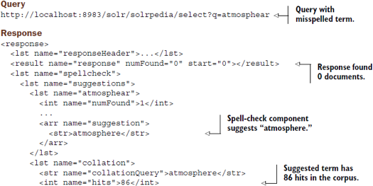 <!-- {"left" : 0.36, "top" : 1.68, "height" : 4.54, "width" : 8.35} -->

Notes:


---

## Spell checking - setup


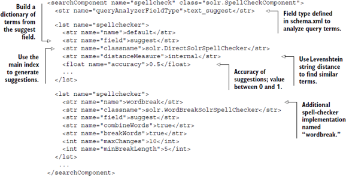 <!-- {"left" : 0.36, "top" : 1.68, "height" : 4.56, "width" : 8.86} -->


Notes:


---

## Suggestions

  * Misspellings: 
    - implemented with spellchecker(s)
  * Type-ahead suggestions
    - Solr suggest

Notes:


---

## Solr suggester - setup


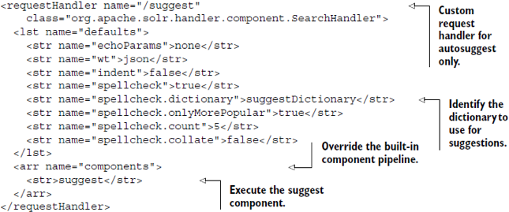 <!-- {"left" : 0.36, "top" : 1.68, "height" : 3.98, "width" : 9.33} -->

Notes:


---

## Solr suggester - response


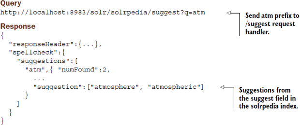 <!-- {"left" : 0.36, "top" : 1.68, "height" : 3.85, "width" : 8.95} -->

Notes:


---

# Highlighting
---

## Benefits of hit highlighting

  * Pinpoint the text which lead to the document being selected
  * Find the portion of the document to show on the screen

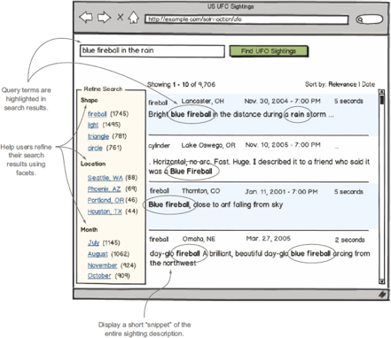 <!-- {"left" : 1.9, "top" : 2.64, "height" : 5.44, "width" : 6.46} -->


Notes:


---

## Example: FreeEed

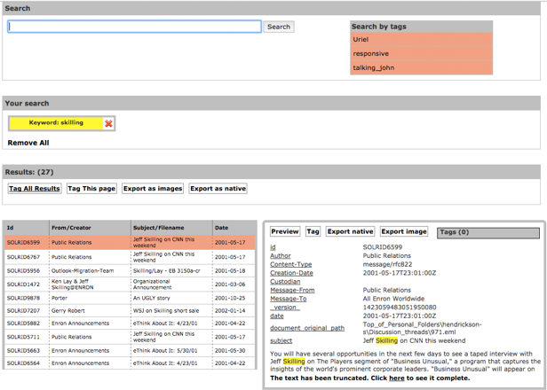 <!-- {"left" : 0.85, "top" : 1.45, "height" : 6.17, "width" : 8.55} -->


Notes:


---

## Highlighting

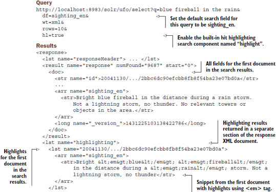 <!-- {"left" : 0.46, "top" : 1.68, "height" : 5.47, "width" : 8.4} -->


Notes:


---

## How hit highlighting works


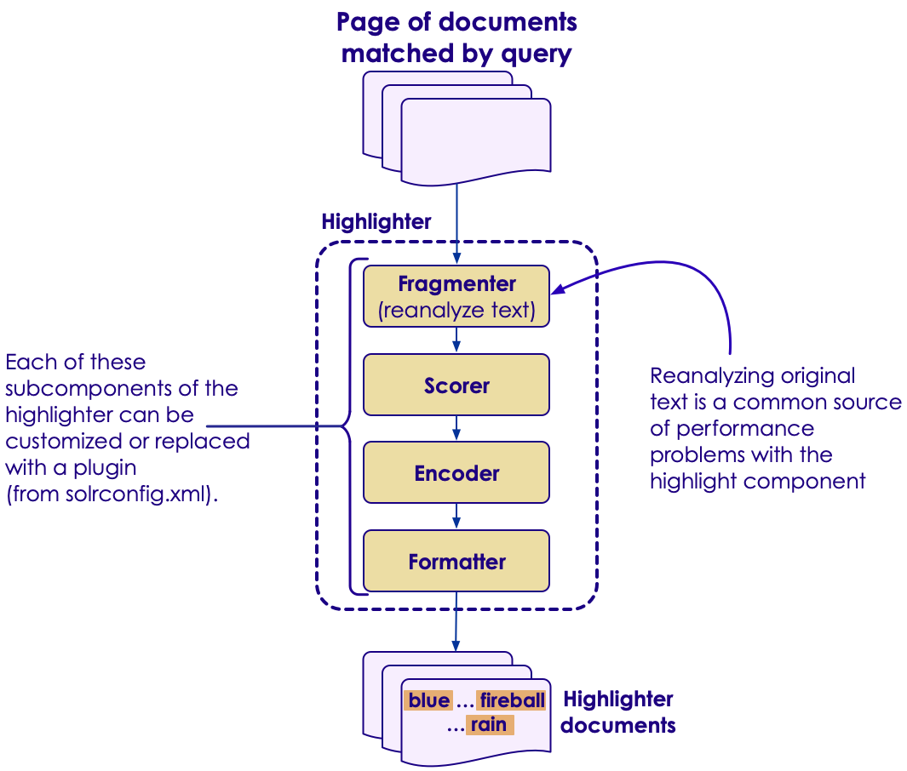 <!-- {"left" : 1.82, "top" : 1.51, "height" : 6.62, "width" : 6.61} -->


Notes:


---

## Re-analyzing the original text

  * Why reanalyze the original text?

  * Reason 1
    - Find the indexed words
    - Compare them to the original text
    - Decide on highlighting

  * Reason 2
    - Find positions of the words
    - Remember, some words were taken out 


Notes:


---

## High highlighting - fragmenting

  * Find relevant snippets
  * Ranked, formatted fragment
  * Text is broken in fragments
  * Fragments are ranked
  * The best ones are returned as snippets
    - GapFragmenter – based on a target length
    - RegexFragmenter, such as 


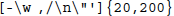 <!-- {"left" : 2.44, "top" : 5.11, "height" : 0.7, "width" : 5.37} -->

Notes:


---

## Lab: Experiment with hit highlighting
* Overview: We will create our own Solr application
* Pre-requisites: solr-labs/install/README.md   
* Approximate time: 30 minutes
* Instructions: solr-labs/clustering/README.md
Notes:


---

## Lab: contd


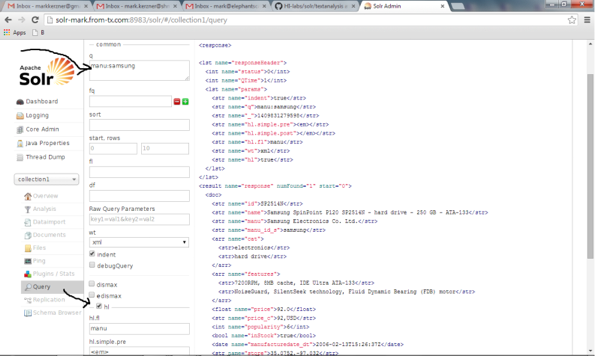  <!-- {"left" : 0.57, "top" : 1.95, "height" : 5.17, "width" : 9.1} -->


Notes:


---

# Pseudo-fields
---

## Pseudo-fields

  * Results of functions
    - `geodist(sfield, latitude, longitude)`
  * Dynamic fields (such as relevancy score)
    - Example:
    -`/select?...&fl=*,score`

Notes:


---

## Pseudo-joins

  * Equivalent to an SQL nested query

  * Example:

    - `/select?fl=RETURN_FIELD_1, RETURN_FIELD_2&q={!join from=FROM_FIELDto=TO_FIELD}CONSTRAINT_FIELD:CONSTRAINT_VALUE MeaningSelect RETURN_FIELD_1, RETURN_FIELD_2 FROM join-data WHERE TO_FIELD IN (SELECT FROM_FIELD from join-data WHERE CONSTRAINT_FIELD = 'CONSTRAINT_VALUE')`


Notes:


---

## When would you use a join?

  * Index of stores
  * Index of user action
  * Join on store, for users that have acted on (visited) that store

Notes:


---

# Multi-language
---

## Multi-language: multi-core


  <!-- {"left" : 0.29, "top" : 1.67, "height" : 3.93, "width" : 9.33} -->

Notes:


---

## Multi-language core +-

  * Pros:
    - Fast search across many languages—each core  in parallel.
    - Supports any query parser - searching on a single field.
  * Cons:
    - You have to manage multiple cores
    - Doesn't support multilingual documents 
    - Relevancy scores not precise


Notes:


---

## Multiple languages per field

  * Pros:
    - Supports any combination of languages in a single field
    - Works in a single Solr core or sharded Solr setup
    - Supports any query parser because it only requires searching on a single field
  * Cons:
    - Not available out of the box, requires custom code


Notes:


