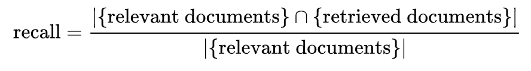

# IR Metrics
---

## How to Measure Search?
 * How fast does it index
   - Number of documents/hour
   - (Average document size)

 * How fast does it search
   - Latency as function of query size
 * Expressiveness of query language
   - Able to express complex information needs
   - Speed on complex queries
 * Uncluttered UI
 * Free?

---

## Measurability
 * All these are *measurable*: we can *quantify* terms like speed or size.
 * What is the real measure?  **User Happiness**
   - What is this?
   - Speed is importnat
 * How can we *quantify* how **User Happieness**

---

## IR Metric Types

  * Online: Data we gather from the system:
    - Usually from log files
    - Data mining
  * Offline: Data we obtain by judging::
    - Supervised Training Examples:
      -  This input should yield this result
    - After the fact judging:
      - This result was relevant to the search term.

Notes:

---

## Online Metrics

 * These metrics are mined from the data itself
   - No need for supervised interaction
   - Human "right/wrong"

 * Session abandonment rate
   - Session abandonment rate is a ratio of search session which do not result in a click.

 * Click-through rate (CTR)
   - The lifeblood of Silicon Valley!
   - ratio of users who click on a specific link to the number of total users who view a page, email, or advertisement. 

---

## Online Metrics Contd

 * Session Success Rate 
   - The ratio of user sessions that lead to a "success".
   - How do we measure success?
     - Purchase
     - Dwell time (how long a user views the content)
     - Click versus Copy/Paste? 

 * Zero result rate
   - ratio of SERPs with zero results
   - Indicates data is not in index.

Notes:

SERP = Search Engine Results Page

---

## Offline Metrics
  * These involve a human judge
    - Defines whether or how much the term was relevant to me.
  * Subjective:
    - A search for "Java" could be the computer language, coffee, or the Indonesian island.
    - How do we determine a "hit" versus a "miss"
  * Often Binary, (Hit/Miss), (Thumbs Up, Thumbs down)
    - Either the search was "relevant", or "not relevant"
  * Sometimes there is a "score"
    - On a scale of 1 to 5, this was a 5.
    - Of all these documents, this is the most relevant to me.

---

## Precision

  * **Precision**: Fraction of retrieved docs that are relevant to user’s information need
    - In short, how much junk do I get?
  * More precisely, fraction of documents judge *relevant* to user's need.

 <!-- {"left" : 2.04, "top" : 3.14, "height" : 0.84, "width" : 6.94} -->

  * For example, let's say I search for *"curry"* and I am delivered 10 results.
    - I'm really looking for Indian food recipes (relevant)
    - But, I end up getting a few results about NBA basketball. (not relevant)
    - All in all, 6 of my results are *relevant* to me. 
      - 4 are not.
    - My Precision is `0.6`

---

## Precision at k

  * Precision can be measured at each retrieval.
    - So what I can do is measure precision for every result returned.
    - This is precision at k, or `P(k)`
  * Let's say the first search result gave me a nice recipe! I am happy.
    - My precision at result 1 is `1.0`
  * My second result is **not** relevant. It is about basketball
    - My precision at result 2 is `0.5`
    - Remember, precision is cumulative.
  * Problem: P(k) doesn't properly penalize search results lower in the list

---

## Recall

  * **Recall** tells me what fraction of relevant documents were returned by a query
    - In short, did any "good stuff" get left out?
    - What was left on the table?

 <!-- {"left" : 3.98, "top" : 2.94, "height" : 0.8, "width" : 5.93} -->

  * aka *Sensitivity:* Probability a relevant document is returned by the query.
  * Trivial Solution: Return *all* documents
    - But that would have precision very low
  * Example, say my search engine indexes 100 pages. 20 of them are relevant. 
    - My query returns 10 results, 5 of which are relevant
    - My recall is `5/20 = 0.25`

---

## Recall and Modern Search Engines

 * Modern Search engines index literally billions of pages
 * Queries return 1000s (not billions) of results
   - Most of the 1000s of results are never seen by the user
   - They are buried deep in the results
 * Measuring recall this way is not all that useful (usually very small)
 * We will define recall a different way:
   - Take the first N results (say, the first page)
   - Assume the first P pages results reflects *all* documents
 * So, say each page is 10 results. We can look at the first 5 pages (50 results)
   - Say 5 results on the first page are relevant. 
   - And say there are 20 total relevant results on all 5 pages
   - So recall would be `5 / 20 = 0.25`

Notes:

---
   

## Fallout

 * The proportion of *non-relevant* documents retrieved, out of all non-relevant documents

<!-- {"left" : 2.51, "top" : 2.16, "height" : 1, "width" : 7.55} -->

 * Probability that a non-relevant document is returned by the query.
 * Related to *specificity* -- it is (1-specificity)

Notes:

---

## F-Score

 * F-Score is a weighted harmonic mean of precision and recall.
 * The most common is F1, where precision and recall are balanced.

<!-- {"left" : 6.07, "top" : 2.1, "height" : 1.12, "width" : 4.01} -->

 * F-Score takes into account *both* precision and recall
 * Precision / Recall are in tension
   - Increasing recall can mean decreasing precision (by returning "everything plus the kitchen sink"0
   - Increasing precision can mean delivering only a few results
     - But that could mean leaving out an important result.

Notes:

---

## Average Precision at K
 * We usually have a ranked list of results. 
 * We can calculate Precision and Recall at K
 * For example:
   - Precision and recall at result 1, again precision and recall at result 2.
 * For the results:
   - The first result should have high precision and low recall)
   - Subsequent results will likely give lower precision and higher recall.
   - The "final" result will have low precision and higher recall

Notes:

---

## Precision Recall Curve

 * We can plot the curve for precision versus recall for all of our first N search results 
 * The plotted points will have a precision recall curve.

<!-- {"left" : 1.83, "top" : 2.87, "height" : 5.05, "width" : 6.59} -->

---

## Average Precision or AUC
 
 * The Average Precision is the Area Under the Curve (AUC) of The Precision-Recall Curve
 * We can measure the AUC as a metric. (Higher the better!)
 * The way we define this is as follows:

<!-- {"left" : 2.32, "top" : 3.89, "height" : 1.87, "width" : 5.62} -->

---

## Lab: Precision And Recall Of Search Engines

- Overview: We will practice measuring the performance of search engines, treating them is IR (information retrieval) systems.
We will look at the two major metrics: precision and recall.
- Pre-requisites: None  
- Approximate time: 30 minutes
- Instructions: `solr-labs/intro/1-IR.md`

Notes:
