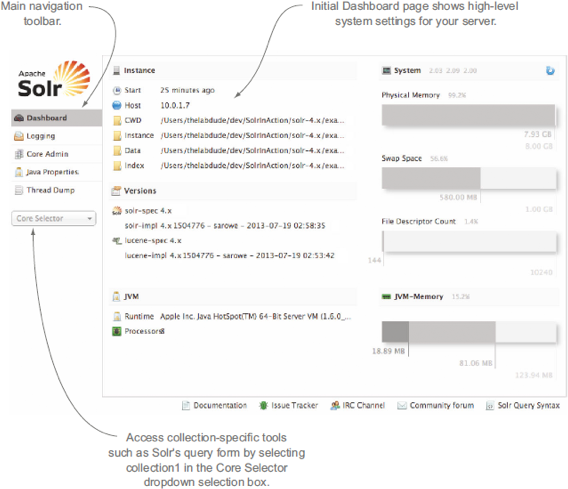
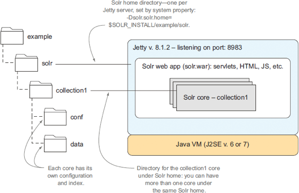
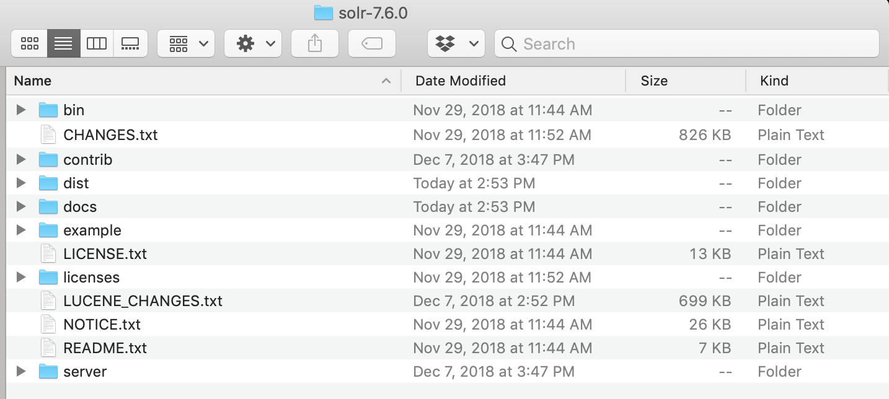
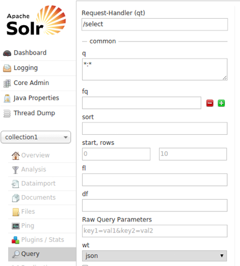
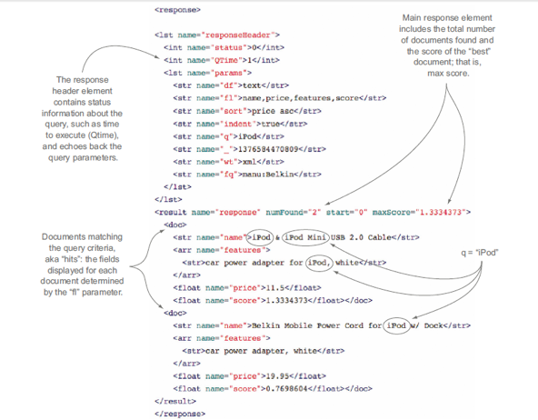
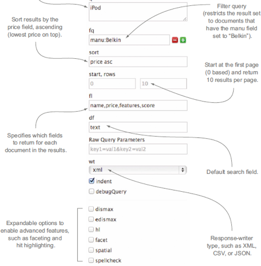
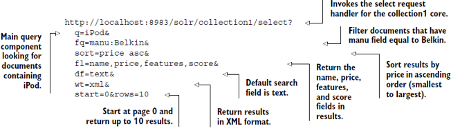

# Solr Install 

---

# Installing And Running Solr

---

## Installing Solr

 * Solr can be downloaded from its website
   - http://lucene.apache.org/solr
   - Current Version is 7.6
 * Lucene library can also be installed
   - http://lucene.apache.org/

---

## Lab: Solr install

- Overview: we will practice the installation of the Solr server.
- Pre-requisites: Java 1.8 or later  
- Approximate time: 30 minutes
- Instructions: solr-labs/solr-intro/1-install.md

Notes:

---

## Lab, contd

 <!-- {"left" : 1.18, "top" : 0.92, "height" : 6.3, "width" : 7.61} -->

Notes:

---

## Solr Example Structure

 <!-- {"left" : 0.71, "top" : 1.34, "height" : 5.36, "width" : 8.83} -->

Notes:

---

## Directory Layout

 <!-- {"left" : 1.02, "top" : 2.14, "height" : 3.69, "width" : 8.21} -->

---

## Directory Layout
* After installing Solr, you’ll see the following directories and files within them:

* **bin/** :  This directory includes several important scripts that will make using Solr easier.
  -  `solr` and `solr.cmd` : start and stop Solr, create  collections or cores, configure authentication, work with configuration files in SolrCloud.
  - `post` : The PostTool, which provides a simple command line interface for POSTing content to Solr.
  - `solr.in.sh` and solr.in.cmd` :  System-level properties for Java, Jetty, and Solr - set properties in one place.
  - `install_solr_services.sh` : run solr as a service.

---

## Directory Layout

 * **contrib/** Solr’s contrib directory includes add-on plugins for specialized features of Solr.
 * **dist/** :  main Solr .jar files.
 * **docs/**  : link to online Javadocs for Solr.
 * **example/** :  examples demonstrate various Solr capabilities.
 * **licenses/** :  The licenses directory includes all of the licenses for 3rd party libraries used by Solr.

---

### Directory Layout: Server

 * **server/** This directory is where the heart of the Solr application resides. 
   - Solr Admin UI (server/solr-webapp)
   - Jetty libraries (server/lib)
   - Log files (server/logs) and log configurations (server/resources)
   - Sample configsets (server/solr/configsets)

---

# Content and Query 

---

## Lab: Simple Query

- Overview: xing of documents with Solr server and searching in them.
- Pre-requisites: solr-labs/solr-intro/1-install.md  
- Approximate time: 30 minutes
- Instructions: solr-labs/solr-intro/2-query.md

Notes:

---

## Lab, contd

 <!-- {"left" : 0.71, "top" : 1.34, "height" : 5.36, "width" : 8.83} -->

Notes:

---

# Reading Solr XML Response

## Example

 <!-- {"left" : 1.02, "top" : 0.9, "height" : 6.45, "width" : 8.22} -->

Notes:

---

# Changing Parameters In The URL

## Example

 <!-- {"left" : 1.83, "top" : 0.96, "height" : 6.23, "width" : 6.59} -->

Notes:

---

## Let’s Break Up The Query

 <!-- {"left" : 0.6, "top" : 2.46, "height" : 2.58, "width" : 9.06} -->

Notes:

---

## Summary

  * What we’ve learned

    - Installing and running Solr
    - Adding content to Solr and searching
    - Changing parameters in the URL
    - Using the browser interface
    - Reading a Solr XML response

Notes:

---

