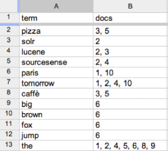

Search Introduction
===================
## Section Objectives

  * Understand Information Retrieval Concepts
  * Understand Inverted Indexes
  * Build An Index

# IR Overview

## Information Retrieval

  * "Information Retrieval (IR) is finding material (usually documents) of an unstructured nature (usually text) that satisfies an information need from within large collections (usually stored on computers).

     - These days we frequently think first of web search, but there are many other cases:

        * E-mail search

        * Searching your laptop

        * Corporate knowledge bases

        * Legal information retrieval

Notes:


---

## Unstructured (text) vs. structured (database) data in the mid-nineties


 <!-- {"left" : 0.3, "top" : 1.5, "height" : 5.16, "width" : 9.66} -->


Notes:

Mostly structured data in those days.


---

## Unstructured (text) vs. structured (database) data today

 <!-- {"left" : 0.3, "top" : 1.5, "height" : 5.16, "width" : 9.66} -->


Notes:

To the surprise of many, the search box has become the preferred method of information access.
Customers ask: Why can’t I search my database in the same way?


---

## IR vs. databases: 


 * IR vs. databases:Structured vs unstructured data

 * Structured data tends to refer to information in “tables”

| Employee | Manager | Salary |
|----------|---------|--------|
| Chang    | Kerzner | 50000  |
| LeBron   | Kumar   | 100000 |
| Rajabi   | Kerzner | 50000  |

<!-- {"left" : 0.25, "top" : 2.01, "height" : 2, "width" : 9.75, "columnwidth" : [3.25, 3.25, 3.25]} -->


 * Typically allows numerical range and exact match

 * (for text) queries, e.g.,

  -   *Salary < 60000 AND Manager = Smith* .

Notes:


---

## Unstructured data


 * Typically refers to free text

 * Allows

     - Keyword queries including operators

     - More sophisticated “concept” queries e.g.,

        * find all web pages dealing with  *drug abuse*

 * Classic model for searching text documents

Notes:


---

## Semi-structured data


 * In fact almost no data is “unstructured”

 * E.g., this slide has distinctly identified zones such as the  *Title*  and  *Bullets*

        * … to say nothing of linguistic structure

 * Facilitates “semi-structured” search such as

     -  *Title*  contains data AND  *Bullets*  contain search

 * Or even

     -  *Title*  is about Object Oriented Programming AND  *Author*   something like `stro*rup`

     - where `*` is the wild-card operator

Notes:


---

## Basic assumptions of Information Retrieval


 * Collection: A set of documents

     - Assume it is a static collection for the moment

 * Goal: Retrieve documents with information that is relevant to the user’s information need and helps the user complete a task

Notes:


---

## The Classic search model

 <!-- {"left" : 0.92, "top" : 1.38, "height" : 5.2, "width" : 8.4} -->


Notes:


---

## How good are the retrieved docs?


 *  *Precision* : Fraction of retrieved docs that are relevant to the user’s information need

 *  *Recall*  : Fraction of relevant docs in collection that are retrieved

     - More precise definitions and measurements to follow later

Notes:


---

## Term-Document Matrices


 * Term-document incidence matrices

 <!-- {"left" : 0.81, "top" : 1.8, "height" : 4.38, "width" : 8.21} -->


Notes:


---

## Unstructured data in 1620

 * Which plays of Shakespeare contain the words  **Brutus**   *AND*   **Caesar**   but  *NOT*   **Calpurnia** ?
 * One could grep all of Shakespeare’s plays for  **Brutus**  and  **Caesar,**  then strip out lines containing  **Calpurnia** ?
 * Why is that not the answer?
     - Slow (for large corpora)
     -  *NOT*   **Calpurnia**  is non-trivial
     - Other operations (e.g., find the word  **Romans** near ****  **countrymen** ) not feasible
     - Ranked retrieval (best documents to return)


Notes:

Grep is line-oriented; IR is document oriented.


---

## Term-document incidence matrices


 * 1 if play contains word, 0 otherwise

 *  **Brutus**   *AND*   **Caesar**   *BUT*   *NOT*   **Calpurnia**


Notes:


---

## Incidence vectors


 * So we have a 0/1 vector for each term.

 * To answer query: take the vectors for  **Brutus, Caesar**  and  **Calpurnia**  (complemented) -> bitwise  *AND* .

     - 110100  *AND*

     - 110111  *AND*

     - 101111 =

     -  **100100**

 *

Notes:


---

## Answers to query


  * Antony and Cleopatra, Act III, Scene ii

  *  *Agrippa*  [Aside to DOMITIUS ENOBARBUS]: Why, Enobarbus,

  * When Antony found Julius **Caesar** dead,

  * He cried almost to roaring; and he wept

  * When at Philippi he found **Brutus** slain.

  * Hamlet, Act III, Scene ii

  * *Lord Polonius:*  I did enact Julius **Caesar** I was killed i’ the

  * Capitol; **Brutus** killed me.


 <!-- {"left" : 8.21, "top" : 4.86, "height" : 2.4, "width" : 1.88} -->


Notes:

Wikimedia commons picture of Shake


---

## Bigger collections


 * Consider  *N* = 1 million documents, each with about 1000 words.

 * Avg 6 bytes/word including spaces/punctuation

     - 6GB of data in the documents.

 * Say there are  *M* = 500K  *distinct*  terms among these.


Notes:


---

## Can’t build the matrix


 * 500K x 1M matrix has half-a-trillion 0’s and 1’s.

 * But it has no more than one billion 1’s. **WHY??**

     - matrix is extremely sparse.

 * What’s a better representation?

     - We only record the 1 positions.

 * Why?


Notes:


---
# Inverted Index

## Inverted Index

  * Each document has an id and a list of terms.
  * For each term “t” we must store a list of all documents that contain “t”.
  * Identify each document by its id.


 <!-- {"left" : 5.42, "top" : 3.01, "height" : 4.14, "width" : 4.6} -->

Notes:


---
## Inverted Index

  * For each term -t- , we must store a list of all documents that contain t .
  * Identify each doc by a **docID** , a document serial number
  * Can we used fixed-size arrays for this?
  * What happens if the word **Caesar** is added to document 14?

 <!-- {"left" : 1.02, "top" : 4.75, "height" : 1.96, "width" : 8.21} -->


Notes:


---
## Inverted index

  * We need variable-size postings lists
    -  On disk, a continuous run of postings is normal and best
    - In memory, can use linked lists or variable length arrays
      - Some tradeoffs in size/ease of insertion

 <!-- {"left" : 1.9, "top" : 4.81, "height" : 1.54, "width" : 6.46} -->


  * Sorted by docID (more later on why).

Notes:


---
## Inverted Index construction

 <!-- {"left" : 0.7, "top" : 1.15, "height" : 5.66, "width" : 8.85} -->

Notes:


---
## Initial stages of text processing

  * Tokenization
    - Cut character sequence into word tokens
      - Deal with **“John’s” , a state-of-the-art solution**
  * Normalization
    - Map text and query term to same form
      - You want **U.S.A.** and **USA** to match
  * Stemming
    - We may wish different forms of a root to match
      - **authorize , authorization**
  * Stop words
    - We may omit very common words (or not)
      - **the, a, to, of**


Notes:


---
## Indexer steps: Token sequence

  *  Sequence of (Modified token, Document ID) pairs.

 <!-- {"left" : 1.02, "top" : 1.79, "height" : 4.38, "width" : 8.21} -->

Notes:


---
## Indexer steps: Sort

  * Sort by terms
    - And then docID
  * **Core indexing step**

 <!-- {"left" : 5.41, "top" : 1.01, "height" : 5.96, "width" : 4.27} -->

Notes:


---
## Indexer steps: Dictionary & Postings

  * Multiple term entries in a single document are merged.
  * Split into Dictionary and Postings
  * Doc. frequency information is added.

 <!-- {"left" : 6.97, "top" : 1.82, "height" : 5.16, "width" : 2.83} -->

Notes:


---
## Where do we pay in storage?

  * IR system implementation
    - How do we index efficiently?
    - How much storage do we need?

 <!-- {"left" : 6.99, "top" : 1.47, "height" : 5.03, "width" : 2.76} -->

Notes:


---
## The index we just built

  * How do we process a query?
    - Later - what kinds of queries can we process?
  * Our focus


Notes:


---
## Query processing: AND

  * Consider processing the query:
    - **Brutus** *AND* **Caesar**
    - Locate **Brutus** in the Dictionary;
      - Retrieve its postings.
    - Locate **Caesar** in the Dictionary;
      - Retrieve its postings.
    - “Merge” the two postings (intersect the document sets):
  * 128
  * 34
  * **Brutus**
  * **Caesar**


Notes:


---
## The merge

  * Walk through the two postings simultaneously, in time linear in the total number of postings entries
  * If the list lengths are x and y , the merge takes `O( x+y )`
  * operations.
  * Crucial: postings sorted by docID.

Notes:


---
## Intersecting two postings lists

  * (a “merge” algorithm)

 <!-- {"left" : 1.55, "top" : 1.45, "height" : 5.91, "width" : 7.92} -->


Notes:


---
## Boolean queries: Exact match

  * The Boolean retrieval model is being able to ask a query that is a Boolean expression:
   - Boolean Queries are queries using AND, OR and NOT to join query terms
     - Views each document as a set of words
     - Is precise: document matches condition or not.
   - Perhaps the simplest model to build an IR system on
  * Primary commercial retrieval tool for 3 decades.
  * Many search systems you still use are Boolean:
   - Email, library catalog, Mac OS X Spotlight

Notes:


---
## Example: WestLaw   http://www.westlaw.com/

  * Largest commercial (paying subscribers) legal search service (started 1975; ranking added 1992)
  * Tens of terabytes of data; ~700,000 users
  * Majority of users still use boolean queries
  * Example query:
    - What is the statute of limitations in cases involving the federal tort claims act?
    - LIMIT! /3 STATUTE ACTION /S FEDERAL /2 TORT /3 CLAIM
      `- /3 = within 3 words, /S = in same sentence`


Notes:


---
## Example: WestLaw   http://www.westlaw.com/

  * Another example query:
    - Requirements for disabled people to be able to access a workplace
    - disabl! /p access! /s work-site work-place (employment /3 place
  * Note that SPACE is disjunction, not conjunction!
  * Long, precise queries; proximity operators; incrementally developed; not like web search
  * Many professional searchers still like Boolean search
    - You know exactly what you are getting
    - But that doesn’t mean it actually works better ... .

Notes:


---
## Boolean queries:

 * More general merges
 * Boolean queries: More general merges
 * Exercise: Adapt the merge for the queries:
 * **Brutus** *AND NOT* **Caesar**
 * **Brutus** *OR NOT* **Caesar**
 * Can we still run through the merge in time O( x+y )?   What can we achieve?

Notes:


---
## Merging

  * What about an arbitrary Boolean formula?
  * (**Brutus** *OR* **Caesar**) *AND NOT*
  * (**Antony** *OR* **Cleopatra**)
  * Can we always merge in “linear” time?
    - Linear in what?
  * Can we do better?


Notes:


---
## Query optimization

  * What is the best order for query processing?
  * Consider a query that is an AND of n terms.
  * For each of the n terms, get its postings, then AND them together.

  * Query: Brutus  AND  Calpurnia  AND  Caesar


 <!-- {"left" : 1.02, "top" : 4.82, "height" : 1.79, "width" : 8.21} -->


Notes:


---
## Query Optimization Example

  * Process in order of increasing freq:
  * start with smallest set, then keep ** cutting further .
  * This is why we kept document freq. in dictionary


  * Execute the query as ( **Calpurnia** *AND* **Brutus**) *AND* **Caesar** .


 <!-- {"left" : 1.02, "top" : 4.67, "height" : 1.79, "width" : 8.21} -->


Notes:


---
## More general optimization


 * e.g.,  *(*  **madding**  *OR*  **crowd**  *) AND (*  **ignoble**  *OR*  **strife**  *)* 

 * Get doc. freq.’s for all terms.

 * Estimate the size of each  *OR*  by the sum of its doc. freq.’s (conservative).

 * Process in increasing order of  *OR*  sizes.


Notes: 


---

## Exercise


 * Recommend a query processing order for

 * Which two terms should we process first?

 *  **(tangerine**  *OR*  **trees)**  *AND*  **(marmalade**  *OR*  **skies)**  *AND*  **(kaleidoscope**  *OR*  **eyes)** 

| Term         | Freq   |
|--------------|--------|
| eyes         | 234334 |
| kaleidoscope | 78949  |
| marmalade    | 123321 |
| skies        | 263432 |
| tangerine    | 46653  |
| trees        | 334234 |

<!-- {"left" : 0.25, "top" : 3.32, "height" : 3.5, "width" : 9.75, "columnwidth" : [4.88, 4.88]} -->

Notes: 


---

## Query processing exercises


 * Exercise: If the query is  **friends**   *AND*  **romans**  *AND (NOT*  **countrymen**  *),* how could we use the freq of  **countrymen** ?

 * Exercise: Extend the merge to an arbitrary Boolean query.  Can we always guarantee execution in time linear in the total postings size?

 * Hint: Begin with the case of a Boolean  *formula*  query: in this, each query term appears only once in the query.

Notes: 


---

## Exercise


 * Try the search feature at http://www.rhymezone.com/shakespeare/

 * Write down five search features you think it could do better

Notes: 


---

## Phrase queries


 * We want to be able to answer queries such as  **“Calvin Klein”** – as a phrase

 * Thus the sentence  *“My best friend is Mary Klein. My name is Calvin.”*  is not a match. 

     - The concept of phrase queries has proven easily understood by users; one of the few “advanced search” ideas that works

     - Many more queries are  *implicit phrase queries* 

 * For this, it no longer suffices to store only

 *    < *term* :  *docs* > entries


Notes: 


---

## A first attempt: Biword indexes


 * Index every consecutive pair of terms in the text as a phrase

 * For example the text “Friends, Romans, Countrymen” would generate the biwords

     -  **friends romans** 

     -  **romans countrymen** 

 * Each of these biwords is now a dictionary term

 * Two-word phrase query-processing is now immediate.


Notes: 


---

## Longer phrase queries


 * Longer phrases can be processed by breaking them down

 *  **Calvin**  **Klein**  **new**  **york** can be broken into the Boolean query on biwords:

 *  **calvin**  **klein**  *AND*  **new**  **york**   *AND*  **new**  **york** 

 * Without the docs, we cannot verify that the docs matching the above Boolean query do contain the phrase.

 * Can have false positives!

Notes: 


---

## Issues for biword indexes


 * False positives, as noted before

 * Index blowup due to bigger dictionary

     - Infeasible for more than biwords, big even for them

 * Biword indexes are not the standard solution (for all biwords) but can be part of a compound strategy

Notes: 


---

## Solution 2: Positional indexes


 * In the postings, store, for each  **term** the position(s) in which tokens of it appear:

     - < **term**  `*,*` number of docs containing  **term** ;

     -  *doc1* : position1, position2 … ;

     -  *doc2* : position1, position2 … ;

     - etc.>

Notes: 


---

## Positional Index Example

 * Which of docs 1,2,4,5 could contain “ **to be or not to be** ”?

```text
  < **be** : 993427;
    1 : 7, 18, 33, 72, 86, 231;
    2 : 3, 149;
    4 : 17, 191, 291, 430, 434;
    5 : 363, 367, …>
```
<!-- {"left" : 0, "top" : 1.38, "height" : 1.93, "width" : 4.81} -->


 * For phrase queries, we use a merge algorithm recursively at the document level

 * But we now need to deal with more than just equality


Notes: 


---

## Processing a phrase query


 * Extract inverted index entries for each distinct term:  **to, be, or, not.** 

 * Merge their  *doc:position*  lists to enumerate all positions with “ **to be or not to be** ”.

    -  **to** :   *2* :1,17,74,222,551;  **4:8,16,190,429,433;**  *7* :13,23,191; ...

    -  **be**  :  *1* :17,19;  **4:17,191,291,430,434;**  *5* :14,19,101; ...

 * Same general method for proximity searches


Notes: 


---

## Proximity queries


 * `LIMIT! /3 STATUTE /3 FEDERAL /2 TORT `

     - Again, here, `/k`  means “within  *k*  words of”.

 * Clearly, positional indexes can be used for such queries; biword indexes cannot.

 * Exercise: Adapt the linear merge of postings to handle proximity queries.  Can you make it work for any value of  *k* ?

     - This is a little tricky to do correctly and efficiently


Notes: 


---

## Positional index size


 * A positional index expands postings storage  *substantially* 

     - Even though indices can be compressed

 * Nevertheless, a positional index is now standardly used because of the power and usefulness of phrase and proximity queries … whether used explicitly or implicitly in a ranking retrieval system.


Notes: 


---

## Positional index size


 * Need an entry for each occurrence, not just once per document

 * Index size depends on average document size **Why?**

     - Average web page has <1000 terms

     - SEC filings, books, even some epic poems … easily 100,000 terms

 * Consider a term with frequency 0.1%

| Document Size | Postings | Positional Postings |
|---------------|----------|---------------------|
| 1000          | 1        | 1                   |
| 100,000       | 1        | 100                 |


Notes: 


---

## Rules of thumb


 * A positional index is 2–4 as large as a non-positional index

 * Positional index size 35–50% of volume of original text

     - Caveat: all of this holds for “English-like” languages


Notes: 


---

## Combination schemes


 * These two approaches can be profitably combined

     - For particular phrases ( **“Michael Jackson”, “Britney Spears”** ) it is inefficient to keep on merging positional postings lists

        * Even more so for phrases like  **“The Who”** 

 * Williams et al. (2004) evaluate a more sophisticated mixed indexing scheme

     - A typical web query mixture was executed in ¼ of the time of using just a positional index

     - It required 26% more space than having a positional index alone


Notes: 


---

## Lab: What Is An Inverted Index

- Overview: We will build both regular and inverted index
- Pre-requisites: solr-labs/install/README.md   
- Approximate time: 30 minutes
- Instructions: solr-labs/inverted-index/README.md


Notes:


---
# IR Metrics

## How to Measure Search?
 * How fast does it index
   - Number of documents/hour
   - (Average document size)

 * How fast does it search
   - Latency as function of query size
 * Expressiveness of query language
   - Able to express complex information needs
   - Speed on complex queries
 * Uncluttered UI
 * Free?

## Measurability
 * All these are *measurable*: we can *quantify* terms like speed or size.
 * What is the real measure?  **User Happiness**
   - What is this?
   - Speed is importnat
 * How can we *quantify* how **User Happieness**

## IR Metric Types

  * Online: Data we gather from the system:
    - Usually from log files
    - Data mining
  * Offline: Data we obtain by judging::
    - Supervised Training Examples:
      -  This input should yield this result
    - After the fact judging:
      - This result was relevant to the search term.


Notes:


---

## Online Metrics

 * These metrics are mined from the data itself
   - No need for supervised interaction
   - Human "right/wrong"

 * Session abandonment rate
   - Session abandonment rate is a ratio of search session which do not result in a click.

 * Click-through rate (CTR)
   - The lifeblood of Silicon Valley!
   - ratio of users who click on a specific link to the number of total users who view a page, email, or advertisement. 

---

## Online Metrics Contd

 * Session Success Rate 
   - The ratio of user sessions that lead to a "success".
   - How do we measure success?
     - Purchase
     - Dwell time (how long a user views the content)
     - Click versus Copy/Paste? 

 * Zero result rate
   - ratio of SERPs with zero results
   - Indicates data is not in index.


Notes:

SERP = Search Engine Results Page

---

## Offline Metrics
  * These involve a human judge
    - Defines whether or how much the term was relevant to me.
  * Subjective:
    - A search for "Java" could be the computer language, coffee, or the Indonesian island.
    - How do we determine a "hit" versus a "miss"
  * Often Binary, (Hit/Miss), (Thumbs Up, Thumbs down)
    - Either the search was "relevant", or "not relevant"
  * Sometimes there is a "score"
    - On a scale of 1 to 5, this was a 5.
    - Of all these documents, this is the most relevant to me.

---

## Precision

  * **Precision**: Fraction of retrieved docs that are relevant to user’s information need
    - In short, how much junk do I get?
  * More precisely, fraction of documents judge *relevant* to user's need.

 <!-- {"left" : 1.68, "top" : 2.92, "height" : 0.84, "width" : 6.89} -->


  * For example, let's say I search for *"curry"* and I am delivered 10 results.
    - I'm really looking for Indian food recipes (relevant)
    - But, I end up getting a few results about NBA basketball. (not relevant)
    - All in all, 6 of my results are *relevant* to me. 
      - 4 are not.
    - My Precision is `0.6`

---

## Precision at k

  * Precision can be measured at each retrieval.
    - So what I can do is measure precision for every result returned.
    - This is precision at k, or `P(k)`
  * Let's say the first search result gave me a nice recipe! I am happy.
    - My precision at result 1 is `1.0`
  * My second result is **not** relevant. It is about basketball
    - My precision at result 2 is `0.5`
    - Remember, precision is cumulative.
  * Problem: P(k) doesn't properly penalize search results lower in the list

---

## Recall

  * **Recall** tells me what fraction of relevant documents were returned by a query
    - In short, did any "good stuff" get left out?
    - What was left on the table?

 <!-- {"left" : 3.34, "top" : 2.68, "height" : 0.82, "width" : 6.09} -->


  * aka *Sensitivity* :  Probability a relevant document is returned by the query.
  * Trivial Solution: Return *all* documents
    - But that would have precision very low
  * Example, say my search engine indexes 100 pages. 20 of them are relevant. 
    - My query returns 10 results, 5 of which are relevant
    - My recall is `5/20 = 0.25`

---

## Recall and Modern Search Engines

 * Modern Search engines index literally billions of pages
 * Queries return 1000s (not billions) of results
   - Most of the 1000s of results are never seen by the user
   - They are buried deep in the results
 * Measuring recall this way is not all that useful (usually very small)
 * We will define recall a different way:
   - Take the first N results (say, the first page)
   - Assume the first P pages results reflects *all* documents
 * So, say each page is 10 results. We can look at the first 5 pages (50 results)
   - Say 5 results on the first page are relevant. 
   - And say there are 20 total relevant results on all 5 pages
   - So recall would be `5 / 20 = 0.25`

Notes:

---
   

## Fallout

 * The proportion of *non-relevant* documents retrieved, out of all non-relevant documents

 <!-- {"left" : 2.19, "top" : 1.94, "height" : 0.88, "width" : 6.64} -->


 * Probability that a non-relevant document is returned by the query.
 * Related to *specificity* -- it is (1-specificity)

Notes:

---

## F-Score

 * F-Score is a weighted harmonic mean of precision and recall.
 * The most common is F1, where precision and recall are balanced.

 <!-- {"left" : 5.22, "top" : 2.1, "height" : 1.18, "width" : 4.22} -->


 * F-Score takes into account *both* precision and recall
 * Precision / Recall are in tension
   - Increasing recall can mean decreasing precision (by returning "everything plus the kitchen sink"0
   - Increasing precision can mean delivering only a few results
     - But that could mean leaving out an important result.

Notes:

---

## Average Precision at K
 * We usually have a ranked list of results. 
 * We can calculate Precision and Recall at K
 * For example:
   - Precision and recall at result 1, again precision and recall at result 2.
 * For the results:
   - The first result should have high precision and low recall)
   - Subsequent results will likely give lower precision and higher recall.
   - The "final" result will have low precision and higher recall

Notes:

---

## Precision Recall Curve
 * We can plot the curve for precision versus recall for all of our first N search results 
 * The plotted points will have a precision recall curve.

 <!-- {"left" : 2.67, "top" : 2.8, "height" : 3.76, "width" : 4.9} -->


---

## Average Precision or AUC
 
 * The Average Precision is the Area Under the Curve (AUC) of The Precision-Recall Curve
 * We can measure the AUC as a metric. (Higher the better!)
 * The way we define this is as follows:

 <!-- {"left" : 0.77, "top" : 3.3, "height" : 0.89, "width" : 2.67} -->


## Lab: Precision And Recall Of Search Engines

- Overview: We will practice measuring the performance of search engines, treating them is IR (information retrieval) systems.
We will look at the two major metrics: precision and recall.
- Pre-requisites: None  
- Approximate time: 30 minutes
- Instructions: `solr-labs/intro/1-IR.md`


Notes:


---

# About Solr

## What Is Solr

* Search server
* Built upon Apache Lucene (Java)
* Fast, very
* Scalable, query load and collection size
* Interoperable
* Extensible

---
## What Is Solr, contd
* Ready to deploy
* Optimized for search
* Large volumes of documents
* Text-Centric
* Results sorted by relevance


 <!-- {"left" : 4.41, "top" : 3.41, "height" : 3.92, "width" : 5.5} -->

Notes:


---

## Overview of Solr

 <!-- {"left" : 1.83, "top" : 1.22, "height" : 5.52, "width" : 6.59} -->


## What Data Is Handled By Solr?
* Text-Centric
* Read-dominant
* Document-oriented
* Flexible schema

## Example Search Application


 <!-- {"left" : 0.66, "top" : 0.95, "height" : 6.17, "width" : 8.74} -->


Notes:


---

## Lucene

  * Information Retrieval library
  * Inverted index of documents
  * Vector space model
  * Advanced search options (synonyms, stop words, similarity, proximity)


Notes:


---

## Brief History 

  * Lucene written by Doug Cutting in 1999
  * Replaces commercial search engines, such as Inktomi ($10K/year => $0)
  * Solr written by Yonik Seeley for CNET and contributed to Apache in 2006
  * LucidWorks – 2009
  * ElasticSearch – 2010

 <!-- {"left" : 7.47, "top" : 2.83, "height" : 2.34, "width" : 1.98} -->

 <!-- {"left" : 7.54, "top" : 5.35, "height" : 1.9, "width" : 1.9} -->

 <!-- {"left" : 4.71, "top" : 4.17, "height" : 1.54, "width" : 2.06} -->

 <!-- {"left" : 0.67, "top" : 4.39, "height" : 2.33, "width" : 3.5} -->


Notes:


---

## Solr Features

  * Scalable
  * Ready to deploy
  * Optimized for search
  * Large volumes of documents (millions of documents)
  * Text-Centric(natural-language text, like emails, web pages, resumes, PDF documents, and social messages such as tweets or blogs) 
  * Results sorted by relevance


Notes:


---

## Solr Features, contd

  * Read-dominant
    - Although, there is near real-time search (NRT)
  * Document-oriented (not DB, not large file storage)
  * Flexible schema (similar to NoSQL)

Notes:


---

## Solr Major Features


 <!-- {"left" : 1.34, "top" : 1.21, "height" : 5.62, "width" : 7.58} -->


Notes:


---

## Solr Major Features, contd

 <!-- {"left" : 1.58, "top" : 0.94, "height" : 6.38, "width" : 7.09} -->


Notes:


---

## Solr Features – User Experience

  * Pagination
  * Sorting
  * Auto-suggest
  * Spell-checking
  * Hit highlighting
  * Geospatial search


Notes:


---

## Solr Features - Architect

  * Result grouping/field collapsing
  * Flexible query support
  * Joins
  * Document clustering
  * Importing rich document formats such as PDF and Word
  * Importing data from relational databases
  * Multilingual support


Notes:


---

## Solr Features – (Starting From Solr4)

  * Near real-time search
  * Atomic updates with optimistic concurrency
  * Real-time get (before commit)
  * Write durability using a transaction log
  * Easy sharding and replication using ZooKeeper

Notes:


---


## New in Solr 7
 * Replication Modes:
   - New replica strategies added: `TLOG` and `PULL`
 * Autoscaling:
   - Solr now features autoscaling
 * Analytics:
   - Analytics component is refactored
 * ConfigSets:
   - Solr features `configSets` as a way to keep configs
   - `_default` ConfigSet will be used if not specified
   - ConfigSets ware uploaded to Zookeeper
 * Schemaless Mode Improvements
 * JSON
   - JSON rather than XML is now the default format


---

## Summary

  * What we’ve learned

    - Installing and running Solr
    - Adding content to Solr and searching
    - Changing parameters in the URL
    - Using the browser interface
    - Reading a Solr XML response


Notes:


---


