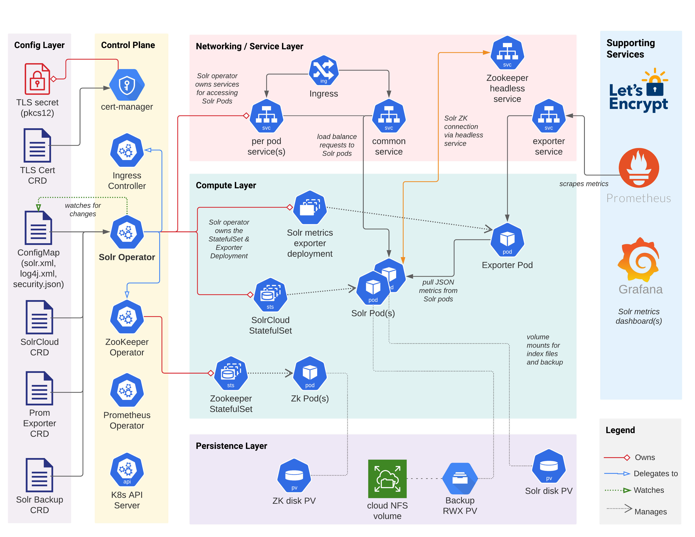

# Kubernetes and Solr

## Solr Operator
 * Solr Operator a control-plane manager for Solr in Kuberenetes
 

---

## Architecture

---

### CRDS (Custom Resource Definition)

 * A Custom Resource Definition (CRD) allows application developers to define a new type of object in Kubernetes. This provides a number of benefits:
 * Exposes domain specific config settings to human operators
 * Reduce boilerplate and hide implementation details
 * Perform CRUD operations on CRDs with kubectl
 * Stored and managed in etcd just like any other K8s resource

---

### CRDS (Custom Resource Definition)
 * The Solr operator defines CRDs that represent the following:
   -  SolrCloud resources
   - metrics exporter resources
   -  backup/restore resource.

 
